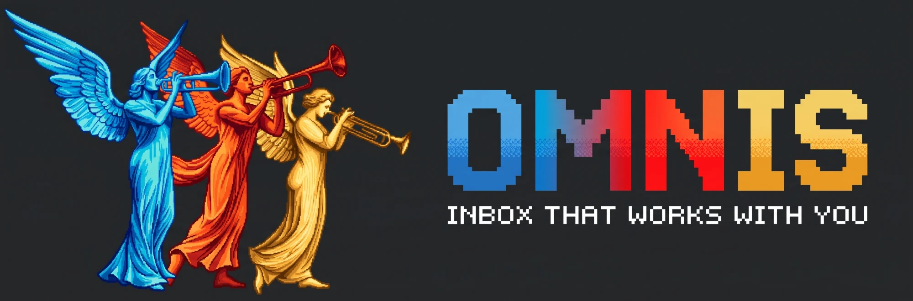
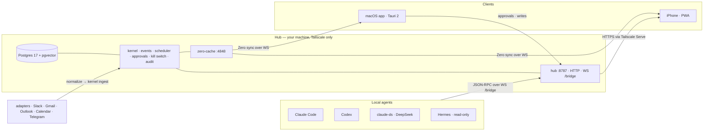

<p align="center">
  
</p>

# omnis 📯

<p align="center">
  <a href="docs/spec/00-omnis-design.md">Design Spec</a> | <a href="docs/design/DESIGN-DIRECTION.md">Design Direction</a> | <a href="docs/superpowers/plans/README.md">Plans</a>
</p>

<p align="center">
  <a href="https://www.immensus.team"></a>
  <a href="LICENSE"></a>
  <a href="https://github.com/immensus-team"></a>
</p>

<p align="center">
  
  
  <a href="README.md"></a>
</p>

**The inbox where all communication between people and agents happens.** Messages from people, requests to agents, the questions and approvals that come back, the handoffs between them — one real-time stream, one memory, one place to decide. omnis reads everything before you get there and leaves a one-line summary on every thread, drafts replies in your voice, files what does not need you, turns messages into tasks, and briefs you every night. Nothing leaves without your approval. It runs on a machine you own, reachable only over your own network — no cloud control plane, no third party holding your inbox.

Use any model you want — local models through Ollama, DeepSeek, Claude, or the subscription CLIs you already pay for. Work routes through a four-tier cascade under a monthly cap, switchable per task from `settings` — no code changes, no lock-in.

<table>
<tr>
<td width="30%"><b>One inbox, people and agents</b></td>
<td>Slack, mail, calendar and chat land in the same stream as a delegated agent run. A run that needs your answer sorts to the top, exactly like a person waiting on you.</td>
</tr>
<tr>
<td width="30%"><b>Read before you get there</b></td>
<td>Every row carries a written summary instead of a subject line, produced by the cheap tier before you open the app. New items reach the screen in under two seconds.</td>
</tr>
<tr>
<td width="30%"><b>Drafts in your voice</b></td>
<td>Replies are written and waiting, editable inline. Sending is a separate, explicit act — the approval gate lives in the kernel, not in the UI.</td>
</tr>
<tr>
<td width="30%"><b>Clears what does not need you</b></td>
<td>Manual archive with undo, plus a nightly pass that files what the classifier is confident about and a digest telling you what it moved.</td>
</tr>
<tr>
<td width="30%"><b>Turns talk into work</b></td>
<td>Messages become tasks; tasks become delegated runs on another machine you own — proposed automatically, executed after you approve.</td>
</tr>
<tr>
<td width="30%"><b>Remembers across sessions</b></td>
<td>One memory layer over your inbox, local files, Drive and GitHub, with bi-temporal entities: every fact knows when it became true and when it stopped.</td>
</tr>
<tr>
<td width="30%"><b>Knows who people are</b></td>
<td>Identities resolved across channels into a single person card, with a follow-up loop that notices when a thread has gone quiet and proposes the nudge.</td>
</tr>
<tr>
<td width="30%"><b>Everything is searchable</b></td>
<td>⌘K searches channels, memory and agent sessions from any screen, with the palette and the ask bar sharing one surface.</td>
</tr>
<tr>
<td width="30%"><b>Runs on your own hardware</b></td>
<td>Postgres, the hub and the agents are one process group on a Mac mini behind Tailscale. The same tree is built to run standalone on a laptop later.</td>
</tr>
</table>

Three theses drive every decision:

1. **Everything is an inbox.** A message from a person and a turn from an agent land in the same queue.
2. **Context is the product.** The inbox is the surface; the asset is one unified memory about you.
3. **Agents act first, you decide.** Drafts, labels, tasks and delegation proposals are ready before you look. Anything that leaves the system passes your approval.

## How it works



The hub owns the database and the state machine, the clients are views, and the agents are local processes the hub talks to. Clients read through zero-cache and write through the hub, so a change is one round trip from every device. The hub binds to `127.0.0.1:8787`; the only way in is your tailnet.

**Design principles.** A warm off-white canvas with conversation rows, glass only on chrome (rail, toolbar, sheets, palette), agent state in the same grammar as people, spring motion at 160/240/320 ms that `prefers-reduced-motion` turns off, and an anti-slop checklist every UI change has to pass — [`docs/design/SKILLS.md`](docs/design/SKILLS.md).

## Channels and agents

Channels are adapters in `packages/adapters/`. Each ships a normalization contract and a fixture corpus its tests replay — **no live account is connected yet.** OAuth, tokens and webhooks are the remaining manual gates, so every run today is fixtures and seeded end-to-end data.

| Channel | Status |
| --- | --- |
| Slack, Gmail, Google Calendar, Outlook, Telegram | Adapter + fixture corpus ready; live tokens pending |
| WhatsApp, KakaoTalk, LinkedIn | Bridge plan only — [`docs/spec/A1-channel-adapters.md`](docs/spec/A1-channel-adapters.md) |

Agent runtimes connect outward from your machine: a small `local-agent` process registers over the hub's `/bridge` and runs work on the CLI you already pay for.

| Runtime | How it connects |
| --- | --- |
| Claude Code | stream-json turns over the bridge |
| Codex | Codex app-server client |
| claude-ds | the Claude Code bridge pointed at DeepSeek |
| Hermes | read-only source, not a delegation target |

## Quickstart

**1 · Hub** — the full runbook is [`ops/mini/RUNBOOK.md`](ops/mini/RUNBOOK.md).

```bash
brew install pgvector
pnpm install --frozen-lockfile && pnpm build
createdb omnis && psql -d postgres -c "ALTER SYSTEM SET wal_level='logical'"
DATABASE_URL="postgres://$USER@127.0.0.1:5432/omnis" pnpm db:migrate
bash ops/mini/install.sh    # hub · zero-cache · local-agent LaunchAgents
```

**2 · App**

```bash
pnpm --filter @omnis/desktop dev    # pnpm tauri:dev for the real shell
pnpm --filter @omnis/web dev        # the PWA, at 127.0.0.1:5173 — see apps/web/README.md to install it on an iPhone
```

**3 · Verify**

```bash
pnpm e2e:phase-a    # seeds through the real adapter and kernel paths, then drives the UI
```

Evidence lands in [`tools/e2e/REPORT.md`](tools/e2e/REPORT.md). Without a hub, the same tree runs locally: `pnpm test`, `pnpm lint`, `pnpm typecheck`.

## Status

**Phase A — done.** 35 stories: `@omnis/db`, `@omnis/kernel` (event bus, scheduler, approvals, kill switch, audit), `@omnis/protocol`, `@omnis/ui`, `@omnis/agents`, the first three adapters, and the `hub`, `local-agent` and `desktop` apps.

**Phase B — complete.** 45 stories, US-B01–US-B45, across W0–W5: migrations 0009–0014, the memory layer and identity resolution, local/Drive/GitHub ingestion, the loop runtime and tool palette, drafts, auto-archive and notifications, tasks, delegation, network, the nightly digest, cost reporting, settings, transcripts, unified search, the PWA and Web Push, the Outlook and Telegram adapters, the Hermes read-only session, the ops scripts, and the hub's adapter registry.

**Evidence on main.** 221 test files passing (1 skipped) / 1,956 tests passing (2 skipped); `pnpm lint` and `pnpm typecheck` clean; `pnpm e2e:phase-a` 34/34 across two consecutive runs, which is the idempotence check. Per-story status and what is deferred: [`docs/superpowers/plans/README.md`](docs/superpowers/plans/README.md).

**Not yet true.** No message in this repo ever came from a live account — connecting one is the next step, and the Phase B exit metrics stay unmeasured until it happens. The iPhone client is a PWA served by the hub, not a shipped binary. What is real is the gate: anything that would leave the machine is blocked on your approval, and that is implemented rather than aspirational.

## Docs

- [`docs/spec/00-omnis-design.md`](docs/spec/00-omnis-design.md) — the design document: definition, structure, decisions, phases.
- [`docs/spec/A1`](docs/spec/A1-channel-adapters.md)–[`A8`](docs/spec/A8-readme-blueprint.md) — channel adapters, bridge protocol, data schema, agent layer, UI/UX, ops, dev process, README blueprint.
- [`docs/design/DESIGN-DIRECTION.md`](docs/design/DESIGN-DIRECTION.md) — the UI direction and the references it is built against.
- [`docs/research/`](docs/research/) — the research sweep behind the decisions, each file with its own verification section.

## Built with

omnis is written by agent workflows as much as by hand: DeepSeek V4.1 Flash implements, Claude reviews and verifies, and authoring and review never share a pass. The plan documents under `docs/superpowers/plans/` are what those agents were actually given.

## License

Apache-2.0 — see [`LICENSE`](LICENSE).
