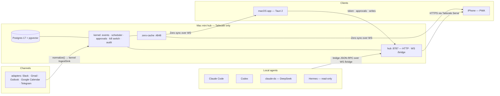

<p align="center">
  
</p>

# omnis 📯

**Inbox that works with you.**

<p align="center">
  <a href="docs/spec/00-omnis-design.md">Docs</a> | <a href="docs/design/DESIGN-DIRECTION.md">Design</a>
</p>

<p align="center">
  <a href="docs/spec/00-omnis-design.md"></a>
  <a href="LICENSE"></a>
  <a href="https://github.com/Onword-Lab"></a>
  
  
  
</p>

**omnis is the inbox where all communication between people and agents happens.** Human-to-human
messages, human-to-agent requests, agent-to-human questions and approvals, agent-to-agent handoffs —
one real-time stream, one memory, one place to decide.

An inbox that works with you reads everything before you do and leaves a one-line summary on every
thread. It drafts in your voice, files what does not need you, turns messages into tasks, and briefs you
every night. It remembers across sessions and machines, and nothing leaves without your approval.

It runs on your own machine, over your own network, with any model you choose.

**Use any model you want.** omnis routes each unit of work through a four-tier cascade — local models
(Ollama) → DeepSeek → Claude → your own subscription CLIs — so the cheap tier absorbs the bulk of the
volume and the expensive tier only sees what needs it. The cascade reserves capacity for VIP and
sensitive items even when the monthly cap is reached. The cap and the reserve are rows in the `settings`
table (`cost.cap_usd`, `cost.reserve_ratio`), not code: switch per task, no code changes, no lock-in.

Three theses drive every decision:

1. **Everything is an inbox.** A message from a person and a turn from an agent land in the same queue.
2. **Context is the product.** The inbox is the surface; the asset is one unified memory about you.
3. **Agents act first, you decide.** Drafts, labels, tasks and delegation proposals are ready before you look. Anything that leaves the system passes your approval.

---

## What omnis does

| Feature | What it gives you |
| --- | --- |
| **Unified real-time inbox** | Every channel in one stream, each row carrying a one-line AI summary instead of a subject line. New items reach the screen in well under two seconds. |
| **Work / personal filter** | One click narrows the list; the channel rail filters it too, and the Inbox tile restores it. |
| **Agent sessions as inbox threads** | A delegated run is a thread with turns, tool calls, cost, pending approvals and a kill switch — the same row grammar as a person. A blocked run floats to the top. |
| **Drafts in your voice** | The model writes, you edit inline, and the send happens only after you approve it. |
| **Archive** | Manual archive with undo, plus a nightly job that archives what the classifier is confident about. A digest tells you what it moved. |
| **Tasks** | Messages become tasks, and a task can be delegated to another machine as an approved run. |
| **Network** | People resolved across channels into one identity, and a follow-up loop that notices a thread has gone quiet and proposes a nudge. |
| **Notes routing** | A note is read, matched against memory, and proposed a destination instead of being filed by hand. |
| **Memory** | One memory layer over your inbox, local files, Drive and GitHub, with bi-temporal entities — every fact knows when it became true and when it stopped. |
| **Unified search** | ⌘K searches across channels, memory and sessions from anywhere in the app. |

## How it works



Everything above the clients is one process group on one machine you own: the hub owns the database and
the state machine, the clients are views, and the agents are local processes the hub talks to. Clients
read through zero-cache and write through the hub, so a change is one round trip from every device. The
hub binds to `127.0.0.1:8787` — the only way in is Tailscale, and there is no cloud control plane. That
machine is a Mac mini today; the same repo is meant to run standalone on a MacBook + iPhone later, which
is why the hub takes its host and user from configuration rather than assuming the mini.

**Design principles**

- kinso-style light UI: a warm off-white canvas, conversation rows with an AI summary line, no hairlines.
- Glass only on chrome — rail, toolbar, sheet, palette, floating panels. Lists and body content stay opaque.
- Agent status uses the same grammar as people; `blocked` (needs your answer) floats to the top.
- Spring motion (160 ms entry / 240 ms transition / 320 ms layer), and `prefers-reduced-motion` turns it off.
- No AI-slop: see the checklist in [`docs/design/SKILLS.md`](docs/design/SKILLS.md).

## Channels & agents

Channels are adapters in `packages/adapters/`. Each ships a normalization contract and a fixture corpus
its contract tests replay — **but real accounts are not connected yet.** Live OAuth, tokens and webhooks
are the remaining Logan-assisted gates, so every run today is fixtures and seeded e2e data.

| Channel | Adapter | Status |
| --- | --- | --- |
| Slack | `packages/adapters/slack` | Adapter + fixtures ready; live Socket Mode token pending |
| Gmail | `packages/adapters/gmail` | Adapter + fixtures ready; live watch + Pub/Sub pending |
| Google Calendar | `packages/adapters/google-calendar` | Adapter + fixtures ready; live `events.watch` pending |
| Outlook | `packages/adapters/outlook` | Adapter + fixtures ready; live OAuth pending |
| Telegram | `packages/adapters/telegram` | Adapter + fixtures ready; live bot token pending |
| WhatsApp · KakaoTalk · LinkedIn | — | No adapter in this tree yet; the bridge plan is in [`docs/spec/A1-channel-adapters.md`](docs/spec/A1-channel-adapters.md) |

Agent runtimes connect outward from your machine: a small `local-agent` process registers over the hub's
WS `/bridge` and runs work on the CLI you already pay for.

| Runtime | How it connects |
| --- | --- |
| Claude Code | `apps/local-agent/src/bridges/claude-code.ts` — stream-json turns over the bridge |
| Codex | `apps/local-agent/src/bridges/codex.ts` — Codex app-server client |
| claude-ds | The same Claude Code bridge pointed at the DeepSeek CLI |
| Hermes | Read-only session: it can be read as an inbox source, and is not a delegation target |

## Quickstart

omnis has two halves: the hub on the mini, and the app you look at. Both come out of this one repo.

**1 · Hub on the Mac mini** — [`ops/mini/RUNBOOK.md`](ops/mini/RUNBOOK.md) is the full runbook; this is the short path.

```bash
# from your laptop: push the tree to the mini
rsync -az --delete --exclude node_modules --exclude target --exclude .git --exclude ops/mini/env.sh \
  ./ vigor@<mini-ip>:/Users/vigor/omnis/

# on the mini
export PATH=/opt/homebrew/bin:$PATH
brew install pgvector             # 0001 does CREATE EXTENSION vector
pnpm install --prod=false --frozen-lockfile && pnpm build
createdb -U vigor omnis && psql -U vigor -d omnis -c "CREATE SCHEMA IF NOT EXISTS zero_cvr"
psql -U vigor -d postgres -c "ALTER SYSTEM SET wal_level='logical'" && brew services restart postgresql@17
DATABASE_URL="postgres://vigor@127.0.0.1:5432/omnis" pnpm db:migrate
bash ops/mini/install.sh          # installs the hub / zero-cache / local-agent LaunchAgents
```

**2 · The macOS app**

```bash
pnpm install
pnpm --filter @omnis/desktop dev    # Vite dev server; pnpm tauri:dev for the real Tauri shell
```

**3 · Verify it end to end**

```bash
pnpm e2e:phase-a    # seeds through the real adapter/kernel paths, then drives the UI in Playwright
```

Results and screenshots land in [`tools/e2e/REPORT.md`](tools/e2e/REPORT.md). For local development
without the mini, the same repo runs against a local Postgres: `pnpm test`, `pnpm test:integration` and
`pnpm lint && pnpm typecheck`.

## Status

**Phase A — done.** 35 stories merged (US-A00–A31, including A19b/A22b/A23b): `@omnis/db`, `@omnis/kernel`
(event bus, scheduler, approvals, kill switch, audit), `@omnis/protocol`, `@omnis/ui`, `@omnis/agents`,
the Slack/Gmail/Google Calendar adapters, and the `hub`, `local-agent` and `desktop` apps. Migrations
0001–0008 are applied.

**Phase B — W0–W5 merged.** The schema bundle (migrations 0009–0013: `settings`, `ingest_sources`,
`push_subscriptions`, Phase B job seeds + the `cost_daily` view) landed first, then W1 through W5:
the memory layer and identity resolution, local/Drive/GitHub ingestion, the loop runtime and tool
palette, auto-archive and notifications, tasks, drafts, network and the nightly digest, cost, settings,
transcript and unified search, and the hub's adapter registry. W4b — the remaining surfaces — is in
progress.

**Evidence.** The last full suite recorded on this history is 183 test files / 1,461 tests passing, with
`pnpm lint` and `pnpm typecheck` clean (2026-09-21). `pnpm e2e:phase-a` runs 38 checks and passes all of
them in two consecutive runs, which is the idempotence check. The per-story plan, wave and gate status
lives in [`docs/superpowers/plans/README.md`](docs/superpowers/plans/README.md).

**Not yet true.** Real Slack/Gmail/Calendar/Telegram accounts are not connected, so no message in this
repo ever came from a live account — the adapters are exercised against fixtures and the smoke test seeds
its own data. The iPhone client is a planned PWA from the same hub, not a shipped binary. Anything that
would leave the machine (sending, delegating, calendar writes) is gated on your approval by design, and
that gate is implemented, not aspirational.

## Docs

- [`docs/spec/00-omnis-design.md`](docs/spec/00-omnis-design.md) — the design document: definition, structure, decisions, phases.
- [`docs/spec/A1`](docs/spec/A1-channel-adapters.md)–[`A8`](docs/spec/A8-readme-blueprint.md) — appendices: channel adapters, agent bridge protocol, data schema, agent layer, UI/UX, ops, dev process, README blueprint.
- [`docs/design/DESIGN-DIRECTION.md`](docs/design/DESIGN-DIRECTION.md) — the UI direction, with the reference images it is built against.
- [`docs/design/SKILLS.md`](docs/design/SKILLS.md) — the design skills and the anti-slop checklist a UI change has to pass.
- [`docs/research/`](docs/research/) — the 2026-09-20 research sweep, each file with its own adversarial verification section.
- [`docs/superpowers/plans/README.md`](docs/superpowers/plans/README.md) — story plans, wave order and gate results.

## Built with

omnis is built by agent workflows as much as by hand: DeepSeek V4.1 Flash and Claude (Opus, Sonnet,
Fable) write, review and verify the code in this repo, with a separate pass for authoring and for review.
The plan documents under `docs/superpowers/plans/` are the artifact of that process — they are what the
agents were actually given.

## License

Apache-2.0 — see [`LICENSE`](LICENSE).
