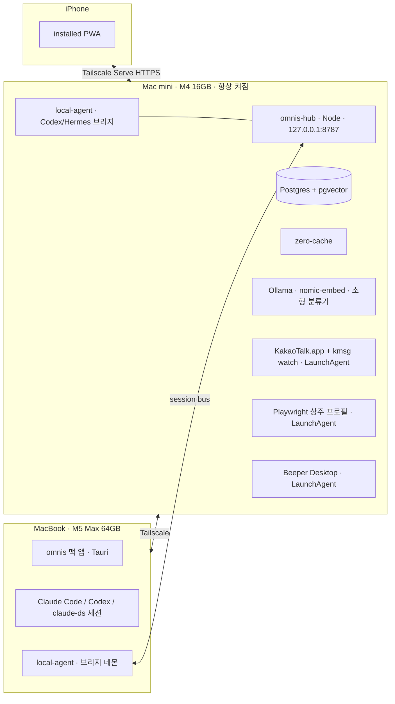

# omnis 기획서 — 마스터 설계 문서

버전 1.0 (2026-09-20). 작성: Fable(기획 총괄). 1.0 = 전역 리뷰 1차·2차(99-review.md, 99-review-v2.md) 반영판. Logan 검토 대기. 근거: `../BRIEF-2026-09-20.md`, `../01-definition-draft.md`, `../research/00-SYNTHESIS.md`와 리서치 파일 01~27.
상태: Logan 검토 대기. §19의 미결 질문은 각각 "기본값"을 정해 두었고, 답이 오기 전까지는 기본값으로 진행한다.

이 문서는 결정과 구조를 담는다. 상세는 부록(A1~A8)이 담는다. 부록이 이 문서와 충돌하면 이 문서가 이긴다.

---

## 1. 정의

**omnis는 나에게 오는 모든 것(사람의 메시지, 일정, 에이전트의 진행과 결과)을 하나의 인박스로 모으고, 나의 컨텍스트를 가진 에이전트들이 먼저 일하고 나는 결정만 하게 만드는 개인 운영 시스템이다.**

테제 세 개가 모든 설계 판단의 기준이다.

1. **Everything is an inbox.** 사람의 메시지든 에이전트의 턴이든, 내 주의를 요구하는 모든 것은 같은 큐에 놓인다. 에이전트 세션은 참여자 중 하나가 에이전트인 스레드일 뿐이다.
2. **Context is the product.** 인박스는 표면이고 자산은 나에 대한 통합 컨텍스트다. 모든 기능은 이 메모리에서 읽고 이 메모리에 쓴다.
3. **Agents act first, I decide.** 분류, 초안, 투두, 위임은 내가 보기 전에 준비된다. 바깥으로 나가는 행동은 반드시 내 승인을 지난다.

## 2. 사용자와 성공 기준

- v1: Logan 1인. 채널 8개(Slack, Gmail, Outlook, Google Calendar, Telegram, WhatsApp, KakaoTalk, LinkedIn), 에이전트 런타임 4종(Claude Code, Codex, claude-ds, Hermes) + omnis 자체 런타임, 기기 3대(맥미니 허브, 맥북, 아이폰).
- v2: 같은 프로파일의 파운더와 오퍼레이터. standalone 배포 시점.

### 목표 G1~G8 (구조에서 도출, 부록이 인용하는 ID)

| # | 목표 | 층 | 판정 기준 |
|---|---|---|---|
| G1 | 모든 채널이 실시간으로 하나의 큐에 들어온다 | L0, L1 | API 채널 수신 지연 5초 이하, 캡처 채널 60초 이하 |
| G2 | 어디서든 컨트롤한다. 읽음, 답장, 아카이브가 원 채널에 반영된다 | L1 | 채널별 write-back 범위가 명시되고 UI가 그 범위만 약속함 |
| G3 | 하나의 컨텍스트. 사람, 프로젝트, 약속, 결정이 메모리에 쌓이고 모든 에이전트가 같은 메모리를 본다 | L2 | 어떤 런타임에 물어도 같은 사실을 같은 시점 기준으로 답함 |
| G4 | 에이전트가 먼저 일한다. 초안, 투두, 라벨, 위임 제안이 내가 보기 전에 준비되고 승인 게이트를 지킨다 | L3 | 승인 없는 외부 전송 0건, 초안 준비 인바운드 후 60초 이내 |
| G5 | 한 화면. 인박스와 에이전트 세션이 같은 문법이고 맥과 아이폰이 실시간 동기화된다 | L4 | 기기 간 상태 반영 2초 이내 |
| G6 | standalone 가능(§4.2의 정직한 정의) | L0 | 허브를 맥북 앱 안에서 띄워도 5개 API 채널 + 에이전트 + 캘린더가 동작하고 아이폰이 동기화됨 |
| G7 | 비용 상한 안에서 돈다 | L3 | 월 $60 상한, 80%에서 자동 강등, 월 리포트 |
| G8 | 안전. 인박스 내용은 신뢰할 수 없는 입력, 외부 전송은 승인, 모든 에이전트 행동은 감사 로그 | L0 | 인젝션 테스트 세트 통과, 감사 로그 누락 0 |

### 성공 지표

| 지표 | 목표 | 측정 |
|---|---|---|
| 브리핑 커버리지 | 그날 처리한 항목 중 아침 브리핑에 있던 비율 ≥ 80% | 처리 로그 대조 |
| 초안 채택률 | 전송된 답장 중 초안에서 출발한 비율 ≥ 50% | Action 로그 |
| 무수정 전송률 | 초안을 고치지 않고 보낸 비율 ≥ 20% | diff 0 |
| 놓친 팔로업 | 미팅 후 48시간 내 팔로업 미발송 0건 | 캘린더 대조 |
| 원 채널 앱 열기 | KakaoTalk, LinkedIn 제외 주 5회 이하 | 자기 보고 |
| 월 LLM 비용 | 상한 $60, 80% 도달 시 자동 강등 | 게이트웨이 청구 |
| 승인 없는 외부 전송 | 0건 | 감사 로그 |

수치는 첫 달 실측 후 조정한다. 리서치의 월 $20~50 추정은 모델 기반 추정이지 실측이 아니다.

## 3. 범위

### v1에 들어가는 것

- 채널: Slack, Gmail, Outlook, Google Calendar, Telegram, WhatsApp, KakaoTalk, LinkedIn.
- 에이전트 런타임: omnis 자체 에이전트, Claude Code, Codex CLI, DeepSeek(claude-ds), Hermes. Hermes는 맥미니와 맥북 양쪽에서 런타임 어댑터로 붙는다(Phase B 읽기 전용 세션 노출, Phase C 위임 대상). 기존 Hermes 구성에 의존하지 않고 HTTP 표면만 쓴다.
- 기능: 실시간 통합 인박스, work/personal 자동 필터, 사람·토픽 자동 라벨, 컨텍스트 기반 답장 초안과 알림, 아침 브리핑, 자동 보관과 밤 아카이브 다이제스트(7일 되살리기), 에이전트와 함께 쓰는 투두, 기기 간 에이전트 위임(자동 제안 + 승인 실행), Network(개인 CRM)와 팔로업, 노트 라우팅, 통합 검색(⌘K, Phase B), 로컬·Drive·GitHub ingestion.
- 표면: macOS 앱, iPhone 앱(Phase B는 installed PWA, Phase D는 네이티브 셸).

### 비목표 (v1)

- 팀과 멀티유저 협업.
- 원 채널 앱의 완전 대체(통화, 스티커, 대용량 미디어).
- 이메일 클라이언트 풀 기능(규칙 엔진, 폴더 관리).
- 자체 모델 학습.
- 맥미니의 기존 세팅(Hermes 구성, omh, buzz 릴레이)과의 호환. omnis는 그것을 대체한다.

## 4. 구조

### 4.1 커널과 4개 층


- **L0 Kernel**: Postgres 위에 짓는다. append-only `events`, 정규화된 `threads`/`items`, `LISTEN/NOTIFY`로 실시간 팬아웃, 허브 프로세스 안의 스케줄러, `pending_approvals` 승인 게이트, `audit_log`, 기기 간 세션 라우팅. 허브가 맥미니든 맥북 앱 안이든 같은 코드다.
- **L1 Adapters**: 채널과 에이전트 런타임을 같은 Item 스키마로 정규화한다. 어댑터는 능력(read, write, realtime, history, media, markRead)을 선언하고 UI는 선언된 능력만 약속한다.
- **L2 Context**: 3층 메모리. self-model 파일(고정 스냅샷 주입), 벡터 메모리(mem0 OSS + pgvector, 로컬 임베딩), bi-temporal 엔티티·관계 테이블(사람, 조직, 프로젝트, 약속, 결정).
- **L3 Agents**: 두 종류의 루프. 계획 없는 반응형 루프(라벨, 분류)와 계획·검증 루프(초안, 위임, CRM 판단). 루프마다 tool palette가 다르고, 비가역 tool(send, delete, delegate 실행)은 자율 루프의 palette에 아예 없다.
- **L4 Surfaces**: 인박스, 스레드, 에이전트 세션, Today(브리핑), Tasks, Network, Notes, Digest, Settings. 맥과 아이폰이 같은 UI 문법을 쓴다.

### 4.2 배치 토폴로지

지금(Phase A~C):



허브 API는 미니 로컬 `127.0.0.1:8787`에 뜨고 Tailscale Serve가 이를 tailnet에 HTTPS로 노출한다(8642는 Hermes가 쓰므로 피한다). `local-agent`는 맥북과 미니 양쪽에 하나씩 있다. 미니의 것은 Codex와 Hermes를, 맥북의 것은 Claude Code, Codex, claude-ds, Hermes를 노출한다.

나중(Phase D, standalone): 허브 프로세스가 맥북 앱 안에서 돈다. Postgres는 앱 번들의 임베디드 인스턴스, 아이폰은 맥북이 켜져 있을 때 동기화한다. **정직한 정의(D12)**: Slack, Gmail, Outlook, Calendar, Telegram, WhatsApp과 에이전트는 완전히 허브 없이 돈다. KakaoTalk과 LinkedIn은 GUI 세션이 살아 있는 맥 1대가 항상 필요하다. 이것은 채널의 구조적 제약이지 omnis의 한계가 아니며, 제품 정의서와 UI 모두 이 사실을 숨기지 않는다.

## 5. 핵심 결정 (Decision log)

| # | 결정 | 근거 | 폴백 |
|---|---|---|---|
| D1 | **Greenfield.** omnis는 자체 에이전트 런타임을 갖고, 맥미니의 Hermes/omh/buzz 세팅을 대체한다. Hermes는 양쪽 호스트에서 런타임 어댑터로만 붙는다(Phase B 읽기 전용, Phase C 위임). 기존 구성·메모리·릴레이에는 의존하지 않는다 | Logan 결정(2026-09-20). buzz의 agent-as-member, ACP 파이프라인, kind dispatch는 아이디어만 차용(`02`) | 없음 |
| D2 | **커널은 Postgres 위 자작.** events + LISTEN/NOTIFY + 스케줄러 + pending_approvals + audit_log | Eve는 에이전트 1개 = Node 프로세스 1개(idle ~550MB)라 16GB 미니의 커널로 부적합(`20`). Mastra/LangGraph/Temporal/Inngest는 더 큰 문제의 답(`11`) | Eve를 답장 초안·다이제스트 에이전트 단위로만 도입 |
| D3 | **하네스는 Vercel AI SDK 7을 모델 호출 계층으로만.** 루프, tool palette, 승인은 자체 코드 | `ai@7`의 tool-approval 정책이 draft-then-approve와 1:1(`11`). lock-in 없음 | Claude Agent SDK(TS)를 에이전트 세션 브리지 보조로 |
| D4 | **채널 계층은 채널별 하이브리드.** 공식 API 5개는 직접, WhatsApp만 Beeper Desktop API, KakaoTalk은 kmsg, LinkedIn은 Playwright | 단일 계층 전제는 틀렸다. Beeper의 실질 이득은 WhatsApp 하나(`21`). LinkedIn 브릿지는 고장(`06`), Kakao는 미지원(`04`) | WhatsApp: whatsmeow Go 사이드카 |
| D5 | **에이전트 브리지는 자체 thin 프로토콜.** `session_key`(안정 스코프)와 `session_id`(회전 트랜스크립트) 분리, `capabilities` 자기기술, 런타임별 네이티브 headless 표면 래핑 | ACP/A2A는 1유저 고정 에이전트셋에 과설계(`09`). `codex mcp-server`는 존재하지 않으므로 app-server JSON-RPC 직결 | 멀티벤더가 필요해지면 ACP |
| D6 | **메모리 3층.** self-model 파일 + mem0 OSS/pgvector(Ollama nomic-embed, 로컬 $0) + Postgres bi-temporal 엔티티(Graphiti 4-timestamp 스키마 차용) | mem0 OSS는 graph memory를 제거해 관계 쿼리는 자체 테이블 외 경로가 없다(`26`). Neo4j는 16GB에 과함(`10`) | 없음. Honcho(AGPL)는 채택하지 않는다 |
| D7 | **동기화는 Zero(rocicorp) + 3티어 이벤트.** ephemeral(토큰 델타, 복제 안 함) / durable(디바운스된 Item row) / cold(raw 로그, 허브만) | Postgres 하나로 끝남. 에이전트 토큰 델타를 그대로 복제하면 G5(2초)를 깎는다(`27`) | PowerSync |
| D8 | **클라이언트: macOS는 Tauri 2, iPhone은 Phase B에 installed PWA, Phase D에 Tauri iOS.** UI는 React + Tailwind v4 + shadcn/ui + react-virtuoso + Tiptap + cmdk | TS 재사용, `window-vibrancy`로 Liquid Glass(`13`,`14`). iPhone의 역할은 triage와 승인이라 PWA + Web Push로 충분(§19 Q1) | iPhone을 Phase B부터 Tauri iOS로 |
| D9 | **모델 4티어 cascade + 민감도 규칙 + 월 상한.** T0 로컬(분류·임베딩) → T1 DeepSeek V4 Flash(초안·라우팅) → T2 Claude Sonnet 5(VIP·저신뢰·메모리 통합) → T3 구독 CLI(unmodified 바이너리 서브프로세스만) | `12`. OAuth 토큰의 SDK 우회 사용은 Anthropic 문언상 금지. `fable`은 headless에서 동의 없이 과금되므로 무인 루프에서 배제(`24`) | 전부 T2로 올리면 비용 상승 |
| D10 | **보안은 프롬프트가 아니라 구조로.** 인박스 텍스트는 항상 data 태그, 비가역 tool은 자율 palette에서 제외, 모든 egress는 승인, append-only 감사 로그, kill switch, 비밀은 Keychain + sops/age | OWASP LLM01(`15`), agentic-inbox의 tool 격리 증명(`22`) | 없음 |
| D11 | **허브 운영: LaunchDaemon/LaunchAgent 분리.** Postgres·허브·zero-cache는 Daemon, KakaoTalk·브라우저·Beeper는 로그인 세션 Agent. 자동 로그인 + pmset + caffeinate, healthchecks + ntfy, restic 백업, `idle_replication_slot_timeout` 명시 | Apple TN2083(`18`), WAL 누적 리스크(`27`) | 없음 |
| D12 | **G6(standalone)의 정직한 재정의.** §4.2 참조 | `25` | 없음 |
| D13 | **개발: OMC ralph 루프 + worktrunk 격리 + 모델 티어 배정.** Opus(커널·브리지·메모리), Sonnet(어댑터·UI·테스트), Haiku(문서·기계적 작업), DeepSeek Flash(격리된 잘 정의된 스토리; Sonnet 이상이 리뷰). Fable은 interactive 기획·리뷰만 | `24` | 없음 |
| D14 | **레포: Onword-Lab/omnis, pnpm 모노레포, 런치까지 private.** | Logan 브리프("회사 깃허브") | public 전환은 README 완성 시 |
| D15 | **Draft는 별도 테이블이 아니라 Item의 status. Action 승인은 HumanInterrupt/HumanResponse 형태.** | agentic-inbox, agent-inbox 소스(`22`) | 없음 |
| D16 | **언어와 런타임: TypeScript + Node 22 + pnpm.** Go는 whatsmeow 폴백 사이드카에만, Python은 쓰지 않는다 | 생태계(AI SDK, mtcute, Zero, Tauri 프런트) 전부 TS | 없음 |

## 6. 데이터 모델 (개요, 상세는 A3)

A3가 스키마 오너다. 이 표는 개요이며 컬럼명은 A3를 따른다.

| 객체 | 핵심 필드 | 비고 |
|---|---|---|
| `accounts` / `account_secrets` | channel, external_id, display, capabilities(jsonb) / 비밀은 별도 테이블(Zero 복제 제외, Keychain 참조) | 채널 로그인 단위 |
| `threads` / `thread_labels` | account_id, external_id, kind(dm/group/email/agent_session/calendar), title, participants[], meta(jsonb), last_item_at, archived_at / 라벨은 조인 테이블 | 에이전트 세션도 thread |
| `items` / `item_labels` | thread_id, external_id, kind(message/email/event/agent_turn/tool_call/system), author(person_id 또는 agent_session_id 또는 system), body, body_html, attachments, sent_at, **status**(received/read/draft/approved/sent/failed/archived), **sensitivity**(normal/personal/finance/legal/health), **embedding** vector(768), meta(jsonb), source_hash | Draft = status. 자동 보관은 status=archived + 7일 undo |
| `persons` / `identities` / `person_merges` | person ↔ (channel, handle) 다대일, labels, relationship_state(unknown/new/warming/active/dormant/closed), first_contact_at, last_contact_at, cadence_days, priority_score, primary_thread_id / 병합·분리 이력 | Network의 뼈대 |
| `labels` / `label_rules` | name, kind(scope/topic/priority/person) / 자연어 프롬프트 → 규칙(jsonb), 활성 여부 | Superhuman Auto Labels 방식 |
| `tasks` | source_item_id, title, kind(todo/followup/delegation), owner(me 또는 agent_runtime), state, due_at, delegated_session_id | 에이전트와 함께 쓰는 투두 |
| `agent_runtimes` / `agent_sessions` | runtime(omnis/claude_code/codex/claude_ds/hermes), host(mini/macbook), session_key, session_id, purpose, capabilities, state | `omnis` 런타임은 1 row, 브리지 어댑터 없음 |
| `agent_runs` | loop, model_tier, provider, tokens_in/out/cached, cost, latency, outcome, item_id | 평가·비용·감사의 단일 소스 |
| `pending_approvals` | action(send/delete/delegate/calendar_write), args(jsonb), description, config(allow_accept/edit/respond/ignore), state, decision(jsonb), decided_at | HumanInterrupt/HumanResponse |
| `notes` | body, routed_to(thread_id/person_id), rationale, confidence | 노트 라우팅 |
| `memories` | content, embedding, source_item_id, source_kind(inbox/calendar/local/drive/github), valid_from, valid_until, recorded_at, invalidated_at, confidence | bi-temporal |
| `entities` / `relations` | type, name, attributes, 같은 4-timestamp | 사람·조직·프로젝트·약속·결정 |
| `digests` | kind(morning/nightly), for_date, body, item_ids[] | |
| `events` | seq, kind, payload, at | append-only, cold 티어, 롤오프는 SECURITY DEFINER 함수로만 |
| `audit_log` | actor(me/agent/system), action, target, before/after, at | append-only |
| `jobs` | name, schedule, last_run, next_run, state | 스케줄 오너는 A4(브리핑 06:30, 다이제스트 23:00 KST) |

## 7. 커널

- **이벤트 3티어**: ephemeral(에이전트 스트리밍 토큰, typing 등)은 NOTIFY 또는 WebSocket으로만 흘리고 저장하지 않는다. durable은 디바운스된 Item row이며 Zero가 복제한다. cold는 raw 이벤트 전체이고 허브 로컬에만 남는다. NOTIFY 페이로드는 8,000B 한도이므로 id만 실어 나른다.
- **스케줄러**: 허브 프로세스 안의 cron 테이블(`jobs`: 아침 브리핑, 밤 다이제스트, 팔로업 타이머, 토큰 갱신, Gmail re-watch 7일, Graph 구독 갱신 주간, Drive/GitHub 폴링). 실행 기록은 events에 남는다.
- **승인 게이트**: 모든 egress(send, delete, calendar write, delegate 실행)는 `pending_approvals`를 거친다. 채널·사람별로 "자율 허용"을 열 수 있지만 기본값은 승인이다. 승인 UI는 전문을 노출한다. 자동 보관은 egress가 아니므로 승인이 아니라 7일 undo와 밤 다이제스트 노출로 보장한다(A4 §6.4).
- **세션 버스**: 기기별 브리지 데몬(`local-agent`)이 허브에 Tailscale로 붙어 `session_key`/`session_id`로 세션을 등록한다. 허브는 세션을 thread로 노출하고, 위임은 `pending_approvals` → 대상 브리지로 흐른다.
- **kill switch**: 전역 플래그 하나로 모든 자율 루프와 egress를 멈춘다. UI와 CLI 양쪽에서 켠다.

## 8. 어댑터 계약과 채널 매트릭스 (상세는 A1)

어댑터 인터페이스(요지):

```ts
interface Adapter {
  id: string; channel: Channel;
  capabilities(): Capabilities;           // read, write, realtime, history, media, markRead, typing
  connect(auth: AuthRef): Promise<void>;  // 로그인·QR·OAuth
  backfill(since?: Date): AsyncIterable<NormalizedItem>;
  subscribe(): AsyncIterable<NormalizedItem | AdapterEvent>; // 실시간
  send(thread: ThreadRef, draft: Outbound): Promise<SendResult>; // 승인 후에만 호출됨
  markRead?(thread: ThreadRef): Promise<void>;
  health(): Promise<Health>;
}
```

| 채널 | 경로 | 폴백 | R/W | 리스크 | Phase |
|---|---|---|---|---|---|
| Slack | Socket Mode + xoxp user token | Events API | 완전 | 낮음 | A |
| Gmail | `users.watch` + Pub/Sub pull, OAuth Production 게시 | `history.list` 폴링 | 완전 | 낮음 | A |
| Google Calendar | `events.list` + syncToken 폴링(1~5분) | `events.watch` push(Phase 0 스파이크) | R/W(hold) | 낮음 | A |
| Outlook | Graph delta 폴링 → webhook(구독 수명 10,080분) | IMAP OAuth2 | 완전 | 낮음 | B |
| Telegram | mtcute(MTProto, 공식 api_id) | Telethon 별도 프로세스 | 완전 | 낮음 | B |
| WhatsApp | Beeper Desktop API(로컬 REST + WS) | whatsmeow 사이드카 | R/W | 중 | C(스파이크 통과 조건, 부번호 파일럿) |
| KakaoTalk | kmsg(macOS AX) LaunchAgent, `watch --json` | Notification Center DB 트리거 + OCR | R 상세 / W 텍스트(dry-run 기본) | 중~높음 | C(read 2주 안정 후 send) |
| LinkedIn | Playwright 상주 프로필, 저빈도 랜덤 폴링 | Gmail의 LinkedIn 알림 메일 파싱(무비용), Unipile | R/W(승인 후) | 중~높음 | C |
| 에이전트 세션 | 네이티브 headless 표면(§9) | — | R/W | 낮음 | A |

## 9. 에이전트 세션 브리지 (상세는 A2)

- 런타임별 표면: Claude Code `claude -p --output-format stream-json --resume`, Codex `app-server` JSON-RPC(버전 핀, `capabilities` 배열로 feature detection), claude-ds는 Claude Code와 같은 표면(모델만 DeepSeek), Hermes는 `/v1` + 세션 헤더(선택).
- 세션 = thread. 턴 = Item(kind agent_turn), tool 호출 = Item(kind tool_call, 라벨+아이콘+진행 상태로 표시).
- 위임: omnis 에이전트가 `delegate(runtime, host, brief)`를 제안 → 승인 → 대상 기기의 브리지가 세션 생성 → 진행이 스레드로 보임 → 결과가 원 스레드에 첨부.
- 상호 이해: 에이전트는 `read_session(session_key)` tool로 다른 세션의 durable 요약을 읽는다(raw 토큰 로그가 아니라 요약과 마지막 N턴). 스코프 제한(의도된 축소): omnis 자체 루프(L3)는 모든 세션 요약을 읽을 수 있지만, 개발 세션(Claude Code, Codex 등)은 `purpose`가 `inbox:*`인 세션과 인박스 스레드 원문을 직접 읽지 못한다. 인박스 내용이 개발 세션으로 새는 경로를 막기 위한 것이고, 필요한 내용은 승인된 위임 브리프에 첨부되어 전달된다. 브리프의 "서로 전부 이해"는 이 경계 안에서 구현한다.
- 동시성 상한: 호스트당 활성 턴 4개(프로세스 수가 아니라 턴 수). Codex는 상주 app-server 1개가 여러 스레드를 처리하므로 프로세스 기준은 무의미하다.
- Logan이 터미널에서 직접 연 세션은 브리지가 관리하지 않는다(CWD·권한·의도를 알 수 없음). `~/.claude/projects/**/*.jsonl` 읽기 전용 import는 Phase C 후보(§19 Q12).
- 에이전트끼리 서로 일을 시키는 경로(의도된 축소): 어떤 런타임도 다른 런타임에 직접 명령하지 않는다. 한 에이전트가 다른 에이전트의 일을 원하면 `propose_delegation`으로 Task와 위임 제안을 만들고, 같은 승인 게이트를 지나 대상 브리지가 실행한다. 브리프의 "서로에게 일을 시킬 수 있어야"는 이 경로로 구현하며, 승인 없는 에이전트 간 명령은 인젝션이 한 세션에서 다른 세션으로 번지는 통로가 되므로 열지 않는다. 런타임·레포별 허용 규칙(Q10)을 열면 승인 없이 흐른다.
- 브리지 프로토콜은 MCP 2026-07-28의 per-request 버전 협상 모델을 따른다.

## 10. 컨텍스트와 메모리 (상세는 A3, A4)

- **Self-model 파일**: `USER.md`(나, 역할, 선호, 톤), `VOICE.md`(채널·상대별 말투 샘플), `PROJECTS.md`. 고정 스냅샷으로 프롬프트 접두에 넣어 prefix cache를 살린다. 에이전트가 제안한 수정은 승인 후 반영.
- **벡터 메모리**: mem0 OSS + pgvector, 임베딩은 Ollama `nomic-embed-text-v1.5`(768d, 로컬 $0). 출처 Item과 연결.
- **엔티티 메모리**: persons/entities/relations, 4-timestamp(valid_from, valid_until, recorded_at, invalidated_at). "지금 기준"과 "그때 기준" 질의가 모두 가능.
- **Ingestion**: 인박스 Item(실시간), 캘린더, 로컬 파일(FSEvents, 허용 폴더만. 맥미니의 파일은 허브가 직접, 맥북의 파일은 맥북 `local-agent`가 읽어 허브로 보낸다), Google Drive(`changes.list` 폴링), GitHub(ETag 폴링). 웹훅은 공인 HTTPS를 요구해 기본값이 폴링이다. 허용 목록은 기본값이 비어 있어 Logan이 채우기 전까지 아무것도 읽지 않는다.
- **통합 주기**: 실시간 추출(T1) → 밤 통합(T2, Batch API) → 주간 self-model 제안.
- **평가**: recall@k 스크립트로 시작. 인박스 기반 골든 질문 50개.

## 11. 에이전트 층 (상세는 A4)

| 루프 | 종류 | 모델 티어 | Tool palette | 산출 |
|---|---|---|---|---|
| 분류·라벨 | 반응형(계획 없음) | T0 → T1 | read only | scope(work/personal), topic, priority, person label |
| 답장 초안 | 계획+검증 | T1, VIP·저신뢰는 T2 | read, search_memory, read_calendar, propose_draft | Item(status draft) + 근거 |
| 투두 추출·리마인드 | 반응형 | T1 | read, propose_task | tasks |
| 위임 | 계획+검증 | T2 | read, read_session, propose_delegation | pending_approval(delegate) |
| 브리핑·다이제스트 | 배치 잡 | T1(Batch) | read | digests |
| Network 팔로업 | 계획+검증 | T1 → T2 | read, read_calendar, propose_draft, propose_task | draft + task |
| 노트 라우팅 | 반응형 | T1 | read, search_memory, propose_route | notes.routed_to |
| 자동 보관 | 반응형 | T0 → T1 | read only | items.status=archived(7일 undo), 밤 다이제스트에 전부 노출 |
| Ingestion | 배치 잡 | T0(임베딩), T1(추출) | read_local(허용 폴더만), read_drive, read_github | memories, entities |

자동 보관 기본 규칙(Logan이 Settings에서 조정): 다음을 모두 만족하면 보관한다. ① 발신자가 no-reply·뉴스레터·알림 계정이거나 사람이 아님 ② 본문에 나에게 향한 질문·요청·CTA가 없음(T1 판정, 신뢰도 ≥ 0.85) ③ VIP가 아니고 sensitivity가 normal ④ 스레드에 내가 답한 적이 없음. 내가 답한 스레드는 "상대의 새 질문 없음" 조건이 추가로 참일 때만 보관한다. 애매하면 보관하지 않는다.

위임은 자동 제안 + 승인 실행이 기본이다. 에이전트가 Task를 만들 때 위임 가능 여부와 대상(런타임, 호스트)을 함께 제안하고, Logan이 한 번 승인하면 실행된다. 완전 자율 실행은 런타임·레포별 허용 규칙을 Logan이 열 때만 켜진다(§19 Q10).

원칙: `propose_*`는 저장만 하고 실행하지 않는다. `send`, `delete`, `delegate`, `calendar_write`는 승인 핸들러만 호출할 수 있고 에이전트 palette에 없다. Ingestion 루프의 상세(허용 폴더, 청킹, 실패 처리, 폴링 주기)는 A4가 소유한다.

## 12. 표면 (상세는 A5)

- 화면: Inbox(통합, 필터 pill: All / Work / Personal / Agents / Needs approval), Thread, Agent Session(같은 Thread 뷰 + tool 배지), Today(아침 브리핑, 오늘 일정, 대기 중 승인), Tasks, Network(사람 카드, 팔로업 큐), Notes(입력 한 줄 → 라우팅 제안), Digest(밤 요약, 되살리기), Settings(계정, 자율 허용 규칙, 모델 티어, kill switch).
- 핵심 인터랙션: ⌘K 커맨드 팔레트(에이전트 액션 + 통합 검색: items 전문검색 + memories kNN, Phase B), 키보드 우선 triage(j/k, e, r, a), 초안 카드의 "Edit & send" 게이트, 우측 고정 채널 아이콘, 선택 행 elevation, 라벨은 InboxRow 2행 우측에 칩 2개 + `+N`. KakaoTalk send는 read 안정 14일 미만이면 비활성이고 잔여일을 표시한다.
- 디자인 언어: 다크 우선, 근흑 캔버스 + 단일 액센트, Liquid Glass는 sidebar/toolbar/sheet/팔레트에만, 리스트와 본문은 불투명. Pretendard + Inter. 모션 100/160/400ms.
- iPhone: 한 손 triage. 승인, 스누즈, 짧은 답장, 노트 입력. 긴 편집은 맥으로. 탭바 5칸(Inbox, Today, Tasks, Network, Notes). Digest는 Today 상단 카드로 진입한다. 알림 정책의 오너는 A4 §3.6이고 폰에도 그대로 적용된다. 즉시 푸시(VIP·긴급 초안, 80자 미리보기 + Approve), 묶음 푸시(3시간 간격), 다이제스트 푸시(밤 1회). 브리프의 "초안을 작성하고 나에게 따로 알림"은 이 세 등급으로 구현한다.

## 13. 보안 (상세는 A4, A6)

MVP 필수: 인박스 텍스트의 data 태깅과 지시 분리, 루프별 tool palette 격리, 모든 egress 승인, append-only 감사 로그, 전역 kill switch, Keychain 비밀 저장, sops+age 설정 암호화, Tailscale ACL로 허브 노출 제한, 채널별 인간 수준 빈도 제한(랜덤 폴링, 선제 발신 금지), 2FA.
Later: 메시지 본문 컬럼 암호화(SQLCipher 급), 프롬프트 인젝션 분류기(agentic-inbox 패턴), 캐너리 토큰, PII 마스킹 옵션.

## 14. 비용 정책

- T0 로컬: 분류, 라벨, 임베딩. 미니의 Ollama(nomic-embed 274MB, 1~3B 분류기). 30B급 로컬 추론은 맥북에서만.
- T1 DeepSeek V4 Flash 직접 호출(prompt cache 활용, 야간 배치는 KST 19시 이후 오프피크). 초안, 노트 라우팅, 투두 추출, 다이제스트.
- T2 Claude Sonnet 5(API 키). VIP 상대, 저신뢰 초안, 메모리 통합, 위임 판단.
- T3 구독 CLI(Claude Code, Codex). 개발과 내 세션에만. unmodified 바이너리 서브프로세스.
- 민감도 규칙(§19 Q4 기본값): personal·finance·legal·health 라벨 또는 VIP 스레드는 T1을 건너뛰고 T2로. 나머지는 T1.
- 월 상한 $60. 이 중 10%는 VIP·민감 스레드용 T2 예비비다. 80% 도달 시 비민감 작업을 T2 → T1로 강등, 예비비를 제외한 예산이 소진되면 비VIP 초안 생성을 중단(분류·보관은 유지), VIP·민감 초안은 예비비가 남는 한 T2로 계속 생성한다. 월 리포트를 Digest에 포함하고 상한은 Settings에서 바꿀 수 있다.
- 병렬·앙상블(같은 입력을 여러 저가 모델에 돌려 합치기)은 런타임에 쓰지 않는다. 호출당 비용이 배수로 늘고, 분류·초안은 저신뢰 시 상위 티어로 올리는 cascade가 같은 정확도를 더 싸게 얻는다. 앙상블은 평가 하네스(판정 패널)에만 쓴다.
- 게이트웨이: OpenRouter 1순위, Vercel AI Gateway는 AI SDK 경유 시 보조.

## 15. 운영 (상세는 A6)

- 미니: LaunchDaemon(Postgres, omnis-hub, zero-cache, Ollama), LaunchAgent(kmsg watch, Playwright 프로필, Beeper). 자동 로그인 + 화면 비잠금 + `pmset` + `caffeinate`. 부팅 시 재적용 LaunchAgent.
- 노출: 허브는 `127.0.0.1:8787`에만 바인딩하고 Tailscale Serve HTTPS(`*.ts.net` 인증서)가 허브 API와 PWA를 tailnet에 노출한다. Funnel은 Calendar push와 Outlook webhook 스파이크에만.
- 백업: restic → B2, Postgres `pg_dump` 야간, self-model 파일 git.
- 모니터링: healthchecks.io dead-man's-switch(허브, 각 어댑터, 브리지) + ntfy 푸시. 어댑터 상태는 omnis 인박스에도 시스템 Item으로.
- 컨테이너는 쓰지 않는다(네이티브 프로세스). 필요 시 Colima만.

## 16. 단계 계획

| Phase | 내용 | 종료 기준 |
|---|---|---|
| **0 스파이크(2주)** | 게이트 14개(통과 전 Phase A 착수 금지): ① Calendar `events.watch` via Funnel ② Beeper 토큰 + WhatsApp 부번호 send ③ FileVault 켠 채 자동 로그인 ④ kmsg read 48시간 ⑤ Tailscale Serve HTTPS를 iPhone Safari에서 ⑥ Zero + Postgres 반영 2초 ⑦ Codex app-server 핀 + 1턴 ⑧ Ollama nomic-embed 처리량 ⑨ Slack Socket Mode 1턴 ⑩ Gmail watch + Pub/Sub ⑪ `claude -p --bare` hook 주입 ⑫ `--permission-mode` ↔ profile 매핑 ⑬ Zero의 vector/tsvector/uuid[] 복제 ⑭ worktrunk 드라이런. 나머지 16개는 각 Phase 진입 시(99-review §5) | 14개 게이트의 pass/fail이 결정표를 채움 |
| **A 커널 + 인박스 코어** | Postgres 커널, Slack·Gmail·Calendar 어댑터, Claude Code·Codex 브리지(맥북 `local-agent`), Zero 동기화, Tauri 맥 앱(Inbox/Thread/Agent Session/⌘K/승인 카드), work/personal 분류(T0/T1), 승인 게이트, kill switch, 감사 로그 | 3채널 + 2런타임에 대해 G1, G2, G4(승인 0건 위반), G5 충족. Logan이 일상 사용 시작. 빌드 완료 2026-09-20 (main 5456a73), 종료 기준 검증은 e2e 스모크 + 미니 배포 + 실계정 연결 후 |
| **B 컨텍스트 + 에이전트 + 폰** | 메모리 3층 + ingestion(로컬·Drive·GitHub), 컨텍스트 초안 + 알림, 아침 브리핑, 자동 보관 + 밤 다이제스트, 통합 검색(⌘K), PWA iPhone + Web Push, Outlook·Telegram, Hermes 읽기 전용 세션 | 초안 채택률·브리핑 커버리지 측정 시작, 월 비용 실측 |
| **C 캡처 채널 + 투두 + Network** | KakaoTalk(kmsg), LinkedIn(Playwright + 알림 메일), WhatsApp(Beeper, 스파이크 조건), 투두·위임(자동 제안 + 승인 실행), Network + 팔로업, 노트 라우팅, 사람·토픽 라벨, claude-ds·Hermes 위임 대상 | 8채널 전부 인박스에. 놓친 팔로업 0 측정 |
| **D standalone + 런치** | 허브 in-app(맥북), Tauri iOS, README와 에셋, public 전환. 미니는 KakaoTalk·LinkedIn 캡처 사이드카로 병행(§19 Q8) | 미니 없이 5채널 + 에이전트 동작. 레포 public |

## 17. 개발 프로세스 (상세는 A7)

- 루프: OMC `ralph` skill. 스토리 단위 = 부록 A7의 스토리 카드(입력, 산출, 검증 명령). worktrunk로 스토리당 worktree. 3회 실패 시 티어 한 단계 상승, Opus에서 3회 실패하면 중단하고 Logan에게 에스컬레이션(Fable 자동 상승 금지). `--max-iterations` 캡. 구현자와 리뷰어 컨텍스트 분리(자기 승인 금지).
- 모델 배정: Opus = 커널, 브리지 프로토콜, 메모리 스키마, 보안 경계. Sonnet = 어댑터, UI, 테스트, 통합. Haiku = 문서, fixture, 기계적 리팩터. DeepSeek V4.1 Flash(claude-ds) = 격리된 잘 정의된 스토리(어댑터 보일러플레이트, DDL, fixture, 단순 UI 컴포넌트). DeepSeek diff는 반드시 Sonnet 이상이 리뷰. Fable = interactive 기획·마일스톤 리뷰만, headless 배제.
- 테스트: 어댑터마다 계약 테스트(fixture 재생), 커널 통합 테스트(Postgres 실 인스턴스), 프롬프트 인젝션 테스트 세트, UI는 Playwright 스모크.
- 커밋: 스토리당 원자 커밋, `Co-Authored-By` 유지.

## 18. 리스크 top 10

| # | 리스크 | 완화 |
|---|---|---|
| 1 | Prompt injection → 실제 행동 | tool palette 격리, egress 승인, data 태깅, 감사 로그, kill switch |
| 2 | KakaoTalk·LinkedIn 계정 정지 | read 우선, dry-run → 승인 1회, 랜덤 저빈도, 선제 발신 금지, 고정 IP |
| 3 | WhatsApp 세션 ban | 부번호 파일럿, read-mostly, 대량 발송 금지 |
| 4 | 맥미니 단일 장애점(GUI 세션 잠김) | 부팅 재적용 LaunchAgent, caffeinate 이중화, dead-man's-switch |
| 5 | WAL 무한 누적 | `idle_replication_slot_timeout` 설정, 슬롯 헬스체크, 디스크 알림 |
| 6 | Codex app-server 드리프트 | 버전 핀, capabilities 기반 feature detection |
| 7 | `fable` headless 과금 | 무인 루프에서 배제 |
| 8 | Anthropic ToS 경계 | OAuth 토큰 우회 금지, unmodified 바이너리만, 제품 백엔드는 API 키 |
| 9 | ralph 루프 폭주 | 스토리당 3회 캡, 마지막 검증 커밋으로 reset, 리뷰어 분리 |
| 10 | 벤더 증발(Beeper 가격, mem0 변경, agentic-inbox 정체) | 어댑터 인터페이스 뒤에 격리, 버전 고정, 분기 재검증 |

## 19. 미결 질문과 기본값

| # | 질문 | 기본값(답 없으면 이대로) | 영향 |
|---|---|---|---|
| Q1 | iPhone을 PWA로 시작해도 되는가 | **PWA(Phase B), Tauri iOS는 Phase D** | Phase B 일정 |
| Q2 | WhatsApp을 실사용 번호로 붙일 것인가 | **부번호 파일럿 먼저** | Phase C |
| Q3 | KakaoTalk 자동화 리스크를 감수하는가 | **read만 먼저, send는 2주 안정 후 승인제로** | Phase C |
| Q4 | 개인 인박스 본문을 DeepSeek(중국 호스팅)에 통과시키는가 | **민감도 규칙 적용(§14): personal·finance·legal·health·VIP는 Anthropic으로** | 비용, Phase B |
| Q5 | 레포는 private인가 | **런치까지 private** | 없음(sops+age는 어차피 MVP) |
| Q6 | Calendar push 스파이크를 돌리는가 | **돌린다(Phase 0)** | Calendar 실시간성 |
| Q7 | Hermes를 어느 Phase에 편입하는가 | **Phase B 읽기 전용 세션, Phase C 위임 대상** (브리프가 양쪽 호스트의 Hermes 접근을 명시) | Phase B 범위 |
| Q8 | Phase D에서 맥북이 유일한 상시 노드가 되는가 | **미니를 KakaoTalk·LinkedIn 캡처 사이드카로 병행** (맥북이 잠들면 캡처가 멈추므로) | Phase D 설계 |
| Q9 | 라이선스 | **Apache-2.0** | 런치 |
| Q10 | 위임을 에이전트가 자동 실행까지 하는가 | **자동 제안 + 승인 실행. 완전 자율은 런타임·레포별 허용 규칙을 열 때만** (브리프의 "먼저 일을 시키기도"를 한 번의 승인으로 구현) | 안전 경계 |
| Q11 | 비용 상한에 걸리면 VIP 초안도 멈추는가 | **아니다. 10% 예비비로 VIP·민감 초안은 계속(§14)** | 비용 |
| Q12 | 터미널에서 직접 연 Claude Code·Codex 세션도 인박스에 보이게 하는가 | **Phase C에 읽기 전용 import 후보로 두고 지금은 안 한다** | Phase C 범위 |
| Q13 | 위임된 Claude Code 실행의 인증·격리 모드와 헤드리스 승인 표면 | **게이트 ⑪(FAIL)·⑪b(PASS, 2026-09-20)로 확정.** `--bare`는 hooks와 `--permission-mode`를 무시하고 API 키 인증만 받지만, `--mcp-config`로 등록하고 `--permission-prompt-tool`로 지정한 MCP tool은 `--bare`에서도 호출되고 deny가 지켜진다(응답 지연 3~4ms). 따라서 ① 헤드리스 승인 표면 = 브리지가 서빙하는 permission-prompt MCP tool → `pending_approvals`로 승격(hook 기반 승격은 폐기) ② Claude Code 위임 = non-bare + 구독 인증 + 새 worktree + Logan 소유 레포 allowlist(프로젝트 hook은 격리되지 않으나 차단 권한이 없음) + `--disallowedTools`로 비가역 tool 차단 ③ claude-ds 위임 = `--bare`(API 키) + 같은 permission-prompt tool. observe 전용 제한은 해제하고 workspace 프로파일까지 허용. Logan이 뒤집을 수 있음 | A2-D11, A2 §4.1, D9 비용 |

## 20. 부록

- A1 채널 어댑터 상세 계약(채널별 인증, 실시간 전략, write-back 범위, 실패 모드, 스파이크 체크리스트)
- A2 에이전트 세션 브리지 프로토콜
- A3 데이터 스키마(DDL)와 메모리 테이블
- A4 에이전트 층 상세(루프, 프롬프트 골격, tool palette, 라우팅 표, 인젝션 방어, 브리핑·다이제스트·팔로업·노트 라우팅 동작 명세)
- A5 UI/UX 상세(화면별 명세, 토큰, 컴포넌트 맵, 맥·아이폰 레이아웃)
- A6 운영·인프라(허브 배치, Tailscale, 백업, 모니터링, 비밀, Phase 0 스파이크 절차)
- A7 개발 프로세스(모노레포 구조, ralph 스토리 카드 형식, 모델 배정 규칙, 테스트·CI)
- A8 README 청사진과 에셋 목록
