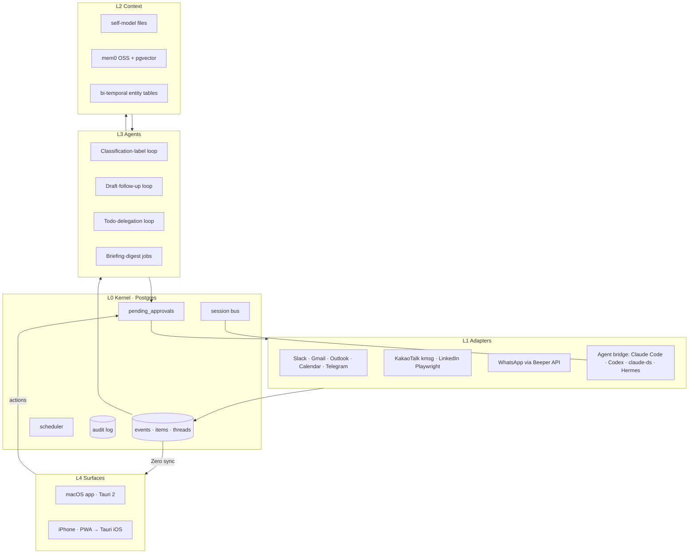
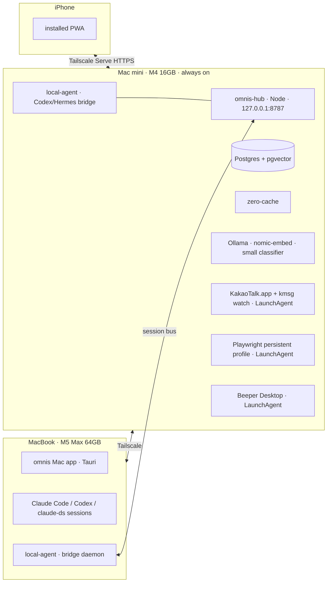

# omnis plan — master design document

Version 1.0 (2026-09-20). Author: Fable (planning lead). 1.0 = the revision incorporating the first and second global reviews (99-review.md, 99-review-v2.md). Pending Logan's review. Basis: `../BRIEF-2026-09-20.md`, `../01-definition-draft.md`, `../research/00-SYNTHESIS.md` and research files 01–27.
Status: pending Logan's review. Each open question in §19 has a default assigned, and work proceeds on those defaults until answers arrive.

This document carries the decisions and the structure. The appendices (A1–A8) carry the details. Where an appendix conflicts with this document, this document wins.

---

## 1. Definition

**omnis is a personal operating system that gathers everything coming to me (messages from people, schedule, agent progress and results) into a single inbox, so that agents holding my context work first and I only decide.**

Three theses are the standard for every design decision.

1. **Everything is an inbox.** Whether it is a message from a person or an agent turn, everything demanding my attention sits in the same queue. An agent session is just a thread where one of the participants is an agent.
2. **Context is the product.** The inbox is the surface; the asset is the unified context about me. Every feature reads from and writes to this memory.
3. **Agents act first, I decide.** Classification, drafts, todos, and delegation are prepared before I look. Any action that leaves the system must pass through my approval.

## 2. Users and success criteria

- v1: Logan alone. 8 channels (Slack, Gmail, Outlook, Google Calendar, Telegram, WhatsApp, KakaoTalk, LinkedIn), 4 agent runtimes (Claude Code, Codex, claude-ds, Hermes) plus the omnis runtime itself, 3 devices (Mac mini hub, MacBook, iPhone).
- v2: founders and operators of the same profile. At the standalone release.

### Goals G1–G8 (derived from the structure; the IDs the appendices cite)

| # | Goal | Layer | Criteria |
|---|---|---|---|
| G1 | Every channel lands in one queue in real time | L0, L1 | API channel receive latency ≤ 5s, capture channels ≤ 60s |
| G2 | Control from anywhere. Read, reply, and archive reflect back to the source channel | L1 | The per-channel write-back scope is stated and the UI promises only that scope |
| G3 | One context. People, projects, commitments, and decisions accumulate in memory and every agent sees the same memory | L2 | Asking any runtime returns the same facts as of the same point in time |
| G4 | Agents work first. Drafts, todos, labels, and delegation proposals are ready before I look, and they observe the approval gate | L3 | Zero outbound sends without approval; draft ready within 60s of an inbound |
| G5 | One surface. Inbox and agent sessions share the same grammar, and Mac and iPhone sync in real time | L4 | State reflects across devices within 2s |
| G6 | standalone is possible (the honest definition in §4.2) | L0 | With the hub running inside the MacBook app, the 5 API channels + agents + calendar work and the iPhone syncs |
| G7 | Runs within a cost ceiling | L3 | $60/month ceiling, automatic downgrade at 80%, monthly report |
| G8 | Safe. Inbox content is untrusted input, outbound sends are approved, every agent action is in the audit log | L0 | Injection test set passes, zero missing audit log entries |

### Success metrics

| Metric | Target | Measurement |
|---|---|---|
| Briefing coverage | Share of items handled that day that appeared in the morning briefing ≥ 80% | Cross-check with the processing log |
| Draft adoption rate | Share of sent replies that started from a draft ≥ 50% | Action log |
| Sent-without-edit rate | Share sent without editing the draft ≥ 20% | diff 0 |
| Missed follow-ups | Zero follow-ups unsent within 48 hours of a meeting | Cross-check with calendar |
| Opening source channel apps | ≤ 5 times per week excluding KakaoTalk and LinkedIn | Self-report |
| Monthly LLM cost | $60 ceiling, automatic downgrade at 80% | Gateway billing |
| Outbound sends without approval | Zero | Audit log |

The numbers will be adjusted after the first month of real measurement. The research estimate of $20–50 per month is model-based, not measured.

## 3. Scope

### In scope for v1

- Channels: Slack, Gmail, Outlook, Google Calendar, Telegram, WhatsApp, KakaoTalk, LinkedIn.
- Agent runtimes: the omnis agent itself, Claude Code, Codex CLI, DeepSeek (claude-ds), Hermes. Hermes attaches as a runtime adapter on both the Mac mini and the MacBook (Phase B exposes read-only sessions, Phase C makes it a delegation target). It does not depend on the existing Hermes setup; it uses only the HTTP surface.
- Features: real-time unified inbox, automatic work/personal filter, automatic people and topic labels, context-based reply drafts and notifications, morning briefing, automatic archiving and nightly archive digest (7-day restore), todos shared with agents, cross-device agent delegation (automatic proposal + approved execution), Network (personal CRM) and follow-ups, note routing, unified search (⌘K, Phase B), local/Drive/GitHub ingestion.
- Surfaces: macOS app, iPhone app (installed PWA in Phase B, native shell in Phase D).

### Non-goals (v1)

- Team and multi-user collaboration.
- Full replacement of source channel apps (calls, stickers, large media).
- Full email client features (rules engine, folder management).
- Training our own models.
- Compatibility with the Mac mini's existing setup (Hermes configuration, omh, buzz relay). omnis replaces it.

## 4. Architecture

### 4.1 Kernel and the four layers



- **L0 Kernel**: Built on Postgres. Append-only `events`, normalized `threads`/`items`, real-time fan-out via `LISTEN/NOTIFY`, the scheduler inside the hub process, the `pending_approvals` approval gate, `audit_log`, and cross-device session routing. The hub is the same code whether it runs on the Mac mini or inside the MacBook app.
- **L1 Adapters**: Normalize channels and agent runtimes into the same Item schema. An adapter declares its capabilities (read, write, realtime, history, media, markRead) and the UI promises only the declared capabilities.
- **L2 Context**: Three-layer memory. self-model files (injected as a fixed snapshot), vector memory (mem0 OSS + pgvector, local embeddings), and bi-temporal entity/relation tables (people, organizations, projects, commitments, decisions).
- **L3 Agents**: Two kinds of loop. Planless reactive loops (labels, classification) and plan-and-verify loops (drafts, delegation, CRM judgment). Each loop has a different tool palette, and irreversible tools (send, delete, delegate execution) are absent from the palette of autonomous loops entirely.
- **L4 Surfaces**: Inbox, Thread, Agent Session, Today (briefing), Tasks, Network, Notes, Digest, Settings. Mac and iPhone use the same UI grammar.

### 4.2 Deployment topology

Now (Phases A–C):



The hub API listens on the mini's local `127.0.0.1:8787` and Tailscale Serve exposes it to the tailnet over HTTPS (8642 is avoided because Hermes uses it). There is one `local-agent` on the MacBook and one on the mini. The mini's exposes Codex and Hermes; the MacBook's exposes Claude Code, Codex, claude-ds, and Hermes.

Later (Phase D, standalone): the hub process runs inside the MacBook app. Postgres is an embedded instance in the app bundle, and the iPhone syncs while the MacBook is on. **Honest definition (D12)**: Slack, Gmail, Outlook, Calendar, Telegram, WhatsApp, and agents run entirely without a hub. KakaoTalk and LinkedIn always need one Mac with a live GUI session. This is a structural constraint of the channels, not a limitation of omnis, and neither the product definition nor the UI hides the fact.

## 5. Core decisions (Decision log)

| # | Decision | Rationale | Fallback |
|---|---|---|---|
| D1 | **Greenfield.** omnis has its own agent runtime and replaces the Mac mini's Hermes/omh/buzz setup. Hermes attaches only as a runtime adapter on both hosts (read-only in Phase B, delegation in Phase C). It does not depend on the existing configuration, memory, or relay | Logan's decision (2026-09-20). Only the ideas of buzz's agent-as-member, its ACP pipeline, and kind dispatch are borrowed (`02`) | None |
| D2 | **The kernel is hand-built on Postgres.** events + LISTEN/NOTIFY + scheduler + pending_approvals + audit_log | Eve runs one Node process per agent (idle ~550MB), which is unsuitable for the kernel on a 16GB mini (`20`). Mastra/LangGraph/Temporal/Inngest are answers to a bigger problem (`11`) | Adopt Eve only at the level of the reply-draft and digest agents |
| D3 | **The harness uses Vercel AI SDK 7 only as the model-call layer.** Loops, tool palettes, and approvals are our own code | `ai@7`'s tool-approval policy maps 1:1 onto draft-then-approve (`11`). No lock-in | Use the Claude Agent SDK (TS) as an assistant to the agent session bridge |
| D4 | **The channel layer is a per-channel hybrid.** The 5 official APIs directly, Beeper Desktop API for WhatsApp only, kmsg for KakaoTalk, Playwright for LinkedIn | The single-layer premise was wrong. Beeper's real gain is WhatsApp alone (`21`). The LinkedIn bridge is broken (`06`) and Kakao is unsupported (`04`) | WhatsApp: a whatsmeow Go sidecar |
| D5 | **The agent bridge is our own thin protocol.** Separate `session_key` (stable scope) from `session_id` (rotating transcript), `capabilities` self-description, and wrapping each runtime's native headless surface | ACP/A2A is over-engineered for a single user with a fixed agent set (`09`). `codex mcp-server` does not exist, so connect directly to app-server JSON-RPC | ACP if multi-vendor support becomes necessary |
| D6 | **Three-layer memory.** self-model files + mem0 OSS/pgvector (Ollama nomic-embed, local, $0) + Postgres bi-temporal entities (borrowing Graphiti's 4-timestamp schema) | mem0 OSS removed graph memory, so relation queries have no path other than our own tables (`26`). Neo4j is overkill for 16GB (`10`) | None. Honcho (AGPL) is not adopted |
| D7 | **Sync is Zero (rocicorp) + three event tiers.** ephemeral (token deltas, not replicated) / durable (debounced Item rows) / cold (raw log, hub only) | It ends at one Postgres. Replicating agent token deltas as-is erodes G5 (2s) (`27`) | PowerSync |
| D8 | **Clients: Tauri 2 for macOS, an installed PWA for iPhone in Phase B, Tauri iOS in Phase D.** The UI is React + Tailwind v4 + shadcn/ui + react-virtuoso + Tiptap + cmdk | TS reuse and Liquid Glass via `window-vibrancy` (`13`,`14`). The iPhone's role is triage and approval, so PWA + Web Push suffices (§19 Q1) | Move the iPhone to Tauri iOS from Phase B |
| D9 | **A 4-tier model cascade + sensitivity rules + a monthly ceiling.** T0 local (classification, embeddings) → T1 DeepSeek V4 Flash (drafts, routing) → T2 Claude Sonnet 5 (VIP, low confidence, memory consolidation) → T3 subscription CLI (unmodified binary subprocesses only) | `12`. Bypassing OAuth tokens through the SDK is prohibited by Anthropic's text. `fable` bills without consent in headless mode, so it is excluded from unattended loops (`24`) | Raising everything to T2 increases cost |
| D10 | **Security by structure, not by prompt.** Inbox text is always data-tagged, irreversible tools are excluded from autonomous palettes, every egress is approved, append-only audit log, kill switch, secrets in Keychain + sops/age | OWASP LLM01 (`15`), agentic-inbox's tool isolation proof (`22`) | None |
| D11 | **Hub operations: split LaunchDaemon/LaunchAgent.** Postgres, the hub, and zero-cache are Daemons; KakaoTalk, the browser, and Beeper are login-session Agents. Auto-login + pmset + caffeinate, healthchecks + ntfy, restic backups, an explicit `idle_replication_slot_timeout` | Apple TN2083 (`18`), WAL accumulation risk (`27`) | None |
| D12 | **The honest restatement of G6 (standalone).** See §4.2 | `25` | None |
| D13 | **Development: the OMC ralph loop + worktrunk isolation + model tier assignment.** Opus (kernel, bridge, memory), Sonnet (adapters, UI, tests), Haiku (docs, mechanical work), DeepSeek Flash (isolated, well-defined stories; Sonnet or above reviews). Fable is for interactive planning and review only | `24` | None |
| D14 | **Repo: Onword-Lab/omnis, a pnpm monorepo, private until launch.** | Logan's brief ("the company GitHub") | Go public when the README is complete |
| D15 | **A draft is an Item status, not a separate table. Action approval takes the HumanInterrupt/HumanResponse shape.** | the agentic-inbox and agent-inbox sources (`22`) | None |
| D16 | **Language and runtime: TypeScript + Node 22 + pnpm.** Go only for the whatsmeow fallback sidecar, no Python | The ecosystem (AI SDK, mtcute, Zero, Tauri frontend) is all TS | None |

## 6. Data model (overview; details in A3)

A3 owns the schema. This table is an overview, and column names follow A3.

| Object | Key fields | Notes |
|---|---|---|
| `accounts` / `account_secrets` | channel, external_id, display, capabilities(jsonb) / secrets live in a separate table (excluded from Zero replication, Keychain reference) | Per channel login |
| `threads` / `thread_labels` | account_id, external_id, kind(dm/group/email/agent_session/calendar), title, participants[], meta(jsonb), last_item_at, archived_at / labels are a join table | Agent sessions are threads too |
| `items` / `item_labels` | thread_id, external_id, kind(message/email/event/agent_turn/tool_call/system), author(person_id or agent_session_id or system), body, body_html, attachments, sent_at, **status**(received/read/draft/approved/sent/failed/archived), **sensitivity**(normal/personal/finance/legal/health), **embedding** vector(768), meta(jsonb), source_hash | Draft = status. Auto-archive is status=archived + 7-day undo |
| `persons` / `identities` / `person_merges` | person ↔ (channel, handle) many-to-one, labels, relationship_state(unknown/new/warming/active/dormant/closed), first_contact_at, last_contact_at, cadence_days, priority_score, primary_thread_id / merge and split history | The backbone of Network |
| `labels` / `label_rules` | name, kind(scope/topic/priority/person) / natural-language prompt → rules(jsonb), enabled flag | The Superhuman Auto Labels approach |
| `tasks` | source_item_id, title, kind(todo/followup/delegation), owner(me or agent_runtime), state, due_at, delegated_session_id | Todos shared with agents |
| `agent_runtimes` / `agent_sessions` | runtime(omnis/claude_code/codex/claude_ds/hermes), host(mini/macbook), session_key, session_id, purpose, capabilities, state | The `omnis` runtime is 1 row with no bridge adapter |
| `agent_runs` | loop, model_tier, provider, tokens_in/out/cached, cost, latency, outcome, item_id | Single source for evaluation, cost, and audit |
| `pending_approvals` | action(send/delete/delegate/calendar_write), args(jsonb), description, config(allow_accept/edit/respond/ignore), state, decision(jsonb), decided_at | HumanInterrupt/HumanResponse |
| `notes` | body, routed_to(thread_id/person_id), rationale, confidence | Note routing |
| `memories` | content, embedding, source_item_id, source_kind(inbox/calendar/local/drive/github), valid_from, valid_until, recorded_at, invalidated_at, confidence | bi-temporal |
| `entities` / `relations` | type, name, attributes, the same 4 timestamps | People, organizations, projects, commitments, decisions |
| `digests` | kind(morning/nightly), for_date, body, item_ids[] | |
| `events` | seq, kind, payload, at | append-only, cold tier, rolloff only through a SECURITY DEFINER function |
| `audit_log` | actor(me/agent/system), action, target, before/after, at | append-only |
| `jobs` | name, schedule, last_run, next_run, state | A4 owns the schedule (briefing 06:30, digest 23:00 KST) |

## 7. Kernel

- **Three event tiers**: ephemeral (agent streaming tokens, typing, and the like) flows only over NOTIFY or WebSocket and is never stored. durable is the debounced Item row, and Zero replicates it. cold is the full raw event stream and stays only on the hub locally. The NOTIFY payload has an 8,000B limit, so only ids are carried.
- **Scheduler**: a cron table inside the hub process (`jobs`: morning briefing, nightly digest, follow-up timers, token refresh, Gmail re-watch every 7 days, Graph subscription renewal weekly, Drive/GitHub polling). Execution records are kept in events.
- **Approval gate**: Every egress (send, delete, calendar write, delegate execution) passes through `pending_approvals`. "Autonomous allow" can be opened per channel or per person, but the default is approval. The approval UI exposes the full text. Auto-archive is not an egress, so it is guaranteed not by approval but by a 7-day undo and exposure in the nightly digest (A4 §6.4).
- **Session bus**: The per-device bridge daemon (`local-agent`) connects to the hub over Tailscale and registers sessions with `session_key`/`session_id`. The hub exposes sessions as threads, and delegation flows from `pending_approvals` to the target bridge.
- **kill switch**: A single global flag halts all autonomous loops and egress. It is set from both the UI and the CLI.

## 8. Adapter contract and channel matrix (details in A1)

Adapter interface (essentials):

```ts
interface Adapter {
  id: string; channel: Channel;
  capabilities(): Capabilities;           // read, write, realtime, history, media, markRead, typing
  connect(auth: AuthRef): Promise<void>;  // login · QR · OAuth
  backfill(since?: Date): AsyncIterable<NormalizedItem>;
  subscribe(): AsyncIterable<NormalizedItem | AdapterEvent>; // real time
  send(thread: ThreadRef, draft: Outbound): Promise<SendResult>; // called only after approval
  markRead?(thread: ThreadRef): Promise<void>;
  health(): Promise<Health>;
}
```

| Channel | Path | Fallback | R/W | Risk | Phase |
|---|---|---|---|---|---|
| Slack | Socket Mode + xoxp user token | Events API | Full | Low | A |
| Gmail | `users.watch` + Pub/Sub pull, OAuth Production publication | `history.list` polling | Full | Low | A |
| Google Calendar | `events.list` + syncToken polling (1–5 min) | `events.watch` push (Phase 0 spike) | R/W(hold) | Low | A |
| Outlook | Graph delta polling → webhook (subscription lifetime 10,080 min) | IMAP OAuth2 | Full | Low | B |
| Telegram | mtcute (MTProto, official api_id) | Telethon in a separate process | Full | Low | B |
| WhatsApp | Beeper Desktop API (local REST + WS) | whatsmeow sidecar | R/W | Medium | C (conditional on the spike passing, secondary-number pilot) |
| KakaoTalk | kmsg (macOS AX) LaunchAgent, `watch --json` | Notification Center DB trigger + OCR | R detailed / W text (dry-run by default) | Medium–High | C (send only after 2 weeks of stable read) |
| LinkedIn | Playwright persistent profile, low-frequency random polling | Parsing LinkedIn notification emails in Gmail (no cost), Unipile | R/W (after approval) | Medium–High | C |
| Agent sessions | Native headless surface (§9) | — | R/W | Low | A |

## 9. Agent session bridge (details in A2)

- Per-runtime surface: Claude Code `claude -p --output-format stream-json --resume`; Codex `app-server` JSON-RPC (pinned version, feature detection via the `capabilities` array); claude-ds uses the same surface as Claude Code (only the model is DeepSeek); Hermes is `/v1` + session headers (optional).
- Session = thread. Turn = Item(kind agent_turn), tool call = Item(kind tool_call, shown with a label, an icon, and a progress state).
- Delegation: the omnis agent proposes `delegate(runtime, host, brief)` → approval → the bridge on the target device creates a session → progress is visible in the thread → the result is attached to the originating thread.
- Mutual understanding: an agent reads another session's durable summary with the `read_session(session_key)` tool (the summary and the last N turns, not the raw token log). Scope restriction (intentional narrowing): the omnis loops (L3) can read every session summary, but development sessions (Claude Code, Codex, etc.) cannot directly read sessions whose `purpose` is `inbox:*` or the raw inbox threads. This is to close the path by which inbox content leaks into development sessions; what is needed is delivered attached to an approved delegation brief. The brief's "everyone understands each other" is implemented within this boundary.
- Concurrency ceiling: 4 active turns per host (turns, not process count). Codex has one resident app-server handling multiple threads, so a process-based measure is meaningless.
- Sessions Logan opens directly in a terminal are not managed by the bridge (CWD, permissions, and intent are unknown). A read-only import of `~/.claude/projects/**/*.jsonl` is a Phase C candidate (§19 Q12).
- The path for agents to assign work to each other (intentional narrowing): no runtime directly commands another runtime. When one agent wants another agent's work done, it creates a Task and a delegation proposal via `propose_delegation`, which passes the same approval gate and is executed by the target bridge. The brief's "must be able to assign work to each other" is implemented through this path, and agent-to-agent commands without approval stay closed because they would be a channel for injection to spread from one session to another. Opening the per-runtime, per-repo allow rules (Q10) lets it flow without approval.
- The bridge protocol follows MCP 2026-07-28's per-request version negotiation model.

## 10. Context and memory (details in A3, A4)

- **Self-model files**: `USER.md` (me, role, preferences, tone), `VOICE.md` (voice samples per channel and per counterpart), `PROJECTS.md`. Inserted as a fixed snapshot at the prompt prefix to keep the prefix cache warm. Edits proposed by agents take effect after approval.
- **Vector memory**: mem0 OSS + pgvector, embeddings from Ollama `nomic-embed-text-v1.5` (768d, local, $0). Linked to the source Item.
- **Entity memory**: persons/entities/relations, 4 timestamps (valid_from, valid_until, recorded_at, invalidated_at). Both "as of now" and "as of then" queries are possible.
- **Ingestion**: inbox Items (real time), calendar, local files (FSEvents, allowlisted folders only. Files on the mini are read by the hub directly; files on the MacBook are read by the MacBook `local-agent` and sent to the hub), Google Drive (`changes.list` polling), GitHub (ETag polling). Webhooks require public HTTPS, so the default is polling. The allowlist defaults to empty, so nothing is read until Logan fills it in.
- **Consolidation cadence**: real-time extraction (T1) → nightly consolidation (T2, Batch API) → weekly self-model proposals.
- **Evaluation**: start with a recall@k script. 50 golden questions grounded in the inbox.

## 11. Agent layer (details in A4)

| Loop | Kind | Model tier | Tool palette | Output |
|---|---|---|---|---|
| Classification·labels | Reactive (no plan) | T0 → T1 | read only | scope(work/personal), topic, priority, person label |
| Reply drafts | Plan + verify | T1, T2 for VIP and low confidence | read, search_memory, read_calendar, propose_draft | Item(status draft) + rationale |
| Todo extraction·reminders | Reactive | T1 | read, propose_task | tasks |
| Delegation | Plan + verify | T2 | read, read_session, propose_delegation | pending_approval(delegate) |
| Briefing·digest | Batch job | T1 (Batch) | read | digests |
| Network follow-ups | Plan + verify | T1 → T2 | read, read_calendar, propose_draft, propose_task | draft + task |
| Note routing | Reactive | T1 | read, search_memory, propose_route | notes.routed_to |
| Auto-archive | Reactive | T0 → T1 | read only | items.status=archived (7-day undo), all exposed in the nightly digest |
| Ingestion | Batch job | T0 (embeddings), T1 (extraction) | read_local (allowlisted folders only), read_drive, read_github | memories, entities |

Default auto-archive rules (Logan tunes these in Settings): archive when all of the following hold. ① The sender is a no-reply, newsletter, or notification account, or is not a person ② The body contains no question, request, or CTA directed at me (T1 judgment, confidence ≥ 0.85) ③ It is not VIP and its sensitivity is normal ④ I have never replied in the thread. Threads I have replied in are archived only when "no new question from the other side" also holds. When in doubt, do not archive.

Delegation defaults to automatic proposal + approved execution. When an agent creates a Task it proposes delegability and the target (runtime, host) along with it, and a single approval from Logan executes it. Fully autonomous execution turns on only when Logan opens the per-runtime, per-repo allow rules (§19 Q10).

Principle: `propose_*` only stores; it does not execute. `send`, `delete`, `delegate`, and `calendar_write` can be called only by the approval handler and are absent from the agent palette. A4 owns the details of the Ingestion loop (allowed folders, chunking, failure handling, polling cadence).

## 12. Surfaces (details in A5)

- Screens: Inbox (unified, filter pills: All / Work / Personal / Agents / Needs approval), Thread, Agent Session (the same Thread view + tool badges), Today (morning briefing, today's schedule, pending approvals), Tasks, Network (person cards, follow-up queue), Notes (one line of input → routing proposal), Digest (nightly summary, restore), Settings (accounts, autonomous allow rules, model tiers, kill switch).
- Key interactions: ⌘K command palette (agent actions + unified search: items full-text search + memories kNN, Phase B), keyboard-first triage (j/k, e, r, a), the draft card's "Edit & send" gate, the fixed channel icon on the right, selected-row elevation, labels as 2 chips plus `+N` on the right of InboxRow line 2. KakaoTalk send stays disabled until read has been stable for 14 days and shows the days remaining.
- Design language (corrected by Logan's decision on 2026-09-20): **follow kinso** — light by default (dark is optional), a left squircle channel rail, an "ask or search" pill bar at the top, rows = avatar + name + relative time + one-line AI summary + channel icon on the right, no hairlines with only the selected row as a card. Liquid Glass only in the sidebar/toolbar/sheet/palette. Pretendard + Inter. Motion 100/160/400ms. Details in `docs/design/DESIGN-DIRECTION.md`; A5's dark-first items are dropped.
- iPhone: one-handed triage. Approvals, snooze, short replies, note entry. Long edits go to the Mac. A 5-item tab bar (Inbox, Today, Tasks, Network, Notes). Digest is reached via a card at the top of Today. A4 §3.6 owns the notification policy and it applies to the phone as-is. Immediate push (VIP and urgent drafts, 80-character preview + Approve), batched push (every 3 hours), digest push (once nightly). The brief's "write a draft and notify me separately" is implemented as these three tiers.

## 13. Security (details in A4, A6)

MVP required: data-tagging of inbox text and separation from instructions, per-loop tool palette isolation, approval for every egress, an append-only audit log, a global kill switch, secrets in Keychain, sops+age configuration encryption, hub exposure limited by Tailscale ACL, human-level rate limits per channel (random polling, no unsolicited outbound), 2FA.
Later: column encryption of message bodies (SQLCipher-grade), a prompt injection classifier (the agentic-inbox pattern), canary tokens, a PII masking option.

## 14. Cost policy

- T0 local: classification, labels, embeddings. Ollama on the mini (nomic-embed 274MB, a 1–3B classifier). 30B-class local inference only on the MacBook.
- T1 DeepSeek V4 Flash called directly (using the prompt cache, nightly batches off-peak after 19:00 KST). Drafts, note routing, todo extraction, digests.
- T2 Claude Sonnet 5 (API key). VIP counterparts, low-confidence drafts, memory consolidation, delegation judgment.
- T3 subscription CLI (Claude Code, Codex). Development and my own sessions only. Unmodified binary subprocesses.
- Sensitivity rules (§19 Q4 default): threads labeled personal, finance, legal, or health, or VIP threads, skip T1 and go to T2. Everything else is T1.
- A $60 monthly ceiling. 10% of it is a T2 reserve for VIP and sensitive threads. At 80%, non-sensitive work downgrades from T2 to T1; once the budget excluding the reserve is exhausted, non-VIP draft generation stops (classification and archiving continue) and VIP and sensitive drafts keep being generated on T2 as long as the reserve lasts. The monthly report is included in the Digest and the ceiling can be changed in Settings.
- Parallelism and ensembles (running the same input through several cheap models and merging) are not used at runtime. The cost per call multiplies, and for classification and drafts the cascade that escalates to a higher tier on low confidence achieves the same accuracy more cheaply. Ensembles are used only in the evaluation harness (judging panels).
- Gateway: OpenRouter first, Vercel AI Gateway as a secondary when going through the AI SDK.

## 15. Operations (details in A6)

- Mini: LaunchDaemon (Postgres, omnis-hub, zero-cache, Ollama), LaunchAgent (kmsg watch, Playwright profile, Beeper). Auto-login + screen never locking + `pmset` + `caffeinate`. Reapply LaunchAgents on boot.
- Exposure: the hub binds only to `127.0.0.1:8787` and Tailscale Serve HTTPS (`*.ts.net` certificate) exposes the hub API and the PWA to the tailnet. Funnel only for the Calendar push and Outlook webhook spikes.
- Backups: restic → B2, nightly Postgres `pg_dump`, self-model files in git.
- Monitoring: healthchecks.io dead-man's-switch (hub, each adapter, bridges) + ntfy push. Adapter state also appears in the omnis inbox as system Items.
- No containers (native processes). Colima only if necessary.

## 16. Phase plan

| Phase | Content | Exit criteria |
|---|---|---|
| **0 Spikes (2 weeks)** | 14 gates (Phase A must not start before they pass): ① Calendar `events.watch` via Funnel ② Beeper token + WhatsApp secondary-number send ③ auto-login with FileVault enabled ④ kmsg read for 48 hours ⑤ Tailscale Serve HTTPS in iPhone Safari ⑥ Zero + Postgres reflecting within 2s ⑦ Codex app-server pinned + 1 turn ⑧ Ollama nomic-embed throughput ⑨ Slack Socket Mode 1 turn ⑩ Gmail watch + Pub/Sub ⑪ `claude -p --bare` hook injection ⑫ `--permission-mode` ↔ profile mapping ⑬ Zero replication of vector/tsvector/uuid[] ⑭ worktrunk dry run. The remaining 16 at each phase entry (99-review §5) | The pass/fail of the 14 gates fills in the decision table |
| **A Kernel + inbox core** | Postgres kernel, Slack/Gmail/Calendar adapters, Claude Code/Codex bridge (MacBook `local-agent`), Zero sync, Tauri Mac app (Inbox/Thread/Agent Session/⌘K/approval cards), work/personal classification (T0/T1), approval gate, kill switch, audit log | G1, G2, G4 (zero approval violations), and G5 met for 3 channels + 2 runtimes. Logan begins daily use. Build complete 2026-09-20 (main 5456a73); exit criteria verified after the e2e smoke + mini deployment + real account connection |
| **B Context + agents + phone** | Three-layer memory + ingestion (local/Drive/GitHub), context drafts + notifications, morning briefing, auto-archive + nightly digest, unified search (⌘K), PWA iPhone + Web Push, Outlook/Telegram, Hermes read-only sessions | Draft adoption rate and briefing coverage begin to be measured; monthly cost measured |
| **C Capture channels + todos + Network** | KakaoTalk (kmsg), LinkedIn (Playwright + notification emails), WhatsApp (Beeper, conditional on the spikes), todos and delegation (automatic proposal + approved execution), Network + follow-ups, note routing, people and topic labels, claude-ds and Hermes as delegation targets | All 8 channels in the inbox. Missed follow-ups measured at 0 |
| **D standalone + launch** | Hub in-app (MacBook), Tauri iOS, README and assets, public switch. The mini continues in parallel as a KakaoTalk/LinkedIn capture sidecar (§19 Q8) | 5 channels + agents work without the mini. Repo public |

## 17. Development process (details in A7)

- Loop: the OMC `ralph` skill. The unit of work is a story card from Appendix A7 (input, output, verification command). One worktree per story via worktrunk. After 3 failures, escalate one tier; after 3 failures on Opus, stop and escalate to Logan (no automatic promotion to Fable). A `--max-iterations` cap. Implementer and reviewer contexts are separate (no self-approval).
- Model assignment: Opus = kernel, bridge protocol, memory schema, security boundaries. Sonnet = adapters, UI, tests, integration. Haiku = docs, fixtures, mechanical refactors. DeepSeek V4.1 Flash (claude-ds) = isolated, well-defined stories (adapter boilerplate, DDL, fixtures, simple UI components). A DeepSeek diff must be reviewed by Sonnet or above. Fable = interactive planning and milestone reviews only, excluded from headless.
- Tests: a contract test per adapter (fixture replay), kernel integration tests (a real Postgres instance), a prompt injection test set, and Playwright smoke for the UI.
- Commits: one atomic commit per story, `Co-Authored-By` preserved.

## 18. Top 10 risks

| # | Risk | Mitigation |
|---|---|---|
| 1 | Prompt injection → real actions | tool palette isolation, egress approval, data tagging, audit log, kill switch |
| 2 | KakaoTalk/LinkedIn account suspension | read first, dry-run → single approval, random low frequency, no unsolicited outbound, fixed IP |
| 3 | WhatsApp session ban | secondary-number pilot, read-mostly, no bulk sending |
| 4 | Mac mini single point of failure (GUI session locked) | reapply LaunchAgents on boot, redundant caffeinate, dead-man's-switch |
| 5 | Unbounded WAL accumulation | set `idle_replication_slot_timeout`, slot health check, disk alerts |
| 6 | Codex app-server drift | version pin, capabilities-based feature detection |
| 7 | `fable` headless billing | excluded from unattended loops |
| 8 | Anthropic ToS boundary | no OAuth token bypass, unmodified binaries only, API keys for the product backend |
| 9 | ralph loop runaway | 3-attempt cap per story, reset to the last verified commit, separate reviewer |
| 10 | Vendor evaporation (Beeper pricing, mem0 changes, agentic-inbox stagnation) | isolate behind the adapter interface, pin versions, re-verify quarterly |

## 19. Open questions and defaults

| # | Question | Default (proceed on this absent an answer) | Impact |
|---|---|---|---|
| Q1 | May the iPhone start as a PWA | **PWA (Phase B), Tauri iOS in Phase D** | Phase B schedule |
| Q2 | Do we attach WhatsApp with a real-use number | **secondary-number pilot first** | Phase C |
| Q3 | Do we accept the KakaoTalk automation risk | **read only first, send after 2 weeks of stability and behind approval** | Phase C |
| Q4 | Do we pass personal inbox bodies through DeepSeek (China-hosted) | **apply the sensitivity rules (§14): personal, finance, legal, health, and VIP go to Anthropic** | Cost, Phase B |
| Q5 | Is the repo private | **private until launch** | None (sops+age is MVP anyway) |
| Q6 | Do we run the Calendar push spike | **Yes (Phase 0)** | Calendar real-timeness |
| Q7 | Which phase does Hermes join in | **read-only sessions in Phase B, delegation target in Phase C** (the brief specifies Hermes access on both hosts) | Phase B scope |
| Q8 | In Phase D, does the MacBook become the only always-on node | **keep the mini in parallel as a KakaoTalk/LinkedIn capture sidecar** (capture stops if the MacBook sleeps) | Phase D design |
| Q9 | License | **Apache-2.0** | Launch |
| Q10 | Does delegation extend to automatic execution by agents | **automatic proposal + approved execution. Fully autonomous only when the per-runtime, per-repo allow rules are opened** (the brief's "also assign work first" is implemented as a single approval) | Safety boundary |
| Q11 | When the cost ceiling is hit, do VIP drafts stop too | **No. The 10% reserve keeps VIP and sensitive drafts going (§14)** | Cost |
| Q12 | Do Claude Code/Codex sessions opened directly in a terminal also show in the inbox | **keep as a read-only import candidate in Phase C; not now** | Phase C scope |
| Q13 | The auth and isolation mode for delegated Claude Code runs, and the headless approval surface | **Settled by gate ⑪ (FAIL) and ⑪b (PASS, 2026-09-20).** `--bare` ignores hooks and `--permission-mode` and accepts only API key auth, but an MCP tool registered with `--mcp-config` and designated with `--permission-prompt-tool` is still called under `--bare` and denials are honored (3–4ms response latency). Therefore ① the headless approval surface = the permission-prompt MCP tool served by the bridge → promoted to `pending_approvals` (hook-based promotion is dropped) ② Claude Code delegation = non-bare + subscription auth + a new worktree + an allowlist of Logan-owned repos (project hooks are not isolated but have no blocking authority) + blocking irreversible tools with `--disallowedTools` ③ claude-ds delegation = `--bare` (API key) + the same permission-prompt tool. The observe-only restriction is lifted and the workspace profile is allowed. Logan can reverse this | A2-D11, A2 §4.1, D9 cost |

## 20. Appendices

- A1 Channel adapter detailed contract (per-channel auth, real-time strategy, write-back scope, failure modes, spike checklist)
- A2 Agent session bridge protocol
- A3 Data schema (DDL) and memory tables
- A4 Agent layer details (loops, prompt skeletons, tool palettes, routing tables, injection defenses, behavioral specs for briefing, digest, follow-up, and note routing)
- A5 UI/UX details (per-screen specs, tokens, component map, Mac and iPhone layouts)
- A6 Operations and infrastructure (hub deployment, Tailscale, backups, monitoring, secrets, Phase 0 spike procedures)
- A7 Development process (monorepo structure, ralph story card format, model assignment rules, tests and CI)
- A8 README blueprint and asset list
