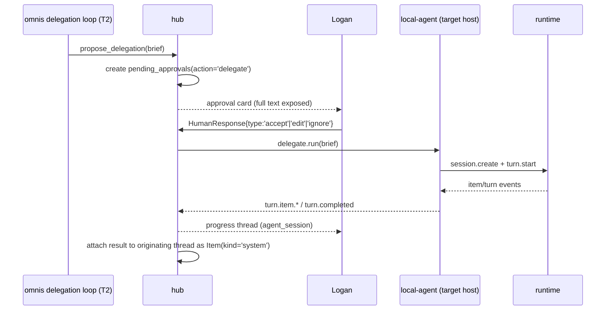

# A2 — Agent Session Bridge Protocol

Version 1.0 · 2026-09-20 · Author Fable
Basis: `research/09-agents-as-inbox.md` (runtime surface, Hermes session header split, ACP/A2A rejection), `research/27-gap-event-volume-and-sync-budget.md` (event measurements, 3-tier split), `research/22-gap-read-the-prior-art-source.md` (HumanInterrupt/HumanResponse, tool isolation), `research/02-block-buzz.md` (agent-as-member, JSON in/out CLI contract), `research/24-gap-ralph-loop-dev-pipeline.md` (claude-ds invocation contract), `research/00-SYNTHESIS.md` §2.3 (version negotiation model), and the master design `00-omnis-design.md` D5/D7/D10/D15/D16 · §6 · §9 · §11 · §19 Q7/Q10.

This appendix extends master §9 to an implementable level. Where it conflicts with the master, the master wins.

---

## 0. Decisions This Appendix Settles

| # | Decision | Basis | Fallback / change condition |
|---|---|---|---|
| A2-D1 | **`session_key` (stable scope) ≠ `session_id` (the transcript ID the runtime rotates).** Key format is `agent:{runtime}:{host}:{purpose}`, max 256 characters, control characters forbidden | Hermes's separation of `X-Hermes-Session-Key` and `X-Hermes-Session-Id` (`09`, the single most strongly verified finding in this sweep) | None |
| A2-D2 | **Transport is a single WebSocket dialed one-way bridge→hub, carrying bidirectional JSON-RPC 2.0.** The hub never connects to the bridge | The MacBook and iPhone sit behind NAT, and only their Tailscale addresses are stable. Keeping the hub listen-only means firewall rules in one direction only | If the bridge existed only on the always-on host (the mini), a hub→bridge dial would also work, but that means two code paths, so we don't |
| A2-D3 | **Version negotiation follows the MCP 2026-07-28 model.** No `initialize` handshake. Every request carries the version in `params._meta["ai.omnis/protocolVersion"]`, and capabilities are queried via the `bridge/discover` RPC | `00-SYNTHESIS` §2.3 (MCP current 2026-07-28, per-request `_meta` + mandatory discover) | None |
| A2-D4 | **Three event tiers.** `turn.item.delta` is not stored (ephemeral). Durable work creates a row on `turn.item.started` → UPDATE only on a 500 ms debounce or on `turn.item.completed`. The full raw NDJSON goes to the hub's local cold log | `27` measurements: of 39 events / 63 KB in one turn, 92% is `system/init`, emitted once per process start; real content is ~4.8 KB. Committing token deltas would eat into G5 (2 seconds) | The debounce interval is tuned after Phase A measurements. 500 ms is the initial value |
| A2-D5 | **The Claude Code adapter is a subprocess per turn.** It is not kept as a resident process. `claude -p --output-format stream-json --verbose --resume <session_id>` | `09` VERIFIED. `-p` is by default a non-interactive one-shot run, and making it resident would require switching to the Agent SDK, which conflicts with D3 (the harness uses only the AI SDK) | If the per-turn `system/init` 28 KB overhead becomes a problem, switch to the Claude Agent SDK's `unstable_v2_resumeSession` (`09`) |
| A2-D6 | **The Codex adapter is one resident `app-server` child process.** The version is pinned to `rust-v0.155.1`, and features are detected via the `capabilities` array | `09`/`27`: app-server is a long-lived bidirectional JSON-RPC channel, and 0.156.0-alpha gets cut 4–5 times a day | The pin is lifted only when the full contract test suite passes |
| A2-D7 | **`codex mcp-server` does not exist.** It is removed from the delegation path entirely | `09` Verification row 10: `codex-rs/cli/src/mcp_cmd.rs` contains only `List/Get/Add/Remove/Login/Logout` | None |
| A2-D8 | **claude-ds is a configuration variant of the Claude Code adapter.** No separate adapter class is created. Only the binary name, model alias, and API key source differ | `09` ("claude-ds is free: same wrapper works unmodified"), `24` (claude-ds invocation contract) | If the claude-ds endpoint breaks the stream-json contract, branch then |
| A2-D9 | **The Hermes adapter exists on both hosts and is split by phase: Phase B = read-only sessions (`origin:'human'` only, excluded from delegation targets), Phase C = included as a delegation target.** The surface is `/v1` + `X-Hermes-Session-Key`/`X-Hermes-Session-Id`, and capabilities come from `GET /v1/capabilities` | master §19 Q7 (Phase B read-only sessions, Phase C delegation targets), `09` VERIFIED (session header split, capabilities self-description) | Promotion to Phase C requires passing S-A2-5 (the actual surface of Hermes command approval). If it fails, Hermes stays read-only |
| A2-D10 | **A runtime's approval request is promoted into omnis `pending_approvals`.** The bridge never accepts on its own judgment | `22` (HumanInterrupt/HumanResponse), master D10/D15 | None |
| A2-D11 | **`--bare` is the default for delegated runs.** The target repo's `.claude/settings.json` hooks and `.mcp.json` are not loaded. Settings exposes an "run owned-repo allowlist without `--bare`" option, but it is **off by default**, and the decision whether to enable it is deferred until after Phase A measures delegation quality (first see whether delegation runs well enough without hooks/MCP) | `09` VERIFIED: without `--bare`, even a `-p` run loads project hooks/MCP without a trust prompt → this opens a path where an inbox-text-induced delegation executes the repo's hooks. The allowlist option has the same shape as master §11's "fully autonomous execution only when Logan opens per-runtime, per-repo allow rules" (§19 Q10) | Even when enabled, it applies only to repo paths in the allowlist, and any delegation originating from the inbox (with a `source_item_id`) is always `--bare` regardless of the allowlist |
| A2-D12 | **The bridge does not start a runtime for a path outside `allowed_roots`.** The bridge re-verifies any `cwd` the hub sends | master D10 (enforced by structure), `15` (Claude Code sandbox strategy) | None |
| A2-D13 | **`read_session` returns only the durable summary plus the last N turns.** It never returns raw deltas or raw reasoning text | master §9, `27` (the reasoning-is-ephemeral decision), privacy | Full transcripts for debugging are available only through a hub-local on-demand API |
| A2-D15 | **Configuration precedence is CLI arguments > environment variables > `~/.omnis/local-agent.toml` > built-in defaults.** Only `[[runtime]]` blocks are TOML-exclusive | A6 §10.1's LaunchAgent plist passes `--hub <url>` via `ProgramArguments`, while A2 §2.1 sets the same value through TOML — nowhere did it say which one wins (99-review-v2 §2-3) | None |
| A2-D16 | **There is no path for one runtime to command another directly.** If a runtime wants another runtime to do work, it uses only `propose_delegation` → approval → the target bridge | master §9 (deliberate reduction): agent-to-agent commands without approval become a channel for injection to spread from one session to another | When Logan opens per-runtime, per-repo allow rules (master §19 Q10), only the approval step is skipped; the path itself still goes through the target bridge |
| A2-D14 | **A mock runtime replaying NDJSON fixtures is the default form of adapter contract testing.** Real runtimes are not invoked in CI | `27`: during measurement, a turn was cut off by the Codex account usage limit. Anything with billing or rate limits does not go into CI | A one-turn real-runtime smoke test runs once a week in nightly only |

---

## 1. Conceptual Model

### 1.1 The Four Objects

```ts
// packages/bridge-protocol/src/types.ts
export type RuntimeKind = 'claude_code' | 'codex' | 'claude_ds' | 'hermes' | 'omnis';
export type HostId = 'mini' | 'macbook';

/** One runtime kind installed on a host. The bridge registers it at startup. */
export interface AgentRuntime {
  id: string;                 // uuid, issued by the hub
  runtime: RuntimeKind;
  host: HostId;
  version: string;            // 'claude 2.1.231' | 'codex rust-v0.155.1'
  capabilities: RuntimeCapabilities;
  transport: 'process' | 'http';  // only hermes is 'http'
  binary_path: string | null;     // null when transport='http' (§2.1)
  allowed_roots: string[];        // A2-D12. [] when transport='http' — cannot be enforced
  base_url: string | null;        // only when transport='http' (§2.1)
  state: 'online' | 'degraded' | 'offline';
  last_health_at: string;     // ISO8601
}

/** A single conversation. 1:1 with a kind='agent_session' row in the omnis threads table. */
export interface AgentSession {
  id: string;                 // uuid = threads.id
  runtime_id: string;
  session_key: string;        // A2-D1, stable
  session_id: string | null;  // as given by the runtime, may rotate
  cwd: string;
  purpose: string;            // 'inbox:draft' | 'proj:omnis' | 'delegate:<task_id>'
  origin: 'human' | 'delegation' | 'job';
  permission_profile: PermissionProfile;
  state: 'idle' | 'running' | 'awaiting_approval' | 'failed' | 'closed';
  opened_at: string;
  last_turn_at: string | null;
}
```

**`session_key`** pins down "who, where, and for what". Its format is `agent:{runtime}:{host}:{purpose}`, e.g. `agent:codex:mini:proj-omnis`, `agent:claude_code:macbook:inbox-draft`. The namespace separator `:` in `purpose` (e.g. `proj:omnis`) is replaced with `-` when placed into `session_key` — because `session_key` itself uses `:` as its segment separator, inserting it verbatim would make parsing ambiguous. The 256-character cap and the ban on control characters follow Hermes's rules verbatim (`09`). This key is the memory scope (A3's `memories.scope`) and the lookup key for `read_session`.

**`session_id`** is the transcript ID the runtime provides. For Claude Code it comes from the `system/init` event or the `session_id` field of `--output-format json` (`09`), and for Codex from `threadId` in `thread.started` (`09`,`27`). When the runtime starts a new session (e.g. a failed `--resume`, an app-server restart), this value changes while `session_key` and the thread persist. **This separation is the backbone of this entire appendix.** Thread continuity and memory scope are not tied to runtime restarts.

**`purpose`** is not a free-form string; only three namespaces are allowed: `inbox:<loop>` (omnis loops such as triage and drafting), `proj:<slug>` (development sessions Logan opens directly), and `delegate:<task_id>` (delegation execution). The namespace is the primary input for choosing the permission profile (§7.1).

**The `'omnis'` kind is not handled by the bridge.** It exists as **exactly one row** in `agent_runtimes` (master §6: "the `omnis` runtime is 1 row, with no bridge adapter"), and this is to mark the ownership of sessions and Items created by omnis's own built-in L3 loops (master §11's triage, drafting, todos, digest, Network, note routing, auto-archiving, and Ingestion). Properties:

- The bridge does **not** register it via `runtime.registered`. The hub upserts it as itself at boot. `host` is the host the hub runs on (mini).
- There is **no** `RuntimeAdapter` implementation (the four in §4 are all of them). There is no code path that calls `probe`/`startTurn`/`cancel`/`close` — the loops run directly inside the hub.
- Sessions of this runtime always have `purpose` of `inbox:*` and `origin` of `job`. So per §7.1 the profile is fixed to `observe`, and the file-write, network, and delegation-execution paths are structurally closed.
- `session_key` uses the same format: `agent:omnis:mini:inbox-triage`, etc.

A note for implementers: keep `'omnis'` in the `RuntimeKind` union but explicitly block it in the adapter factory's `switch` with `throw new Error('omnis runtime has no adapter')`. Silently ignoring it means it later gets mixed into the delegation candidate list.

### 1.2 Capability Self-Description

Runtime capabilities are not inferred from a version string. This is the same reason Claude Code carries a `system/init.capabilities` array (`09` VERIFIED, v2.1.205+).

```ts
export interface RuntimeCapabilities {
  resume: boolean;              // can resume past sessions
  cross_project_resume: boolean;// resume by session ID outside the CWD (claude >= 2.1.223, `09`)
  stream_deltas: boolean;       // provides token-level deltas
  reasoning_stream: boolean;    // provides reasoning deltas (codex)
  tool_calls: boolean;          // provides tool calls as structured events
  approvals: 'native' | 'hook' | 'none';
  cancel: boolean;              // cancel an in-flight turn
  models: string[];             // selectable model aliases
  features: string[];           // passes through the runtime's original capability strings verbatim
}
```

`features` carries the array the runtime gave verbatim, untouched (Claude Code's `interrupt_receipt_v1`, etc.). The adapter promotes only what it understands into the boolean fields above and passes the rest through — so when a new feature appears, the hub can discover it from logs without a bridge deployment.

### 1.3 Session State Machine (herdr model → `agent_sessions.state`)

Session states use herdr's pane model verbatim (`idle / working / blocked / done`, `research/30-herdr-and-oss-ui-borrow.md` §1 — "when an agent stalls waiting for an answer, herdr says so"). The stored values are the six in A3 §4 `agent_sessions_state_ck`, and this is the only mapping:

| herdr | `agent_sessions.state` | Transition point |
|---|---|---|
| — | `starting` | immediately after the row is first created (the hub's `session.create`, or when the bridge's `session.registered` arrives with an unknown key) |
| idle | `idle` | after the `session.create`/`session.resume` response |
| working | `running` | `turn.started`, and as soon as even one `turn.item.started` arrives |
| blocked | `waiting_approval` | from receipt of `approval.requested` until a human decides |
| (recompute) | — | immediately after a decision. The state is not pinned; it is re-chosen: if any `pending` approval remains, `waiting_approval`; if the turn is still open, `running`; otherwise the terminus of the last `turn.completed` (`idle`/`failed`) |
| done | `idle` | when `turn.completed` (status=ok) and the session thread has no `pending` approval |
| — | `failed` | `turn.completed`(status≠ok) |
| — | `ended` | `session.close` |

**Folding `done` into `idle` is intentional.** The CHECK's `ended` is the slot for session termination; reusing it would make "an open session whose turn finished" indistinguishable from "a closed session". The UI's evidence that "this turn is over" is not the session state but the thread's last item (a single turn-completion line with `kind='system'`).

**blocked is stronger than done.** Even when `turn.completed` arrives, if a `pending` approval remains on that session thread, the session stays in `waiting_approval` — in the ordering where a runtime closes the turn during an approval round trip (approval request → turn end → decision), the session must not briefly appear as "nothing to do". The sole determining signal is `pending_approvals.thread_id`, which is why an approval the bridge raises is attached to the session thread at the moment of receipt.

**Once a decision is made, the state is not put back to `running`.** If the state were pinned to `running` at the moment a call waiting on approval is released, then in the ordering above (approval request → turn end → decision) the turn has already finished while the session badge would remain "working" forever. Immediately after a decision, the state is re-chosen as in the (recompute) row above: blocked → working → the terminus of the last turn.

These values are replicated verbatim into the `agent_sessions.state` already present in Zero publication (0008) — the desktop draws session badges without a separate query.

---

## 2. The Bridge Daemon `local-agent`

### 2.1 Placement

`apps/local-agent`, a single Node 22 process. On the MacBook it runs as a LaunchAgent (login session); on the mini it runs as a LaunchDaemon (master D11 — code-execution runtimes don't need a GUI). **The bridge runs on both hosts**: the MacBook (Claude Code, Codex, claude-ds, Hermes) and the mini (Codex, Hermes). The mini also hosts the hub, but the bridge stays a separate process — if the hub spawned runtimes directly, A2-D12's path re-verification would move inside the hub and the privilege boundary would blur.

Keychain item names apply A1's naming convention `omnis.<channel>.<kind>.<external_id>` to runtimes as well (with the host in place of `<external_id>`). **The canonical literal for the bridge token is `omnis.bridge.token.<host>`** — there are only two actual values, `omnis.bridge.token.macbook` and `omnis.bridge.token.mini`, and the only places this name appears in the body are the two TOML examples below. A6 §9's `omnis.<host>.session_bus_token` is unified into this literal (99-review-v2 §4-4).

**Configuration precedence** (A2-D15): CLI arguments > environment variables > `~/.omnis/local-agent.toml` > built-in defaults. The `--hub <url>` that A6 §10.1's LaunchAgent/LaunchDaemon plist passes via `ProgramArguments` overrides TOML's `hub_url`, and `--host` and `--token-keychain-item` similarly override their corresponding keys. Environment variables use the `OMNIS_` prefix in upper snake case (`OMNIS_HUB_URL`, `OMNIS_HOST`) and are stronger than TOML but weaker than the CLI — the slot for a one-off trial without rewriting the plist. **`[[runtime]]` blocks exist only in TOML**: runtimes are not added or modified via CLI or environment variables. If `allowed_roots` could be changed from the command line, A2-D12's path cap would lose its meaning. The startup log prints the effective value and its source (`cli`|`env`|`toml`|`default`) for each key, one line per key.

MacBook configuration `~/.omnis/local-agent.toml`:

```toml
host = "macbook"
hub_url = "wss://omnis-hub.your-tailnet.ts.net/bridge"   # the hub itself binds to 127.0.0.1:8787
token_keychain_item = "omnis.bridge.token.macbook"     # security find-generic-password

[[runtime]]
kind = "claude_code"
binary = "/opt/homebrew/bin/claude"
allowed_roots = ["/Users/logankim/AI-Workspaces", "/Users/logankim/dev"]
default_model = "sonnet"

[[runtime]]
kind = "codex"
binary = "/opt/homebrew/bin/codex"
pinned_version = "rust-v0.155.1"
allowed_roots = ["/Users/logankim/dev"]

[[runtime]]
kind = "claude_ds"
binary = "/opt/homebrew/bin/claude-ds"
allowed_roots = ["/Users/logankim/dev"]
default_model = "deepseek-flash"

[[runtime]]
kind = "hermes"
base_url = "http://127.0.0.1:8642"
token_keychain_item = "omnis.hermes.api_key.macbook"
session_header_mode = "hermes_v1"
```

Mini configuration `~/.omnis/local-agent.toml`:

```toml
host = "mini"
hub_url = "ws://127.0.0.1:8787/bridge"                 # same machine, loopback
token_keychain_item = "omnis.bridge.token.mini"

[[runtime]]
kind = "codex"
binary = "/opt/homebrew/bin/codex"
pinned_version = "rust-v0.155.1"
allowed_roots = ["/Users/logankim/dev"]

[[runtime]]
kind = "hermes"
base_url = "http://127.0.0.1:8642"
token_keychain_item = "omnis.hermes.api_key.mini"
session_header_mode = "hermes_v1"
```

**`[[runtime]]` fields differ by runtime kind.** `binary`, `allowed_roots`, `pinned_version`, and `default_model` exist only for runtimes the bridge spawns as child processes (`claude_code`, `codex`, `claude_ds`). `hermes` is a client that attaches to an already-running HTTP server without spawning a process, so all four are meaningless — configuration validation refuses to start if these fields are present on an HTTP runtime. Instead:

| Field | Meaning | Default |
|---|---|---|
| `base_url` | Hermes `api_server` address. `API_SERVER_PORT` defaults to 8642 (`09` VERIFIED) | `http://127.0.0.1:8642` |
| `token_keychain_item` | Keychain item for the bearer token (`API_SERVER_KEY`) (`09` VERIFIED) | Required, no default |
| `session_header_mode` | Session header convention. `hermes_v1` = `X-Hermes-Session-Key` (stable) + `X-Hermes-Session-Id` (rotating) (`09` VERIFIED) | `hermes_v1` |

Capabilities are not written into configuration; they are queried at startup via `GET /v1/capabilities` (`09` VERIFIED: it self-describes things like `"session_key_header": "X-Hermes-Session-Key"`). If the response's `session_key_header` differs from what `session_header_mode` assumes, the runtime is registered as `degraded` and no sessions are opened. The path cap (A2-D12) cannot be applied to HTTP runtimes — the bridge does not control the Hermes process's working directory. So for Hermes sessions the bridge cannot enforce §7.1's `observe`/`workspace` determination, and in Phase B they are used only as `origin:'human'` read-only (A2-D9).

Using `$HOME` itself or `/` in `allowed_roots` is rejected at startup (fail-fast in configuration validation).

### 2.2 Connection, Authentication, Reconnection

1. The bridge reads the token from Keychain and dials `wss://.../bridge` with `Authorization: Bearer <token>`. Tailscale ACLs already block access from outside the tailnet (master §13), but the token remains as a second factor proving "which device this is". Tokens differ per device and are stored in the hub DB only as `sha256` hashes.
2. The hub **strips and then re-injects** the identity headers Tailscale Serve injects, preventing spoofing (borrowing the Tailscale pattern from `15`).
3. Immediately after connecting, the bridge calls `bridge/discover` (§3.2). The hub answers with its own protocol version and supported methods.
4. It then sends the runtime list as `runtime.registered` notifications, not `session.registered` (one per runtime).
5. On disconnect it reconnects with exponential backoff: 1s → 2s → 4s → … → 30s cap, ±20% jitter. After reconnecting, the bridge re-sends `runtime.registered` and re-declares the list of live sessions via `session.registered`. The hub handles this idempotently (upsert keyed by `session_key`).
6. A `health` notification every 30 seconds. If the hub does not receive one for 90 seconds, it marks that bridge's runtimes `offline` and creates one system Item in the inbox ("macbook bridge disconnected") (master §15).

**Turns while disconnected.** A dropped WS does not kill an in-flight runtime process. The bridge queues durable events (`turn.item.started/completed`, `turn.completed`, `approval.requested`) to a disk queue (`~/.omnis/outbox.ndjson`, max 50 MB; on overflow, drop oldest first — but `approval.requested` is never dropped) and flushes it in order on reconnect. Ephemeral deltas are not queued; they are discarded (A2-D4).

### 2.3 Session List

The bridge manages only sessions it created. It does not scan and attach Claude Code sessions Logan opened directly in a terminal — the bridge cannot know such a session's CWD, permissions, or intent, and it does not fit master D10's "enforced by structure". (If desired, Phase C can consider a read-only import of `~/.claude/projects/**/*.jsonl` as a separate feature. For now it is a non-goal.)

---

## 3. Wire Protocol

### 3.1 Common Shape

JSON-RPC 2.0, one WebSocket text frame = one message. Requests carry an `id`; notifications do not. Every request carries the following in `params._meta` (A2-D3):

```json
{
  "jsonrpc": "2.0",
  "id": "h-8f21",
  "method": "turn.start",
  "params": {
    "_meta": {
      "ai.omnis/protocolVersion": "2026-09-20",
      "ai.omnis/traceId": "01JBQ...",
      "ai.omnis/origin": "delegation"
    },
    "session_key": "agent:codex:mini:proj-omnis",
    "input": { "text": "Run the kernel contract tests and report failures." }
  }
}
```

A version mismatch does not drop the connection. If the receiver does not support the version, it rejects only that request with `-32010 VERSION_UNSUPPORTED` and returns `data.supported: ["2026-09-20"]`. This lets the bridge and hub be deployed independently.

### 3.2 hub → bridge (requests)

| method | params | result | Notes |
|---|---|---|---|
| `bridge/discover` | — | `{ protocolVersions: string[], methods: string[], runtimes: AgentRuntime[] }` | Bidirectional. The bridge also calls the same method on the hub |
| `session.create` | `{ session_key, runtime, cwd, purpose, origin, permission_profile, model? }` | `{ session_id: null, thread_id }` | The runtime process starts on the first turn. Here it is only a slot |
| `session.resume` | `{ session_key }` | `{ session_id, restored: boolean }` | `restored:false` means the runtime could not find the past session and started fresh |
| `turn.start` | `{ session_key, input: { text, attachments? }, model?, timeout_ms? }` | `{ turn_id }` | `-32004` if already running |
| `turn.cancel` | `{ session_key, turn_id, reason }` | `{ cancelled: boolean }` | `-32003` if `capabilities.cancel=false` |
| `session.read_summary` | `{ session_key, last_n_turns? }` | `SessionSummary` (§6) | For understanding other sessions |
| `delegate.run` | `DelegationBrief` (§5.2) | `{ session_key, turn_id }` | Approved delegations only |
| `session.close` | `{ session_key, reason }` | `{ closed: true }` | Terminates the runtime process |
| `ingest.scan` | `{ roots: string[], since?: string }` | `{ files: { path, size, mtime, sha256 }[], truncated: boolean }` | Independent of sessions. MacBook local file ingestion (master §10) |
| `ingest.read` | `{ path, max_bytes? }` | `{ path, mtime, bytes, content_b64, truncated: boolean }` | One file. Default cap 1 MB |

**Caps on the ingestion RPCs.** Master §10 settled that "files on the Mac mini are read by the hub directly, and files on the MacBook are read by the MacBook's `local-agent` and sent to the hub" — `ingest.scan`/`ingest.read` are that path, and because they are pure reads that start no runtime, they are unrelated to the session, turn, and concurrency caps (§7.2). What the bridge enforces: (a) `roots` and `path` must lie within the **intersection** of A4 §10.1's local folder allowlist and this host's `allowed_roots`, re-checked after `realpath` resolution — outside means `-32005`, and no file listing is returned either; (b) even inside the allowlist, `.env*`, `*.pem`, `*.key`, `id_rsa*`, anything under `.git/`, and other dotfiles are **always** rejected. A4 §10.2's privacy exclusion rules catch this once more at the hub, but secret files are blocked before they ever reach the hub; (c) `ingest.read` truncates at a default 1 MB per file and sets `truncated:true`. If the full content is needed, pass the path through the delegation brief's `inputs` (§5.2) and let the target runtime read it directly.

### 3.3 bridge → hub (notifications, some requests)

| method | Type | Payload summary | Tier |
|---|---|---|---|
| `runtime.registered` | notification | `AgentRuntime` | durable |
| `session.registered` | notification | `{ session_key, session_id, runtime_id, state }` | durable |
| `turn.started` | notification | `{ session_key, turn_id, at }` | durable |
| `turn.item.started` | notification | `{ session_key, turn_id, item_id, kind, label, meta }` | durable (row created) |
| `turn.item.delta` | notification | `{ session_key, turn_id, item_id, seq, text }` | **ephemeral (not stored)** |
| `turn.item.completed` | notification | `{ session_key, turn_id, item_id, body, status, meta }` | durable (row finalized) |
| `turn.completed` | notification | `{ session_key, turn_id, status, usage, error? }` | durable |
| `approval.requested` | **request** | `{ session_key, turn_id, interrupt: HumanInterrupt }` | durable |
| `health` | notification | `{ host, runtimes: [{id, state, load}], at }` | durable (summary only) |

Only `approval.requested` is a request — the bridge must await the hub's response (`HumanResponse`) before it can return an answer to the runtime. Everything else is a notification with no ack, and ordering is guaranteed by the WS.

**There are only two `kind` values**: `agent_turn` (what the model said to a human) and `tool_call` (a tool execution). It uses the same enum as master §6's `items.kind`. Reasoning is not an item — it flows only as deltas and disappears (A2-D4, A2-D13).

**Author mapping.** A3's `items.author` is three nullable columns (`person_id` | `agent_session_id` | system flag), of which exactly one is filled (master §6). Every Item created from a bridge event **fills `agent_session_id`** — the id of the `AgentSession` that produced that turn (= `threads.id`). `person_id` and the system flag are left empty. Two exceptions: the summary Item that attaches a delegation result to the originating thread (§5.3) and the bridge-disconnect system Item (§2.2) are outputs of the hub, not of an agent session, so they use the system flag. The bridge does not write `author` itself — the hub fills it by looking up `session_key` → `AgentSession.id`.

### 3.4 Error Codes

On top of the JSON-RPC standard (-32700 parse, -32600 invalid request, -32601 method not found, -32602 invalid params, -32603 internal), the omnis range:

| Code | Name | Meaning | Caller action |
|---|---|---|---|
| -32001 | `SESSION_NOT_FOUND` | `session_key` not registered | Retry after `session.create` |
| -32002 | `RUNTIME_UNAVAILABLE` | Missing binary / failed to start | System Item in the inbox, no retry |
| -32003 | `CAPABILITY_UNSUPPORTED` | Request this runtime cannot do | Degrade the feature |
| -32004 | `TURN_ALREADY_ACTIVE` | A turn is in progress | Queue, or retry after `turn.cancel` |
| -32005 | `PATH_NOT_ALLOWED` | `cwd` outside `allowed_roots` | Write an audit log entry, expose to the user |
| -32006 | `APPROVAL_REQUIRED` | Delegation attempted without approval | Bug. Audit log + alert |
| -32007 | `TURN_TIMEOUT` | `timeout_ms` exceeded | §5.4 |
| -32008 | `TURN_CANCELLED` | Cancelled by user / kill switch | Treat as a normal termination |
| -32009 | `RUNTIME_RATE_LIMITED` | Runtime account limit | Back off, suggest another runtime |
| -32010 | `VERSION_UNSUPPORTED` | Protocol version mismatch | Degrade using `data.supported` |
| -32011 | `AUTH_FAILED` | Invalid token | Stop reconnecting, alert |
| -32012 | `BUDGET_EXCEEDED` | Monthly cap reached (master §14) | Degrade to T1 or stop |

`-32009` really happens — during `27`'s measurements, Codex cut a turn off due to the account usage limit. The bridge also sends this error once more as `turn.completed{status:'failed', error:{code:-32009}}` to leave a trace on the thread.

---

## 4. Runtime Adapters

There is one adapter interface:

```ts
export interface RuntimeAdapter {
  kind: RuntimeKind;
  probe(): Promise<{ version: string; capabilities: RuntimeCapabilities }>;
  startTurn(s: AgentSession, input: TurnInput, sink: EventSink): Promise<TurnHandle>;
  cancel(h: TurnHandle, reason: string): Promise<boolean>;
  close(s: AgentSession): Promise<void>;
}
export interface EventSink {
  itemStarted(e: ItemStarted): void;
  delta(e: ItemDelta): void;           // ephemeral
  itemCompleted(e: ItemCompleted): void;
  turnCompleted(e: TurnCompleted): void;
  approval(i: HumanInterrupt): Promise<HumanResponse>;
  raw(line: string): void;             // cold tier
}
```

`sink.raw` receives every raw line and appends it to `~/.omnis/cold/<session_key>/<turn_id>.ndjson`. This is the cold tier, and it is not replicated to the hub (A2-D4).

### 4.1 Claude Code

Startup (A2-D5):

```bash
claude -p \
  --output-format stream-json --verbose --include-partial-messages \
  --resume "$SESSION_ID" \
  --permission-mode "$MODE" \
  --model "$MODEL" \
  ${BARE:+--bare} \
  "$PROMPT"
```

Without `--include-partial-messages`, token deltas do not arrive (`09`). `--verbose` is a required flag to receive all events from `stream-json` (`09`). `--resume` accepts a session ID or a `.jsonl` path, and resuming by session ID outside the CWD works only in v2.1.223+ (`09` Verification row 4) — so the bridge parses the version at startup and sets the `cross_project_resume` capability.

Event → Item mapping:

| stream-json event | Bridge output | Tier |
|---|---|---|
| `system` / `init` | `session.registered{session_id, capabilities}` | durable (small) + cold |
| `stream_event` / `content_block_start` (text) | `turn.item.started{kind:'agent_turn'}` | durable |
| `stream_event` / `content_block_delta` | `turn.item.delta` | **ephemeral** |
| `stream_event` / `content_block_stop` | (ignored; `assistant` is the authoritative version) | cold |
| `assistant` (text block) | `turn.item.completed{kind:'agent_turn', body}` | durable |
| `assistant` (tool_use block) | `turn.item.started{kind:'tool_call', label, meta:{tool, input}}` | durable |
| `user` (tool_result block) | `turn.item.completed{kind:'tool_call', status, body:summary}` | durable |
| `result` | `turn.completed{status, usage:{cost_usd, duration_ms, num_turns}}` | durable |
| `rate_limit_event` | `health{..., limited:true}` (+ `-32009` if needed) | durable (summary) |
| any other `system` | (none) | cold |

`system/init` accounts for most of a turn's bytes (measured 28,340 B, `27`). The bridge does not put it into durable as-is; it extracts only `session_id` and `capabilities` and sends the rest to cold.

**tool_result body truncation rule**: above 8 KB, truncate to the first 2 KB + `… (N bytes truncated)` + the last 1 KB, and attach `meta.cold_ref` so the full text can be found via the cold tier's `turn_id`.

**Using hooks**: `approvals: 'hook'`. The `PreToolUse` hook sends the tool name and arguments to the bridge's Unix socket, and the bridge promotes it to `approval.requested` (`09`: the Agent SDK exposes `PreToolUse`/`PostToolUse`/`Stop`, etc.). However, per A2-D11 a delegated run is `--bare`, so project hooks are not loaded; the bridge therefore explicitly injects its own hook settings file path via `--settings`. *The exact flag surface for injecting hooks via `--settings` in the `-p` + `--bare` combination is not in the research — **UNVERIFIED — spike S-A2-1**.*

**Permission mode policy**: The only values the research confirmed are `bypassPermissions` (claude-ds's real-world convention, `24`) and the existence of the `--permission-mode` flag (`09`). omnis policy is defined by §7.1's profiles, and the profile → actual flag value mapping is settled in a spike (**UNVERIFIED — spike S-A2-2**). Under no circumstances is `bypassPermissions` given to a session with `origin != 'human'`.

### 4.2 Codex

One resident `app-server` child is held over stdio (A2-D6). Its thread/turn/item three-part structure is taken as-is (`09`,`27`).

| app-server event | Bridge output | Tier |
|---|---|---|
| `thread.started` | `session.registered{session_id: threadId}` | durable |
| `turn.started` | `turn.started` | durable |
| `item/started` (`agentMessage`) | `turn.item.started{kind:'agent_turn'}` | durable |
| `item/agentMessage/delta` | `turn.item.delta` | ephemeral |
| `item/plan/delta`, `item/reasoning/textDelta`, `item/reasoning/summaryTextDelta`, `item/reasoning/summaryPartAdded` | `turn.item.delta{channel:'reasoning'}` | **ephemeral only, promotion to durable forbidden** |
| `item/started` (`commandExecution`/`fileChange`/`mcpToolCall`/`dynamicToolCall`/`collabToolCall`/`webSearch`/`imageView`) | `turn.item.started{kind:'tool_call', label}` | durable |
| `item/commandExecution/outputDelta` | `turn.item.delta` | ephemeral |
| `item/completed` | `turn.item.completed` | durable |
| `turn.completed` / `turn.failed` | `turn.completed{status}` | durable |
| server-originated approval request | `approval.requested` | durable |

There are 11+ item types and 6+ delta types (`27` VERIFIED). The adapter **maps only known types and generalizes unknown `item/started` events as `kind:'tool_call', label: item.type`** — so the thread does not break when a 0.156 alpha adds new types.

Approval mapping (`09` VERIFIED: command decisions `accept|acceptForSession|decline|cancel|acceptWithExecpolicyAmendment`, file-change decisions `accept|acceptForSession|decline|cancel`):

| Codex decision | `HumanInterruptConfig` | `HumanResponse` |
|---|---|---|
| `accept` | `allow_accept` | `{type:'accept'}` |
| `acceptForSession` | `allow_accept` + omnis "allow autonomy for this session" toggle | `{type:'accept'}` + record `session_rules` |
| `decline` | `allow_ignore` | `{type:'ignore'}` |
| `cancel` | — | Routed separately through `turn.cancel` |
| `acceptWithExecpolicyAmendment` | `allow_edit` | `{type:'edit', args:{...}}` |

The amendment payload schema for `acceptWithExecpolicyAmendment` is not in the research — **UNVERIFIED — spike S-A2-3**. Until then this decision is not exposed in the UI and is demoted to `decline`.

**Handling version drift**: If `codex --version` at startup differs from the pin, register as `degraded` and add `version_mismatch` to `capabilities.features`. Sessions still start, but it is excluded from delegation target candidates.

### 4.3 claude-ds

The same class as the Claude Code adapter, differing only in configuration (A2-D8).

| Item | claude_code | claude_ds |
|---|---|---|
| Binary | `claude` | `claude-ds` |
| Model | `sonnet`/`haiku`/`opus` | `deepseek-flash` (default), Pro via `DS_MODEL=deepseek-v4-pro` † |
| Key | Subscription OAuth (master D9 T3) | Keychain `deepseek-api`. The bridge reads the value and passes it only via the child's env; it never appears in logs, events, or error messages |
| Default flags | Per profile | Fixed `--strict-mcp-config` (`24`) |
| Cost accounting | **Ignore** `result.cost_usd` (computed at Claude rates, so wrong) | Take only token counts and recompute at DeepSeek rates |
| Usage | Human sessions, delegation | Isolated, well-defined delegations (master D13) |

† `DS_MODEL=deepseek-v4-pro` and the `deepseek-flash` default are **not a research source but Logan's local `~/.claude/CLAUDE.md` operating practice** (the strings `DS_MODEL` and `deepseek-v4-pro` appear nowhere in `research/` — confirmed by grep). What `24` backs is the `claude-ds -p … --permission-mode bypassPermissions --strict-mcp-config` invocation contract and the advice not to trust `total_cost_usd`, which is printed at Claude rates. The model alias names and the switching mechanism are **UNVERIFIED — spike S-A2-4 below checks them as well** (when capturing contract-test fixtures, run one turn with each of the two `DS_MODEL` values to check both alias validity and token accounting).

Whether claude-ds's Anthropic-compatible endpoint honors the stream-json contract exactly is not confirmed by a primary source (`09` open question). Phase A contract tests will confirm it by actually capturing fixtures — **UNVERIFIED — spike S-A2-4**.

### 4.4 Hermes (Phase B read-only → Phase C delegation)

It is HTTP + SSE. It attaches to `http://127.0.0.1:8642` without spawning a process (`09` VERIFIED, `API_SERVER_PORT`, bearer `API_SERVER_KEY`). The hub itself binds to `127.0.0.1:8787`, so the two can run together on the mini without port conflicts. Each host's Hermes (mini and MacBook) registers as a separate `AgentRuntime` through that host's bridge.

Phase split (A2-D9, master §19 Q7):

| | Phase B | Phase C |
|---|---|---|
| Allowed `origin` | `human` only | `human` + `delegation` |
| Delegation target | Excluded | Included (once S-A2-5 passes) |
| Approval path | Not applicable (read-only sessions leave no room for an approval request to arise) | Promoted to `approval.requested` and mapped onto Hermes's native approval surface |

- Capabilities: `GET /v1/capabilities` → `session_key_header: "X-Hermes-Session-Key"`, etc. (`09` VERIFIED).
- Sessions: the omnis `session_key` goes into `X-Hermes-Session-Key` verbatim. The `X-Hermes-Session-Id` Hermes returns is recorded as `session_id`. **Because this mapping is 1:1, this is the thinnest adapter.**
- Turns: chained through `conversation` (= `session_key`) or `previous_response_id` on `/v1/responses` (`09` VERIFIED).
- Stream: SSE, with a `: keepalive` comment every 10 seconds of silence (`09` VERIFIED). The adapter does not raise keepalives as events; it only refreshes the health timer.
- Approvals: Hermes is documented as having its own command approval, but it was not independently verified in this sweep (`09`). To be confirmed on entering Phase C — **UNVERIFIED — spike S-A2-5**. Until then Hermes sessions allow only `origin:'human'` and are excluded from delegation targets.

---

## 5. Delegation Flow

### 5.1 Path



**Delegation is automatic proposal + approved execution** (master §11, §19 Q10). The trigger is automatic — when an agent creates a Task, it judges for itself whether delegation is possible and what the target is (runtime, host), calls `propose_delegation`, and one approval from Logan executes it. It is not a structure that requires a human to first say "delegate this". The only thing that does not open automatically is **execution**.

**There is no path for runtimes to command each other directly** (A2-D16, master §9) — even if a Codex session wants Claude Code to do work, it must create a Task and a delegation proposal via `propose_delegation` and pass through the same approval gate shown above, and execution is always the target host's bridge. Because the bridge rejects a `delegate.run` without an `approval_id` with `-32006`, this reduction is enforced on the wire as well.

`propose_delegation` only persists. `delegate.run` can be called only by the approval handler and is not in the agent tool palette at all (master §11, `22`'s structural enforcement). The bridge blocks it twice over: if the `delegate.run` params lack an `approval_id` signed by the hub, `-32006`. Fully autonomous execution (running immediately without approval) is enabled only when Logan opens per-runtime, per-repo allow rules in Settings and is off by default (master §19 Q10, the same switch as A2-D11's allowlist).

**Name mapping** (notation unified with A7 and A4): the approval handler exposes **four tool names: `send` / `delete` / `delegate` / `calendar_write`** (master §11). The bridge **keeps the wire RPC name `delegate.run`** — JSON-RPC methods follow the `<namespace>.<verb>` convention (`turn.start`, `session.close`), so there is no reason to make this one different. That is, the approval handler's `delegate` tool calls the bridge's `delegate.run` RPC 1:1. `calendar_write` finishes inside the hub, so it has no corresponding bridge RPC.

### 5.2 Brief Format

Delegations mostly fail because the brief is vague. Five fixed fields, all required:

```ts
export interface DelegationBrief {
  approval_id: string;          // approval evidence
  target: { runtime: RuntimeKind; host: HostId; cwd: string };
  goal: string;                 // 1–3 sentences. What must be finished for this to be done
  inputs: string[];             // Absolute-path files/directories. Explicit [] if none
  verify: string;               // A single shell command. exit 0 = success
  output: 'diff' | 'file' | 'report';
  output_path?: string;         // Required when output='file'
  timeout_ms: number;           // Default 900000 (15 minutes)
  source_item_id?: string;      // The inbox Item that triggered this delegation
}
```

No delegation is created without `verify` — without a verification command, a human has to read the result again, which is not delegation but added work. It is the same shape as `24`'s DeepSeek delegation contract ("files + acceptance criteria + verify command").

The form it is assembled into as a prompt (common to all runtimes):

```
[omnis delegation · approval {approval_id}]
GOAL: {goal}
INPUTS: {inputs.join('\n')}
VERIFY: run `{verify}`; it must exit 0 before you report done.
OUTPUT: {output}{output_path ? ` at ${output_path}` : ''}
Do not send messages, do not modify files outside {cwd}.
```

### 5.3 Result Attachment

When `turn.completed` arrives, the hub:
1. Combines the delegation thread's last `agent_turn` body with the result of re-running `verify` (which the bridge leaves as a separate `tool_call` Item) into a summary Item.
2. If `source_item_id` exists, attaches it to the originating thread as a `kind:'system'` Item and fills `tasks.delegated_session_id`.
3. If `output='diff'`, the full diff stays in the cold tier and only a per-file `+/-` summary goes into the thread.

### 5.4 Failure, Timeout, Cancellation

| Situation | Bridge | Hub |
|---|---|---|
| `verify` exit != 0 | `turn.completed{status:'failed'}` + verify output tail 4 KB | Failure Item on the thread, **no** automatic retry |
| `timeout_ms` exceeded | SIGTERM → SIGKILL after 5 seconds, `-32007` | Link to partial artifacts + a retry approval card |
| Runtime rate limit | `-32009` | Propose re-approving the same brief on another runtime (once) |
| Bridge disconnected | Keep the process, queue to outbox | Keep the thread `state:'running'`, "disconnected" badge after 90 seconds |
| kill switch | `turn.cancel` on every session | Reject all new `delegate.run` outright |
| User cancellation | `turn.cancel` → SIGTERM if `capabilities.cancel=false` | `-32008` is shown as a normal termination, not a failure |

Retries are always pressed by a human. There is no automatic retry — automatically re-running a failed delegation multiplies both cost and side effects.

---

## 6. Mutual Understanding — `read_session`

This is the only path by which an agent understands another session. Raw transcripts are not provided (A2-D13).

```ts
export interface SessionSummary {
  session_key: string;
  runtime: RuntimeKind;
  host: HostId;
  purpose: string;
  state: AgentSession['state'];
  opened_at: string;
  last_turn_at: string | null;
  turn_count: number;
  summary: string;              // durable summary, within 400 characters
  open_questions: string[];     // where this session is stuck
  artifacts: { path: string; action: 'created'|'modified'|'read' }[];
  recent_turns: {
    turn_id: string;
    at: string;
    role: 'user' | 'agent';
    text: string;               // truncated above 1,000 characters
    tool_calls: { label: string; status: 'ok' | 'failed' }[];
  }[];                          // default N=3, max 10
}
```

**Summary generation cadence**: once per 30-second debounce after `turn.completed`. If consecutive turns run in the same session, only the last one generates. The model is T1 (DeepSeek Flash), and the input is durable Items only (deltas and reasoning excluded). Every fifth turn, the entire durable set is re-read and the summary rewritten (preventing summary-of-summary accumulated drift).

**`artifacts`** is extracted mechanically from `tool_call` Items' meta (only tools that reveal file paths). The model does not produce it — this field is a core input to delegation decisions, so hallucination cannot be allowed.

**Call permissions**: `read_session` is a read-only tool, so it enters the delegation and drafting loops' palettes (master §11). The scope boundary follows verbatim what master §9 nails down as a **deliberate reduction**: omnis's own loops (L3) can read every session summary, but development sessions (Claude Code, Codex, etc.) cannot directly read sessions whose `purpose` is `inbox:*` or the raw text of inbox threads. This is to block the path by which inbox content leaks into development sessions; needed content is delivered attached to an approved delegation brief (§5.2's `inputs` and `goal`). The brief's "everyone understands each other" is implemented within this boundary.

The direction is therefore asymmetric. A caller with `runtime = 'omnis'` (= an L3 loop) reads every session summary, while a session of any other runtime that queries `inbox:*` receives `-32001 SESSION_NOT_FOUND` — answering with non-existence rather than a permission error, so as not to reveal that it exists.

---

## 7. Security

### 7.1 permission profile

```ts
export type PermissionProfile = 'observe' | 'workspace' | 'trusted';
```

| profile | File writes | Network | Approvals | Allowed origin |
|---|---|---|---|---|
| `observe` | None (read only) | None | Not applicable | `inbox:*` loops |
| `workspace` | Only under `cwd` | Runtime default | Every other tool triggers `approval.requested` | `delegation`, `job` |
| `trusted` | Within `allowed_roots` | Allowed | Runtime native | `human` only |

`bypassPermissions` can arise only from `trusted` + `origin:'human'`. No path originating from the inbox can reach `trusted` — the profile is determined from `origin` and `purpose` and does not change via prompts.

### 7.2 Caps

- **Directories**: `cwd` must be under one of `allowed_roots`. Symlinks are re-checked after `realpath`. Violation means `-32005` + audit log.
- **Network**: `observe` starts the runtime without network (borrowing the Claude Code sandbox strategy, `15`). `workspace`/`trusted` are not restricted — the research has no reliable way to block network per process on macOS (**UNVERIFIED — spike S-A2-6**).
- **Secrets**: the bridge passes values read from Keychain only via the child's env, and replaces known secret values with `***` before writing to `sink.raw`.
- **Concurrency**: **a cap of 4 active turns per host** (master §9). The unit counted is the turn, not the process — because each runtime counts processes differently, a process-based cap would mean completely different loads for the same number. Claude Code and claude-ds spawn and kill a subprocess per turn (A2-D5), so process count = active turn count, but Codex has one resident `app-server` child handling multiple threads/turns at once (A2-D6), so process count is always 1 and the cap becomes meaningless. With Hermes the bridge spawns no process at all (§4.4). The bridge increments the counter on `turn.started` and decrements it on `turn.completed` (success, failure, and cancellation alike). Excess requests are queued (max 8; overflow yields `-32004`).

### 7.3 Audit Log Entries

Bridge-related rows written to `audit_log` (master §6):

| action | actor | target | before/after |
|---|---|---|---|
| `bridge.connect` / `bridge.disconnect` | system | host | first 8 characters of the token hash, reason |
| `session.create` | agent or me | session_key | cwd, profile, origin |
| `turn.start` | agent or me | session_key/turn_id | Full prompt text (the entire brief for delegations) |
| `approval.decided` | me | approval_id | Full interrupt text → full HumanResponse text |
| `delegate.run` | me | session_key | Full brief + approval_id |
| `path.denied` | system | attempted path | allowed_roots |
| `killswitch.engaged` | me | — | List of cancelled turn_ids |

append-only. Approval-decision rows must be able to reconstruct "what was approved, given what was shown", so the full interrupt text is not truncated.

---

## 8. Contract Tests and the Mock Runtime

### 8.1 Fixture Capture

```bash
# Claude Code
claude -p "List files in src/ then summarize" \
  --output-format stream-json --verbose --include-partial-messages \
  > fixtures/claude_code/tool_call_turn.ndjson

# Codex (a smoke test before attaching directly to app-server)
codex exec --json --sandbox read-only --skip-git-repo-check "…" \
  > fixtures/codex/tool_call_turn.ndjson
```

Fixtures are committed. Secrets and paths are substituted immediately after capture by `scripts/scrub-fixture.ts` (home paths → `/Users/u`, tokens → `***`).

Required fixture set (per runtime):

| Name | Content |
|---|---|
| `text_only_turn` | Text only, many deltas |
| `tool_call_turn` | One tool call + result |
| `tool_error_turn` | Tool failure |
| `approval_turn` | An approval request occurs |
| `rate_limited_turn` | Aborted by rate limit (a case actually caught in `27`) |
| `cancelled_turn` | Cancelled mid-turn |
| `unknown_item_turn` | Unknown item type (forward-compatibility check) |

### 8.2 Mock Runtime

`packages/bridge-protocol/test/mock-runtime.ts`. A process that replays fixture NDJSON at real timing (the captured relative timestamps). It goes through the exact code path where `RuntimeAdapter` reads stdio, so parser bugs are caught.

Invariants the contract tests verify (4 runtimes × 7 fixtures):

1. Every `turn.item.started` is closed by a `turn.item.completed` with the same `item_id` (excluding cancellation and failure, where `turn.completed` closes it).
2. **Not a single** `turn.item.delta` reaches durable storage (a spy counts DB writes).
3. durable write count ≤ item count × 2. If there is a write per delta, the test fails (A2-D4 regression guard).
4. An unknown event type does not kill the parser and lands only in cold.
5. `approval.requested` always receives a `HumanResponse` before an answer goes back to the runtime.
6. No process is **spawned** for a `cwd` that yields `-32005` (spawn spy count 0).
7. After an outbox flush on reconnect, durable Items contain no duplicates (idempotent by `item_id`).
8. Reassembling deltas into an item body matches `item.completed.body` (adapter parser consistency).

The kernel integration test (real Postgres) registers two mock runtimes on different hosts and runs one delegation round trip: `propose_delegation → approval → delegate.run → turn.completed → attach to originating thread`. This is Phase A's bridge exit criterion.

### 8.3 Spike List (added by this appendix)

| ID | Content | What it blocks |
|---|---|---|
| S-A2-1 | Confirm the flag surface for explicitly injecting hook configuration under `-p --bare` | The approval gate for delegated runs |
| S-A2-2 | Enumerate all allowed `--permission-mode` values and settle the profile mapping | All of §7.1 |
| S-A2-3 | The amendment payload schema for Codex's `acceptWithExecpolicyAmendment` | The approval UI's edit path |
| S-A2-4 | Whether claude-ds honors the stream-json contract and token accounting exactly, plus validation of the `DS_MODEL` aliases (`deepseek-flash`/`deepseek-v4-pro`) (currently backed only by Logan's local CLAUDE.md practice) | A2-D8, cost accounting, the model row in §4.3 |
| S-A2-5 | The actual surface of Hermes command approval | Phase C Hermes delegation |
| S-A2-6 | A means of blocking network for child processes on macOS | The `observe` profile's network cap |

S-A2-1 and S-A2-2 run in Phase 0; the rest run on entering their respective phases.

---

## Revision History

### v0.95 (2026-09-20, pass 1)

Changes made to match 99-review (§2, §3, §4) and master v0.95. All four items from the previous "Review Notes (2026-09-20)" were incorporated into the body and deleted.

- §2.1 — Added a `local-agent.toml` example for the mini (`host = "mini"`, Codex+Hermes). Stated in the body that the bridge runs on both hosts.
- §2.1 — Defined the Hermes `[[runtime]]` schema: `base_url` (default `http://127.0.0.1:8642`), `token_keychain_item`, `session_header_mode`, and capabilities queried via `GET /v1/capabilities` (`09`). Stated that `binary`/`allowed_roots`/`pinned_version`/`default_model` are meaningless for HTTP runtimes and are rejected by configuration validation.
- §2.1 — Aligned Keychain item names with A1's convention `omnis.<channel>.<kind>.<external_id>` (`omnis-bridge-token` → `omnis.bridge.token.<host>`). Noted the hub bind address `127.0.0.1:8787` in a comment.
- §1.1 — Added the definition of the `'omnis'` RuntimeKind: 1 row in `agent_runtimes`, not registered by the bridge, no `RuntimeAdapter`, session purpose fixed to `inbox:*`, origin `job`, profile `observe`. Explicit throw in the adapter factory.
- §7.2 — Replaced the concurrency cap "4 concurrent runtime processes" with **"4 active turns per host"** (master §9). Recorded the rationale in the difference between the counting for Codex's resident app-server and Claude Code's per-turn processes.
- §4.3 — Footnote the origin of `DS_MODEL=deepseek-v4-pro` and `deepseek-flash` as Logan's local `~/.claude/CLAUDE.md` operating practice, marked **UNVERIFIED — spike S-A2-4**. Separated out what `24` actually backs (invocation flags, ignoring reported cost).
- §8.3 — Added `DS_MODEL` alias validation to the scope of spike S-A2-4.
- A2-D9 / §4.4 — Rewrote Hermes from "optional after Phase C, may be deferred indefinitely" to **Phase B read-only sessions (`origin:'human'`, excluded from delegation) → Phase C delegation target** (master §19 Q7). Stated the phase comparison table, the 8642/8787 port separation, and separate runtime registration for each of the two hosts.
- A2-D11 — Rewrote `--bare` as the **default** for delegated runs and folded the Settings option "run owned-repo allowlist without `--bare`" (off by default; the decision deferred until after Phase A quality measurements) into the decision row. Inbox-originated delegations are always `--bare` regardless of the allowlist.
- §5.1 — Stated that the delegation trigger is **automatic proposal + approved execution** (master §11, §19 Q10). Noted that only execution does not open automatically, and the condition for full autonomy (per-runtime, per-repo allow rules).
- §5.1 — Added a line on tool/RPC name mapping: the approval handler's tools are `send`/`delete`/`delegate`/`calendar_write`, the bridge wire RPC keeps `delegate.run`, and `calendar_write` has no corresponding RPC.
- §6 — Incorporated master §9's sentences verbatim into the `read_session` scope (L3 loops can read all session summaries; development sessions cannot read `inbox:*` sessions or the raw text of inbox threads; needed content is passed via an approved delegation brief) and added the rule that unauthorized queries are answered with `-32001`.
- §1.1 — Added `transport` (`process`|`http`) and `base_url` to `AgentRuntime`, and defined `binary_path`/`allowed_roots` as null/empty array for HTTP runtimes.
- §3.3 — Added the Item author mapping: bridge-originated Items fill `agent_session_id` among A3's three author columns. Only hub-originated system Items (delegation result attachment, disconnection) use the system flag.
- Header — version 0.9 → 0.95; added `24` and master §6/§9/§11/§19 to the basis.

### v1.0 (2026-09-20, pass 2)

Changes made to match 99-review-v2 (§2-3, §4-4) and master v1.0 §9 and §10.

- A2-D15 added / §2.1 — Settled the configuration precedence rule: CLI arguments > environment variables (`OMNIS_*`) > `~/.omnis/local-agent.toml` > built-in defaults. A6 §10.1's plist `--hub <url>` overrides TOML's `hub_url`. `[[runtime]]` blocks are TOML-exclusive (if `allowed_roots` could be changed from the command line, A2-D12 would be meaningless). The startup log records the effective value and source per key (99-review-v2 §2-3).
- §2.1 — Specified the canonical bridge-token Keychain literal `omnis.bridge.token.<host>` in one place (unifying A6 §9's `omnis.<host>.session_bus_token` under this name, 99-review-v2 §4-4).
- A2-D16 added / §5.1 — Incorporated master §9's agent↔agent reduction: a runtime does not command another runtime directly but goes only through `propose_delegation` → approval → the target bridge. Added the sentence that a `delegate.run` without an `approval_id` is `-32006`, so it is enforced on the wire too.
- §3.2 — Implemented master §10's MacBook local file ingestion path as RPCs: added two rows, `ingest.scan` and `ingest.read` (independent of sessions, outside the concurrency cap). Stated the security caps — A4 §10.1 allowlist ∩ `allowed_roots` intersection + `realpath` re-check (`-32005` if outside), always reject `.env*`, `*.pem`, `*.key`, `id_rsa*`, `.git/`, and dotfiles, and a 1 MB per-file cap on `ingest.read`.
- Header — version 0.95 → 1.0.
