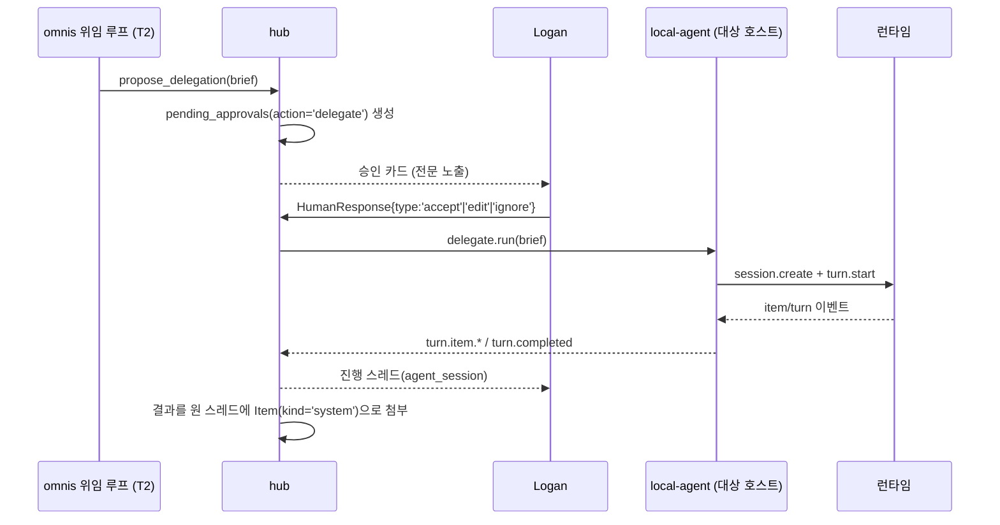

# A2 — 에이전트 세션 브리지 프로토콜

버전 1.0 · 2026-09-20 · 작성 Fable
근거: `research/09-agents-as-inbox.md`(런타임 표면·Hermes 세션 헤더 분리·ACP/A2A 기각), `research/27-gap-event-volume-and-sync-budget.md`(이벤트 실측·3티어 분리), `research/22-gap-read-the-prior-art-source.md`(HumanInterrupt/HumanResponse·tool 격리), `research/02-block-buzz.md`(agent-as-member, JSON in/out CLI 규약), `research/24-gap-ralph-loop-dev-pipeline.md`(claude-ds 호출 규약), `research/00-SYNTHESIS.md` §2.3(버전 협상 모델), 마스터 설계 `00-omnis-design.md` D5/D7/D10/D15/D16 · §6 · §9 · §11 · §19 Q7/Q10.

이 부록은 마스터 §9를 구현 가능한 수준으로 확장한다. 마스터와 충돌하면 마스터가 이긴다.

---

## 0. 이 부록이 확정하는 결정

| # | 결정 | 근거 | 폴백/변경 조건 |
|---|---|---|---|
| A2-D1 | **`session_key`(안정 스코프) ≠ `session_id`(런타임이 회전시키는 트랜스크립트 ID).** key 포맷은 `agent:{runtime}:{host}:{purpose}`, 최대 256자, 제어문자 금지 | Hermes `X-Hermes-Session-Key`/`X-Hermes-Session-Id` 분리(`09`, 이 스윕에서 가장 강하게 검증된 단일 발견) | 없음 |
| A2-D2 | **전송은 브리지→허브 단방향 dial의 WebSocket 1개, JSON-RPC 2.0 양방향.** 허브는 브리지에 접속하지 않는다 | 맥북·아이폰은 NAT 뒤에 있고 Tailscale 주소만 안정적. 허브를 listen-only로 두면 방화벽 규칙이 한 방향뿐 | 브리지가 항상 켜진 호스트(미니)에만 있으면 허브→브리지 dial도 가능하지만 코드 두 벌이 되므로 안 한다 |
| A2-D3 | **버전 협상은 MCP 2026-07-28 모델.** `initialize` 핸드셰이크 없음. 모든 요청의 `params._meta["ai.omnis/protocolVersion"]`에 버전을 싣고, 능력은 `bridge/discover` RPC로 조회 | `00-SYNTHESIS` §2.3(MCP 현행 2026-07-28, per-request `_meta` + mandatory discover) | 없음 |
| A2-D4 | **이벤트 3티어.** `turn.item.delta`는 저장하지 않는다(ephemeral). durable은 `turn.item.started`에 row 생성 → 500ms 디바운스 또는 `turn.item.completed`에만 UPDATE. raw NDJSON 전량은 허브 로컬 cold 로그 | `27` 실측: 한 턴 39이벤트/63KB 중 92%가 프로세스 기동당 1회 나가는 `system/init`, 실콘텐츠 ~4.8KB. 토큰 델타 커밋은 G5(2초)를 깎는다 | 디바운스 간격은 Phase A 실측 후 조정. 500ms는 초기값 |
| A2-D5 | **Claude Code 어댑터는 턴당 서브프로세스.** 상주 프로세스로 두지 않는다. `claude -p --output-format stream-json --verbose --resume <session_id>` | `09` VERIFIED. `-p`는 비대화형 1회 실행이 기본 계약이고, 상주화하려면 Agent SDK로 갈아타야 하는데 D3(하네스는 AI SDK만)과 충돌 | 턴당 `system/init` 28KB 오버헤드가 문제가 되면 Claude Agent SDK `unstable_v2_resumeSession`으로 교체(`09`) |
| A2-D6 | **Codex 어댑터는 상주 `app-server` 자식 프로세스 1개.** 버전은 `rust-v0.155.1`에 핀, 기능은 `capabilities` 배열로 feature detection | `09`/`27`: app-server는 장수명 양방향 JSON-RPC이고 0.156.0-alpha가 하루 4~5회 잘린다 | 핀 해제는 계약 테스트 전량 통과 시에만 |
| A2-D7 | **`codex mcp-server`는 존재하지 않는다.** 위임 경로에서 완전히 뺀다 | `09` Verification 행 10: `codex-rs/cli/src/mcp_cmd.rs`에 `List/Get/Add/Remove/Login/Logout`뿐 | 없음 |
| A2-D8 | **claude-ds는 Claude Code 어댑터의 설정 변형.** 별도 어댑터 클래스를 만들지 않는다. 바이너리 이름·모델 alias·API 키 출처만 다르다 | `09`("claude-ds is free: same wrapper works unmodified"), `24`(claude-ds 호출 규약) | claude-ds 엔드포인트가 stream-json 계약을 깨면 그때 분기 |
| A2-D9 | **Hermes 어댑터는 두 호스트 모두에 있고 Phase가 나뉜다: Phase B = 읽기 전용 세션(`origin:'human'`만, 위임 대상에서 제외), Phase C = 위임 대상 편입.** 표면은 `/v1` + `X-Hermes-Session-Key`/`X-Hermes-Session-Id`, 능력은 `GET /v1/capabilities` | 마스터 §19 Q7(Phase B 읽기 전용 세션, Phase C 위임 대상), `09` VERIFIED(세션 헤더 분리·capabilities 자기기술) | Phase C 승격 조건은 S-A2-5(Hermes command approval의 실제 표면) 통과. 실패하면 Hermes는 읽기 전용에 머문다 |
| A2-D10 | **런타임의 승인 요청은 omnis `pending_approvals`로 승격된다.** 브리지가 자체 판단으로 accept하지 않는다 | `22`(HumanInterrupt/HumanResponse), 마스터 D10/D15 | 없음 |
| A2-D11 | **delegated 런은 `--bare`가 기본이다.** 대상 레포의 `.claude/settings.json` hooks와 `.mcp.json`을 로드하지 않는다. Settings에 "owned-repo allowlist는 `--bare` 없이 실행" 옵션을 두되 **기본 off**이고, 켤지 여부의 결정은 Phase A의 위임 품질 실측 뒤로 미룬다(hook/MCP 없이도 위임이 충분히 도는지를 먼저 본다) | `09` VERIFIED: `--bare` 없으면 `-p` 런도 프로젝트 hook/MCP를 신뢰 프롬프트 없이 로드한다 → 인박스 텍스트가 유도한 위임이 레포의 hook을 실행시키는 경로가 열린다. allowlist 옵션은 마스터 §11의 "완전 자율 실행은 런타임·레포별 허용 규칙을 Logan이 열 때만"과 같은 모양이다(§19 Q10) | 켜더라도 allowlist에 든 레포 경로에만 적용되고, 인박스에서 출발한 위임(`source_item_id` 있음)은 allowlist와 무관하게 항상 `--bare` |
| A2-D12 | **브리지는 `allowed_roots` 밖 경로에서 런타임을 기동하지 않는다.** 허브가 보낸 `cwd`는 브리지가 재검증한다 | 마스터 D10(구조로 강제), `15`(Claude Code 샌드박스 전략) | 없음 |
| A2-D13 | **`read_session`은 durable 요약 + 마지막 N턴만 반환한다.** raw 델타·reasoning 원문은 절대 반환하지 않는다 | 마스터 §9, `27`(reasoning ephemeral 결정), 프라이버시 | 디버깅용 전체 트랜스크립트는 허브 로컬 온디맨드 API로만 |
| A2-D15 | **설정 우선순위는 CLI 인자 > 환경변수 > `~/.omnis/local-agent.toml` > 내장 기본값.** `[[runtime]]` 블록만은 TOML 전용이다 | A6 §10.1의 LaunchAgent plist가 `--hub <url>`을 `ProgramArguments`로 넘기는데 A2 §2.1은 TOML로 같은 값을 정한다 — 둘 중 어느 쪽이 이기는지가 어디에도 없었다(99-review-v2 §2-3) | 없음 |
| A2-D16 | **런타임이 다른 런타임에 직접 명령하는 경로는 없다.** 한 런타임이 다른 런타임의 일을 원하면 `propose_delegation` → 승인 → 대상 브리지만 쓴다 | 마스터 §9(의도된 축소): 승인 없는 에이전트 간 명령은 인젝션이 한 세션에서 다른 세션으로 번지는 통로가 된다 | 런타임·레포별 허용 규칙(마스터 §19 Q10)을 Logan이 열면 승인 단계만 생략되고, 경로 자체는 그대로 대상 브리지를 지난다 |
| A2-D14 | **mock 런타임 + NDJSON fixture 재생이 어댑터 계약 테스트의 기본 형태.** 실런타임을 CI에서 호출하지 않는다 | `27`: 실측 중 Codex 계정 사용량 한도로 턴이 끊겼다. 과금·rate limit이 있는 것을 CI에 넣지 않는다 | 주 1회 nightly에서만 실런타임 스모크 1턴 |

---

## 1. 개념 모델

### 1.1 4개 객체

```ts
// packages/bridge-protocol/src/types.ts
export type RuntimeKind = 'claude_code' | 'codex' | 'claude_ds' | 'hermes' | 'omnis';
export type HostId = 'mini' | 'macbook';

/** 호스트에 설치된 런타임 1종. 브리지가 기동 시 등록한다. */
export interface AgentRuntime {
  id: string;                 // uuid, 허브가 발급
  runtime: RuntimeKind;
  host: HostId;
  version: string;            // 'claude 2.1.231' | 'codex rust-v0.155.1'
  capabilities: RuntimeCapabilities;
  transport: 'process' | 'http';  // hermes만 'http'
  binary_path: string | null;     // transport='http'면 null (§2.1)
  allowed_roots: string[];        // A2-D12. transport='http'면 [] — 강제할 수 없다
  base_url: string | null;        // transport='http'일 때만 (§2.1)
  state: 'online' | 'degraded' | 'offline';
  last_health_at: string;     // ISO8601
}

/** 하나의 대화. omnis threads 테이블의 kind='agent_session' row와 1:1. */
export interface AgentSession {
  id: string;                 // uuid = threads.id
  runtime_id: string;
  session_key: string;        // A2-D1, 안정
  session_id: string | null;  // 런타임이 준 것, 회전 가능
  cwd: string;
  purpose: string;            // 'inbox:draft' | 'proj:omnis' | 'delegate:<task_id>'
  origin: 'human' | 'delegation' | 'job';
  permission_profile: PermissionProfile;
  state: 'idle' | 'running' | 'awaiting_approval' | 'failed' | 'closed';
  opened_at: string;
  last_turn_at: string | null;
}
```

**`session_key`** 는 "누가·어디서·무엇을 위해"를 고정한다. 포맷은 `agent:{runtime}:{host}:{purpose}`, 예: `agent:codex:mini:proj-omnis`, `agent:claude_code:macbook:inbox-draft`. `purpose`의 네임스페이스 구분자 `:`(예 `proj:omnis`)는 `session_key`에 넣을 때 `-`로 치환한다 — `session_key` 자체가 `:`를 세그먼트 구분자로 쓰므로 그대로 넣으면 파싱이 모호해진다. 256자 상한과 제어문자 금지는 Hermes의 규칙을 그대로 따른다(`09`). 이 키가 메모리 스코프(A3의 `memories.scope`)와 `read_session`의 조회 키다.

**`session_id`** 는 런타임이 준 트랜스크립트 ID다. Claude Code는 `system/init` 이벤트나 `--output-format json`의 `session_id` 필드에서 얻고(`09`), Codex는 `thread.started`의 `threadId`에서 얻는다(`09`,`27`). 런타임이 세션을 새로 만들면(예: `--resume` 실패, app-server 재시작) 이 값은 바뀌지만 `session_key`와 thread는 유지된다. **이 분리가 이 부록 전체의 뼈대다.** 스레드 연속성과 메모리 스코프가 런타임의 재시작에 묶이지 않는다.

**`purpose`** 는 자유 문자열이 아니라 3개 네임스페이스만 허용한다: `inbox:<loop>`(분류·초안 등 omnis 루프), `proj:<slug>`(Logan이 직접 여는 개발 세션), `delegate:<task_id>`(위임 실행). 네임스페이스가 permission profile을 고르는 1차 입력이다(§7.1).

**`'omnis'` kind는 브리지가 다루지 않는다.** `agent_runtimes`에 **row 1개**로 고정 존재하며(마스터 §6: "`omnis` 런타임은 1 row, 브리지 어댑터 없음"), 이것은 omnis 자체의 내장 L3 루프(마스터 §11의 분류·초안·투두·다이제스트·Network·노트 라우팅·자동 보관·Ingestion)가 만든 세션과 Item의 소속을 표시하기 위한 것이다. 성질:

- 브리지가 `runtime.registered`로 등록하지 **않는다**. 허브가 부팅 시 자기 자신으로 upsert한다. `host`는 허브가 도는 호스트(미니).
- `RuntimeAdapter` 구현체가 **없다**(§4의 4종이 전부다). `probe`/`startTurn`/`cancel`/`close`가 호출되는 경로 자체가 없다 — 루프는 허브 안에서 직접 돈다.
- 이 런타임의 세션은 `purpose`가 항상 `inbox:*`이고 `origin`은 `job`이다. 따라서 §7.1에 따라 profile은 `observe` 고정이고, 파일 쓰기·네트워크·위임 실행 경로가 구조적으로 닫힌다.
- `session_key`는 같은 포맷을 쓴다: `agent:omnis:mini:inbox-triage` 등.

구현자에게: `RuntimeKind` 유니온에 `'omnis'`는 남기되 어댑터 팩토리의 `switch`에서는 `throw new Error('omnis runtime has no adapter')`로 명시 차단한다. 조용히 무시하면 나중에 위임 대상 후보 목록에 섞여 들어간다.

### 1.2 capabilities 자기기술

런타임 능력을 버전 문자열로 추론하지 않는다. Claude Code가 `system/init.capabilities` 배열을 두는 이유와 같다(`09` VERIFIED, v2.1.205+).

```ts
export interface RuntimeCapabilities {
  resume: boolean;              // 과거 세션 재개 가능
  cross_project_resume: boolean;// CWD 밖 세션 ID로 재개 (claude >= 2.1.223, `09`)
  stream_deltas: boolean;       // 토큰 단위 델타 제공
  reasoning_stream: boolean;    // reasoning 델타 제공 (codex)
  tool_calls: boolean;          // tool 호출을 구조화 이벤트로 제공
  approvals: 'native' | 'hook' | 'none';
  cancel: boolean;              // 진행 중 턴 취소
  models: string[];             // 선택 가능한 모델 alias
  features: string[];           // 런타임 원본 capability 문자열 그대로 통과
}
```

`features`는 런타임이 준 배열을 손대지 않고 그대로 싣는다(Claude Code의 `interrupt_receipt_v1` 등). 어댑터는 자기가 이해하는 것만 위쪽 boolean으로 승격하고 나머지는 통과시킨다 — 새 기능이 나와도 브리지 배포 없이 허브가 로그로 발견할 수 있다.

---

## 2. 브리지 데몬 `local-agent`

### 2.1 배치

`apps/local-agent`, Node 22 단일 프로세스. 맥북은 LaunchAgent(로그인 세션), 미니는 LaunchDaemon으로 뜬다(마스터 D11 — 코드 실행 런타임은 GUI가 필요 없다). **브리지는 두 호스트 모두에서 돈다**: 맥북(Claude Code, Codex, claude-ds, Hermes)과 미니(Codex, Hermes). 미니는 허브를 겸하지만 브리지는 별도 프로세스로 둔다 — 허브가 런타임을 직접 spawn하면 A2-D12의 경로 재검증이 허브 안으로 들어와 권한 경계가 흐려진다.

Keychain 아이템 이름은 A1의 명명 규칙 `omnis.<channel>.<kind>.<external_id>`를 런타임에도 그대로 적용한다(`<external_id>` 자리에 호스트). **브리지 토큰의 정본 리터럴은 `omnis.bridge.token.<host>`** — 실제 값은 `omnis.bridge.token.macbook`과 `omnis.bridge.token.mini` 둘뿐이고, 본문에서 이 이름이 나오는 곳은 아래 두 TOML 예시가 전부다. A6 §9가 쓰던 `omnis.<host>.session_bus_token`은 이 리터럴로 통일한다(99-review-v2 §4-4).

**설정 우선순위**(A2-D15): CLI 인자 > 환경변수 > `~/.omnis/local-agent.toml` > 내장 기본값. A6 §10.1의 LaunchAgent/LaunchDaemon plist가 `ProgramArguments`로 넘기는 `--hub <url>`은 TOML의 `hub_url`을 덮어쓰고, `--host`·`--token-keychain-item`도 같은 방식으로 대응 키를 덮어쓴다. 환경변수는 `OMNIS_` 접두 + 대문자 스네이크(`OMNIS_HUB_URL`, `OMNIS_HOST`)로 TOML보다 세고 CLI보다 약하다 — plist를 다시 쓰지 않고 한 번 시험해 볼 때 쓰는 자리다. **`[[runtime]]` 블록은 TOML에만 있다**: CLI나 환경변수로 런타임을 추가·수정하지 않는다. `allowed_roots`가 명령줄에서 바뀔 수 있으면 A2-D12의 경로 상한이 의미를 잃는다. 기동 로그에 실효값과 그 출처(`cli`|`env`|`toml`|`default`)를 키마다 한 줄씩 찍는다.

맥북 설정 `~/.omnis/local-agent.toml`:

```toml
host = "macbook"
hub_url = "wss://omnis-hub.your-tailnet.ts.net/bridge"   # 허브 자체는 127.0.0.1:8787에 bind
token_keychain_item = "omnis.bridge.token.macbook"     # security find-generic-password

[[runtime]]
kind = "claude_code"
binary = "/opt/homebrew/bin/claude"
allowed_roots = ["/Users/logankim/AI-Workspaces", "/Users/logankim/dev"]
default_model = "sonnet"

[[runtime]]
kind = "codex"
binary = "/opt/homebrew/bin/codex"
pinned_version = "rust-v0.155.1"
allowed_roots = ["/Users/logankim/dev"]

[[runtime]]
kind = "claude_ds"
binary = "/opt/homebrew/bin/claude-ds"
allowed_roots = ["/Users/logankim/dev"]
default_model = "deepseek-flash"

[[runtime]]
kind = "hermes"
base_url = "http://127.0.0.1:8642"
token_keychain_item = "omnis.hermes.api_key.macbook"
session_header_mode = "hermes_v1"
```

미니 설정 `~/.omnis/local-agent.toml`:

```toml
host = "mini"
hub_url = "ws://127.0.0.1:8787/bridge"                 # 같은 기기, 루프백
token_keychain_item = "omnis.bridge.token.mini"

[[runtime]]
kind = "codex"
binary = "/opt/homebrew/bin/codex"
pinned_version = "rust-v0.155.1"
allowed_roots = ["/Users/logankim/dev"]

[[runtime]]
kind = "hermes"
base_url = "http://127.0.0.1:8642"
token_keychain_item = "omnis.hermes.api_key.mini"
session_header_mode = "hermes_v1"
```

**`[[runtime]]` 필드는 런타임 종류에 따라 갈린다.** `binary`·`allowed_roots`·`pinned_version`·`default_model`은 브리지가 자식 프로세스를 spawn하는 런타임(`claude_code`, `codex`, `claude_ds`)에만 있다. `hermes`는 프로세스를 띄우지 않고 이미 떠 있는 HTTP 서버에 붙는 클라이언트라 이 넷이 전부 의미가 없다 — 설정 검증이 HTTP 런타임에 이 필드가 오면 기동을 거부한다. 대신:

| 필드 | 의미 | 기본값 |
|---|---|---|
| `base_url` | Hermes `api_server` 주소. `API_SERVER_PORT` 기본이 8642다(`09` VERIFIED) | `http://127.0.0.1:8642` |
| `token_keychain_item` | bearer 토큰(`API_SERVER_KEY`)의 Keychain 아이템(`09` VERIFIED) | 필수, 기본값 없음 |
| `session_header_mode` | 세션 헤더 규약. `hermes_v1` = `X-Hermes-Session-Key`(안정) + `X-Hermes-Session-Id`(회전)(`09` VERIFIED) | `hermes_v1` |

능력은 설정에 적지 않고 기동 시 `GET /v1/capabilities`로 조회한다(`09` VERIFIED: `"session_key_header": "X-Hermes-Session-Key"` 등을 자기기술로 돌려준다). 응답의 `session_key_header`가 `session_header_mode`가 가정한 값과 다르면 런타임을 `degraded`로 등록하고 세션을 열지 않는다. 경로 상한(A2-D12)은 HTTP 런타임에 적용할 수 없다 — Hermes 프로세스의 작업 디렉터리는 브리지가 정하지 않는다. 그래서 Hermes 세션은 §7.1의 `observe`/`workspace` 판정을 브리지가 강제하지 못하고, Phase B에서 `origin:'human'` 읽기 전용으로만 쓴다(A2-D9).

`allowed_roots`에 `$HOME` 자체나 `/`를 쓰는 것은 기동 시 거부한다(설정 검증에서 fail-fast).

### 2.2 접속·인증·재연결

1. 브리지가 Keychain에서 토큰을 읽어 `Authorization: Bearer <token>`으로 `wss://.../bridge`에 dial한다. Tailscale ACL이 이미 tailnet 밖 접근을 막지만(마스터 §13), 토큰은 "어느 기기인가"를 증명하는 2차 요소로 남긴다. 토큰은 기기별로 다르고 허브 DB에 `sha256` 해시로만 저장한다.
2. 허브는 Tailscale Serve가 주입한 identity 헤더를 **먼저 제거하고 재주입**해 스푸핑을 막는다(`15`의 Tailscale 패턴 차용).
3. 접속 직후 브리지가 `bridge/discover`를 호출한다(§3.2). 허브가 자기 프로토콜 버전과 지원 메서드를 답한다.
4. 이어서 런타임 목록을 `session.registered`가 아니라 `runtime.registered` 알림으로 보낸다(런타임 1개당 1건).
5. 끊기면 지수 백오프로 재연결한다: 1s → 2s → 4s → … → 30s 상한, ±20% jitter. 재연결 후 브리지는 `runtime.registered`를 다시 보내고, 살아 있는 세션 목록을 `session.registered`로 재신고한다. 허브는 이를 멱등으로 처리한다(`session_key` 기준 upsert).
6. 30초마다 `health` 알림. 허브가 90초 동안 못 받으면 해당 브리지의 런타임을 `offline`로 내리고, 인박스에 시스템 Item("macbook 브리지 연결 끊김")을 하나 만든다(마스터 §15).

**끊긴 동안의 턴.** WS가 끊겨도 진행 중인 런타임 프로세스는 죽이지 않는다. 브리지는 durable 이벤트(`turn.item.started/completed`, `turn.completed`, `approval.requested`)를 디스크 큐(`~/.omnis/outbox.ndjson`, 최대 50MB, 넘치면 오래된 것부터 버리되 `approval.requested`는 절대 안 버림)에 쌓고 재연결 시 순서대로 flush한다. ephemeral 델타는 큐에 넣지 않고 버린다(A2-D4).

### 2.3 세션 목록

브리지는 자기가 만든 세션만 관리한다. Logan이 터미널에서 직접 연 Claude Code 세션을 스캔해서 붙이지 않는다 — 그 세션의 CWD·권한·의도를 브리지가 알 수 없고, 마스터 D10의 "구조로 강제"와 맞지 않는다. (원한다면 Phase C에서 `~/.claude/projects/**/*.jsonl` 읽기 전용 import를 별도 기능으로 검토. 지금은 비목표.)

---

## 3. 와이어 프로토콜

### 3.1 공통 형태

JSON-RPC 2.0, WebSocket 텍스트 프레임 1개 = 메시지 1개. 요청은 `id`를 갖고, 알림은 갖지 않는다. 모든 요청의 `params._meta`에 다음을 싣는다(A2-D3):

```json
{
  "jsonrpc": "2.0",
  "id": "h-8f21",
  "method": "turn.start",
  "params": {
    "_meta": {
      "ai.omnis/protocolVersion": "2026-09-20",
      "ai.omnis/traceId": "01JBQ...",
      "ai.omnis/origin": "delegation"
    },
    "session_key": "agent:codex:mini:proj-omnis",
    "input": { "text": "Run the kernel contract tests and report failures." }
  }
}
```

버전 불일치는 연결을 끊지 않는다. 수신 측이 지원하지 못하는 버전이면 그 요청만 `-32010 VERSION_UNSUPPORTED`로 거절하고 `data.supported: ["2026-09-20"]`를 돌려준다. 이렇게 두면 브리지와 허브를 따로 배포할 수 있다.

### 3.2 hub → bridge (요청)

| method | params | result | 비고 |
|---|---|---|---|
| `bridge/discover` | — | `{ protocolVersions: string[], methods: string[], runtimes: AgentRuntime[] }` | 양방향. 브리지도 허브에 같은 메서드를 호출한다 |
| `session.create` | `{ session_key, runtime, cwd, purpose, origin, permission_profile, model? }` | `{ session_id: null, thread_id }` | 런타임 프로세스는 첫 턴에 뜬다. 여기선 슬롯만 |
| `session.resume` | `{ session_key }` | `{ session_id, restored: boolean }` | `restored:false`면 런타임이 과거 세션을 못 찾아 새로 시작했다는 뜻 |
| `turn.start` | `{ session_key, input: { text, attachments? }, model?, timeout_ms? }` | `{ turn_id }` | 이미 실행 중이면 `-32004` |
| `turn.cancel` | `{ session_key, turn_id, reason }` | `{ cancelled: boolean }` | `capabilities.cancel=false`면 `-32003` |
| `session.read_summary` | `{ session_key, last_n_turns? }` | `SessionSummary` (§6) | 다른 세션 이해용 |
| `delegate.run` | `DelegationBrief` (§5.2) | `{ session_key, turn_id }` | 승인된 위임만 |
| `session.close` | `{ session_key, reason }` | `{ closed: true }` | 런타임 프로세스 종료 |
| `ingest.scan` | `{ roots: string[], since?: string }` | `{ files: { path, size, mtime, sha256 }[], truncated: boolean }` | 세션과 무관. 맥북 로컬 파일 ingestion(마스터 §10) |
| `ingest.read` | `{ path, max_bytes? }` | `{ path, mtime, bytes, content_b64, truncated: boolean }` | 파일 1개. 기본 상한 1MB |

**ingestion RPC의 상한.** 마스터 §10은 "맥미니의 파일은 허브가 직접, 맥북의 파일은 맥북 `local-agent`가 읽어 허브로 보낸다"로 정했다 — `ingest.scan`/`ingest.read`가 그 경로이고, 런타임을 기동하지 않는 순수 읽기라 세션·턴·동시성 상한(§7.2)과 무관하다. 브리지가 강제하는 것: (a) `roots`와 `path`는 A4 §10.1의 로컬 폴더 allowlist와 이 호스트의 `allowed_roots`의 **교집합** 안이어야 하고, `realpath` 해석 뒤 다시 검사한다 — 밖이면 `-32005`이고 파일 목록도 돌려주지 않는다; (b) allowlist 안이라도 `.env*`·`*.pem`·`*.key`·`id_rsa*`·`.git/` 이하·그 밖의 dotfile은 **항상** 거부한다. A4 §10.2의 프라이버시 제외 규칙이 허브에서 한 번 더 걸리지만, 비밀 파일은 허브에 도달하기 전에 막는다; (c) `ingest.read`는 파일당 기본 1MB에서 자르고 `truncated:true`를 세운다. 전량이 필요하면 위임 브리프의 `inputs`(§5.2)로 경로를 넘겨 대상 런타임이 직접 읽게 한다.

### 3.3 bridge → hub (알림, 일부 요청)

| method | 종류 | payload 요지 | 티어 |
|---|---|---|---|
| `runtime.registered` | 알림 | `AgentRuntime` | durable |
| `session.registered` | 알림 | `{ session_key, session_id, runtime_id, state }` | durable |
| `turn.started` | 알림 | `{ session_key, turn_id, at }` | durable |
| `turn.item.started` | 알림 | `{ session_key, turn_id, item_id, kind, label, meta }` | durable (row 생성) |
| `turn.item.delta` | 알림 | `{ session_key, turn_id, item_id, seq, text }` | **ephemeral (저장 안 함)** |
| `turn.item.completed` | 알림 | `{ session_key, turn_id, item_id, body, status, meta }` | durable (row 확정) |
| `turn.completed` | 알림 | `{ session_key, turn_id, status, usage, error? }` | durable |
| `approval.requested` | **요청** | `{ session_key, turn_id, interrupt: HumanInterrupt }` | durable |
| `health` | 알림 | `{ host, runtimes: [{id, state, load}], at }` | durable(요약만) |

`approval.requested`만 요청이다 — 브리지가 허브의 응답(`HumanResponse`)을 기다려야 런타임에 답을 돌려줄 수 있기 때문이다. 나머지는 전부 알림이라 ack가 없고, 순서는 WS가 보장한다.

**`kind`는 두 개뿐이다**: `agent_turn`(모델이 사람에게 한 말), `tool_call`(도구 실행). 마스터 §6의 `items.kind`와 같은 enum을 쓴다. reasoning은 item이 아니다 — 델타로만 흐르고 사라진다(A2-D4, A2-D13).

**author 매핑.** A3의 `items.author`는 nullable 3컬럼(`person_id` | `agent_session_id` | system 플래그)이고 셋 중 하나만 채워진다(마스터 §6). 브리지 이벤트에서 만들어지는 Item은 전부 **`agent_session_id`를 채운다** — 그 턴을 만든 `AgentSession`의 id(= `threads.id`)다. `person_id`와 system 플래그는 비운다. 예외 둘: 위임 결과를 원 스레드에 붙이는 요약 Item(§5.3)과 브리지 연결 끊김 시스템 Item(§2.2)은 에이전트 세션의 산출이 아니라 허브의 산출이므로 system 플래그를 쓴다. 브리지가 `author`를 직접 쓰지 않는다 — 허브가 `session_key` → `AgentSession.id` 조회로 채운다.

### 3.4 에러 코드

JSON-RPC 표준(-32700 parse, -32600 invalid request, -32601 method not found, -32602 invalid params, -32603 internal) 위에 omnis 범위:

| 코드 | 이름 | 의미 | 호출자 조치 |
|---|---|---|---|
| -32001 | `SESSION_NOT_FOUND` | `session_key` 미등록 | `session.create` 후 재시도 |
| -32002 | `RUNTIME_UNAVAILABLE` | 바이너리 없음/기동 실패 | 인박스에 시스템 Item, 재시도 안 함 |
| -32003 | `CAPABILITY_UNSUPPORTED` | 이 런타임이 못 하는 요청 | 기능 강등 |
| -32004 | `TURN_ALREADY_ACTIVE` | 턴 진행 중 | 큐잉 또는 `turn.cancel` 후 재시도 |
| -32005 | `PATH_NOT_ALLOWED` | `cwd`가 `allowed_roots` 밖 | 감사 로그 기록, 사용자에게 노출 |
| -32006 | `APPROVAL_REQUIRED` | 승인 없이 위임 시도 | 버그. 감사 로그 + 알림 |
| -32007 | `TURN_TIMEOUT` | `timeout_ms` 초과 | §5.4 |
| -32008 | `TURN_CANCELLED` | 사용자/킬스위치 취소 | 정상 종료 처리 |
| -32009 | `RUNTIME_RATE_LIMITED` | 런타임 계정 한도 | 백오프, 다른 런타임으로 제안 |
| -32010 | `VERSION_UNSUPPORTED` | 프로토콜 버전 불일치 | `data.supported` 보고 강등 |
| -32011 | `AUTH_FAILED` | 토큰 무효 | 재연결 중단, 알림 |
| -32012 | `BUDGET_EXCEEDED` | 월 상한 도달(마스터 §14) | T1 강등 또는 중단 |

`-32009`는 실제로 발생한다 — `27`의 실측 중 Codex가 계정 사용량 한도로 턴을 끊었다. 브리지는 이 에러를 `turn.completed{status:'failed', error:{code:-32009}}`로도 한 번 더 보내 스레드에 흔적을 남긴다.

---

## 4. 런타임 어댑터

어댑터 인터페이스는 하나다:

```ts
export interface RuntimeAdapter {
  kind: RuntimeKind;
  probe(): Promise<{ version: string; capabilities: RuntimeCapabilities }>;
  startTurn(s: AgentSession, input: TurnInput, sink: EventSink): Promise<TurnHandle>;
  cancel(h: TurnHandle, reason: string): Promise<boolean>;
  close(s: AgentSession): Promise<void>;
}
export interface EventSink {
  itemStarted(e: ItemStarted): void;
  delta(e: ItemDelta): void;           // ephemeral
  itemCompleted(e: ItemCompleted): void;
  turnCompleted(e: TurnCompleted): void;
  approval(i: HumanInterrupt): Promise<HumanResponse>;
  raw(line: string): void;             // cold tier
}
```

`sink.raw`는 모든 원본 줄을 받아 `~/.omnis/cold/<session_key>/<turn_id>.ndjson`에 append한다. 이것이 cold 티어이고 허브로 복제하지 않는다(A2-D4).

### 4.1 Claude Code

기동(A2-D5):

```bash
claude -p \
  --output-format stream-json --verbose --include-partial-messages \
  --resume "$SESSION_ID" \
  --permission-mode "$MODE" \
  --model "$MODEL" \
  ${BARE:+--bare} \
  "$PROMPT"
```

`--include-partial-messages`가 없으면 토큰 델타가 안 온다(`09`). `--verbose`는 `stream-json`에서 전체 이벤트를 받기 위한 필수 플래그다(`09`). `--resume`은 세션 ID 또는 `.jsonl` 경로를 받고, CWD 밖 세션 ID 재개는 v2.1.223+에서만 된다(`09` Verification 행 4) — 그래서 브리지는 기동 시 버전을 파싱해 `cross_project_resume` capability를 세운다.

이벤트 → Item 매핑:

| stream-json 이벤트 | 브리지 출력 | 티어 |
|---|---|---|
| `system` / `init` | `session.registered{session_id, capabilities}` | durable(작게) + cold |
| `stream_event` / `content_block_start` (text) | `turn.item.started{kind:'agent_turn'}` | durable |
| `stream_event` / `content_block_delta` | `turn.item.delta` | **ephemeral** |
| `stream_event` / `content_block_stop` | (무시, `assistant`가 확정판) | cold |
| `assistant` (text block) | `turn.item.completed{kind:'agent_turn', body}` | durable |
| `assistant` (tool_use block) | `turn.item.started{kind:'tool_call', label, meta:{tool, input}}` | durable |
| `user` (tool_result block) | `turn.item.completed{kind:'tool_call', status, body:요약}` | durable |
| `result` | `turn.completed{status, usage:{cost_usd, duration_ms, num_turns}}` | durable |
| `rate_limit_event` | `health{..., limited:true}` (+ 필요시 `-32009`) | durable(요약) |
| 그 외 `system` | (없음) | cold |

`system/init`이 한 턴 바이트의 대부분을 차지한다(실측 28,340B, `27`). 브리지는 이것을 그대로 durable에 넣지 않고 `session_id`와 `capabilities`만 뽑아 쓰고 나머지는 cold로 보낸다.

**tool_result 본문 축약 규칙**: 8KB 초과 시 앞 2KB + `… (N bytes truncated)` + 뒤 1KB로 자르고, 전문은 cold 티어의 `turn_id`로 찾을 수 있게 `meta.cold_ref`를 붙인다.

**hooks 활용**: `approvals: 'hook'`. `PreToolUse` hook이 도구 이름·인자를 브리지의 유닉스 소켓으로 보내고 브리지가 `approval.requested`로 승격한다(`09`: Agent SDK가 `PreToolUse`/`PostToolUse`/`Stop` 등을 노출). 단 A2-D11에 따라 delegated 런은 `--bare`라 프로젝트 hook이 로드되지 않으므로, 브리지가 `--settings`로 자기 hook 설정 파일 경로를 명시 주입한다. *`-p` + `--bare` 조합에서 `--settings`로 hook을 주입하는 정확한 플래그 표면은 리서치에 없음 — **UNVERIFIED — spike S-A2-1**.*

**권한 모드 정책**: 리서치가 확인한 값은 `bypassPermissions`(claude-ds 실사용 규약, `24`)와 `--permission-mode` 플래그의 존재(`09`)뿐이다. omnis 정책은 §7.1의 profile로 정의하고, profile → 실제 플래그 값 매핑은 스파이크에서 확정한다(**UNVERIFIED — spike S-A2-2**). 어떤 경우에도 `origin != 'human'`인 세션에 `bypassPermissions`를 주지 않는다.

### 4.2 Codex

상주 `app-server` 자식 1개를 stdio로 붙든다(A2-D6). 스레드/턴/아이템 3원 구조를 그대로 받는다(`09`,`27`).

| app-server 이벤트 | 브리지 출력 | 티어 |
|---|---|---|
| `thread.started` | `session.registered{session_id: threadId}` | durable |
| `turn.started` | `turn.started` | durable |
| `item/started` (`agentMessage`) | `turn.item.started{kind:'agent_turn'}` | durable |
| `item/agentMessage/delta` | `turn.item.delta` | ephemeral |
| `item/plan/delta`, `item/reasoning/textDelta`, `item/reasoning/summaryTextDelta`, `item/reasoning/summaryPartAdded` | `turn.item.delta{channel:'reasoning'}` | **ephemeral 전용, durable 승격 금지** |
| `item/started` (`commandExecution`/`fileChange`/`mcpToolCall`/`dynamicToolCall`/`collabToolCall`/`webSearch`/`imageView`) | `turn.item.started{kind:'tool_call', label}` | durable |
| `item/commandExecution/outputDelta` | `turn.item.delta` | ephemeral |
| `item/completed` | `turn.item.completed` | durable |
| `turn.completed` / `turn.failed` | `turn.completed{status}` | durable |
| 서버발 승인 요청 | `approval.requested` | durable |

item 타입은 11종 이상이고 델타 타입은 6종 이상이다(`27` VERIFIED). 어댑터는 **알려진 타입만 매핑하고 모르는 `item/started`는 `kind:'tool_call', label: item.type`으로 일반화**한다 — 0.156 알파가 새 타입을 추가해도 스레드가 깨지지 않는다.

승인 매핑(`09` VERIFIED: command 결정 `accept|acceptForSession|decline|cancel|acceptWithExecpolicyAmendment`, file-change 결정 `accept|acceptForSession|decline|cancel`):

| Codex 결정 | `HumanInterruptConfig` | `HumanResponse` |
|---|---|---|
| `accept` | `allow_accept` | `{type:'accept'}` |
| `acceptForSession` | `allow_accept` + omnis "이 세션 자율 허용" 토글 | `{type:'accept'}` + `session_rules` 기록 |
| `decline` | `allow_ignore` | `{type:'ignore'}` |
| `cancel` | — | `turn.cancel` 경로로 분리 |
| `acceptWithExecpolicyAmendment` | `allow_edit` | `{type:'edit', args:{...}}` |

`acceptWithExecpolicyAmendment`의 amendment payload 스키마는 리서치에 없다 — **UNVERIFIED — spike S-A2-3**. 그때까지 이 결정은 UI에 노출하지 않고 `decline`으로 강등한다.

**버전 드리프트 대응**: 기동 시 `codex --version`이 핀과 다르면 `degraded`로 등록하고 `capabilities.features`에 `version_mismatch`를 넣는다. 세션은 계속 뜨지만 위임 대상 후보에서 제외한다.

### 4.3 claude-ds

Claude Code 어댑터와 같은 클래스, 설정만 다르다(A2-D8).

| 항목 | claude_code | claude_ds |
|---|---|---|
| 바이너리 | `claude` | `claude-ds` |
| 모델 | `sonnet`/`haiku`/`opus` | `deepseek-flash`(기본), `DS_MODEL=deepseek-v4-pro`로 Pro † |
| 키 | 구독 OAuth(마스터 D9 T3) | Keychain `deepseek-api`. 브리지는 값을 읽어 자식 env로만 넘기고 로그·이벤트·에러 메시지에 절대 싣지 않는다 |
| 기본 플래그 | profile별 | `--strict-mcp-config` 고정(`24`) |
| 비용 집계 | `result.cost_usd`를 **무시**한다(Claude 단가로 계산되어 틀림) | 토큰 수만 취해 DeepSeek 단가로 재계산 |
| 사용처 | 사람 세션, 위임 | 격리된 잘 정의된 위임(마스터 D13) |

† `DS_MODEL=deepseek-v4-pro`와 `deepseek-flash` 기본값은 **리서치 출처가 아니라 Logan의 로컬 `~/.claude/CLAUDE.md` 운용 관행**이다(`research/` 전체에 `DS_MODEL`·`deepseek-v4-pro` 문자열이 없다 — grep 확인). `24`가 뒷받침하는 것은 `claude-ds -p … --permission-mode bypassPermissions --strict-mcp-config` 호출 규약과 "Claude 단가로 찍히는 `total_cost_usd`를 믿지 말 것"까지다. 모델 alias 이름과 전환 방식은 **UNVERIFIED — 아래 spike S-A2-4가 같이 확인한다**(계약 테스트 fixture를 캡처할 때 `DS_MODEL` 두 값으로 각각 1턴씩 돌려 alias 유효성과 토큰 회계를 함께 본다).

claude-ds의 Anthropic 호환 엔드포인트가 stream-json 계약을 그대로 지키는지는 1차 소스로 확인되지 않았다(`09` open question). Phase A 계약 테스트에서 fixture를 실제로 캡처해 확인한다 — **UNVERIFIED — spike S-A2-4**.

### 4.4 Hermes (Phase B 읽기 전용 → Phase C 위임)

HTTP + SSE다. 프로세스를 띄우지 않고 `http://127.0.0.1:8642`에 붙는다(`09` VERIFIED, `API_SERVER_PORT`, bearer `API_SERVER_KEY`). 허브 자체는 `127.0.0.1:8787`에 bind하므로 미니에서 둘이 같이 떠도 포트가 겹치지 않는다. 두 호스트(미니·맥북) 각각의 Hermes가 그 호스트의 브리지를 통해 별개 `AgentRuntime`으로 등록된다.

Phase 구분(A2-D9, 마스터 §19 Q7):

| | Phase B | Phase C |
|---|---|---|
| 허용 `origin` | `human`만 | `human` + `delegation` |
| 위임 대상 | 제외 | 포함(S-A2-5 통과 시) |
| 승인 경로 | 해당 없음(읽기 전용 세션이라 승인 요청이 발생할 여지를 만들지 않는다) | `approval.requested`로 승격, Hermes 네이티브 승인 표면에 매핑 |

- 능력: `GET /v1/capabilities` → `session_key_header: "X-Hermes-Session-Key"` 등(`09` VERIFIED).
- 세션: omnis `session_key`를 `X-Hermes-Session-Key`에 그대로 넣는다. Hermes가 돌려주는 `X-Hermes-Session-Id`를 `session_id`에 기록한다. **이 매핑이 1:1이라 어댑터가 제일 얇다.**
- 턴: `/v1/responses`에 `conversation`(= `session_key`) 또는 `previous_response_id`로 체인(`09` VERIFIED).
- 스트림: SSE, 10초 무음마다 `: keepalive` 주석(`09` VERIFIED). 어댑터는 keepalive를 이벤트로 올리지 않고 health 타이머만 갱신한다.
- 승인: Hermes는 자체 command approval이 있다고 문서화되어 있으나 이번 스윕에서 독립 검증되지 않았다(`09`). Phase C 진입 시 확인 — **UNVERIFIED — spike S-A2-5**. 그때까지 Hermes 세션은 `origin:'human'`만 허용하고 위임 대상에서 제외한다.

---

## 5. 위임 흐름

### 5.1 경로



**위임은 자동 제안 + 승인 실행이다**(마스터 §11, §19 Q10). 트리거는 자동이다 — 에이전트가 Task를 만들 때 위임 가능 여부와 대상(런타임·호스트)을 스스로 판단해 `propose_delegation`을 부르고, Logan의 승인 한 번으로 실행된다. 사람이 "이걸 위임해"라고 먼저 말해야 시작되는 구조가 아니다. 자동으로 열리지 않는 것은 **실행**뿐이다.

**런타임끼리 직접 명령하는 경로는 없다**(A2-D16, 마스터 §9) — Codex 세션이 Claude Code에 일을 시키고 싶어도 `propose_delegation`으로 Task와 위임 제안을 만들어 위 그림의 같은 승인 게이트를 지나야 하고, 실행은 언제나 대상 호스트의 브리지다. 브리지가 `approval_id` 없는 `delegate.run`을 `-32006`으로 거절하므로 이 축소는 와이어에서도 강제된다.

`propose_delegation`은 저장만 한다. `delegate.run`은 승인 핸들러만 호출할 수 있고 에이전트 tool palette에 아예 없다(마스터 §11, `22`의 구조적 강제). 브리지도 이중으로 막는다: `delegate.run` params에 허브가 서명한 `approval_id`가 없으면 `-32006`. 완전 자율 실행(승인 없이 바로 run)은 런타임·레포별 허용 규칙을 Logan이 Settings에서 열 때만 켜지고 기본은 off다(마스터 §19 Q10, A2-D11의 allowlist와 같은 스위치).

**이름 매핑**(A7·A4와의 표기 통일): 승인 핸들러가 노출하는 **tool 이름은 `send` / `delete` / `delegate` / `calendar_write` 4개**다(마스터 §11). 브리지 **와이어 RPC 이름은 `delegate.run`을 유지한다** — JSON-RPC 메서드는 `<namespace>.<verb>` 규약을 쓰고 있어서(`turn.start`, `session.close`) 여기만 다르게 둘 이유가 없다. 즉 승인 핸들러의 `delegate` tool이 브리지의 `delegate.run` RPC를 1:1로 호출한다. `calendar_write`는 허브 안에서 끝나므로 대응하는 브리지 RPC가 없다.

### 5.2 브리프 포맷

위임이 실패하는 이유는 대부분 브리프가 모호해서다. 5필드 고정, 전부 필수:

```ts
export interface DelegationBrief {
  approval_id: string;          // 승인 증거
  target: { runtime: RuntimeKind; host: HostId; cwd: string };
  goal: string;                 // 1~3문장. 무엇이 끝나면 done인지
  inputs: string[];             // 절대 경로 파일/디렉터리. 없으면 [] 명시
  verify: string;               // 단일 셸 명령. exit 0 = 성공
  output: 'diff' | 'file' | 'report';
  output_path?: string;         // output='file'일 때 필수
  timeout_ms: number;           // 기본 900000 (15분)
  source_item_id?: string;      // 이 위임을 촉발한 인박스 Item
}
```

`verify`가 없는 위임은 만들지 않는다 — 검증 명령이 없으면 결과를 사람이 다시 읽어야 하고, 그건 위임이 아니라 일을 늘리는 것이다. `24`의 DeepSeek 위임 규약("files + acceptance criteria + verify command")과 같은 형태다.

프롬프트로 조립되는 형태(런타임 공통):

```
[omnis delegation · approval {approval_id}]
GOAL: {goal}
INPUTS: {inputs.join('\n')}
VERIFY: run `{verify}`; it must exit 0 before you report done.
OUTPUT: {output}{output_path ? ` at ${output_path}` : ''}
Do not send messages, do not modify files outside {cwd}.
```

### 5.3 결과 첨부

`turn.completed`가 오면 허브가:
1. 위임 스레드의 마지막 `agent_turn` 본문 + `verify` 재실행 결과(브리지가 별도 `tool_call` Item으로 남김)를 묶어 요약 Item을 만든다.
2. `source_item_id`가 있으면 원 스레드에 `kind:'system'` Item으로 첨부하고 `tasks.delegated_session_id`를 채운다.
3. `output='diff'`면 diff 전문은 cold 티어에 두고 스레드에는 파일별 `+/-` 요약만 넣는다.

### 5.4 실패·타임아웃·취소

| 상황 | 브리지 | 허브 |
|---|---|---|
| `verify` exit != 0 | `turn.completed{status:'failed'}` + verify 출력 tail 4KB | 스레드에 실패 Item, 자동 재시도 **안 함** |
| `timeout_ms` 초과 | SIGTERM → 5초 후 SIGKILL, `-32007` | 부분 산출물 링크 + 재시도 승인 카드 |
| 런타임 rate limit | `-32009` | 같은 브리프를 다른 런타임으로 재승인 제안(1회) |
| 브리지 연결 끊김 | 프로세스 유지, outbox 큐잉 | 스레드 `state:'running'` 유지, 90초 후 "연결 끊김" 배지 |
| kill switch | 전 세션 `turn.cancel` | 신규 `delegate.run` 전면 거부 |
| 사용자 취소 | `turn.cancel` → `capabilities.cancel=false`면 SIGTERM | `-32008`은 실패가 아니라 정상 종료로 표시 |

재시도는 언제나 사람이 누른다. 자동 재시도는 넣지 않는다 — 실패한 위임을 자동으로 다시 돌리는 것은 비용과 부작용이 둘 다 곱해진다.

---

## 6. 상호 이해 — `read_session`

에이전트가 다른 세션을 이해하는 유일한 경로다. raw 트랜스크립트는 주지 않는다(A2-D13).

```ts
export interface SessionSummary {
  session_key: string;
  runtime: RuntimeKind;
  host: HostId;
  purpose: string;
  state: AgentSession['state'];
  opened_at: string;
  last_turn_at: string | null;
  turn_count: number;
  summary: string;              // durable 요약, 400자 이내
  open_questions: string[];     // 이 세션이 막혀 있는 지점
  artifacts: { path: string; action: 'created'|'modified'|'read' }[];
  recent_turns: {
    turn_id: string;
    at: string;
    role: 'user' | 'agent';
    text: string;               // 1,000자 초과 시 잘림
    tool_calls: { label: string; status: 'ok' | 'failed' }[];
  }[];                          // 기본 N=3, 최대 10
}
```

**요약 생성 주기**: `turn.completed` 후 30초 디바운스로 1회. 같은 세션에서 연속 턴이 돌면 마지막 것만 생성된다. 모델은 T1(DeepSeek Flash), 입력은 durable Item만(델타·reasoning 제외). 5턴마다 한 번은 전체 durable을 다시 읽어 요약을 재작성한다(요약의 요약이 누적 드리프트하는 것을 막는다).

**`artifacts`** 는 `tool_call` Item의 meta에서 기계적으로 추출한다(파일 경로가 드러나는 도구만). 모델이 만들지 않는다 — 이 필드가 위임 판단의 핵심 입력이라 hallucination을 허용할 수 없다.

**호출 권한**: `read_session`은 read-only tool이라 위임·초안 루프 palette에 들어간다(마스터 §11). 스코프 경계는 마스터 §9가 **의도된 축소**로 못박은 것을 그대로 따른다: omnis 자체 루프(L3)는 모든 세션 요약을 읽을 수 있지만, 개발 세션(Claude Code, Codex 등)은 `purpose`가 `inbox:*`인 세션과 인박스 스레드 원문을 직접 읽지 못한다. 인박스 내용이 개발 세션으로 새는 경로를 막기 위한 것이고, 필요한 내용은 승인된 위임 브리프(§5.2의 `inputs`·`goal`)에 첨부되어 전달된다. 브리프의 "서로 전부 이해"는 이 경계 안에서 구현한다.

즉 방향이 비대칭이다. `runtime = 'omnis'`인 호출자(=L3 루프)는 전 세션 요약을 읽고, 그 외 런타임의 세션은 `inbox:*`를 조회하면 `-32001 SESSION_NOT_FOUND`를 받는다 — 존재를 알려주지 않기 위해 권한 에러가 아니라 미존재로 답한다.

---

## 7. 보안

### 7.1 permission profile

```ts
export type PermissionProfile = 'observe' | 'workspace' | 'trusted';
```

| profile | 파일 쓰기 | 네트워크 | 승인 | 허용 origin |
|---|---|---|---|---|
| `observe` | 없음(읽기만) | 없음 | 해당 없음 | `inbox:*` 루프 |
| `workspace` | `cwd` 하위만 | 런타임 기본 | 그 외 모든 도구는 `approval.requested` | `delegation`, `job` |
| `trusted` | `allowed_roots` 내 | 허용 | 런타임 네이티브 | `human`만 |

`bypassPermissions`는 `trusted` + `origin:'human'`에서만 나올 수 있다. 인박스에서 출발한 어떤 경로도 `trusted`에 도달하지 못한다 — profile은 `origin`과 `purpose`에서 결정되고 프롬프트로 바뀌지 않는다.

### 7.2 상한

- **디렉터리**: `cwd`는 `allowed_roots` 중 하나의 하위여야 한다. 심볼릭 링크는 `realpath` 후 재검사. 위반 시 `-32005` + 감사 로그.
- **네트워크**: `observe`는 런타임을 네트워크 없이 띄운다(Claude Code 샌드박스 전략 차용, `15`). `workspace`/`trusted`는 제한하지 않는다 — macOS에서 프로세스별 네트워크 차단을 신뢰성 있게 거는 방법이 리서치에 없다(**UNVERIFIED — spike S-A2-6**).
- **비밀**: 브리지는 Keychain에서 읽은 값을 자식 env로만 전달하고, `sink.raw`에 쓰기 전에 알려진 비밀 값을 `***`로 치환한다.
- **동시성**: **호스트당 활성 턴 4개 상한**(마스터 §9). 세는 단위는 프로세스가 아니라 턴이다 — 런타임마다 프로세스 셈법이 달라서 프로세스 기준으로는 같은 상한이 전혀 다른 부하를 뜻하게 된다. Claude Code·claude-ds는 턴당 서브프로세스가 뜨고 죽으므로(A2-D5) 프로세스 수 = 활성 턴 수지만, Codex는 상주 `app-server` 자식 1개가 여러 thread/턴을 동시에 처리하므로(A2-D6) 프로세스 수는 항상 1이고 캡이 무의미해진다. Hermes는 아예 브리지가 프로세스를 띄우지 않는다(§4.4). 브리지는 `turn.started`에서 카운터를 올리고 `turn.completed`(성공·실패·취소 모두)에서 내린다. 초과 요청은 큐잉(최대 8, 넘치면 `-32004`).

### 7.3 감사 로그 항목

`audit_log`에 남기는 브리지 관련 행(마스터 §6):

| action | actor | target | before/after |
|---|---|---|---|
| `bridge.connect` / `bridge.disconnect` | system | host | token 해시 앞 8자, 이유 |
| `session.create` | agent 또는 me | session_key | cwd, profile, origin |
| `turn.start` | agent 또는 me | session_key/turn_id | 프롬프트 전문(위임은 브리프 전체) |
| `approval.decided` | me | approval_id | interrupt 전문 → HumanResponse 전문 |
| `delegate.run` | me | session_key | 브리프 전체 + approval_id |
| `path.denied` | system | 시도 경로 | allowed_roots |
| `killswitch.engaged` | me | — | 취소된 turn_id 목록 |

append-only. 승인 결정 행은 "무엇을 보고 승인했는가"를 복원할 수 있어야 하므로 interrupt 전문을 잘라내지 않는다.

---

## 8. 계약 테스트와 mock 런타임

### 8.1 fixture 캡처

```bash
# Claude Code
claude -p "List files in src/ then summarize" \
  --output-format stream-json --verbose --include-partial-messages \
  > fixtures/claude_code/tool_call_turn.ndjson

# Codex (app-server를 직접 붙잡기 전 단계의 스모크)
codex exec --json --sandbox read-only --skip-git-repo-check "…" \
  > fixtures/codex/tool_call_turn.ndjson
```

fixture는 커밋한다. 비밀·경로는 캡처 직후 `scripts/scrub-fixture.ts`로 치환한다(홈 경로 → `/Users/u`, 토큰 → `***`).

필수 fixture 세트(런타임별):

| 이름 | 내용 |
|---|---|
| `text_only_turn` | 텍스트만, 델타 다수 |
| `tool_call_turn` | tool 호출 1회 + 결과 |
| `tool_error_turn` | tool 실패 |
| `approval_turn` | 승인 요청 발생 |
| `rate_limited_turn` | rate limit로 중단 (`27`에서 실제로 잡힌 케이스) |
| `cancelled_turn` | 중간 취소 |
| `unknown_item_turn` | 미지의 item 타입(전방 호환 확인) |

### 8.2 mock 런타임

`packages/bridge-protocol/test/mock-runtime.ts`. fixture NDJSON을 실제 타이밍(캡처된 상대 시각)으로 재생하는 프로세스다. `RuntimeAdapter`가 stdio를 읽는 코드 경로를 그대로 타므로 파서 버그가 잡힌다.

계약 테스트가 검증하는 불변식(런타임 4종 × fixture 7종):

1. 모든 `turn.item.started`는 같은 `item_id`의 `turn.item.completed`로 닫힌다(취소·실패 제외, 그때는 `turn.completed`가 닫는다).
2. `turn.item.delta`는 **하나도** durable 저장소에 도달하지 않는다(spy가 DB write를 카운트).
3. durable write 횟수 ≤ item 수 × 2. 델타당 write가 있으면 실패한다(A2-D4 회귀 방지).
4. 미지의 이벤트 타입이 와도 파서가 죽지 않고 cold에만 남는다.
5. `approval.requested`는 항상 `HumanResponse`를 받고 나서야 런타임에 답이 간다.
6. `-32005`가 나는 `cwd`로는 프로세스가 **spawn되지 않는다**(spawn spy 0회).
7. 재연결 시 outbox flush 후 durable Item에 중복이 없다(`item_id` 기준 멱등).
8. 델타 → item body 재조립 결과가 `item.completed.body`와 일치한다(어댑터 파서 정합성).

커널 통합 테스트(실 Postgres)는 mock 런타임 2개를 서로 다른 host로 등록해 위임 왕복 1회를 돈다: `propose_delegation → 승인 → delegate.run → turn.completed → 원 스레드 첨부`. 이것이 Phase A의 브리지 종료 기준이다.

### 8.3 스파이크 목록 (이 부록이 추가한 것)

| ID | 내용 | 차단하는 것 |
|---|---|---|
| S-A2-1 | `-p --bare`에서 hook 설정을 명시 주입하는 플래그 표면 확인 | 위임 런의 승인 게이트 |
| S-A2-2 | `--permission-mode` 허용 값 전수와 profile 매핑 확정 | §7.1 전체 |
| S-A2-3 | Codex `acceptWithExecpolicyAmendment`의 amendment payload 스키마 | 승인 UI의 edit 경로 |
| S-A2-4 | claude-ds가 stream-json 계약·토큰 회계를 그대로 지키는지 + `DS_MODEL` alias(`deepseek-flash`/`deepseek-v4-pro`) 유효성 확인(현재 근거는 Logan 로컬 CLAUDE.md 관행뿐) | A2-D8, 비용 집계, §4.3 모델 행 |
| S-A2-5 | Hermes command approval의 실제 표면 | Phase C Hermes 위임 |
| S-A2-6 | macOS에서 자식 프로세스 네트워크 차단 수단 | `observe` profile의 네트워크 상한 |

S-A2-1·S-A2-2는 Phase 0에, 나머지는 해당 Phase 진입 시 돌린다.

---

## 수정 이력

### v0.95 (2026-09-20, pass 1)

99-review(§2·§3·§4)와 마스터 v0.95에 맞춰 고친 것. 이전 "리뷰 노트 (2026-09-20)" 4건은 전부 본문에 반영되어 삭제했다.

- §2.1 — 미니용 `local-agent.toml` 예시(`host = "mini"`, Codex+Hermes) 추가. 브리지가 두 호스트 모두에서 돈다는 것을 본문에 명시.
- §2.1 — Hermes `[[runtime]]` 스키마 정의: `base_url`(기본 `http://127.0.0.1:8642`), `token_keychain_item`, `session_header_mode`, 능력은 `GET /v1/capabilities` 조회(`09`). `binary`/`allowed_roots`/`pinned_version`/`default_model`은 HTTP 런타임에 무의미하며 설정 검증이 거부한다고 명시.
- §2.1 — Keychain 아이템 이름을 A1 규칙 `omnis.<channel>.<kind>.<external_id>`에 정렬(`omnis-bridge-token` → `omnis.bridge.token.<host>`). 허브 bind 주소 `127.0.0.1:8787`을 주석으로 표기.
- §1.1 — `'omnis'` RuntimeKind 정의 추가: `agent_runtimes` 1 row, 브리지가 등록하지 않음, `RuntimeAdapter` 없음, 세션 purpose는 `inbox:*`·origin `job`·profile `observe` 고정. 어댑터 팩토리에서 명시 throw.
- §7.2 — 동시성 상한을 "동시 런타임 프로세스 4개" → **"호스트당 활성 턴 4개"**(마스터 §9)로 교체. Codex 상주 app-server와 Claude Code 턴당 프로세스의 셈법 차이를 근거로 기재.
- §4.3 — `DS_MODEL=deepseek-v4-pro`·`deepseek-flash`의 출처를 Logan 로컬 `~/.claude/CLAUDE.md` 운용 관행으로 각주 표기하고 **UNVERIFIED — spike S-A2-4**로 마킹. `24`가 실제로 뒷받침하는 범위(호출 플래그, 비용 표시 무시)를 분리.
- §8.3 — S-A2-4 스파이크 범위에 `DS_MODEL` alias 검증 추가.
- A2-D9 / §4.4 — Hermes를 "Phase C 이후 선택, 영구 보류 가능"에서 **Phase B 읽기 전용 세션(`origin:'human'`, 위임 제외) → Phase C 위임 대상**으로 재작성(마스터 §19 Q7). Phase 비교표와 8642/8787 포트 분리, 두 호스트 각각 별개 런타임 등록을 명시.
- A2-D11 — `--bare`를 delegated 런의 **기본**으로 재작성하고 Settings 옵션 "owned-repo allowlist는 `--bare` 없이 실행"(기본 off, 결정은 Phase A 품질 실측 뒤로 유보)을 결정 행에 편입. 인박스 발 위임은 allowlist와 무관하게 항상 `--bare`.
- §5.1 — 위임 트리거가 **자동 제안 + 승인 실행**임을 명시(마스터 §11, §19 Q10). 자동으로 열리지 않는 것은 실행뿐이라는 점과 완전 자율의 조건(런타임·레포별 허용 규칙) 기재.
- §5.1 — tool/RPC 이름 매핑 한 줄 추가: 승인 핸들러 tool은 `send`/`delete`/`delegate`/`calendar_write`, 브리지 와이어 RPC는 `delegate.run` 유지, `calendar_write`는 대응 RPC 없음.
- §6 — `read_session` 스코프에 마스터 §9의 문장(L3 루프는 전 세션 요약 가능, 개발 세션은 `inbox:*` 세션·인박스 스레드 원문 불가, 필요한 내용은 승인된 위임 브리프로 전달)을 그대로 편입하고, 비인가 조회를 `-32001`로 답한다는 규칙 추가.
- §1.1 — `AgentRuntime`에 `transport`(`process`|`http`)·`base_url` 추가, `binary_path`/`allowed_roots`를 HTTP 런타임에서 null/빈 배열로 정의.
- §3.3 — Item author 매핑 추가: 브리지 발 Item은 A3의 3컬럼 author 중 `agent_session_id`를 채운다. 허브 발 시스템 Item(위임 결과 첨부·연결 끊김)만 system 플래그.
- 헤더 — 버전 0.9 → 0.95, 근거에 `24`와 마스터 §6/§9/§11/§19 추가.

### v1.0 (2026-09-20, pass 2)

99-review-v2(§2-3, §4-4)와 마스터 v1.0 §9·§10에 맞춘 것.

- A2-D15 신설 / §2.1 — 설정 우선순위 규칙 확정: CLI 인자 > 환경변수(`OMNIS_*`) > `~/.omnis/local-agent.toml` > 내장 기본값. A6 §10.1 plist의 `--hub <url>`이 TOML `hub_url`을 덮어쓴다. `[[runtime]]` 블록은 TOML 전용(명령줄로 `allowed_roots`를 바꿀 수 있으면 A2-D12가 무의미해진다). 기동 로그에 키별 실효값+출처 기재(99-review-v2 §2-3).
- §2.1 — 브리지 토큰 Keychain 정본 리터럴을 `omnis.bridge.token.<host>`로 한 곳에서 명시(A6 §9의 `omnis.<host>.session_bus_token`을 이 이름으로 통일, 99-review-v2 §4-4).
- A2-D16 신설 / §5.1 — 마스터 §9의 에이전트↔에이전트 축소 편입: 런타임이 다른 런타임에 직접 명령하지 않고 `propose_delegation` → 승인 → 대상 브리지만 지난다. `approval_id` 없는 `delegate.run`은 `-32006`이라 와이어에서도 강제된다는 문장 추가.
- §3.2 — 마스터 §10의 맥북 로컬 파일 ingestion 경로를 RPC로 구현: `ingest.scan`·`ingest.read` 2행 추가(세션 무관, 동시성 상한 밖). 보안 상한 명시 — A4 §10.1 allowlist ∩ `allowed_roots` 교집합 + `realpath` 재검사(밖이면 `-32005`), `.env*`·`*.pem`·`*.key`·`id_rsa*`·`.git/`·dotfile 항상 거부, `ingest.read` 파일당 1MB 상한.
- 헤더 — 버전 0.95 → 1.0.
