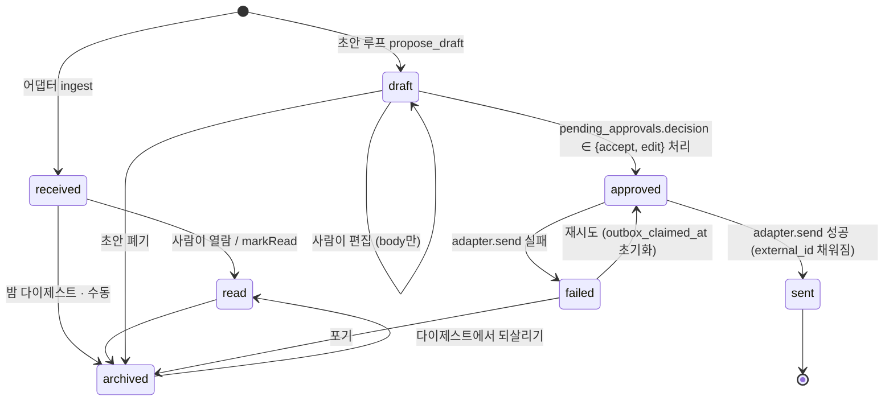

# A3 — 데이터 스키마와 메모리 테이블

버전 1.0 (2026-09-20). 작성: Fable. 상위 문서: `00-omnis-design.md` v1.0 (§6 데이터 모델, §7 커널, §10 메모리). 충돌 시 마스터가 이긴다. 0.95 = 전역 리뷰(`99-review.md` §1.1·§3·§4) 반영판, 1.0 = pass 2 리뷰(`99-review-v2.md` §2-5·§4-3) 반영판.

근거: `22`(Draft=Item status, HumanInterrupt/HumanResponse 스키마), `26`(mem0 OSS graph 제거 → Postgres 엔티티 테이블 필수, nomic-embed 768d, pgvector HNSW 2,000d 한계, 결정론적 신원 매칭), `10`(Graphiti 4-timestamp bi-temporal 차용, mem0 TS `/oss` 서브패스), `27`(NOTIFY 8,000B·coalescing, 3-tier 이벤트, `idle_replication_slot_timeout`, 볼륨 추정), `13`(Zero = Postgres 하나로 끝나는 서버-authoritative sync).

## 0. 이 부록이 확정하는 결정

| # | 결정 | 근거 | 바뀌는 조건 |
|---|---|---|---|
| A3-D1 | 모든 도메인 테이블의 PK는 `uuid` + `gen_random_uuid()`. `events`/`audit_log`만 `bigint` 시퀀스(`seq`)를 순서 보장용으로 추가로 갖는다 | 고정 버전 PG17에 내장 `uuidv7()`가 없다(**UNVERIFIED — spike**: `research/`에 근거 없음. Phase 0에서 `SELECT uuidv7()` 1회 실행으로 확정). 시간 정렬은 `(at, id)` 복합 인덱스로 충분 | 내장 `uuidv7()`가 있는 메이저로 올리면 default만 교체(스키마 변경 없음, 기존 row 유지) |
| A3-D2 | enum은 native `CREATE TYPE ... AS ENUM`이 아니라 **`text` + 이름 붙은 `CHECK`** | 값 제거·재정렬이 native enum에서는 타입 재생성이라 마이그레이션이 비싸다. Zero의 PG enum 타입 매핑은 `13`/`27`에 근거 없음(UNVERIFIED) | Zero가 enum을 1급으로 지원한다고 확인되고 값 집합이 1년간 안정되면 native enum으로 승격 |
| A3-D3 | 모든 시각은 `timestamptz`, 저장은 UTC. 컬럼명은 `*_at`, 이벤트 발생 시각만 `at` | — | 없음 |
| A3-D4 | 채널 비밀(`auth_ref`)은 `accounts`가 아니라 **`account_secrets` 별도 테이블**에 두고 Zero publication에서 제외 | 컬럼 단위 권한에 의존하지 않고 테이블 경계로 막는다(구조로 막기, 마스터 D10) | 없음 |
| A3-D5 | append-only는 트리거 + `REVOKE` 이중으로 강제. `audit_log`는 UPDATE/DELETE 영구 금지, `events`는 **롤오프 윈도우 밖 DELETE만** 허용 | 마스터 §6 "append-only", `27`의 cold tier | 없음 |
| A3-D6 | `events`는 v1에서 파티셔닝하지 않는다. 야간 잡이 90일 초과분을 DELETE | `27` 추정 최대 30,000 events/day → 90일 2.7M row. 파티셔닝은 과설계 | 일 100,000건을 넘거나 DELETE가 5분을 넘으면 월 단위 RANGE 파티션으로 전환 |
| A3-D7 | `LISTEN/NOTIFY`는 **허브 내부 팬아웃 전용**(어댑터, 에이전트 루프, `local-agent` 브리지). 클라이언트 동기화는 Zero가 단독으로 한다. 페이로드는 id만 | `27`: 8,000B 한도 + "key만 보내라" 공식 권고 | 없음 |
| A3-D8 | Zero 복제 대상은 `CREATE PUBLICATION`의 **화이트리스트**. 새 테이블은 명시적으로 추가하지 않으면 동기화되지 않는다 | 실수로 `memories`(768d 벡터)나 `audit_log`가 폰에 복제되는 사고를 구조로 차단 | 없음 |
| A3-D9 | 마이그레이션은 **plain SQL 파일 + 자체 runner**(~70줄, advisory lock) | 리서치 어디에도 검증된 TS 마이그레이션 도구가 없다. 없는 도구를 발명하지 않는다 | 스키마가 30개 파일을 넘고 롤백이 실제로 필요해지면 재검토 |
| A3-D10 | Draft는 `items.status='draft'`. 중복 발송은 `outbox_claimed_at` + `idempotency_key`로 막는다(상태 값 추가 없음) | `22`: agentic-inbox는 draft 전용 테이블 없이 동작. 마스터 D15 | 없음 |
| A3-D11 | `pending_approvals`는 `state`(라이프사이클)와 `decision`(사람의 선택) **두 컬럼**으로 나눈다. `decision`은 `22`의 `HumanResponse.type`과 1:1 | `22` | 없음 |
| A3-D12 | `public.memories`는 omnis 소유 테이블이고, mem0 OSS는 이 테이블에 붙는 **커스텀 VectorStore 어댑터**로 쓴다(mem0가 자기 테이블을 만들게 두지 않는다) | `26`: mem0는 graph를 통째로 들어낼 만큼 브레이킹하다 → 저장 레이어 소유권을 넘기지 않는다. `10`: mem0-ts는 `vector_stores/` 인터페이스를 갖는다 | mem0의 VectorStore 인터페이스가 export되지 않으면(스파이크 S-A3-1) mem0를 추출 로직 라이브러리로만 쓰고 upsert는 직접 SQL |
| A3-D13 | 신원 해석은 결정론적 키 매칭 + 수동 병합. 병합은 `person_merges`에 기록해 되돌릴 수 있게 한다 | `26` §5: 1인 규모에서 ML 엔티티 리졸루션은 과잉 | 미해결 매칭이 수백 건 쌓이면 재검토 |
| A3-D14 | ephemeral 티어(토큰 델타, typing, reasoning 청크)는 **어떤 테이블에도 저장하지 않는다** | `27` §4-1, 마스터 §7 | 없음 |

---

## 1. 규약

- 대상: **PostgreSQL 17 고정**(99-review §1.2 — A6의 `@17`에 맞춘다. A7의 CI 매트릭스도 17), 확장 `pgcrypto`(`gen_random_uuid`), `vector`(pgvector), `pg_trgm`.
- 스키마: 전부 `public`. mem0가 자체 테이블을 만들어야 하는 폴백 경로에서만 `mem0` 스키마를 쓴다.
- 역할: `omnis_owner`(DDL·마이그레이션), `omnis_hub`(허브 프로세스, DML), `omnis_sync`(zero-cache, `REPLICATION` + SELECT).
- `events`/`audit_log`에는 **FK를 걸지 않는다.** 원본 row가 지워져도 감사 기록은 남아야 한다. 참조는 plain `uuid` 컬럼 + `target_table` 문자열.
- 텍스트 검색: `to_tsvector('simple', ...)` GIN + `pg_trgm` GIN 병행. 한국어 형태소 분석기는 v1에서 쓰지 않는다(설치 비용 대비 1인 인박스 검색 품질 이득이 불확실 — 검색이 실제로 안 잡히면 그때 `pg_bigm` 재검토).

```sql
CREATE EXTENSION IF NOT EXISTS pgcrypto;
CREATE EXTENSION IF NOT EXISTS vector;
CREATE EXTENSION IF NOT EXISTS pg_trgm;
```

### 1.1 값 집합 (A3-D2: text + CHECK)

| 컬럼 | 허용 값 |
|---|---|
| `accounts.channel` | `slack, gmail, outlook, gcal, telegram, whatsapp, kakaotalk, linkedin, agent, system` |
| `threads.kind` | `dm, group, email, agent_session, calendar, system` |
| `items.kind` | `message, email, event, agent_turn, tool_call, system` |
| `items.status` | `received, read, draft, approved, sent, failed, archived` |
| `items.scope` | `work, personal, unknown` |
| `items.sensitivity` | `normal, personal, finance, legal, health` (기본 `normal`. `normal` 외 = T2 강제, 마스터 §14) |
| `labels.kind` | `scope, topic, priority, person` |
| `label_rules.tier` | `T0, T1` |
| `tasks.state` | `open, in_progress, blocked, done, dropped` |
| `tasks.kind` | `todo, followup, delegation` |
| `calendar_events.status` | `confirmed, tentative, cancelled` |
| `agent_runs.model_tier` | `T0, T1, T2, T3` (마스터 §14) |
| `agent_runs.outcome` | `running, ok, failed, skipped, blocked` |
| `agent_runtimes.runtime` | `claude_code, codex, claude_ds, hermes, omnis` |
| `agent_sessions.state` | `starting, idle, running, waiting_approval, ended, failed` |
| `pending_approvals.action` | `send, delete, calendar_write, delegate, self_model_edit, memory_write` |
| `pending_approvals.state` | `pending, decided, executing, executed, failed, expired` |
| `pending_approvals.decision` | `accept, edit, respond, ignore` (`22`의 `HumanResponse.type`) |
| `memories.kind` | `fact, preference, commitment, event, summary` |
| `entities.type` | `person, org, project, commitment, decision, topic` |
| `digests.kind` | `morning, nightly` |
| `jobs.last_status` | `ok, failed, skipped` |

---

## 2. DDL — 채널·인박스 코어

```sql
CREATE TABLE accounts (
  id            uuid PRIMARY KEY DEFAULT gen_random_uuid(),
  channel       text NOT NULL,
  external_id   text NOT NULL,                 -- 채널 내 계정 식별자 (Slack team+user, 메일 주소 등)
  display       text NOT NULL,
  capabilities  jsonb NOT NULL DEFAULT '{}'::jsonb,  -- {read,write,realtime,history,media,markRead,typing}
  state         text NOT NULL DEFAULT 'active',
  last_health_at timestamptz,
  last_error    text,
  created_at    timestamptz NOT NULL DEFAULT now(),
  CONSTRAINT accounts_channel_ck CHECK (channel IN
    ('slack','gmail','outlook','gcal','telegram','whatsapp','kakaotalk','linkedin','agent','system')),
  CONSTRAINT accounts_state_ck CHECK (state IN ('active','paused','broken')),
  CONSTRAINT accounts_uq UNIQUE (channel, external_id)
);

-- A3-D4: 비밀은 별도 테이블. Zero publication에 절대 넣지 않는다.
CREATE TABLE account_secrets (
  account_id  uuid PRIMARY KEY REFERENCES accounts(id) ON DELETE CASCADE,
  auth_ref    text NOT NULL,                   -- Keychain item 이름 (값이 아니다).
                                               -- 명명 규칙은 A1 소유: omnis.<channel>.<kind>.<external_id>
                                               -- (99-review §1.2 — A6-D9의 omnis-slack-bot-token 표기가 이쪽으로 정정된다)
  scopes      text[] NOT NULL DEFAULT '{}',
  expires_at  timestamptz,
  rotated_at  timestamptz NOT NULL DEFAULT now()
);

CREATE TABLE threads (
  id            uuid PRIMARY KEY DEFAULT gen_random_uuid(),
  account_id    uuid NOT NULL REFERENCES accounts(id) ON DELETE RESTRICT,
  external_id   text NOT NULL,
  kind          text NOT NULL,
  title         text,
  scope         text NOT NULL DEFAULT 'unknown',
  participants  uuid[] NOT NULL DEFAULT '{}',  -- persons.id
  meta          jsonb NOT NULL DEFAULT '{}'::jsonb,  -- 예약 키: meta.pending_next_step (A4 §7.3 folk 판정 캐시)
  last_item_at  timestamptz,
  unread_count  integer NOT NULL DEFAULT 0,
  needs_action  boolean NOT NULL DEFAULT false,
  archived_at   timestamptz,
  muted_until   timestamptz,
  created_at    timestamptz NOT NULL DEFAULT now(),
  CONSTRAINT threads_kind_ck CHECK (kind IN ('dm','group','email','agent_session','calendar','system')),
  CONSTRAINT threads_scope_ck CHECK (scope IN ('work','personal','unknown')),
  CONSTRAINT threads_uq UNIQUE (account_id, external_id)
);

CREATE INDEX threads_inbox_idx ON threads (last_item_at DESC)
  WHERE archived_at IS NULL;
CREATE INDEX threads_scope_idx ON threads (scope, last_item_at DESC)
  WHERE archived_at IS NULL;
CREATE INDEX threads_participants_idx ON threads USING gin (participants);

CREATE TABLE items (
  id               uuid PRIMARY KEY DEFAULT gen_random_uuid(),
  thread_id        uuid NOT NULL REFERENCES threads(id) ON DELETE CASCADE,
  account_id       uuid NOT NULL REFERENCES accounts(id) ON DELETE RESTRICT,
  external_id      text,                        -- draft는 NULL (아직 채널에 없음)
  kind             text NOT NULL,
  status           text NOT NULL DEFAULT 'received',
  scope            text NOT NULL DEFAULT 'unknown',
  sensitivity      text NOT NULL DEFAULT 'normal',   -- A4 L1이 유일한 생산자 (A4 §2.4, A4-D12)
  author_person_id uuid REFERENCES persons(id) ON DELETE SET NULL,
  author_agent_id  uuid REFERENCES agent_runtimes(id) ON DELETE SET NULL,
  author_is_me     boolean NOT NULL DEFAULT false,
  in_reply_to      uuid REFERENCES items(id) ON DELETE SET NULL,  -- `22`: draft ↔ 원본 연결
  subject          text,
  body             text NOT NULL DEFAULT '',
  body_html        text,
  attachments      jsonb NOT NULL DEFAULT '[]'::jsonb,
  tool             jsonb,                       -- kind='tool_call'일 때 {name,args,state,label,icon}
  sent_at          timestamptz NOT NULL,
  received_at      timestamptz NOT NULL DEFAULT now(),
  source_hash      text,                        -- 어댑터 멱등성 키
  idempotency_key  text,                        -- 발송 멱등성 키 (A3-D10)
  outbox_claimed_at timestamptz,                -- 발송 워커의 at-most-once claim
  fail_reason      text,
  meta             jsonb NOT NULL DEFAULT '{}'::jsonb,  -- 아래 "meta 규약" 참조. draft_meta를 흡수했다
  embedding        vector(768),                 -- nomic-embed-text-v1.5 (`26`). A4 §2.2 kNN의 입력
  search_tsv       tsvector GENERATED ALWAYS AS
                     (to_tsvector('simple', coalesce(subject,'') || ' ' || coalesce(body,''))) STORED,
  CONSTRAINT items_kind_ck CHECK (kind IN ('message','email','event','agent_turn','tool_call','system')),
  CONSTRAINT items_status_ck CHECK (status IN
    ('received','read','draft','approved','sent','failed','archived')),
  CONSTRAINT items_scope_ck CHECK (scope IN ('work','personal','unknown')),
  CONSTRAINT items_sensitivity_ck CHECK (sensitivity IN
    ('normal','personal','finance','legal','health')),
  CONSTRAINT items_author_ck CHECK (num_nonnulls(author_person_id, author_agent_id) <= 1)
);

CREATE UNIQUE INDEX items_external_uq ON items (account_id, external_id)
  WHERE external_id IS NOT NULL;
CREATE UNIQUE INDEX items_source_hash_uq ON items (account_id, source_hash)
  WHERE source_hash IS NOT NULL;
CREATE UNIQUE INDEX items_idem_uq ON items (idempotency_key)
  WHERE idempotency_key IS NOT NULL;
CREATE INDEX items_thread_idx ON items (thread_id, sent_at DESC);
CREATE INDEX items_pending_idx ON items (status, sent_at DESC)
  WHERE status IN ('draft','approved','failed');
CREATE INDEX items_search_idx ON items USING gin (search_tsv);
CREATE INDEX items_body_trgm_idx ON items USING gin (body gin_trgm_ops);

-- 임베딩이 있는 item만 인덱싱한다. 대부분의 item은 임베딩되지 않는다
-- (agent_turn, tool_call, system, 그리고 아직 T0 배치가 안 돈 것).
CREATE INDEX items_embedding_idx ON items
  USING hnsw (embedding vector_cosine_ops)
  WITH (m = 16, ef_construction = 64)   -- 파라미터 근거: UNVERIFIED — spike (§14 S-A3-7)
  WHERE embedding IS NOT NULL;
```

`items`가 `persons`/`agent_runtimes`를 참조하므로 실제 마이그레이션 파일에서는 그 두 테이블이 먼저 생성된다(§3, §4). 위 순서는 읽기용이다.

**`author` 3컬럼 규약** — 마스터 §6은 author를 `person_id | agent_session_id | system`으로 적지만, A3의 구현은 `author_person_id`(사람) + `author_agent_id`(→ `agent_runtimes`) + `author_is_me`(나/시스템 구분) 세 컬럼이다. 세션 식별은 별도 컬럼이 아니라 `items.thread_id`로 한다 — 에이전트 세션 = thread(마스터 §9)이므로 turn이 속한 세션은 thread로 유일하게 결정되고, `items → agent_sessions → threads → items`의 FK 순환을 만들지 않아도 된다. A1·A2의 `author` 값 집합은 이 3컬럼에 맞춘다(99-review §1.2).

**`items.meta` 규약** — `draft_meta`는 폐기하고 `meta`로 접었다(중복 jsonb 컬럼 2개를 두지 않는다). 예약 키:

| 키 | 쓰는 쪽 | 내용 |
|---|---|---|
| `meta.draft` | A4 초안 루프 | `{model, tier, rationale, memory_ids[], confidence}` — 옛 `draft_meta`의 내용 그대로 |
| `meta.pending` | 커널 | `true`면 placeholder draft(A4 §3의 60초 SLA). 완료 시 같은 row가 교체되며 키가 지워진다 |

tool 호출 페이로드는 `meta`가 아니라 기존 `tool` 컬럼에 그대로 둔다.

예약되지 않은 키는 자유롭게 쓰되 인덱스를 기대하지 않는다. `meta`에 조회 조건이 생기면 그때 컬럼으로 승격한다.

### 2.1 캘린더 이벤트 상세

인박스 투영과 상세를 나눈다. **`items(kind='event')`가 인박스 투영**이고(브리핑·타임라인·Inbox 행이 읽는 것), **`calendar_events`가 상세 테이블**이다(참석자, 반복, 시작·종료 시각). A4 §7.1의 팔로업 트리거와 §7.5 지표가 이 테이블을 참조한다.

```sql
CREATE TABLE calendar_events (
  id           uuid PRIMARY KEY DEFAULT gen_random_uuid(),
  item_id      uuid NOT NULL UNIQUE REFERENCES items(id) ON DELETE CASCADE,  -- 조인 규칙
  account_id   uuid NOT NULL REFERENCES accounts(id) ON DELETE RESTRICT,
  external_id  text NOT NULL,              -- Google/Graph의 event id
  start_at     timestamptz NOT NULL,
  end_at       timestamptz NOT NULL,
  all_day      boolean NOT NULL DEFAULT false,
  status       text NOT NULL DEFAULT 'confirmed',
  attendees    jsonb NOT NULL DEFAULT '[]'::jsonb,   -- [{email, display, response, person_id}]
  attendees_count integer GENERATED ALWAYS AS (jsonb_array_length(attendees)) STORED,
  location     text,
  recurrence   text,                       -- RRULE 원문. 전개는 하지 않는다(어댑터가 인스턴스를 준다)
  updated_at   timestamptz NOT NULL DEFAULT now(),
  CONSTRAINT calendar_events_status_ck CHECK (status IN ('confirmed','tentative','cancelled')),
  CONSTRAINT calendar_events_uq UNIQUE (account_id, external_id),
  CONSTRAINT calendar_events_span_ck CHECK (end_at >= start_at)
);
CREATE INDEX calendar_events_start_idx ON calendar_events (start_at);
CREATE INDEX calendar_events_end_idx   ON calendar_events (end_at)
  WHERE status <> 'cancelled';
```

**조인 규칙**: 1 이벤트 = 1 `items` row(`kind='event'`, `thread_id` = `threads.kind='calendar'`) + 정확히 1 `calendar_events` row. 어댑터는 두 row를 같은 트랜잭션에서 upsert한다. `items.sent_at`에는 `start_at`을 넣어 인박스 정렬이 일정 시각을 따르게 한다. 캘린더 화면·브리핑·팔로업은 `calendar_events`를 읽고, Inbox 리스트와 검색은 `items`만 읽는다. `attendees_count`는 생성 컬럼이므로 A4 §7.1의 `attendees_count BETWEEN 1 AND 8` 트리거가 그대로 동작한다.

---

## 3. DDL — 사람·라벨

```sql
CREATE TABLE persons (
  id                 uuid PRIMARY KEY DEFAULT gen_random_uuid(),
  display_name       text NOT NULL,
  org                text,
  role               text,
  relationship_state text NOT NULL DEFAULT 'unknown',
  vip                boolean NOT NULL DEFAULT false,
  notes              text,
  first_contact_at   timestamptz,          -- A4 §7.2 초면 판정
  last_contact_at    timestamptz,
  next_followup_at   timestamptz,
  item_count         integer NOT NULL DEFAULT 0,   -- A4 §7.2 (부재 또는 90일 이내 AND item_count < 3 = 초면)
  primary_thread_id  uuid REFERENCES threads(id) ON DELETE SET NULL,  -- A4 §7.3 cadence 쿼리의 조인 대상
  cadence_days       integer,              -- NULL이면 relationship_state 기본값 (A4 §7.3)
  priority_score     real NOT NULL DEFAULT 0,      -- A4 §7.3 팔로업 큐 정렬 키
  merged_into        uuid REFERENCES persons(id) ON DELETE SET NULL,  -- tombstone
  created_at         timestamptz NOT NULL DEFAULT now(),
  CONSTRAINT persons_rel_ck CHECK (relationship_state IN
    ('unknown','new','warming','active','dormant','closed'))
);
CREATE INDEX persons_followup_idx ON persons (next_followup_at)
  WHERE merged_into IS NULL AND next_followup_at IS NOT NULL;
CREATE INDEX persons_name_trgm_idx ON persons USING gin (display_name gin_trgm_ops);
CREATE INDEX persons_cadence_idx ON persons (priority_score DESC)
  WHERE merged_into IS NULL AND relationship_state IN ('warming','active');

CREATE TABLE identities (
  id          uuid PRIMARY KEY DEFAULT gen_random_uuid(),
  person_id   uuid NOT NULL REFERENCES persons(id) ON DELETE CASCADE,
  channel     text NOT NULL,
  handle      text NOT NULL,              -- 원본 표기
  handle_norm text NOT NULL,              -- 정규화 키 (§9)
  display     text,
  verified    boolean NOT NULL DEFAULT false,
  source      text NOT NULL DEFAULT 'adapter',
  created_at  timestamptz NOT NULL DEFAULT now(),
  CONSTRAINT identities_source_ck CHECK (source IN ('adapter','manual','agent')),
  CONSTRAINT identities_uq UNIQUE (channel, handle_norm)
);
CREATE INDEX identities_person_idx ON identities (person_id);
```

`cadence_days` 해석(값의 오너는 A4 §7.3, A3는 저장만 한다): row의 `cadence_days`가 NULL이면 `relationship_state`별 기본값(`active` 30일, `warming` 21일, `dormant` 없음)을 쓴다. **`vip=true`는 `relationship_state`를 오버라이드해 14일이 된다**(99-review §4-14). `vip`는 enum 값이 아니라 별도 불리언이므로 CHECK로 강제하지 않고 쿼리 쪽에서 `COALESCE(p.cadence_days, CASE WHEN p.vip THEN 14 WHEN ... END)`로 푼다.

```sql
CREATE TABLE person_merges (
  id             uuid PRIMARY KEY DEFAULT gen_random_uuid(),
  kind           text NOT NULL,                 -- 'merge' | 'split'
  from_person_id uuid NOT NULL,
  to_person_id   uuid NOT NULL,
  identity_ids   uuid[] NOT NULL DEFAULT '{}',  -- split일 때 옮긴 identity
  reason         text,
  at             timestamptz NOT NULL DEFAULT now(),
  CONSTRAINT person_merges_kind_ck CHECK (kind IN ('merge','split'))
);

CREATE TABLE labels (
  id         uuid PRIMARY KEY DEFAULT gen_random_uuid(),
  name       text NOT NULL,
  kind       text NOT NULL,
  color      text,
  rule       text,                          -- 자연어 규칙 (Superhuman Auto Labels 방식)
  rule_model text,
  person_id  uuid REFERENCES persons(id) ON DELETE CASCADE,  -- kind='person'
  archived   boolean NOT NULL DEFAULT false,
  created_at timestamptz NOT NULL DEFAULT now(),
  CONSTRAINT labels_kind_ck CHECK (kind IN ('scope','topic','priority','person')),
  CONSTRAINT labels_uq UNIQUE (kind, name)
);

-- 자연어 라벨 규칙 (A4 §2.3, Superhuman Auto Labels 방식). A4가 들고 있던 DDL을 A3로 편입하고
-- `id`/`label_id`의 text ↔ uuid 불일치를 uuid로 맞췄다(99-review §1.1).
CREATE TABLE label_rules (
  id             uuid PRIMARY KEY DEFAULT gen_random_uuid(),
  label_id       uuid NOT NULL REFERENCES labels(id) ON DELETE CASCADE,
  prompt         text NOT NULL,                    -- 사용자가 적은 원문 (SSOT)
  rule           jsonb NOT NULL DEFAULT '{}'::jsonb, -- 컴파일 결과 CompiledRule (A4 §2.3)
  rule_by        text,                             -- 'claude-sonnet-5' | 'user'
  rule_at        timestamptz,
  probe_embedding vector(768),                     -- CompiledRule.semantic 임베딩 (A4 §2.3 kNN 폴백)
  tier           text NOT NULL DEFAULT 'T0',
  positives      uuid[] NOT NULL DEFAULT '{}',     -- items.id
  negatives      uuid[] NOT NULL DEFAULT '{}',
  hits_30d       integer NOT NULL DEFAULT 0,
  corrections_30d integer NOT NULL DEFAULT 0,
  pinned_by_user boolean NOT NULL DEFAULT false,
  active         boolean NOT NULL DEFAULT true,
  created_at     timestamptz NOT NULL DEFAULT now(),
  updated_at     timestamptz NOT NULL DEFAULT now(),
  CONSTRAINT label_rules_tier_ck CHECK (tier IN ('T0','T1'))
);
CREATE INDEX label_rules_active_idx ON label_rules (label_id) WHERE active;

CREATE TABLE item_labels (
  item_id    uuid NOT NULL REFERENCES items(id) ON DELETE CASCADE,
  label_id   uuid NOT NULL REFERENCES labels(id) ON DELETE CASCADE,
  confidence real,
  by         text NOT NULL DEFAULT 'agent',   -- 'agent' | 'me' | 'rule'
  at         timestamptz NOT NULL DEFAULT now(),
  CONSTRAINT item_labels_by_ck CHECK (by IN ('agent','me','rule')),
  PRIMARY KEY (item_id, label_id)
);
CREATE INDEX item_labels_label_idx ON item_labels (label_id);

CREATE TABLE thread_labels (
  thread_id  uuid NOT NULL REFERENCES threads(id) ON DELETE CASCADE,
  label_id   uuid NOT NULL REFERENCES labels(id) ON DELETE CASCADE,
  confidence real,
  by         text NOT NULL DEFAULT 'agent',
  at         timestamptz NOT NULL DEFAULT now(),
  CONSTRAINT thread_labels_by_ck CHECK (by IN ('agent','me','rule')),
  PRIMARY KEY (thread_id, label_id)
);
CREATE INDEX thread_labels_label_idx ON thread_labels (label_id);
```

**A4 §2.3 표기와의 대응**(A3가 스키마 오너이므로 A3 이름이 이긴다): A4의 `compiled` → `rule`, `compiled_by` → `rule_by`, `compiled_at` → `rule_at`, `corrections` → `corrections_30d`. `positives`/`negatives`는 `text[]`가 아니라 `uuid[]`(items.id).

---

## 4. DDL — 작업·에이전트·승인·노트

```sql
CREATE TABLE agent_runtimes (
  id           uuid PRIMARY KEY DEFAULT gen_random_uuid(),
  runtime      text NOT NULL,
  host         text NOT NULL,                  -- 'mini' | 'macbook'
  display      text NOT NULL,
  capabilities jsonb NOT NULL DEFAULT '{}'::jsonb,   -- 브리지 자기기술 (마스터 D5)
  version      text,
  state        text NOT NULL DEFAULT 'offline',
  last_seen_at timestamptz,
  created_at   timestamptz NOT NULL DEFAULT now(),
  CONSTRAINT agent_runtimes_runtime_ck CHECK (runtime IN
    ('claude_code','codex','claude_ds','hermes','omnis')),
  CONSTRAINT agent_runtimes_host_ck CHECK (host IN ('mini','macbook')),
  CONSTRAINT agent_runtimes_state_ck CHECK (state IN ('offline','online','degraded')),
  CONSTRAINT agent_runtimes_uq UNIQUE (runtime, host)
);

-- `omnis`는 유효한 runtime 값이지만 브리지 어댑터가 없는 특수 row다(마스터 §6, 99-review §4-8):
-- omnis 자체 L3 루프가 이 row를 actor로 쓴다. RuntimeAdapter도 local-agent 등록도 없다.
-- 호스트는 허브가 도는 곳이고, Phase D에서 허브가 맥북으로 옮겨가면 이 row의 host를
-- UPDATE할 뿐 새 row를 만들지 않는다. 아래 부분 유니크 인덱스가 2번째 row를 구조로 막는다.
CREATE UNIQUE INDEX agent_runtimes_omnis_uq ON agent_runtimes (runtime)
  WHERE runtime = 'omnis';

INSERT INTO agent_runtimes (runtime, host, display, state)
  VALUES ('omnis', 'mini', 'omnis agents', 'online');

CREATE TABLE agent_sessions (
  id           uuid PRIMARY KEY DEFAULT gen_random_uuid(),
  runtime_id   uuid NOT NULL REFERENCES agent_runtimes(id) ON DELETE CASCADE,
  thread_id    uuid NOT NULL REFERENCES threads(id) ON DELETE CASCADE,  -- 세션 = thread
  session_key  text NOT NULL,        -- 안정 스코프 (마스터 D5)
  session_id   text,                 -- 회전하는 트랜스크립트 id
  cwd          text,
  state        text NOT NULL DEFAULT 'starting',
  summary      text,                 -- read_session이 읽는 durable 요약
  last_turn_at timestamptz,
  started_at   timestamptz NOT NULL DEFAULT now(),
  ended_at     timestamptz,
  CONSTRAINT agent_sessions_state_ck CHECK (state IN
    ('starting','idle','running','waiting_approval','ended','failed')),
  CONSTRAINT agent_sessions_uq UNIQUE (runtime_id, session_key)
);
CREATE INDEX agent_sessions_active_idx ON agent_sessions (last_turn_at DESC)
  WHERE ended_at IS NULL;

-- 모든 L3 루프 실행의 단일 기록 (A4-D16: 평가·비용·감사의 단일 소스).
-- 여기 없는 실행은 존재하지 않은 것으로 취급한다 — 월 비용(마스터 §14 $60 상한),
-- 루프별 품질 지표, 인젝션 플래그가 전부 이 테이블의 집계다.
CREATE TABLE agent_runs (
  id               uuid PRIMARY KEY DEFAULT gen_random_uuid(),
  loop             text NOT NULL,          -- 'classify' | 'draft' | 'task' | 'delegate' | 'digest' | 'followup' | 'note_route' | 'auto_archive' | 'ingest'
  agent_session_id uuid REFERENCES agent_sessions(id) ON DELETE SET NULL,
  item_id          uuid REFERENCES items(id) ON DELETE SET NULL,
  trigger_kind     text NOT NULL DEFAULT 'event',   -- 'event' | 'cron' | 'manual'
  trigger_ref      text,                   -- cron 잡 이름 등, item 외의 트리거
  model_tier       text NOT NULL,          -- T0|T1|T2|T3 (마스터 §14)
  provider         text NOT NULL,          -- 'local' | 'deepseek' | 'anthropic' | 'openrouter'
  model            text NOT NULL,          -- 'nomic-embed-text-v1.5' | 'deepseek-v4.1-flash' | 'claude-sonnet-5' ...
  tokens_in        integer,
  tokens_out       integer,
  tokens_cached    integer,
  cost_usd         numeric(10,6),
  latency_ms       integer,
  outcome          text NOT NULL DEFAULT 'running',
  error            text,
  confidence       real,
  escalated_from   uuid REFERENCES agent_runs(id) ON DELETE SET NULL,  -- T1 → T2 에스컬레이션 연결
  injection_flags  text[] NOT NULL DEFAULT '{}',
  context_hash     text,                   -- sha256(cachedPrefix) — 캐시 히트율 추적
  result_ref       uuid,                   -- 산출물 id (item/task/approval/digest). FK 없음: 대상 테이블이 여럿
  raw_output       text,                   -- 스키마 위반 출력 보관 (A4 §1.6)
  created_at       timestamptz NOT NULL DEFAULT now(),
  finished_at      timestamptz,
  CONSTRAINT agent_runs_tier_ck CHECK (model_tier IN ('T0','T1','T2','T3')),
  CONSTRAINT agent_runs_outcome_ck CHECK (outcome IN ('running','ok','failed','skipped','blocked'))
);
CREATE INDEX agent_runs_created_idx ON agent_runs (created_at DESC);
CREATE INDEX agent_runs_loop_idx    ON agent_runs (loop, created_at DESC);
CREATE INDEX agent_runs_item_idx    ON agent_runs (item_id) WHERE item_id IS NOT NULL;

CREATE TABLE tasks (
  id                  uuid PRIMARY KEY DEFAULT gen_random_uuid(),
  title               text NOT NULL,
  detail              text,
  kind                text NOT NULL DEFAULT 'todo',  -- A4 §7.3 Task 라우팅
  state               text NOT NULL DEFAULT 'open',
  owner_kind          text NOT NULL DEFAULT 'me',   -- 'me' | 'agent'
  owner_runtime_id    uuid REFERENCES agent_runtimes(id) ON DELETE SET NULL,
  source_item_id      uuid REFERENCES items(id) ON DELETE SET NULL,
  person_id           uuid REFERENCES persons(id) ON DELETE SET NULL,
  delegated_session_id uuid REFERENCES agent_sessions(id) ON DELETE SET NULL,
  due_at              timestamptz,
  remind_at           timestamptz,
  done_at             timestamptz,
  created_at          timestamptz NOT NULL DEFAULT now(),
  created_by          text NOT NULL DEFAULT 'agent',
  CONSTRAINT tasks_kind_ck CHECK (kind IN ('todo','followup','delegation')),
  CONSTRAINT tasks_state_ck CHECK (state IN ('open','in_progress','blocked','done','dropped')),
  CONSTRAINT tasks_owner_ck CHECK (owner_kind IN ('me','agent'))
);
CREATE INDEX tasks_open_idx ON tasks (due_at NULLS LAST) WHERE state IN ('open','in_progress');
CREATE INDEX tasks_remind_idx ON tasks (remind_at) WHERE remind_at IS NOT NULL AND state <> 'done';

-- `22`의 HumanInterrupt / HumanResponse를 그대로 이식. A3-D11.
CREATE TABLE pending_approvals (
  id            uuid PRIMARY KEY DEFAULT gen_random_uuid(),
  action        text NOT NULL,
  args          jsonb NOT NULL,          -- ActionRequest.args (전문. UI가 그대로 노출)
  description   text NOT NULL,
  config        jsonb NOT NULL DEFAULT
                  '{"allow_accept":true,"allow_edit":true,"allow_respond":false,"allow_ignore":true}'::jsonb,
  state         text NOT NULL DEFAULT 'pending',
  decision      text,                    -- accept | edit | respond | ignore
  decided_args  jsonb,                   -- edit/respond일 때 사람이 고친 결과
  requested_by  uuid REFERENCES agent_runtimes(id) ON DELETE SET NULL,
  thread_id     uuid REFERENCES threads(id) ON DELETE SET NULL,
  item_id       uuid REFERENCES items(id) ON DELETE SET NULL,
  task_id       uuid REFERENCES tasks(id) ON DELETE SET NULL,
  risk          text NOT NULL DEFAULT 'normal',
  expires_at    timestamptz,
  created_at    timestamptz NOT NULL DEFAULT now(),
  decided_at    timestamptz,
  executed_at   timestamptz,
  fail_reason   text,
  CONSTRAINT approvals_action_ck CHECK (action IN
    ('send','delete','calendar_write','delegate','self_model_edit','memory_write')),
  CONSTRAINT approvals_state_ck CHECK (state IN
    ('pending','decided','executing','executed','failed','expired')),
  CONSTRAINT approvals_decision_ck CHECK (decision IS NULL OR decision IN
    ('accept','edit','respond','ignore')),
  CONSTRAINT approvals_risk_ck CHECK (risk IN ('normal','high')),
  CONSTRAINT approvals_decided_ck CHECK ((state = 'pending') = (decision IS NULL))
);
CREATE INDEX approvals_pending_idx ON pending_approvals (created_at DESC) WHERE state = 'pending';
CREATE INDEX approvals_thread_idx ON pending_approvals (thread_id, created_at DESC);

CREATE TABLE notes (
  id           uuid PRIMARY KEY DEFAULT gen_random_uuid(),
  body         text NOT NULL,
  routed_to_thread_id uuid REFERENCES threads(id) ON DELETE SET NULL,
  routed_to_person_id uuid REFERENCES persons(id) ON DELETE SET NULL,
  rationale    text,
  route_state  text NOT NULL DEFAULT 'proposed',
  created_at   timestamptz NOT NULL DEFAULT now(),
  CONSTRAINT notes_route_state_ck CHECK (route_state IN ('proposed','accepted','rejected','none'))
);

CREATE TABLE digests (
  id         uuid PRIMARY KEY DEFAULT gen_random_uuid(),
  kind       text NOT NULL,
  for_date   date NOT NULL,
  body       text NOT NULL,
  item_ids   uuid[] NOT NULL DEFAULT '{}',
  metrics    jsonb NOT NULL DEFAULT '{}'::jsonb,   -- 커버리지·비용 지표 (마스터 §2)
  created_at timestamptz NOT NULL DEFAULT now(),
  CONSTRAINT digests_kind_ck CHECK (kind IN ('morning','nightly')),
  CONSTRAINT digests_uq UNIQUE (kind, for_date)
);
```

**A4 §1.7 표기와의 대응**(A3가 이긴다): A4의 `tier` → `model_tier`, `input_tokens` → `tokens_in`, `output_tokens` → `tokens_out`, `cached_input_tokens` → `tokens_cached`, `status` → `outcome`, `started_at` → `created_at`. `provider` 컬럼은 A4에 없던 것으로, 게이트웨이(OpenRouter)와 직접 호출을 비용 집계에서 가르기 위해 A3가 추가했다(마스터 §14). A4의 `trigger_ref`에 item_id를 담던 용법은 `item_id` 컬럼으로 승격했고, `trigger_ref`에는 cron 잡 이름처럼 item이 아닌 트리거만 남긴다.

---

## 5. DDL — 메모리 3층

```sql
-- L2-3 엔티티/관계. Graphiti 4-timestamp (`10`, `26`).
CREATE TABLE entities (
  id             uuid PRIMARY KEY DEFAULT gen_random_uuid(),
  type           text NOT NULL,
  name           text NOT NULL,
  person_id      uuid REFERENCES persons(id) ON DELETE SET NULL,
  attributes     jsonb NOT NULL DEFAULT '{}'::jsonb,
  valid_from     timestamptz NOT NULL DEFAULT now(),
  valid_until    timestamptz,
  recorded_at    timestamptz NOT NULL DEFAULT now(),
  invalidated_at timestamptz,
  CONSTRAINT entities_type_ck CHECK (type IN
    ('person','org','project','commitment','decision','topic'))
);
CREATE UNIQUE INDEX entities_live_uq ON entities (type, lower(name))
  WHERE invalidated_at IS NULL;

CREATE TABLE relations (
  id             uuid PRIMARY KEY DEFAULT gen_random_uuid(),
  from_entity_id uuid NOT NULL REFERENCES entities(id) ON DELETE CASCADE,
  to_entity_id   uuid NOT NULL REFERENCES entities(id) ON DELETE CASCADE,
  type           text NOT NULL,           -- works_at, introduced_by, owns, promised_to, decided_on ...
  attributes     jsonb NOT NULL DEFAULT '{}'::jsonb,
  source_item_id uuid REFERENCES items(id) ON DELETE SET NULL,
  confidence     real NOT NULL DEFAULT 0.5,
  valid_from     timestamptz NOT NULL,     -- 사실이 유효해진 시점
  valid_until    timestamptz,              -- 사실이 무효해진 시점
  recorded_at    timestamptz NOT NULL DEFAULT now(),   -- 시스템이 알게 된 시점
  invalidated_at timestamptz               -- 시스템이 "더 이상 사실 아님"을 알게 된 시점
);
CREATE INDEX relations_from_idx ON relations (from_entity_id, type, valid_from DESC);
CREATE INDEX relations_to_idx   ON relations (to_entity_id, type, valid_from DESC);
CREATE INDEX relations_asof_idx ON relations (valid_from, valid_until);

-- L2-2 벡터 메모리. nomic-embed-text-v1.5 = 768d (`26`), HNSW 한계 2,000d 안쪽.
CREATE TABLE memories (
  id             uuid PRIMARY KEY DEFAULT gen_random_uuid(),
  content        text NOT NULL,
  embedding      vector(768),
  kind           text NOT NULL DEFAULT 'fact',
  scope          text NOT NULL DEFAULT 'unknown',
  source_item_id uuid REFERENCES items(id) ON DELETE SET NULL,
  source_kind    text NOT NULL DEFAULT 'inbox',  -- inbox|calendar|file|drive|github|self
  source_ref     text,                            -- 파일 경로, Drive fileId, GitHub URL 등
  person_id      uuid REFERENCES persons(id) ON DELETE SET NULL,
  entity_id      uuid REFERENCES entities(id) ON DELETE SET NULL,
  confidence     real NOT NULL DEFAULT 0.5,
  valid_from     timestamptz NOT NULL DEFAULT now(),
  valid_until    timestamptz,
  recorded_at    timestamptz NOT NULL DEFAULT now(),
  invalidated_at timestamptz,
  superseded_by  uuid REFERENCES memories(id) ON DELETE SET NULL,
  CONSTRAINT memories_kind_ck CHECK (kind IN ('fact','preference','commitment','event','summary')),
  CONSTRAINT memories_scope_ck CHECK (scope IN ('work','personal','unknown'))
);

-- 현재 유효한 메모리만 인덱싱한다. 무효화된 row는 검색 대상이 아니다.
CREATE INDEX memories_embedding_idx ON memories
  USING hnsw (embedding vector_cosine_ops)
  WITH (m = 16, ef_construction = 64)   -- 파라미터 근거: UNVERIFIED — spike (§14 S-A3-7)
  WHERE invalidated_at IS NULL;
CREATE INDEX memories_person_idx ON memories (person_id, recorded_at DESC);
CREATE INDEX memories_source_idx ON memories (source_kind, source_ref);
CREATE INDEX memories_valid_idx ON memories (valid_from DESC) WHERE invalidated_at IS NULL;
```

**3층 ↔ 테이블 대응**

| 층 (마스터 §10) | 저장소 | 비고 |
|---|---|---|
| Self-model 파일 | `~/.omnis/memory/USER.md`, `VOICE.md`, `PROJECTS.md` + git | **테이블 없음.** 에이전트의 수정 제안은 `pending_approvals(action='self_model_edit', args={file,patch})`로만 들어온다 |
| 벡터 메모리 | `memories` (768d HNSW) | mem0는 A3-D12의 커스텀 VectorStore로 이 테이블에 붙는다 |
| 엔티티 메모리 | `entities`, `relations`, `persons`, `identities` | 관계 traversal은 여기밖에 없다 — mem0 OSS는 graph를 제거했다(`26`) |

---

## 6. DDL — 커널 테이블

```sql
CREATE TABLE events (
  seq     bigint GENERATED ALWAYS AS IDENTITY PRIMARY KEY,
  kind    text NOT NULL,                 -- 'item.created', 'approval.decided', 'job.run', 'adapter.error' ...
  actor   text NOT NULL DEFAULT 'system',
  target_table text,
  target_id    uuid,
  payload jsonb NOT NULL DEFAULT '{}'::jsonb,
  at      timestamptz NOT NULL DEFAULT now()
);
CREATE INDEX events_at_idx ON events (at DESC);
CREATE INDEX events_kind_idx ON events (kind, at DESC);
CREATE INDEX events_target_idx ON events (target_id, at DESC) WHERE target_id IS NOT NULL;

CREATE TABLE audit_log (
  seq          bigint GENERATED ALWAYS AS IDENTITY PRIMARY KEY,
  actor        text NOT NULL,            -- 'me' | 'agent:<runtime>' | 'system'
  action       text NOT NULL,
  target_table text NOT NULL,
  target_id    uuid,
  before       jsonb,
  after        jsonb,
  approval_id  uuid,                     -- FK 없음(의도적). egress는 여기에 반드시 남는다
  at           timestamptz NOT NULL DEFAULT now()
);
CREATE INDEX audit_log_at_idx ON audit_log (at DESC);
CREATE INDEX audit_log_action_idx ON audit_log (action, at DESC);

CREATE TABLE jobs (
  id           uuid PRIMARY KEY DEFAULT gen_random_uuid(),
  name         text NOT NULL UNIQUE,
  schedule     text NOT NULL,            -- 5-field cron, TZ=Asia/Seoul
  payload      jsonb NOT NULL DEFAULT '{}'::jsonb,
  enabled      boolean NOT NULL DEFAULT true,
  next_run_at  timestamptz NOT NULL,
  claimed_at   timestamptz,              -- at-most-once claim
  last_run_at  timestamptz,
  last_status  text,
  last_error   text,
  CONSTRAINT jobs_status_ck CHECK (last_status IS NULL OR last_status IN ('ok','failed','skipped'))
);
CREATE INDEX jobs_due_idx ON jobs (next_run_at) WHERE enabled AND claimed_at IS NULL;

-- 스케줄 오너 분담(99-review v2 §2-5):
--   L3~L9 루프 잡의 cron 정본은 **A4 §6.1 표**다. A3는 그 값을 seed만 하고, 시각이 바뀌면 A4를 먼저 고친다.
--   어댑터·커널 인프라 잡(토큰 갱신, 구독 재신청, 폴링, 롤오프, 슬롯 감시, outbox claim 해제)의
--   오너는 **A3**다. A4 §6.1 표는 A4 소유분만 싣는다.
INSERT INTO jobs (name, schedule, next_run_at) VALUES
  -- A4 소유 (정본: A4 §6.1)
  ('morning_digest',        '30 6 * * *',   now()),   -- L5 아침 브리핑 06:30 KST
  ('nightly_digest',        '0 23 * * *',   now()),   -- L5 밤 다이제스트 23:00 KST
  ('memory_consolidate',    '30 23 * * *',  now()),   -- 야간 메모리 통합. 23:00은 nightly_digest가 쓴다
  ('auto_archive_sweep',    '0 22 * * *',   now()),   -- L8 자동 보관. 23:00 다이제스트가 싣도록 먼저 돈다
  ('task_remind',           '0 9,14,19 * * *', now()),-- L3 리마인드
  ('network_inactive_sweep','0 10 * * 1-5', now()),   -- L6 비활성 감지(평일 10:00). `followup_sweep`과 다른 잡
  ('self_model_weekly',     '0 21 * * 0',   now()),   -- self-model 제안(일 21:00)
  ('eval_weekly',           '0 22 * * 0',   now()),   -- 평가 하네스(일 22:00)
  ('drive_poll',            '*/10 * * * *', now()),   -- L9 ingestion. `26`: changes.list 폴링
  ('github_poll',           '*/15 * * * *', now()),   -- L9 ingestion. `26`: ETag conditional request
  -- A3 소유 (인프라)
  ('followup_sweep',        '0 * * * *',    now()),   -- outbox claim 해제
  ('token_refresh',         '*/30 * * * *', now()),
  ('gmail_rewatch',         '0 3 * * *',    now()),   -- watch 만료 7일 → 매일 갱신
  ('graph_sub_renew',       '0 4 * * 1',    now()),   -- Outlook 구독 10,080분
  ('events_rolloff',        '15 4 * * *',   now()),
  ('slot_health',           '*/5 * * * *',  now());   -- `27`: WAL 슬롯 감시
```

`drive_poll`·`github_poll`은 A4 §6.1 표에도 있으므로 A4 소유로 분류한다(주기를 바꾸려면 A4 §10.1을 먼저 고친다).

### 6.1 append-only 강제 (A3-D5)

```sql
CREATE OR REPLACE FUNCTION omnis_append_only() RETURNS trigger
LANGUAGE plpgsql AS $fn$
BEGIN
  IF TG_OP = 'UPDATE' THEN
    RAISE EXCEPTION 'append-only: UPDATE on % is forbidden', TG_TABLE_NAME
      USING ERRCODE = '42501';
  END IF;
  IF TG_OP = 'DELETE' THEN
    -- audit_log는 어떤 경우에도 삭제 불가. events는 롤오프 윈도우 밖만 허용.
    IF TG_TABLE_NAME = 'audit_log'
       OR OLD.at > now() - (current_setting('omnis.events_retention', true))::interval THEN
      RAISE EXCEPTION 'append-only: DELETE on % is forbidden (retention window)', TG_TABLE_NAME
        USING ERRCODE = '42501';
    END IF;
  END IF;
  RETURN OLD;
END
$fn$;

CREATE OR REPLACE FUNCTION omnis_no_truncate() RETURNS trigger
LANGUAGE plpgsql AS $fn$
BEGIN
  RAISE EXCEPTION 'append-only: TRUNCATE on % is forbidden', TG_TABLE_NAME
    USING ERRCODE = '42501';
END
$fn$;

CREATE TRIGGER events_append_only   BEFORE UPDATE OR DELETE ON events
  FOR EACH ROW EXECUTE FUNCTION omnis_append_only();
CREATE TRIGGER audit_append_only    BEFORE UPDATE OR DELETE ON audit_log
  FOR EACH ROW EXECUTE FUNCTION omnis_append_only();
CREATE TRIGGER events_no_truncate   BEFORE TRUNCATE ON events
  FOR EACH STATEMENT EXECUTE FUNCTION omnis_no_truncate();
CREATE TRIGGER audit_no_truncate    BEFORE TRUNCATE ON audit_log
  FOR EACH STATEMENT EXECUTE FUNCTION omnis_no_truncate();

-- 2차 방어: 허브 역할에서 권한 자체를 뺀다.
ALTER DATABASE omnis SET omnis.events_retention = '90 days';
REVOKE UPDATE, DELETE, TRUNCATE ON events, audit_log FROM omnis_hub;
GRANT  DELETE ON events TO omnis_owner;   -- 롤오프는 아래 SECURITY DEFINER 함수로만
```

`ALTER DATABASE ... SET`으로 기본값을 박았으므로 `current_setting(..., true)`가 NULL을 돌려주는 경우는 없다. 만에 하나 NULL이면 비교식이 NULL이 되어 `IF`가 거짓 → DELETE가 통과하므로, 롤오프 함수는 실행 전에 retention 값이 비었는지 스스로 확인하고 비면 예외를 던진다(아래 DDL 첫 블록).

### 6.1.1 `events_rolloff` 권한 (99-review §4-2)

허브 프로세스는 `omnis_hub` role로 DB에 붙는데(§1 규약) 그 role에는 `events`에 대한 DELETE가 없다. 허브가 이 잡 하나 때문에 `omnis_owner` 커넥션을 따로 들고 있으면 "허브는 DELETE를 못 한다"는 구조적 보장이 무너진다. 그래서 **롤오프는 `omnis_owner` 소유의 `SECURITY DEFINER` 함수 하나로만 가능하고, `omnis_hub`는 그 함수에 대한 EXECUTE만 갖는다.** 허브는 `SELECT omnis_events_rolloff()`를 호출할 수 있을 뿐, 임의의 `DELETE FROM events`는 여전히 권한 에러다.

```sql
CREATE OR REPLACE FUNCTION omnis_events_rolloff()
RETURNS TABLE (cutoff timestamptz, deleted bigint)
LANGUAGE plpgsql
SECURITY DEFINER
SET search_path = public, pg_temp
AS $fn$
DECLARE
  retention text := current_setting('omnis.events_retention', true);
  cut       timestamptz;
  n         bigint;
BEGIN
  IF retention IS NULL OR retention = '' THEN
    RAISE EXCEPTION 'omnis.events_retention is not set — refusing to roll off';
  END IF;
  cut := now() - retention::interval;
  -- 덤프(§11)는 호출 전에 허브가 끝낸다. 이 함수는 삭제만 한다.
  DELETE FROM events WHERE at <= cut;
  GET DIAGNOSTICS n = ROW_COUNT;
  INSERT INTO audit_log (actor, action, target_table, after)
    VALUES ('system', 'events.rolloff', 'events',
            json_build_object('cutoff', cut, 'deleted', n)::jsonb);
  RETURN QUERY SELECT cut, n;
END
$fn$;

ALTER FUNCTION omnis_events_rolloff() OWNER TO omnis_owner;
REVOKE ALL   ON FUNCTION omnis_events_rolloff() FROM PUBLIC;
GRANT  EXECUTE ON FUNCTION omnis_events_rolloff() TO omnis_hub;
```

`SET search_path`를 함수에 박는 것은 `SECURITY DEFINER`의 기본 위생이다 — 호출자가 search_path를 바꿔 다른 `events`를 가리키게 만드는 경로를 막는다. `omnis_hub`가 얻는 것은 "90일보다 오래된 events를 지운다"는 **하나의 동작**이지 DELETE 권한이 아니다(마스터 D10: 구조로 막기). `events_rolloff` 잡은 이 함수만 호출하고, 함수 자신이 `audit_log`에 결과를 남긴다.

### 6.2 NOTIFY 채널 (A3-D7)

페이로드는 **id만**. `27`의 8,000B 한도와 "큰 데이터는 payload에 넣지 말고 key만" 권고를 그대로 따른다. 같은 트랜잭션 안의 동일 채널·동일 페이로드는 Postgres가 coalescing하므로, 배치 ingest에서는 thread 단위로 한 번만 나가게 된다(의도된 동작).

| 채널 | 페이로드 | 소비자 |
|---|---|---|
| `omnis_item` | `{"id":"<uuid>","thread_id":"<uuid>","op":"insert"\|"update"}` | 분류 루프, 초안 루프, 허브 WS 팬아웃 |
| `omnis_thread` | `{"id":"<uuid>","op":"insert"\|"update"}` | 인박스 뷰 팬아웃 |
| `omnis_approval` | `{"id":"<uuid>","state":"pending"\|"decided"}` | 승인 실행기, 푸시 알림기 |
| `omnis_task` | `{"id":"<uuid>","op":"insert"\|"update"}` | 리마인더 |
| `omnis_session` | `{"id":"<uuid>","runtime":"codex","state":"running"}` | `local-agent` 브리지 |
| `omnis_job` | `{"id":"<uuid>","name":"morning_digest"}` | 스케줄러 워커 |
| `omnis_control` | `{"kill_switch":true}` | 모든 자율 루프 (마스터 §7) |

```sql
CREATE OR REPLACE FUNCTION omnis_notify_item() RETURNS trigger
LANGUAGE plpgsql AS $fn$
BEGIN
  PERFORM pg_notify('omnis_item', json_build_object(
    'id', NEW.id, 'thread_id', NEW.thread_id,
    'op', CASE WHEN TG_OP = 'INSERT' THEN 'insert' ELSE 'update' END)::text);
  RETURN NULL;
END
$fn$;

CREATE TRIGGER items_notify AFTER INSERT OR UPDATE ON items
  FOR EACH ROW EXECUTE FUNCTION omnis_notify_item();
```

같은 모양의 트리거를 `threads`, `pending_approvals`, `tasks`, `agent_sessions`에 붙인다. **ephemeral 델타는 NOTIFY를 타지 않는다** — 허브의 WS 팬아웃으로만 흐르고 어디에도 저장되지 않는다(A3-D14, `27` §4-1).

---

## 7. Zero 동기화 범위 (A3-D8)

```sql
CREATE PUBLICATION zero_omnis FOR TABLE
  accounts, threads, calendar_events, persons, identities,
  labels, label_rules, item_labels, thread_labels,
  tasks, agent_runtimes, agent_sessions,
  pending_approvals, notes, digests,
  -- items만 컬럼 리스트로 좁힌다: 768d 임베딩과 생성 컬럼을 폰까지 끌고 가지 않는다.
  items (id, thread_id, account_id, external_id, kind, status, scope, sensitivity,
         author_person_id, author_agent_id, author_is_me, in_reply_to,
         subject, body, body_html, attachments, tool, sent_at, received_at,
         source_hash, idempotency_key, outbox_claimed_at, fail_reason, meta);
```

**새 컬럼의 include/exclude 판정**

| 컬럼 | Zero 복제 | 왜 |
|---|---|---|
| `items.sensitivity` | **포함** | UI가 민감 배지와 "이 스레드는 T2 전용" 표시를 그려야 한다(A5). 값은 짧은 text 하나 |
| `items.meta` | **포함** | `meta.pending`(초안 준비 중 placeholder)을 폰이 그대로 읽어야 한다(A4 §3의 60초 SLA UX) |
| `items.embedding` | **제외** | 768 × 4B = 3KB/row. 2,000 row/일이면 하루 6MB를 폰에 밀어 넣는 셈이고 클라이언트가 쓸 일이 없다(kNN은 서버). 허브 API로만 |
| `items.search_tsv` | **제외** | 생성 컬럼. 복제 대상이 아니고 클라이언트 검색은 허브 API를 쓴다 |
| `threads.meta` | **포함** | `meta.pending_next_step`이 Network 화면 배지의 근거다(A4 §7.3) |
| `calendar_events` | **포함** | Today 화면이 오늘 일정을 오프라인으로 그린다. `attendees_count`는 생성 컬럼이라 복제 대상에서 자동 빠진다 |
| `label_rules` | **포함** | Settings에서 규칙을 보고 켜고 끈다. 단 `probe_embedding`은 `items.embedding`과 같은 이유로 제외한다 |
| `agent_runs` | **제외** | 비용·감사 집계는 서버가 한다. 월 리포트는 `digests.metrics`로 이미 복제된다 |

`label_rules`도 컬럼 리스트가 필요하다(`probe_embedding` 제외). 위 DDL에서는 가독성을 위해 `items`만 펼쳤고, 실제 `0008_publication.sql`은 `label_rules`도 같은 방식으로 컬럼을 나열한다.

**제외 테이블**: `account_secrets`(비밀), `events`(cold 티어), `audit_log`(감사), `agent_runs`(비용·감사), `memories`(768d × 다수 row — 폰에 복제할 이유가 없다), `entities`, `relations`(서버 쿼리), `person_merges`, `jobs`. 제외 테이블은 허브 API(`GET /memory/search`, `GET /transcript/:session_id`)로 온디맨드 조회한다.

WAL 안전장치(`27`): GUC `idle_replication_slot_timeout`의 **오너는 A6**다(`postgresql.conf` 소관, 99-review §1.2). A3는 값을 정하지 않고 인용만 한다 — **A6-D4의 `'3d'`**. `slot_health` 잡이 5분마다 `pg_replication_slots.active`와 `pg_wal` 크기를 확인해 임계치 초과 시 ntfy로 알린다. 기본값 0(비활성)이면 zero-cache가 죽었을 때 WAL이 디스크를 채운다.

**클라이언트 권한 규칙 개요** (Zero permission DSL, TS 쪽 스키마 파일에 선언):

- 모든 테이블 read: 허용(단일 유저 = 단일 tenant).
- `items`: insert/update 허용 범위는 `status ∈ {draft, read, archived}`와 `body/subject` 컬럼뿐. `status`를 `approved`/`sent`로 바꾸는 것은 **거부** — 그 전이는 승인 핸들러(서버)만 한다.
- `pending_approvals`: `decision`, `decided_args`, `state='decided'`로의 전이만 허용. `state='executed'`는 서버 전용.
- `tasks`, `notes`, `labels`, `item_labels`, `thread_labels`, `threads.archived_at/muted_until`: 자유 쓰기.
- `label_rules`: `prompt`, `active`, `pinned_by_user`만 쓰기 허용(`rule`/`probe_embedding` 재컴파일은 서버).
- `accounts`, `agent_runtimes`, `agent_sessions`, `digests`, `calendar_events`: read-only.
- 쓰기 금지 위반은 Zero가 서버에서 reject하고 클라이언트 낙관적 업데이트가 롤백된다(서버-authoritative, `13`).

---

## 8. 마이그레이션 (A3-D9)

**정규 경로는 `packages/db/migrations/000N_<name>.sql`이고 추적 테이블은 `_omnis_migrations`다**(99-review §1.2 — A3가 스키마 오너이므로 A7의 `schema_migrations`·`0001_core.sql` 표기는 이쪽으로 정정된다. A7 US-A02~A04는 아래 8파일 분할을 그대로 복사한다). 4자리 정수, 연속, 되돌리기 없음(forward-only). 파일 하나 = 트랜잭션 하나. `CREATE INDEX CONCURRENTLY`가 필요하면 파일명에 `.noxact.sql`을 붙여 runner가 트랜잭션 밖에서 실행한다.

**파일 분할 — 이 목록이 v1 테이블의 전체 목록이다.**

| 파일 | 만드는 것 |
|---|---|
| `0001_extensions.sql` | `pgcrypto`, `vector`, `pg_trgm`. 역할(`omnis_owner`, `omnis_hub`, `omnis_sync`) 생성 |
| `0002_core_inbox.sql` | `accounts`, `account_secrets`, `persons`, `identities`, `person_merges`, `agent_runtimes`(+ `omnis` 단일 row seed), `threads`, `items`(+ 부분 HNSW), `calendar_events` |
| `0003_labels.sql` | `labels`, `label_rules`, `item_labels`, `thread_labels` |
| `0004_tasks_approvals.sql` | `agent_sessions`, `agent_runs`, `tasks`, `pending_approvals`, `notes`, `digests` |
| `0005_memory.sql` | `entities`, `relations`, `memories` + HNSW |
| `0006_kernel.sql` | `events`, `audit_log`, `jobs`(+ seed) + append-only 트리거 + `omnis_events_rolloff()` 함수와 GRANT |
| `0007_notify.sql` | NOTIFY 함수와 트리거(§6.2) |
| `0008_publication.sql` | `CREATE PUBLICATION zero_omnis`(컬럼 리스트 포함, §7) |

```
packages/db/migrations/
  0001_extensions.sql
  0002_core_inbox.sql
  0003_labels.sql
  0004_tasks_approvals.sql
  0005_memory.sql
  0006_kernel.sql
  0007_notify.sql
  0008_publication.sql
```

`person_merges`는 `persons`만 참조하므로 `0002`에, `calendar_events`는 `items`를 참조하므로 같은 `0002` 끝에 온다. **A7 US-A02는 `0002_core_inbox.sql`의 산출물로 위 표의 9개 테이블(`calendar_events`·`person_merges` 포함)을 그대로 옮겨 적는다**(99-review v2 §4-3). `calendar_events`의 DDL은 §2.1에 있으므로 "A3에 정의가 없다"는 배제 사유는 성립하지 않는다. `agent_runs`는 `agent_sessions`와 `items` 둘 다 참조하므로 `0004`에 둔다.

runner (`packages/db/migrate.ts`, ~70줄):

```ts
import { readdir, readFile } from "node:fs/promises";
import { Client } from "pg";

const LOCK = 8_931_447; // omnis migration advisory lock

const c = new Client({ connectionString: process.env.OMNIS_DB_URL });
await c.connect();
await c.query(`CREATE TABLE IF NOT EXISTS _omnis_migrations (
  name text PRIMARY KEY, sha text NOT NULL, applied_at timestamptz NOT NULL DEFAULT now())`);
await c.query("SELECT pg_advisory_lock($1)", [LOCK]);
try {
  const done = new Map<string, string>(
    (await c.query("SELECT name, sha FROM _omnis_migrations")).rows.map(r => [r.name, r.sha]));
  const files = (await readdir("packages/db/migrations")).filter(f => f.endsWith(".sql")).sort();
  for (const f of files) {
    const sql = await readFile(`packages/db/migrations/${f}`, "utf8");
    const sha = Buffer.from(await crypto.subtle.digest("SHA-256", Buffer.from(sql))).toString("hex");
    const prev = done.get(f);
    if (prev === sha) continue;
    if (prev) throw new Error(`migration ${f} changed after apply (${prev} -> ${sha})`);
    const inTx = !f.endsWith(".noxact.sql");
    if (inTx) await c.query("BEGIN");
    try {
      await c.query(sql);
      await c.query("INSERT INTO _omnis_migrations (name, sha) VALUES ($1, $2)", [f, sha]);
      if (inTx) await c.query("COMMIT");
      console.log("applied", f);
    } catch (e) { if (inTx) await c.query("ROLLBACK"); throw e; }
  }
} finally {
  await c.query("SELECT pg_advisory_unlock($1)", [LOCK]);
  await c.end();
}
```

검증: `pnpm db:migrate && pnpm db:migrate`(2회 연속 실행이 no-op) + 적용된 파일 수정 시 에러. 이게 이 runner의 전체 테스트다.

---

## 9. Draft 상태 전이 (A3-D10)



규칙:

1. `draft → approved` 전이는 **승인 핸들러만** 실행한다. 에이전트 tool palette에 이 전이가 없고(마스터 §11), Zero 클라이언트 권한에서도 막혀 있다(§7).
2. 발송 워커는 `UPDATE items SET outbox_claimed_at = now() WHERE id = $1 AND status='approved' AND outbox_claimed_at IS NULL RETURNING *`로 claim한다. 0행이면 다른 워커가 이미 잡은 것이므로 그냥 빠진다.
3. `idempotency_key = sha256(thread_id || in_reply_to || body)`. 어댑터가 send를 재시도해도 채널 쪽 중복은 이 키로 감지한다(어댑터가 키를 지원하지 않으면 `sent_at` ±60초 + 동일 body로 중복 확인 — A1 소관).
4. `approved` 상태로 5분 이상 `outbox_claimed_at`이 남아 있으면 크래시로 간주하고 `followup_sweep` 잡이 claim을 해제한다.
5. 모든 `→ sent` 전이는 `audit_log`에 `action='item.sent'`, `approval_id`와 함께 기록된다. 승인 없는 sent는 존재할 수 없고, 있으면 마스터 §2의 "승인 없는 외부 전송 0건" 지표가 깨진 것이다 — 야간 잡이 `sent인데 approval_id 없음`을 세서 0이 아니면 알림.

---

## 10. Person 신원 해석 (A3-D13)

**정규화 키** `handle_norm`: 채널별 결정론적 변환. 이것만으로 매칭한다(`26` §5).

| channel | handle_norm |
|---|---|
| `gmail`, `outlook` | 소문자, Gmail은 `+태그` 제거 및 `.` 제거 |
| `telegram`, `whatsapp` | E.164 정규화(`+8210...`) |
| `slack` | `<team_id>:<user_id>` (표시 이름 아님) |
| `kakaotalk` | `kt:` + `encode(sha256(lower(btrim(display_name)) ‖ 0x1f ‖ room_external_id), 'hex')`의 앞 32자 — **불안정**, `verified=false`로만 생성 |
| `linkedin` | 프로필 URL의 `/in/<slug>` 부분만 |
| `gcal` | 참석자 이메일(=gmail 규칙) |

카카오톡 규칙이 해시인 이유: kmsg(macOS AX)가 주는 것은 표시 이름과 방뿐이고 안정적인 사용자 id가 없다(A1). 표시 이름을 그대로 키로 쓰면 이름을 바꾼 사람이 새 person이 되고, 같은 이름의 다른 사람이 한 person으로 합쳐진다. 방을 섞어 해시하면 "이 방의 이 이름"으로 스코프가 좁아져 후자의 사고를 줄인다. 그래도 전자는 남으므로 카카오톡 identity는 `verified=false`이고, 병합은 사람이 Network UI에서 한다(§10 병합). `0x1f`는 구분자(Unit Separator)이고 `room_external_id`는 `threads.external_id`다 — 둘 다 어댑터가 아니라 이 문서가 고정한다. 구현은 결정론적이어야 하고 재현 테스트가 계약 테스트에 포함된다.

**해석 알고리즘** (어댑터가 아이템을 정규화할 때):

1. `identities(channel, handle_norm)` 조회 → 있으면 그 `person_id`. `persons.merged_into`가 채워져 있으면 끝까지 따라간다(체인 깊이는 병합 시 평탄화하므로 최대 1).
2. 없으면 **교차 채널 결정론적 매칭**: 이메일이 있고 다른 채널의 identity 중 같은 `handle_norm`을 가진 이메일 identity가 있으면 그 person에 붙인다.
3. 그래도 없으면 새 `persons` + `identities` 생성, `verified=false`.
4. 추측 매칭은 하지 않는다. 표시 이름이 같다는 이유로 붙이지 않는다.

**병합(merge)**: Network UI의 "같은 사람입니다" 버튼 → 한 트랜잭션에서 (a) `UPDATE identities SET person_id = $to WHERE person_id = $from`, (b) `UPDATE persons SET merged_into = $to WHERE id = $from`, (c) `UPDATE items SET author_person_id = $to WHERE author_person_id = $from`, (d) `INSERT INTO person_merges(kind='merge', ...)`, (e) `audit_log`. `$from`은 지우지 않는다 — tombstone으로 남겨 되돌릴 수 있게 한다.

**분리(split)**: 잘못 붙인 identity를 고르고 새 person(또는 원래의 tombstone person)으로 `person_id`를 되돌린 뒤 `person_merges(kind='split', identity_ids=...)`를 남긴다. `items.author_person_id` 재배정은 **해당 identity가 등장하는 thread 기준**으로 한다 — `identities.handle_norm`으로 그 채널의 thread를 찾고, 그 thread의 item 중 `author_person_id = $from`인 것만 새 person으로 옮긴다. 한 thread에 병합된 두 사람이 모두 등장하면 자동 재배정이 불가능하므로 해당 item의 `author_person_id`를 NULL로 두고 Network UI에 "재배정 필요"로 노출한다.

---

## 11. 보존·정리 정책

| 데이터 | 정책 |
|---|---|
| ephemeral(토큰 델타, typing, reasoning 청크) | **저장하지 않음.** WS 팬아웃만. 세션을 안 보고 있으면 버려진다(`27` §4-1) |
| `events` | 90일 후 `events_rolloff` 잡이 DELETE(A3-D6). 삭제 전 해당 구간을 `~/.omnis/cold/events-YYYY-MM.jsonl.zst`로 덤프하고 restic 백업에 포함 |
| `audit_log` | 영구 보존. 삭제 경로 없음 |
| `items` | 영구 보존. `archived_at`은 뷰 필터일 뿐 삭제가 아니다 |
| `items.body_html`, `attachments` | 180일 후 본문 HTML은 NULL로, 첨부 blob은 로컬 파일로 내리고 경로만 남긴다(디스크 절약). 평문 `body`는 유지 |
| `memories` | 삭제하지 않고 `invalidated_at`으로 무효화. HNSW 부분 인덱스가 자동으로 제외한다 |
| `relations` | 동일. `valid_until`/`invalidated_at`만 채운다 — bi-temporal의 핵심은 지우지 않는 것 |
| `pending_approvals` | `expires_at` 경과 시 `state='expired'`. row는 남긴다 |
| `agent_sessions.summary` | 유지. raw transcript는 cold 티어(파일)로만 |
| `agent_runs` | 영구 보존(비용·평가의 단일 소스, A4-D16). 단 `raw_output`은 90일 후 NULL로 — 파싱 실패 원문은 프롬프트를 고치고 나면 쓸모가 없고 인박스 본문을 품고 있다 |
| `calendar_events` | 영구 보존. 취소된 이벤트도 `status='cancelled'`로 남긴다(팔로업 지표가 "미팅이 있었는가"를 사후에 물어본다) |
| `items.embedding` | 재생성 가능하므로 보존 대상이 아니다. 디스크가 좁아지면 180일 초과 item의 embedding을 NULL로 내린다(A4 §2.2 kNN은 180일 창만 본다) |

---

## 12. 예시 쿼리

**(1) 통합 인박스 목록** — All / Work / Personal / Needs approval 필터의 기본 쿼리.

```sql
SELECT t.id, t.kind, t.title, t.scope, t.last_item_at, t.unread_count,
       a.channel,
       (SELECT i.body FROM items i
         WHERE i.thread_id = t.id ORDER BY i.sent_at DESC LIMIT 1) AS preview,
       EXISTS (SELECT 1 FROM pending_approvals p
                WHERE p.thread_id = t.id AND p.state = 'pending') AS needs_approval
FROM threads t
JOIN accounts a ON a.id = t.account_id
WHERE t.archived_at IS NULL
  AND ($1::text IS NULL OR t.scope = $1)      -- 'work' | 'personal' | NULL
ORDER BY t.last_item_at DESC NULLS LAST
LIMIT 50;
```

**(2) 승인 대기 큐** — Today 화면과 폰 triage.

```sql
SELECT p.id, p.action, p.description, p.args, p.config, p.risk, p.created_at,
       t.title AS thread_title, r.runtime, r.host
FROM pending_approvals p
LEFT JOIN threads t ON t.id = p.thread_id
LEFT JOIN agent_runtimes r ON r.id = p.requested_by
WHERE p.state = 'pending'
  AND (p.expires_at IS NULL OR p.expires_at > now())
ORDER BY (p.risk = 'high') DESC, p.created_at ASC;
```

**(3) "지금 기준" 관계 조회** — 이 사람이 지금 어디서 일하는가.

```sql
SELECT e2.name AS org, r.type, r.valid_from, r.confidence
FROM relations r
JOIN entities e1 ON e1.id = r.from_entity_id
JOIN entities e2 ON e2.id = r.to_entity_id
WHERE e1.person_id = $1
  AND r.type = 'works_at'
  AND r.invalidated_at IS NULL
  AND r.valid_from <= now()
  AND (r.valid_until IS NULL OR r.valid_until > now())
ORDER BY r.valid_from DESC;
```

**(4) "그때 기준" 조회** — 작년 6월에 만났을 때 이 사람은 어디 소속이었나. valid time(`$2`)과 transaction time(`$3`)을 따로 준다: `$3`을 과거로 주면 "그 시점의 omnis가 알고 있던 내용"을 재현한다.

```sql
SELECT e2.name AS org, r.valid_from, r.valid_until, r.recorded_at
FROM relations r
JOIN entities e1 ON e1.id = r.from_entity_id
JOIN entities e2 ON e2.id = r.to_entity_id
WHERE e1.person_id = $1
  AND r.type = 'works_at'
  AND r.valid_from <= $2::timestamptz
  AND (r.valid_until  IS NULL OR r.valid_until  > $2::timestamptz)
  AND r.recorded_at <= $3::timestamptz
  AND (r.invalidated_at IS NULL OR r.invalidated_at > $3::timestamptz);
```

**(5) 팔로업 후보** — 미팅이 끝난 뒤 아직 내가 아무것도 안 보낸 사람. 이것은 **조기 알림용 큐**이고(A4 §7.1의 트리거는 종료 +90분), 마스터 §2의 "미팅 후 48시간 내 팔로업 미발송 0건" **지표 판정은 아래 (5b)가 따로 한다**. 두 쿼리를 나눈 이유: 큐는 일찍 떠야 쓸모가 있고 지표는 48시간이 실제로 지난 뒤에만 셀 수 있다. `$1`은 경과 임계(큐는 `'90 minutes'`, 지표는 `'48 hours'`).

```sql
WITH met AS (
  SELECT DISTINCT unnest(t.participants) AS person_id, max(ce.end_at) AS met_at
  FROM threads t
  JOIN items i  ON i.thread_id = t.id AND i.kind = 'event'
  JOIN calendar_events ce ON ce.item_id = i.id
  WHERE t.kind = 'calendar'
    AND ce.status <> 'cancelled'
    AND ce.end_at BETWEEN now() - interval '14 days' AND now() - $1::interval
  GROUP BY 1
)
SELECT p.id, p.display_name, p.org, m.met_at, p.last_contact_at
FROM met m
JOIN persons p ON p.id = m.person_id AND p.merged_into IS NULL
WHERE NOT EXISTS (
  SELECT 1 FROM items i2
  JOIN threads t2 ON t2.id = i2.thread_id
  WHERE i2.author_is_me
    AND i2.status = 'sent'
    AND i2.sent_at > m.met_at
    AND p.id = ANY (t2.participants))
ORDER BY m.met_at ASC;
```

**(5b) "놓친 팔로업" 지표** — 마스터 §2의 0건 지표. (5)와 같은 CTE를 `$1 = '48 hours'`로 돌리고 세기만 한다. 밤 다이제스트 잡이 하루 한 번 실행해 `digests.metrics.missed_followups`에 넣는다. 0이 아니면 그날의 다이제스트에 이름이 뜬다.

```sql
-- (5)의 WITH met (...) 을 $1 = '48 hours' 로 그대로 재사용
SELECT count(*) AS missed_followups, array_agg(p.display_name) AS who
FROM met m JOIN persons p ON p.id = m.person_id AND p.merged_into IS NULL
WHERE NOT EXISTS (
  SELECT 1 FROM items i2
  JOIN threads t2 ON t2.id = i2.thread_id
  WHERE i2.author_is_me AND i2.status = 'sent'
    AND i2.sent_at > m.met_at AND i2.sent_at <= m.met_at + interval '48 hours'
    AND p.id = ANY (t2.participants));
```

벡터 검색은 별도 함수로 감싼다(mem0 어댑터와 허브 API가 같은 경로를 쓰게):

```sql
-- $1 = query embedding, $2 = k, $3 = as-of
SELECT id, content, kind, source_item_id, 1 - (embedding <=> $1) AS score
FROM memories
WHERE invalidated_at IS NULL AND valid_from <= $3
  AND (valid_until IS NULL OR valid_until > $3)
ORDER BY embedding <=> $1
LIMIT $2;
```

---

## 13. 용량 추정 (전부 UNVERIFIED)

`27`의 수치를 그대로 인용한다: 인박스 메시지 **~2,000건/일**(`27`의 가정치 — 브리프 원문에는 이 수치가 없다), 하루 총 이벤트 **1,000~30,000건**(`27`이 스스로 "UNVERIFIED (추정치, 실측 필요)"로 표기). 아래 파생값도 전부 미검증이다.

| 테이블 | 일 증가 | 1년 | 근거 |
|---|---|---|---|
| `items` | 2,000 row × 평균 2KB ≈ 4MB | ~1.5GB | `27` 메시지 볼륨 |
| `events` | 최대 30,000 × ~500B ≈ 15MB | 90일 보존 = ~1.35GB 정상 상태 | `27` 이벤트 볼륨 |
| `memories` | 200 row × (768×4B 벡터 + ~500B 텍스트) ≈ 0.8MB | ~0.3GB | 추출률 10%를 가정한 자체 추정 |
| `memories` HNSW 인덱스 | — | 벡터 데이터의 1.5~2배로 가정 | pgvector 일반론, 미실측 |
| `audit_log` | ~500 row × 1KB ≈ 0.5MB | ~0.2GB | 자체 추정 |

합계 1년 약 **3~4GB**. 미니 디스크에 문제되지 않는다. 임계 신호는 용량이 아니라 (a) HNSW 인덱스가 shared_buffers를 넘겨 검색 지연이 뜨는 시점, (b) `events_rolloff` DELETE가 5분을 넘는 시점이다. (a)가 오면 `26`의 Matryoshka 축소(768→256)를 스키마 변경 없이 적용한다(같은 `vector` 컬럼에 앞 256차원만 넣고 재인덱싱). (b)가 오면 A3-D6의 파티셔닝으로 전환한다.

---

## 14. 스파이크 / 미검증

| # | 항목 | 왜 |
|---|---|---|
| S-A3-1 | **mem0-ts OSS가 커스텀 `VectorStore` 구현을 export하는가** — UNVERIFIED. `10`/`26`은 `vector_stores/` 디렉터리에 `pgvector.ts`가 있다는 것만 확인했고, 외부 구현을 끼울 수 있는 공개 인터페이스인지는 확인 안 됨. A3-D12의 전제 | 안 되면 mem0를 추출 로직으로만 쓰고 upsert는 직접 SQL |
| S-A3-2 | **Zero가 `vector`, `tsvector`, `uuid[]`, generated column을 어떻게 다루는가** — UNVERIFIED. 복제 대상 테이블에 `items.search_tsv`(generated), `threads.participants`(uuid[])가 있다 | 문제가 되면 `search_tsv`를 별도 테이블로 빼고 `participants`를 join 테이블로 정규화 |
| S-A3-3 | **`idle_replication_slot_timeout`의 실제 동작 확인**(`27`은 문서만 확인) — 값을 걸고 zero-cache를 죽여 슬롯이 실제로 invalidate되는지 | 안 되면 `slot_health` 잡이 직접 `pg_drop_replication_slot` |
| S-A3-4 | **M4 16GB에서 nomic-embed 배치 처리량** — `26`이 명시적으로 미실측이라고 밝힌 항목. 1,000문장 배치 시간 측정 | 감당 못 하면 voyage-3-lite($0.02/M, 200M 무료, `26`)로 폴백 — 차원이 달라지므로 `vector(768)`을 바꿔야 한다 |
| S-A3-5 | **`items` 2,000행/일 ingest 시 NOTIFY 폭주** — `27`의 coalescing이 실제로 얼마나 줄여주는지 미실측 | 초당 수백 건을 넘으면 어댑터 측에서 thread 단위 디바운스 |
| S-A3-6 | **Zero가 컬럼 리스트 publication(`FOR TABLE items (…)`)을 받아들이는가** — UNVERIFIED. §7이 `items.embedding`/`search_tsv` 제외를 여기에 의존한다. Phase 0의 S-A3-2(Zero의 `vector`/`tsvector`/`uuid[]`/generated 처리)와 같은 스파이크에서 함께 본다 | 안 되면 `items_embedding`을 1:1 별도 테이블로 빼고 publication에서 통째로 제외 |
| S-A3-7 | **HNSW `m=16, ef_construction=64`와 PG17의 `uuidv7()` 부재** — 둘 다 공식 자료 기준으로는 맞지만 `research/`에 근거가 없다(UNVERIFIED). 파라미터는 `memories` 1만 row에서 recall@10을 재서 확정한다 | recall이 부족하면 `m=24, ef_construction=100`. `uuidv7()`는 있으면 A3-D1의 default만 교체 |

---

## 리뷰 노트 (2026-09-20)

v0.95에서 아래 5건은 전부 인라인으로 닫았다(§수정 이력 참조). 남은 것은 없고, 새로 열린 항목은 §14의 S-A3-6·S-A3-7 두 개다.

| # | 원래 심각도 | 처리 |
|---|---|---|
| 1 | blocker | §6.1.1 신설. `events_rolloff`는 `omnis_owner` 소유 `SECURITY DEFINER` 함수 `omnis_events_rolloff()`로만 돌고 `omnis_hub`는 EXECUTE만 갖는다(99-review §4-2) |
| 2 | major | §12 (5)를 "조기 알림 큐"로 재정의하고 임계를 파라미터 `$1`로 뺐다. 48시간 지표는 (5b)로 분리 |
| 3 | major | 마스터 v0.95 §6 표가 `account_secrets`·`args`·`item_ids`·`thread_labels`·`agent_runs`·`label_rules`·`person_merges`·`items.sensitivity`·`items.embedding`·`threads.meta`로 갱신되어 불일치가 없어졌다. A3 쪽 잔여 차이(`author` 3컬럼, A4 표기 대응)는 §2·§3·§4에 각주로 명시 |
| 4 | minor | A3-D1과 §5 HNSW 파라미터에 `UNVERIFIED — spike` 표기 + §14 S-A3-7 신설 |
| 5 | minor | §10 카카오톡 `handle_norm`을 결정론적 해시식으로 확정하고 그 선택의 이유와 한계를 적었다 |

---

## 수정 이력 (v0.95, 2026-09-20)

- 헤더: 버전 0.9 → 0.95, 상위 문서를 마스터 v0.95로 고정.
- §1 규약: 대상 Postgres를 "16+"에서 **17 고정**으로(99-review §1.2, A6 `@17`).
- A3-D1: PG 버전 근거를 17 기준으로 다시 쓰고 `uuidv7()` 주장에 `UNVERIFIED — spike` 표기.
- §1.1 값 집합: `items.sensitivity`, `tasks.kind`, `label_rules.tier`, `calendar_events.status`, `agent_runs.model_tier`, `agent_runs.outcome` 추가.
- §2 `items`: `sensitivity text NOT NULL DEFAULT 'normal'` + CHECK(`normal/personal/finance/legal/health`) 추가.
- §2 `items`: `embedding vector(768)` 추가 + `WHERE embedding IS NOT NULL` 부분 HNSW 인덱스 `items_embedding_idx`(A4 §2.2 kNN의 전제).
- §2 `items`: `draft_meta`를 폐기하고 `meta jsonb NOT NULL DEFAULT '{}'`로 흡수. 예약 키 표(`meta.draft`, `meta.pending`)를 신설.
- §2 `items`: 마스터 §6의 `author(person_id|agent_session_id|system)`와 A3의 3컬럼 구현의 대응을 각주로 명시.
- §2 `threads`: `meta jsonb NOT NULL DEFAULT '{}'` 추가(예약 키 `meta.pending_next_step`, A4 §7.3).
- §2 `account_secrets`: `auth_ref`의 Keychain 명명 규칙 오너가 A1(`omnis.<channel>.<kind>.<external_id>`)임을 명시.
- §2.1 신설: `calendar_events` 테이블 + `attendees_count` 생성 컬럼 + 인덱스, 그리고 `items(kind='event')`=인박스 투영 / `calendar_events`=상세의 조인 규칙.
- §3 `persons`: `first_contact_at`, `item_count`, `primary_thread_id`, `cadence_days`, `priority_score` 추가. `relationship_state` CHECK에 `warming` 추가(A4 §7.4의 런타임 CHECK 위반 해소). `persons_cadence_idx` 추가.
- §3: `cadence_days` 해석과 **vip 오버라이드 14일**(99-review §4-14)을 문단으로 고정.
- §3 `label_rules` 신설: A4가 들고 있던 DDL을 편입하고 `id`/`label_id`를 `text` → `uuid`로 정정. A4 표기(`compiled` 등)와의 대응표 추가.
- §4 `tasks`: `kind text CHECK ('todo','followup','delegation') DEFAULT 'todo'` 추가.
- §4 `agent_runs` 신설: L3 루프 실행의 단일 소스(A4-D16). `(created_at)`, `(loop, created_at)`, `(item_id)` 인덱스 + A4 §1.7 컬럼명 대응표.
- §4 `agent_runtimes`: `omnis`가 유효 값이며 **1 row만** 존재함을 부분 유니크 인덱스로 강제하고 seed INSERT 추가, 브리지 없음을 명시(99-review §4-8).
- §6 `jobs` seed: `morning_digest` 07:00 → **06:30 KST**, `nightly_digest` 22:30 → **23:00 KST**(스케줄 오너는 A4). 충돌을 피해 `memory_consolidate`를 23:30으로 이동.
- §6.1.1 신설: `omnis_events_rolloff()` SECURITY DEFINER 함수 DDL, `OWNER TO omnis_owner`, `REVOKE ALL FROM PUBLIC`, `GRANT EXECUTE TO omnis_hub`.
- §7 publication: `calendar_events`, `label_rules` 추가. `items`를 컬럼 리스트로 바꿔 `embedding`·`search_tsv` 제외. 신규 컬럼별 include/exclude 판정표 추가. `agent_runs`는 제외.
- §7: `idle_replication_slot_timeout`의 오너를 **A6**로 넘기고 값은 A6-D4의 `'3d'`를 인용(기존 `'2h'` 삭제).
- §7 클라이언트 권한: `label_rules` 부분 쓰기, `calendar_events` read-only 규칙 추가.
- §8: 정규 경로를 **`packages/db/migrations/000N_<name>.sql`**, 추적 테이블 `_omnis_migrations`로 명시(A7이 이 분할을 복사한다). 파일별 테이블 전체 목록 표 신설 — 신규 4개(`label_rules`, `agent_runs`, `calendar_events`)와 누락돼 있던 `person_merges` 배정. runner 코드 경로도 함께 수정.
- §10: 카카오톡 `handle_norm`을 결정론적 해시식으로 확정 + 근거 문단.
- §11 보존 정책: `agent_runs`(영구, `raw_output`만 90일), `calendar_events`(영구), `items.embedding`(재생성 가능) 행 추가.
- §12 (5): 팔로업 큐를 `calendar_events.end_at` 기준으로 바꾸고 임계를 `$1` 파라미터로 분리. **(5b) 48시간 지표 쿼리 신설**.
- §14: S-A3-6(Zero의 컬럼 리스트 publication), S-A3-7(HNSW 파라미터·`uuidv7()`) 추가.
- 리뷰 노트: 5건 전부 처리로 교체.

### v1.0 (2026-09-20, pass 2)

- 헤더: 버전 0.95 → 1.0, 상위 문서를 마스터 v1.0으로 고정.
- §6 `jobs` seed(`0006_kernel.sql`): A4 §6.1 표에만 있던 5개를 그대로 추가 — `auto_archive_sweep`(`0 22 * * *`), `task_remind`(`0 9,14,19 * * *`), `network_inactive_sweep`(`0 10 * * 1-5`), `self_model_weekly`(`0 21 * * 0`), `eval_weekly`(`0 22 * * 0`). 기존 인프라 잡 6개는 그대로 둔다(99-review v2 §2-5).
- §6 `jobs` seed: 오너 분담을 주석으로 명시 — **L3~L9 루프 스케줄의 정본은 A4 §6.1**, **어댑터·커널 인프라 스케줄의 오너는 A3**. seed를 A4 소유분/A3 소유분 두 블록으로 나누고 각 행에 소속 루프를 주석으로 달았다. `drive_poll`·`github_poll`은 A4 §6.1 표에 있으므로 A4 소유로 분류.
- §8 파일 분할: `0002_core_inbox.sql` 행의 `calendar_events`·`person_merges`가 A7이 그대로 복사할 대상임을 본문에 명시하고, `calendar_events`의 DDL 위치(§2.1)를 적어 A7 US-A04의 "A3에 정의 없음" 배제 사유가 stale임을 못박았다(99-review v2 §4-3).
