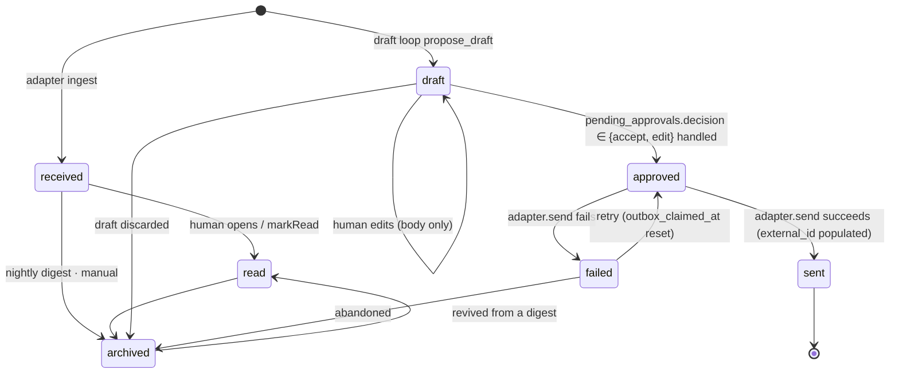

# A3 — Data Schema and Memory Tables

Version 1.0 (2026-09-20). Author: Fable. Parent document: `00-omnis-design.md` v1.0 (§6 Data Model, §7 Kernel, §10 Memory). The master wins on conflict. 0.95 = revision incorporating the global review (`99-review.md` §1.1·§3·§4), 1.0 = revision incorporating the pass 2 review (`99-review-v2.md` §2-5·§4-3).

Basis: `22` (Draft=Item status, HumanInterrupt/HumanResponse schema), `26` (mem0 OSS graph removal → Postgres entity tables required, nomic-embed 768d, pgvector HNSW 2,000d limit, deterministic identity matching), `10` (Graphiti 4-timestamp bi-temporal borrowed, mem0 TS `/oss` subpath), `27` (NOTIFY 8,000B·coalescing, 3-tier events, `idle_replication_slot_timeout`, volume estimates), `13` (Zero = server-authoritative sync that ends with Postgres alone).

## 0. Decisions This Appendix Fixes

| # | Decision | Basis | Condition that changes it |
|---|---|---|---|
| A3-D1 | The PK of every domain table is `uuid` + `gen_random_uuid()`. Only `events`/`audit_log` additionally carry a `bigint` sequence (`seq`) to guarantee ordering | The pinned version PG17 has no built-in `uuidv7()` (**UNVERIFIED — spike**: no basis in `research/`. Confirmed in Phase 0 by running `SELECT uuidv7()` once). Time ordering is sufficient with the `(at, id)` composite index | Upgrading to a major with built-in `uuidv7()` swaps only the default (no schema change, existing rows kept) |
| A3-D2 | Enums are not native `CREATE TYPE ... AS ENUM` but **`text` + a named `CHECK`** | Removing or reordering values is a type recreation with native enums, making migrations expensive. Zero's mapping of PG enum types has no basis in `13`/`27` (UNVERIFIED) | If Zero is confirmed to support enums as first-class and the value set stays stable for a year, promote to native enums |
| A3-D3 | All times are `timestamptz`, stored in UTC. Column names are `*_at`, and only the event occurrence time is `at` | — | None |
| A3-D4 | Channel secrets (`auth_ref`) live in a separate **`account_secrets` table**, not in `accounts`, and are excluded from the Zero publication | Rather than relying on column-level privileges, we block it at the table boundary (block it structurally, master D10) | None |
| A3-D5 | Append-only is enforced doubly: triggers + `REVOKE`. `audit_log` forbids UPDATE/DELETE permanently; `events` allows **only DELETE outside the rolloff window** | Master §6 "append-only", the cold tier in `27` | None |
| A3-D6 | `events` is not partitioned in v1. A nightly job DELETEs anything older than 90 days | `27` estimates at most 30,000 events/day → 2.7M rows over 90 days. Partitioning is over-engineering | If it exceeds 100,000/day or the DELETE exceeds 5 minutes, switch to monthly RANGE partitions |
| A3-D7 | `LISTEN/NOTIFY` is **exclusively for hub-internal fanout** (adapters, agent loops, the `local-agent` bridge). Client sync is done by Zero alone. The payload is the id only | `27`: the 8,000B limit + the official advice to "send only the key" | None |
| A3-D8 | What Zero replicates is the **whitelist** of `CREATE PUBLICATION`. A new table is not synced unless it is added explicitly | Structurally blocks the accident of `memories` (768d vectors) or `audit_log` being replicated to the phone | None |
| A3-D9 | Migrations are **plain SQL files + our own runner** (~70 lines, advisory lock) | No verified TS migration tool exists anywhere in the research. We do not invent a tool that does not exist | Revisit if the schema exceeds 30 files and rollback becomes genuinely necessary |
| A3-D10 | A draft is `items.status='draft'`. Duplicate sends are blocked with `outbox_claimed_at` + `idempotency_key` (no extra state value) | `22`: agentic-inbox works without a draft-only table. Master D15 | None |
| A3-D11 | `pending_approvals` splits into **two columns**: `state` (lifecycle) and `decision` (the human's choice). `decision` is 1:1 with `22`'s `HumanResponse.type` | `22` | None |
| A3-D12 | `public.memories` is an omnis-owned table, and mem0 OSS is used as a **custom VectorStore adapter** attached to this table (we do not let mem0 create its own tables) | `26`: mem0 is breaking enough that the graph was removed wholesale → we do not hand over ownership of the storage layer. `10`: mem0-ts has a `vector_stores/` interface | If mem0's VectorStore interface is not exported (spike S-A3-1), use mem0 only as an extraction-logic library and do upserts with direct SQL |
| A3-D13 | Identity resolution is deterministic key matching + manual merge. Merges are recorded in `person_merges` so they can be undone | `26` §5: at single-person scale, ML entity resolution is overkill | Revisit if unresolved matches pile up into the hundreds |
| A3-D14 | The ephemeral tier (token deltas, typing, reasoning chunks) is **stored in no table at all** | `27` §4-1, master §7 | None |

---

## 1. Conventions

- Scope: **PostgreSQL 17 pinned** (99-review §1.2 — matches A6's `@17`. A7's CI matrix is also 17), extensions `pgcrypto` (`gen_random_uuid`), `vector` (pgvector), `pg_trgm`.
- Schemas: all `public`. The `mem0` schema is used only on the fallback path where mem0 must create its own tables.
- Roles: `omnis_owner` (DDL·migrations), `omnis_hub` (hub process, DML), `omnis_sync` (zero-cache, `REPLICATION` + SELECT).
- **No FKs** on `events`/`audit_log`. The audit record must survive even if the source row is deleted. References are a plain `uuid` column + a `target_table` string.
- Text search: `to_tsvector('simple', ...)` GIN plus `pg_trgm` GIN in parallel. No Korean morphological analyzer in v1 (the single-user inbox search-quality gain is uncertain relative to the install cost — revisit `pg_bigm` if search actually fails to hit).

```sql
CREATE EXTENSION IF NOT EXISTS pgcrypto;
CREATE EXTENSION IF NOT EXISTS vector;
CREATE EXTENSION IF NOT EXISTS pg_trgm;
```

### 1.1 Value Sets (A3-D2: text + CHECK)

| Column | Allowed values |
|---|---|
| `accounts.channel` | `slack, gmail, outlook, gcal, telegram, whatsapp, kakaotalk, linkedin, agent, system` |
| `threads.kind` | `dm, group, email, agent_session, calendar, system` |
| `items.kind` | `message, email, event, agent_turn, tool_call, system` |
| `items.status` | `received, read, draft, approved, sent, failed, archived` |
| `items.scope` | `work, personal, unknown` |
| `items.sensitivity` | `normal, personal, finance, legal, health` (default `normal`. Anything other than `normal` = forced T2, master §14) |
| `labels.kind` | `scope, topic, priority, person` |
| `label_rules.tier` | `T0, T1` |
| `tasks.state` | `open, in_progress, blocked, done, dropped` |
| `tasks.kind` | `todo, followup, delegation` |
| `calendar_events.status` | `confirmed, tentative, cancelled` |
| `agent_runs.model_tier` | `T0, T1, T2, T3` (master §14) |
| `agent_runs.outcome` | `running, ok, failed, skipped, blocked` |
| `agent_runtimes.runtime` | `claude_code, codex, claude_ds, hermes, omnis` |
| `agent_sessions.state` | `starting, idle, running, waiting_approval, ended, failed` |
| `pending_approvals.action` | `send, delete, calendar_write, delegate, self_model_edit, memory_write` |
| `pending_approvals.state` | `pending, decided, executing, executed, failed, expired` |
| `pending_approvals.decision` | `accept, edit, respond, ignore` (`22`'s `HumanResponse.type`) |
| `memories.kind` | `fact, preference, commitment, event, summary` |
| `entities.type` | `person, org, project, commitment, decision, topic` |
| `digests.kind` | `morning, nightly` |
| `jobs.last_status` | `ok, failed, skipped` |

---

## 2. DDL — Channel and Inbox Core

```sql
CREATE TABLE accounts (
  id            uuid PRIMARY KEY DEFAULT gen_random_uuid(),
  channel       text NOT NULL,
  external_id   text NOT NULL,                 -- in-channel account identifier (Slack team+user, email address, etc.)
  display       text NOT NULL,
  capabilities  jsonb NOT NULL DEFAULT '{}'::jsonb,  -- {read,write,realtime,history,media,markRead,typing}
  state         text NOT NULL DEFAULT 'active',
  last_health_at timestamptz,
  last_error    text,
  created_at    timestamptz NOT NULL DEFAULT now(),
  CONSTRAINT accounts_channel_ck CHECK (channel IN
    ('slack','gmail','outlook','gcal','telegram','whatsapp','kakaotalk','linkedin','agent','system')),
  CONSTRAINT accounts_state_ck CHECK (state IN ('active','paused','broken')),
  CONSTRAINT accounts_uq UNIQUE (channel, external_id)
);

-- A3-D4: secrets live in a separate table. Never put them in the Zero publication.
CREATE TABLE account_secrets (
  account_id  uuid PRIMARY KEY REFERENCES accounts(id) ON DELETE CASCADE,
  auth_ref    text NOT NULL,                   -- Keychain item name (not the value).
                                               -- Naming convention is owned by A1: omnis.<channel>.<kind>.<external_id>
                                               -- (99-review §1.2 — A6-D9's omnis-slack-bot-token notation is corrected to this)
  scopes      text[] NOT NULL DEFAULT '{}',
  expires_at  timestamptz,
  rotated_at  timestamptz NOT NULL DEFAULT now()
);

CREATE TABLE threads (
  id            uuid PRIMARY KEY DEFAULT gen_random_uuid(),
  account_id    uuid NOT NULL REFERENCES accounts(id) ON DELETE RESTRICT,
  external_id   text NOT NULL,
  kind          text NOT NULL,
  title         text,
  scope         text NOT NULL DEFAULT 'unknown',
  participants  uuid[] NOT NULL DEFAULT '{}',  -- persons.id
  meta          jsonb NOT NULL DEFAULT '{}'::jsonb,  -- reserved key: meta.pending_next_step (A4 §7.3 folk determination cache)
  last_item_at  timestamptz,
  unread_count  integer NOT NULL DEFAULT 0,
  needs_action  boolean NOT NULL DEFAULT false,
  archived_at   timestamptz,
  muted_until   timestamptz,
  created_at    timestamptz NOT NULL DEFAULT now(),
  CONSTRAINT threads_kind_ck CHECK (kind IN ('dm','group','email','agent_session','calendar','system')),
  CONSTRAINT threads_scope_ck CHECK (scope IN ('work','personal','unknown')),
  CONSTRAINT threads_uq UNIQUE (account_id, external_id)
);

CREATE INDEX threads_inbox_idx ON threads (last_item_at DESC)
  WHERE archived_at IS NULL;
CREATE INDEX threads_scope_idx ON threads (scope, last_item_at DESC)
  WHERE archived_at IS NULL;
CREATE INDEX threads_participants_idx ON threads USING gin (participants);

CREATE TABLE items (
  id               uuid PRIMARY KEY DEFAULT gen_random_uuid(),
  thread_id        uuid NOT NULL REFERENCES threads(id) ON DELETE CASCADE,
  account_id       uuid NOT NULL REFERENCES accounts(id) ON DELETE RESTRICT,
  external_id      text,                        -- NULL for drafts (not yet in the channel)
  kind             text NOT NULL,
  status           text NOT NULL DEFAULT 'received',
  scope            text NOT NULL DEFAULT 'unknown',
  sensitivity      text NOT NULL DEFAULT 'normal',   -- A4 L1 is the sole producer (A4 §2.4, A4-D12)
  author_person_id uuid REFERENCES persons(id) ON DELETE SET NULL,
  author_agent_id  uuid REFERENCES agent_runtimes(id) ON DELETE SET NULL,
  author_is_me     boolean NOT NULL DEFAULT false,
  in_reply_to      uuid REFERENCES items(id) ON DELETE SET NULL,  -- `22`: draft ↔ source link
  subject          text,
  body             text NOT NULL DEFAULT '',
  body_html        text,
  attachments      jsonb NOT NULL DEFAULT '[]'::jsonb,
  tool             jsonb,                       -- {name,args,state,label,icon} when kind='tool_call'
  sent_at          timestamptz NOT NULL,
  received_at      timestamptz NOT NULL DEFAULT now(),
  source_hash      text,                        -- adapter idempotency key
  idempotency_key  text,                        -- send idempotency key (A3-D10)
  outbox_claimed_at timestamptz,                -- at-most-once claim by the send worker
  fail_reason      text,
  meta             jsonb NOT NULL DEFAULT '{}'::jsonb,  -- see "meta conventions" below. Absorbed draft_meta
  embedding        vector(768),                 -- nomic-embed-text-v1.5 (`26`). Input to A4 §2.2 kNN
  search_tsv       tsvector GENERATED ALWAYS AS
                     (to_tsvector('simple', coalesce(subject,'') || ' ' || coalesce(body,''))) STORED,
  CONSTRAINT items_kind_ck CHECK (kind IN ('message','email','event','agent_turn','tool_call','system')),
  CONSTRAINT items_status_ck CHECK (status IN
    ('received','read','draft','approved','sent','failed','archived')),
  CONSTRAINT items_scope_ck CHECK (scope IN ('work','personal','unknown')),
  CONSTRAINT items_sensitivity_ck CHECK (sensitivity IN
    ('normal','personal','finance','legal','health')),
  CONSTRAINT items_author_ck CHECK (num_nonnulls(author_person_id, author_agent_id) <= 1)
);

CREATE UNIQUE INDEX items_external_uq ON items (account_id, external_id)
  WHERE external_id IS NOT NULL;
CREATE UNIQUE INDEX items_source_hash_uq ON items (account_id, source_hash)
  WHERE source_hash IS NOT NULL;
CREATE UNIQUE INDEX items_idem_uq ON items (idempotency_key)
  WHERE idempotency_key IS NOT NULL;
CREATE INDEX items_thread_idx ON items (thread_id, sent_at DESC);
CREATE INDEX items_pending_idx ON items (status, sent_at DESC)
  WHERE status IN ('draft','approved','failed');
CREATE INDEX items_search_idx ON items USING gin (search_tsv);
CREATE INDEX items_body_trgm_idx ON items USING gin (body gin_trgm_ops);

-- Index only items that have an embedding. Most items are not embedded
-- (agent_turn, tool_call, system, and those the T0 batch has not yet run on).
CREATE INDEX items_embedding_idx ON items
  USING hnsw (embedding vector_cosine_ops)
  WITH (m = 16, ef_construction = 64)   -- Parameter basis: UNVERIFIED — spike (§14 S-A3-7)
  WHERE embedding IS NOT NULL;
```

Because `items` references `persons`/`agent_runtimes`, the actual migration creates those two tables first (§3, §4). The order above is for reading.

**`author` 3-column convention** — master §6 writes author as `person_id | agent_session_id | system`, but A3's implementation uses three columns: `author_person_id` (person) + `author_agent_id` (→ `agent_runtimes`) + `author_is_me` (distinguishes me from the system). Session identification is done through `items.thread_id`, not a separate column — since an agent session = a thread (master §9), the session a turn belongs to is uniquely determined by the thread, and there is no need to create the FK cycle `items → agent_sessions → threads → items`. A1·A2's `author` value set is aligned to these 3 columns (99-review §1.2).

**`items.meta` conventions** — `draft_meta` is dropped and folded into `meta` (we do not keep two redundant jsonb columns). Reserved keys:

| Key | Written by | Contents |
|---|---|---|
| `meta.draft` | A4 draft loop | `{model, tier, rationale, memory_ids[], confidence}` — exactly the old `draft_meta` contents |
| `meta.pending` | Kernel | When `true`, a placeholder draft (A4 §3's 60-second SLA). On completion the same row is replaced and the key is removed |

Tool-call payloads stay in the existing `tool` column, not in `meta`.

Non-reserved keys are free to use, but do not expect an index. If a lookup condition arises on `meta`, promote it to a column then.

### 2.1 Calendar Event Details

The inbox projection and the details are split. **`items(kind='event')` is the inbox projection** (what briefings, timelines, and Inbox rows read), and **`calendar_events` is the detail table** (attendees, recurrence, start and end times). A4 §7.1's follow-up trigger and §7.5's metrics reference this table.

```sql
CREATE TABLE calendar_events (
  id           uuid PRIMARY KEY DEFAULT gen_random_uuid(),
  item_id      uuid NOT NULL UNIQUE REFERENCES items(id) ON DELETE CASCADE,  -- join rule
  account_id   uuid NOT NULL REFERENCES accounts(id) ON DELETE RESTRICT,
  external_id  text NOT NULL,              -- Google/Graph event id
  start_at     timestamptz NOT NULL,
  end_at       timestamptz NOT NULL,
  all_day      boolean NOT NULL DEFAULT false,
  status       text NOT NULL DEFAULT 'confirmed',
  attendees    jsonb NOT NULL DEFAULT '[]'::jsonb,   -- [{email, display, response, person_id}]
  attendees_count integer GENERATED ALWAYS AS (jsonb_array_length(attendees)) STORED,
  location     text,
  recurrence   text,                       -- Raw RRULE. No expansion (the adapter supplies instances)
  updated_at   timestamptz NOT NULL DEFAULT now(),
  CONSTRAINT calendar_events_status_ck CHECK (status IN ('confirmed','tentative','cancelled')),
  CONSTRAINT calendar_events_uq UNIQUE (account_id, external_id),
  CONSTRAINT calendar_events_span_ck CHECK (end_at >= start_at)
);
CREATE INDEX calendar_events_start_idx ON calendar_events (start_at);
CREATE INDEX calendar_events_end_idx   ON calendar_events (end_at)
  WHERE status <> 'cancelled';
```

**Join rule**: 1 event = 1 `items` row (`kind='event'`, `thread_id` = `threads.kind='calendar'`) + exactly 1 `calendar_events` row. The adapter upserts both rows in the same transaction. `items.sent_at` gets `start_at` so inbox ordering follows the schedule time. The calendar screen, briefings, and follow-ups read `calendar_events`; the Inbox list and search read only `items`. Because `attendees_count` is a generated column, A4 §7.1's `attendees_count BETWEEN 1 AND 8` trigger works as-is.

---

## 3. DDL — People and Labels

```sql
CREATE TABLE persons (
  id                 uuid PRIMARY KEY DEFAULT gen_random_uuid(),
  display_name       text NOT NULL,
  org                text,
  role               text,
  relationship_state text NOT NULL DEFAULT 'unknown',
  vip                boolean NOT NULL DEFAULT false,
  notes              text,
  first_contact_at   timestamptz,          -- A4 §7.2 first-contact determination
  last_contact_at    timestamptz,
  next_followup_at   timestamptz,
  item_count         integer NOT NULL DEFAULT 0,   -- A4 §7.2 (absent or within 90 days AND item_count < 3 = first contact)
  primary_thread_id  uuid REFERENCES threads(id) ON DELETE SET NULL,  -- join target for the A4 §7.3 cadence query
  cadence_days       integer,              -- NULL means the relationship_state default (A4 §7.3)
  priority_score     real NOT NULL DEFAULT 0,      -- A4 §7.3 follow-up queue sort key
  merged_into        uuid REFERENCES persons(id) ON DELETE SET NULL,  -- tombstone
  created_at         timestamptz NOT NULL DEFAULT now(),
  CONSTRAINT persons_rel_ck CHECK (relationship_state IN
    ('unknown','new','warming','active','dormant','closed'))
);
CREATE INDEX persons_followup_idx ON persons (next_followup_at)
  WHERE merged_into IS NULL AND next_followup_at IS NOT NULL;
CREATE INDEX persons_name_trgm_idx ON persons USING gin (display_name gin_trgm_ops);
CREATE INDEX persons_cadence_idx ON persons (priority_score DESC)
  WHERE merged_into IS NULL AND relationship_state IN ('warming','active');

CREATE TABLE identities (
  id          uuid PRIMARY KEY DEFAULT gen_random_uuid(),
  person_id   uuid NOT NULL REFERENCES persons(id) ON DELETE CASCADE,
  channel     text NOT NULL,
  handle      text NOT NULL,              -- original notation
  handle_norm text NOT NULL,              -- normalization key (§9)
  display     text,
  verified    boolean NOT NULL DEFAULT false,
  source      text NOT NULL DEFAULT 'adapter',
  created_at  timestamptz NOT NULL DEFAULT now(),
  CONSTRAINT identities_source_ck CHECK (source IN ('adapter','manual','agent')),
  CONSTRAINT identities_uq UNIQUE (channel, handle_norm)
);
CREATE INDEX identities_person_idx ON identities (person_id);
```

Interpreting `cadence_days` (the value is owned by A4 §7.3; A3 only stores it): if a row's `cadence_days` is NULL, the per-`relationship_state` default is used (`active` 30 days, `warming` 21 days, `dormant` none). **`vip=true` overrides `relationship_state` and becomes 14 days** (99-review §4-14). Since `vip` is a separate boolean rather than an enum value, it is not enforced by CHECK; the query side resolves it with `COALESCE(p.cadence_days, CASE WHEN p.vip THEN 14 WHEN ... END)`.

```sql
CREATE TABLE person_merges (
  id             uuid PRIMARY KEY DEFAULT gen_random_uuid(),
  kind           text NOT NULL,                 -- 'merge' | 'split'
  from_person_id uuid NOT NULL,
  to_person_id   uuid NOT NULL,
  identity_ids   uuid[] NOT NULL DEFAULT '{}',  -- identities moved on split
  reason         text,
  at             timestamptz NOT NULL DEFAULT now(),
  CONSTRAINT person_merges_kind_ck CHECK (kind IN ('merge','split'))
);

CREATE TABLE labels (
  id         uuid PRIMARY KEY DEFAULT gen_random_uuid(),
  name       text NOT NULL,
  kind       text NOT NULL,
  color      text,
  rule       text,                          -- natural-language rule (Superhuman Auto Labels style)
  rule_model text,
  person_id  uuid REFERENCES persons(id) ON DELETE CASCADE,  -- kind='person'
  archived   boolean NOT NULL DEFAULT false,
  created_at timestamptz NOT NULL DEFAULT now(),
  CONSTRAINT labels_kind_ck CHECK (kind IN ('scope','topic','priority','person')),
  CONSTRAINT labels_uq UNIQUE (kind, name)
);

-- Natural-language label rules (A4 §2.3, Superhuman Auto Labels style). Folded the DDL A4 was holding into A3 and
-- aligned the text ↔ uuid mismatch of `id`/`label_id` to uuid (99-review §1.1).
CREATE TABLE label_rules (
  id             uuid PRIMARY KEY DEFAULT gen_random_uuid(),
  label_id       uuid NOT NULL REFERENCES labels(id) ON DELETE CASCADE,
  prompt         text NOT NULL,                    -- raw text the user wrote (SSOT)
  rule           jsonb NOT NULL DEFAULT '{}'::jsonb, -- compilation result, CompiledRule (A4 §2.3)
  rule_by        text,                             -- 'claude-sonnet-5' | 'user'
  rule_at        timestamptz,
  probe_embedding vector(768),                     -- CompiledRule.semantic embedding (A4 §2.3 kNN fallback)
  tier           text NOT NULL DEFAULT 'T0',
  positives      uuid[] NOT NULL DEFAULT '{}',     -- items.id
  negatives      uuid[] NOT NULL DEFAULT '{}',
  hits_30d       integer NOT NULL DEFAULT 0,
  corrections_30d integer NOT NULL DEFAULT 0,
  pinned_by_user boolean NOT NULL DEFAULT false,
  active         boolean NOT NULL DEFAULT true,
  created_at     timestamptz NOT NULL DEFAULT now(),
  updated_at     timestamptz NOT NULL DEFAULT now(),
  CONSTRAINT label_rules_tier_ck CHECK (tier IN ('T0','T1'))
);
CREATE INDEX label_rules_active_idx ON label_rules (label_id) WHERE active;

CREATE TABLE item_labels (
  item_id    uuid NOT NULL REFERENCES items(id) ON DELETE CASCADE,
  label_id   uuid NOT NULL REFERENCES labels(id) ON DELETE CASCADE,
  confidence real,
  by         text NOT NULL DEFAULT 'agent',   -- 'agent' | 'me' | 'rule'
  at         timestamptz NOT NULL DEFAULT now(),
  CONSTRAINT item_labels_by_ck CHECK (by IN ('agent','me','rule')),
  PRIMARY KEY (item_id, label_id)
);
CREATE INDEX item_labels_label_idx ON item_labels (label_id);

CREATE TABLE thread_labels (
  thread_id  uuid NOT NULL REFERENCES threads(id) ON DELETE CASCADE,
  label_id   uuid NOT NULL REFERENCES labels(id) ON DELETE CASCADE,
  confidence real,
  by         text NOT NULL DEFAULT 'agent',
  at         timestamptz NOT NULL DEFAULT now(),
  CONSTRAINT thread_labels_by_ck CHECK (by IN ('agent','me','rule')),
  PRIMARY KEY (thread_id, label_id)
);
CREATE INDEX thread_labels_label_idx ON thread_labels (label_id);
```

**Correspondence with A4 §2.3's notation** (A3 owns the schema, so A3's names win): A4's `compiled` → `rule`, `compiled_by` → `rule_by`, `compiled_at` → `rule_at`, `corrections` → `corrections_30d`. `positives`/`negatives` are `uuid[]` (items.id), not `text[]`.

---

## 4. DDL — Tasks, Agents, Approvals, Notes

```sql
CREATE TABLE agent_runtimes (
  id           uuid PRIMARY KEY DEFAULT gen_random_uuid(),
  runtime      text NOT NULL,
  host         text NOT NULL,                  -- 'mini' | 'macbook'
  display      text NOT NULL,
  capabilities jsonb NOT NULL DEFAULT '{}'::jsonb,   -- bridge self-description (master D5)
  version      text,
  state        text NOT NULL DEFAULT 'offline',
  last_seen_at timestamptz,
  created_at   timestamptz NOT NULL DEFAULT now(),
  CONSTRAINT agent_runtimes_runtime_ck CHECK (runtime IN
    ('claude_code','codex','claude_ds','hermes','omnis')),
  CONSTRAINT agent_runtimes_host_ck CHECK (host IN ('mini','macbook')),
  CONSTRAINT agent_runtimes_state_ck CHECK (state IN ('offline','online','degraded')),
  CONSTRAINT agent_runtimes_uq UNIQUE (runtime, host)
);

-- `omnis` is a valid runtime value but a special row with no bridge adapter (master §6, 99-review §4-8):
-- omnis's own L3 loop uses this row as the actor. There is no RuntimeAdapter and no local-agent registration.
-- The host is where the hub runs, and when the hub moves to the MacBook in Phase D we
-- UPDATE this row's host rather than creating a new row. The partial unique index below blocks a 2nd row structurally.
CREATE UNIQUE INDEX agent_runtimes_omnis_uq ON agent_runtimes (runtime)
  WHERE runtime = 'omnis';

INSERT INTO agent_runtimes (runtime, host, display, state)
  VALUES ('omnis', 'mini', 'omnis agents', 'online');

CREATE TABLE agent_sessions (
  id           uuid PRIMARY KEY DEFAULT gen_random_uuid(),
  runtime_id   uuid NOT NULL REFERENCES agent_runtimes(id) ON DELETE CASCADE,
  thread_id    uuid NOT NULL REFERENCES threads(id) ON DELETE CASCADE,  -- session = thread
  session_key  text NOT NULL,        -- stable scope (master D5)
  session_id   text,                 -- rotating transcript id
  cwd          text,
  state        text NOT NULL DEFAULT 'starting',
  summary      text,                 -- durable summary that read_session reads
  last_turn_at timestamptz,
  started_at   timestamptz NOT NULL DEFAULT now(),
  ended_at     timestamptz,
  CONSTRAINT agent_sessions_state_ck CHECK (state IN
    ('starting','idle','running','waiting_approval','ended','failed')),
  CONSTRAINT agent_sessions_uq UNIQUE (runtime_id, session_key)
);
CREATE INDEX agent_sessions_active_idx ON agent_sessions (last_turn_at DESC)
  WHERE ended_at IS NULL;

-- Single record of every L3 loop execution (A4-D16: the single source for evaluation, cost, and audit).
-- An execution not here is treated as not having existed — monthly cost (master §14 $60 cap),
-- per-loop quality metrics, and injection flags are all aggregations over this table.
CREATE TABLE agent_runs (
  id               uuid PRIMARY KEY DEFAULT gen_random_uuid(),
  loop             text NOT NULL,          -- 'classify' | 'draft' | 'task' | 'delegate' | 'digest' | 'followup' | 'note_route' | 'auto_archive' | 'ingest'
  agent_session_id uuid REFERENCES agent_sessions(id) ON DELETE SET NULL,
  item_id          uuid REFERENCES items(id) ON DELETE SET NULL,
  trigger_kind     text NOT NULL DEFAULT 'event',   -- 'event' | 'cron' | 'manual'
  trigger_ref      text,                   -- cron job name etc., a trigger other than an item
  model_tier       text NOT NULL,          -- T0|T1|T2|T3 (master §14)
  provider         text NOT NULL,          -- 'local' | 'deepseek' | 'anthropic' | 'openrouter'
  model            text NOT NULL,          -- 'nomic-embed-text-v1.5' | 'deepseek-v4.1-flash' | 'claude-sonnet-5' ...
  tokens_in        integer,
  tokens_out       integer,
  tokens_cached    integer,
  cost_usd         numeric(10,6),
  latency_ms       integer,
  outcome          text NOT NULL DEFAULT 'running',
  error            text,
  confidence       real,
  escalated_from   uuid REFERENCES agent_runs(id) ON DELETE SET NULL,  -- T1 → T2 escalation link
  injection_flags  text[] NOT NULL DEFAULT '{}',
  context_hash     text,                   -- sha256(cachedPrefix) — cache hit-rate tracking
  result_ref       uuid,                   -- artifact id (item/task/approval/digest). No FK: multiple target tables
  raw_output       text,                   -- retains schema-violating output (A4 §1.6)
  created_at       timestamptz NOT NULL DEFAULT now(),
  finished_at      timestamptz,
  CONSTRAINT agent_runs_tier_ck CHECK (model_tier IN ('T0','T1','T2','T3')),
  CONSTRAINT agent_runs_outcome_ck CHECK (outcome IN ('running','ok','failed','skipped','blocked'))
);
CREATE INDEX agent_runs_created_idx ON agent_runs (created_at DESC);
CREATE INDEX agent_runs_loop_idx    ON agent_runs (loop, created_at DESC);
CREATE INDEX agent_runs_item_idx    ON agent_runs (item_id) WHERE item_id IS NOT NULL;

CREATE TABLE tasks (
  id                  uuid PRIMARY KEY DEFAULT gen_random_uuid(),
  title               text NOT NULL,
  detail              text,
  kind                text NOT NULL DEFAULT 'todo',  -- A4 §7.3 Task routing
  state               text NOT NULL DEFAULT 'open',
  owner_kind          text NOT NULL DEFAULT 'me',   -- 'me' | 'agent'
  owner_runtime_id    uuid REFERENCES agent_runtimes(id) ON DELETE SET NULL,
  source_item_id      uuid REFERENCES items(id) ON DELETE SET NULL,
  person_id           uuid REFERENCES persons(id) ON DELETE SET NULL,
  delegated_session_id uuid REFERENCES agent_sessions(id) ON DELETE SET NULL,
  due_at              timestamptz,
  remind_at           timestamptz,
  done_at             timestamptz,
  created_at          timestamptz NOT NULL DEFAULT now(),
  created_by          text NOT NULL DEFAULT 'agent',
  CONSTRAINT tasks_kind_ck CHECK (kind IN ('todo','followup','delegation')),
  CONSTRAINT tasks_state_ck CHECK (state IN ('open','in_progress','blocked','done','dropped')),
  CONSTRAINT tasks_owner_ck CHECK (owner_kind IN ('me','agent'))
);
CREATE INDEX tasks_open_idx ON tasks (due_at NULLS LAST) WHERE state IN ('open','in_progress');
CREATE INDEX tasks_remind_idx ON tasks (remind_at) WHERE remind_at IS NOT NULL AND state <> 'done';

-- Ported verbatim from `22`'s HumanInterrupt / HumanResponse. A3-D11.
CREATE TABLE pending_approvals (
  id            uuid PRIMARY KEY DEFAULT gen_random_uuid(),
  action        text NOT NULL,
  args          jsonb NOT NULL,          -- ActionRequest.args (full text. The UI exposes it as-is)
  description   text NOT NULL,
  config        jsonb NOT NULL DEFAULT
                  '{"allow_accept":true,"allow_edit":true,"allow_respond":false,"allow_ignore":true}'::jsonb,
  state         text NOT NULL DEFAULT 'pending',
  decision      text,                    -- accept | edit | respond | ignore
  decided_args  jsonb,                   -- the human-edited result when edit/respond
  requested_by  uuid REFERENCES agent_runtimes(id) ON DELETE SET NULL,
  thread_id     uuid REFERENCES threads(id) ON DELETE SET NULL,
  item_id       uuid REFERENCES items(id) ON DELETE SET NULL,
  task_id       uuid REFERENCES tasks(id) ON DELETE SET NULL,
  risk          text NOT NULL DEFAULT 'normal',
  expires_at    timestamptz,
  created_at    timestamptz NOT NULL DEFAULT now(),
  decided_at    timestamptz,
  executed_at   timestamptz,
  fail_reason   text,
  CONSTRAINT approvals_action_ck CHECK (action IN
    ('send','delete','calendar_write','delegate','self_model_edit','memory_write')),
  CONSTRAINT approvals_state_ck CHECK (state IN
    ('pending','decided','executing','executed','failed','expired')),
  CONSTRAINT approvals_decision_ck CHECK (decision IS NULL OR decision IN
    ('accept','edit','respond','ignore')),
  CONSTRAINT approvals_risk_ck CHECK (risk IN ('normal','high')),
  CONSTRAINT approvals_decided_ck CHECK ((state = 'pending') = (decision IS NULL))
);
CREATE INDEX approvals_pending_idx ON pending_approvals (created_at DESC) WHERE state = 'pending';
CREATE INDEX approvals_thread_idx ON pending_approvals (thread_id, created_at DESC);

CREATE TABLE notes (
  id           uuid PRIMARY KEY DEFAULT gen_random_uuid(),
  body         text NOT NULL,
  routed_to_thread_id uuid REFERENCES threads(id) ON DELETE SET NULL,
  routed_to_person_id uuid REFERENCES persons(id) ON DELETE SET NULL,
  rationale    text,
  route_state  text NOT NULL DEFAULT 'proposed',
  created_at   timestamptz NOT NULL DEFAULT now(),
  CONSTRAINT notes_route_state_ck CHECK (route_state IN ('proposed','accepted','rejected','none'))
);

CREATE TABLE digests (
  id         uuid PRIMARY KEY DEFAULT gen_random_uuid(),
  kind       text NOT NULL,
  for_date   date NOT NULL,
  body       text NOT NULL,
  item_ids   uuid[] NOT NULL DEFAULT '{}',
  metrics    jsonb NOT NULL DEFAULT '{}'::jsonb,   -- coverage and cost metrics (master §2)
  created_at timestamptz NOT NULL DEFAULT now(),
  CONSTRAINT digests_kind_ck CHECK (kind IN ('morning','nightly')),
  CONSTRAINT digests_uq UNIQUE (kind, for_date)
);
```

**Correspondence with A4 §1.7's notation** (A3 wins): A4's `tier` → `model_tier`, `input_tokens` → `tokens_in`, `output_tokens` → `tokens_out`, `cached_input_tokens` → `tokens_cached`, `status` → `outcome`, `started_at` → `created_at`. The `provider` column did not exist in A4; A3 added it to separate gateway (OpenRouter) calls from direct calls in cost aggregation (master §14). A4's usage of packing an item_id into `trigger_ref` is promoted to the `item_id` column, and `trigger_ref` keeps only non-item triggers such as cron job names.

---

## 5. DDL — The 3-Tier Memory

```sql
-- L2-3 entities/relations. Graphiti 4-timestamp (`10`, `26`).
CREATE TABLE entities (
  id             uuid PRIMARY KEY DEFAULT gen_random_uuid(),
  type           text NOT NULL,
  name           text NOT NULL,
  person_id      uuid REFERENCES persons(id) ON DELETE SET NULL,
  attributes     jsonb NOT NULL DEFAULT '{}'::jsonb,
  valid_from     timestamptz NOT NULL DEFAULT now(),
  valid_until    timestamptz,
  recorded_at    timestamptz NOT NULL DEFAULT now(),
  invalidated_at timestamptz,
  CONSTRAINT entities_type_ck CHECK (type IN
    ('person','org','project','commitment','decision','topic'))
);
CREATE UNIQUE INDEX entities_live_uq ON entities (type, lower(name))
  WHERE invalidated_at IS NULL;

CREATE TABLE relations (
  id             uuid PRIMARY KEY DEFAULT gen_random_uuid(),
  from_entity_id uuid NOT NULL REFERENCES entities(id) ON DELETE CASCADE,
  to_entity_id   uuid NOT NULL REFERENCES entities(id) ON DELETE CASCADE,
  type           text NOT NULL,           -- works_at, introduced_by, owns, promised_to, decided_on ...
  attributes     jsonb NOT NULL DEFAULT '{}'::jsonb,
  source_item_id uuid REFERENCES items(id) ON DELETE SET NULL,
  confidence     real NOT NULL DEFAULT 0.5,
  valid_from     timestamptz NOT NULL,     -- when the fact became valid
  valid_until    timestamptz,              -- when the fact became invalid
  recorded_at    timestamptz NOT NULL DEFAULT now(),   -- when the system learned of it
  invalidated_at timestamptz               -- when the system learned it is "no longer true"
);
CREATE INDEX relations_from_idx ON relations (from_entity_id, type, valid_from DESC);
CREATE INDEX relations_to_idx   ON relations (to_entity_id, type, valid_from DESC);
CREATE INDEX relations_asof_idx ON relations (valid_from, valid_until);

-- L2-2 vector memory. nomic-embed-text-v1.5 = 768d (`26`), inside the HNSW 2,000d limit.
CREATE TABLE memories (
  id             uuid PRIMARY KEY DEFAULT gen_random_uuid(),
  content        text NOT NULL,
  embedding      vector(768),
  kind           text NOT NULL DEFAULT 'fact',
  scope          text NOT NULL DEFAULT 'unknown',
  source_item_id uuid REFERENCES items(id) ON DELETE SET NULL,
  source_kind    text NOT NULL DEFAULT 'inbox',  -- inbox|calendar|file|drive|github|self
  source_ref     text,                            -- file path, Drive fileId, GitHub URL, etc.
  person_id      uuid REFERENCES persons(id) ON DELETE SET NULL,
  entity_id      uuid REFERENCES entities(id) ON DELETE SET NULL,
  confidence     real NOT NULL DEFAULT 0.5,
  valid_from     timestamptz NOT NULL DEFAULT now(),
  valid_until    timestamptz,
  recorded_at    timestamptz NOT NULL DEFAULT now(),
  invalidated_at timestamptz,
  superseded_by  uuid REFERENCES memories(id) ON DELETE SET NULL,
  CONSTRAINT memories_kind_ck CHECK (kind IN ('fact','preference','commitment','event','summary')),
  CONSTRAINT memories_scope_ck CHECK (scope IN ('work','personal','unknown'))
);

-- Index only currently valid memories. Invalidated rows are not search targets.
CREATE INDEX memories_embedding_idx ON memories
  USING hnsw (embedding vector_cosine_ops)
  WITH (m = 16, ef_construction = 64)   -- Parameter basis: UNVERIFIED — spike (§14 S-A3-7)
  WHERE invalidated_at IS NULL;
CREATE INDEX memories_person_idx ON memories (person_id, recorded_at DESC);
CREATE INDEX memories_source_idx ON memories (source_kind, source_ref);
CREATE INDEX memories_valid_idx ON memories (valid_from DESC) WHERE invalidated_at IS NULL;
```

**3 tiers ↔ table correspondence**

| Tier (master §10) | Store | Notes |
|---|---|---|
| Self-model files | `~/.omnis/memory/USER.md`, `VOICE.md`, `PROJECTS.md` + git | **No table.** An agent's proposed edit enters only via `pending_approvals(action='self_model_edit', args={file,patch})` |
| Vector memory | `memories` (768d HNSW) | mem0 attaches to this table via the A3-D12 custom VectorStore |
| Entity memory | `entities`, `relations`, `persons`, `identities` | Relation traversal exists nowhere else — mem0 OSS removed the graph (`26`) |

---

## 6. DDL — Kernel Tables

```sql
CREATE TABLE events (
  seq     bigint GENERATED ALWAYS AS IDENTITY PRIMARY KEY,
  kind    text NOT NULL,                 -- 'item.created', 'approval.decided', 'job.run', 'adapter.error' ...
  actor   text NOT NULL DEFAULT 'system',
  target_table text,
  target_id    uuid,
  payload jsonb NOT NULL DEFAULT '{}'::jsonb,
  at      timestamptz NOT NULL DEFAULT now()
);
CREATE INDEX events_at_idx ON events (at DESC);
CREATE INDEX events_kind_idx ON events (kind, at DESC);
CREATE INDEX events_target_idx ON events (target_id, at DESC) WHERE target_id IS NOT NULL;

CREATE TABLE audit_log (
  seq          bigint GENERATED ALWAYS AS IDENTITY PRIMARY KEY,
  actor        text NOT NULL,            -- 'me' | 'agent:<runtime>' | 'system'
  action       text NOT NULL,
  target_table text NOT NULL,
  target_id    uuid,
  before       jsonb,
  after        jsonb,
  approval_id  uuid,                     -- No FK (deliberate). Egress must always leave a record here
  at           timestamptz NOT NULL DEFAULT now()
);
CREATE INDEX audit_log_at_idx ON audit_log (at DESC);
CREATE INDEX audit_log_action_idx ON audit_log (action, at DESC);

CREATE TABLE jobs (
  id           uuid PRIMARY KEY DEFAULT gen_random_uuid(),
  name         text NOT NULL UNIQUE,
  schedule     text NOT NULL,            -- 5-field cron, TZ=Asia/Seoul
  payload      jsonb NOT NULL DEFAULT '{}'::jsonb,
  enabled      boolean NOT NULL DEFAULT true,
  next_run_at  timestamptz NOT NULL,
  claimed_at   timestamptz,              -- at-most-once claim
  last_run_at  timestamptz,
  last_status  text,
  last_error   text,
  CONSTRAINT jobs_status_ck CHECK (last_status IS NULL OR last_status IN ('ok','failed','skipped'))
);
CREATE INDEX jobs_due_idx ON jobs (next_run_at) WHERE enabled AND claimed_at IS NULL;

-- Schedule ownership split (99-review v2 §2-5):
--   The canonical cron for L3~L9 loop jobs is the **A4 §6.1 table**. A3 only seeds those values; if a time changes, A4 is fixed first.
--   The owner of adapter and kernel infrastructure jobs (token refresh, subscription renewal, polling, rolloff, slot health, outbox claim release)
--   is **A3**. The A4 §6.1 table carries only A4-owned entries.
INSERT INTO jobs (name, schedule, next_run_at) VALUES
  -- A4-owned (canonical: A4 §6.1)
  ('morning_digest',        '30 6 * * *',   now()),   -- L5 morning briefing 06:30 KST
  ('nightly_digest',        '0 23 * * *',   now()),   -- L5 nightly digest 23:00 KST
  ('memory_consolidate',    '30 23 * * *',  now()),   -- nightly memory consolidation. 23:00 is taken by nightly_digest
  ('auto_archive_sweep',    '0 22 * * *',   now()),   -- L8 auto-archive. Runs earlier so the 23:00 digest can include it
  ('task_remind',           '0 9,14,19 * * *', now()),-- L3 reminders
  ('network_inactive_sweep','0 10 * * 1-5', now()),   -- L6 inactivity detection (weekdays 10:00). A different job from `followup_sweep`
  ('self_model_weekly',     '0 21 * * 0',   now()),   -- self-model proposals (Sun 21:00)
  ('eval_weekly',           '0 22 * * 0',   now()),   -- evaluation harness (Sun 22:00)
  ('drive_poll',            '*/10 * * * *', now()),   -- L9 ingestion. `26`: changes.list polling
  ('github_poll',           '*/15 * * * *', now()),   -- L9 ingestion. `26`: ETag conditional request
  -- A3-owned (infrastructure)
  ('followup_sweep',        '0 * * * *',    now()),   -- outbox claim release
  ('token_refresh',         '*/30 * * * *', now()),
  ('gmail_rewatch',         '0 3 * * *',    now()),   -- watch expires in 7 days → renew daily
  ('graph_sub_renew',       '0 4 * * 1',    now()),   -- Outlook subscription 10,080 minutes
  ('events_rolloff',        '15 4 * * *',   now()),
  ('slot_health',           '*/5 * * * *',  now());   -- `27`: WAL slot health
```

`drive_poll` and `github_poll` also appear in the A4 §6.1 table, so they are classified as A4-owned (to change the interval, fix A4 §10.1 first).

### 6.1 Append-Only Enforcement (A3-D5)

```sql
CREATE OR REPLACE FUNCTION omnis_append_only() RETURNS trigger
LANGUAGE plpgsql AS $fn$
BEGIN
  IF TG_OP = 'UPDATE' THEN
    RAISE EXCEPTION 'append-only: UPDATE on % is forbidden', TG_TABLE_NAME
      USING ERRCODE = '42501';
  END IF;
  IF TG_OP = 'DELETE' THEN
    -- audit_log can never be deleted. events are allowed only outside the rolloff window.
    IF TG_TABLE_NAME = 'audit_log'
       OR OLD.at > now() - (current_setting('omnis.events_retention', true))::interval THEN
      RAISE EXCEPTION 'append-only: DELETE on % is forbidden (retention window)', TG_TABLE_NAME
        USING ERRCODE = '42501';
    END IF;
  END IF;
  RETURN OLD;
END
$fn$;

CREATE OR REPLACE FUNCTION omnis_no_truncate() RETURNS trigger
LANGUAGE plpgsql AS $fn$
BEGIN
  RAISE EXCEPTION 'append-only: TRUNCATE on % is forbidden', TG_TABLE_NAME
    USING ERRCODE = '42501';
END
$fn$;

CREATE TRIGGER events_append_only   BEFORE UPDATE OR DELETE ON events
  FOR EACH ROW EXECUTE FUNCTION omnis_append_only();
CREATE TRIGGER audit_append_only    BEFORE UPDATE OR DELETE ON audit_log
  FOR EACH ROW EXECUTE FUNCTION omnis_append_only();
CREATE TRIGGER events_no_truncate   BEFORE TRUNCATE ON events
  FOR EACH STATEMENT EXECUTE FUNCTION omnis_no_truncate();
CREATE TRIGGER audit_no_truncate    BEFORE TRUNCATE ON audit_log
  FOR EACH STATEMENT EXECUTE FUNCTION omnis_no_truncate();

-- Second line of defense: take the privilege itself away from the hub role.
ALTER DATABASE omnis SET omnis.events_retention = '90 days';
REVOKE UPDATE, DELETE, TRUNCATE ON events, audit_log FROM omnis_hub;
GRANT  DELETE ON events TO omnis_owner;   -- rolloff only via the SECURITY DEFINER function below
```

Because `ALTER DATABASE ... SET` pins the default, `current_setting(..., true)` never returns NULL. Should it somehow be NULL, the comparison becomes NULL, the `IF` is false, and the DELETE would pass — so the rolloff function itself checks whether the retention value is empty before running and raises if it is (first block of the DDL below).

### 6.1.1 `events_rolloff` Privileges (99-review §4-2)

The hub process connects to the DB as the `omnis_hub` role (§1 conventions) and that role has no DELETE on `events`. If the hub held a separate `omnis_owner` connection just for this one job, the structural guarantee that "the hub cannot DELETE" would collapse. So **rolloff is possible only through a single `SECURITY DEFINER` function owned by `omnis_owner`, and `omnis_hub` has only EXECUTE on that function.** The hub can call `SELECT omnis_events_rolloff()`; an arbitrary `DELETE FROM events` is still a permission error.

```sql
CREATE OR REPLACE FUNCTION omnis_events_rolloff()
RETURNS TABLE (cutoff timestamptz, deleted bigint)
LANGUAGE plpgsql
SECURITY DEFINER
SET search_path = public, pg_temp
AS $fn$
DECLARE
  retention text := current_setting('omnis.events_retention', true);
  cut       timestamptz;
  n         bigint;
BEGIN
  IF retention IS NULL OR retention = '' THEN
    RAISE EXCEPTION 'omnis.events_retention is not set — refusing to roll off';
  END IF;
  cut := now() - retention::interval;
  -- The dump (§11) is finished by the hub before the call. This function only deletes.
  DELETE FROM events WHERE at <= cut;
  GET DIAGNOSTICS n = ROW_COUNT;
  INSERT INTO audit_log (actor, action, target_table, after)
    VALUES ('system', 'events.rolloff', 'events',
            json_build_object('cutoff', cut, 'deleted', n)::jsonb);
  RETURN QUERY SELECT cut, n;
END
$fn$;

ALTER FUNCTION omnis_events_rolloff() OWNER TO omnis_owner;
REVOKE ALL   ON FUNCTION omnis_events_rolloff() FROM PUBLIC;
GRANT  EXECUTE ON FUNCTION omnis_events_rolloff() TO omnis_hub;
```

Pinning `SET search_path` on the function is basic `SECURITY DEFINER` hygiene — it blocks the path where a caller changes search_path to point at a different `events`. What `omnis_hub` gains is **one action**, "delete events older than 90 days", not DELETE privilege (master D10: block it structurally). The `events_rolloff` job calls only this function, and the function itself records the result in `audit_log`.

### 6.2 NOTIFY Channels (A3-D7)

The payload is **the id only**. This follows `27`'s 8,000B limit and its recommendation to "send only the key, not large data in the payload". Postgres coalesces identical channel and identical payload within the same transaction, so in batch ingest it goes out only once per thread (intended behavior).

| Channel | Payload | Consumer |
|---|---|---|
| `omnis_item` | `{"id":"<uuid>","thread_id":"<uuid>","op":"insert"\|"update"}` | classification loop, draft loop, hub WS fanout |
| `omnis_thread` | `{"id":"<uuid>","op":"insert"\|"update"}` | inbox view fanout |
| `omnis_approval` | `{"id":"<uuid>","state":"pending"\|"decided"}` | approval executor, push notifier |
| `omnis_task` | `{"id":"<uuid>","op":"insert"\|"update"}` | reminders |
| `omnis_session` | `{"id":"<uuid>","runtime":"codex","state":"running"}` | `local-agent` bridge |
| `omnis_job` | `{"id":"<uuid>","name":"morning_digest"}` | scheduler worker |
| `omnis_control` | `{"kill_switch":true}` | all autonomous loops (master §7) |

```sql
CREATE OR REPLACE FUNCTION omnis_notify_item() RETURNS trigger
LANGUAGE plpgsql AS $fn$
BEGIN
  PERFORM pg_notify('omnis_item', json_build_object(
    'id', NEW.id, 'thread_id', NEW.thread_id,
    'op', CASE WHEN TG_OP = 'INSERT' THEN 'insert' ELSE 'update' END)::text);
  RETURN NULL;
END
$fn$;

CREATE TRIGGER items_notify AFTER INSERT OR UPDATE ON items
  FOR EACH ROW EXECUTE FUNCTION omnis_notify_item();
```

Triggers of the same shape are attached to `threads`, `pending_approvals`, `tasks`, and `agent_sessions`. **Ephemeral deltas do not ride NOTIFY** — they flow only through the hub's WS fanout and are stored nowhere (A3-D14, `27` §4-1).

---

## 7. Zero Sync Scope (A3-D8)

```sql
CREATE PUBLICATION zero_omnis FOR TABLE
  accounts, threads, calendar_events, persons, identities,
  labels, label_rules, item_labels, thread_labels,
  tasks, agent_runtimes, agent_sessions,
  pending_approvals, notes, digests,
  -- Narrow only items to a column list: we do not drag the 768d embedding and generated column down to the phone.
  items (id, thread_id, account_id, external_id, kind, status, scope, sensitivity,
         author_person_id, author_agent_id, author_is_me, in_reply_to,
         subject, body, body_html, attachments, tool, sent_at, received_at,
         source_hash, idempotency_key, outbox_claimed_at, fail_reason, meta);
```

**Include/exclude decisions for new columns**

| Column | Zero replication | Why |
|---|---|---|
| `items.sensitivity` | **Include** | The UI must draw the sensitivity badge and the "this thread is T2-only" indicator (A5). The value is one short text |
| `items.meta` | **Include** | The phone must read `meta.pending` (placeholder while the draft is being prepared) as-is (A4 §3's 60-second SLA UX) |
| `items.embedding` | **Exclude** | 768 × 4B = 3KB/row. At 2,000 rows/day that is pushing 6MB a day to the phone, and the client has no use for it (kNN is server-side). Hub API only |
| `items.search_tsv` | **Exclude** | Generated column. Not a replication target, and client search uses the hub API |
| `threads.meta` | **Include** | `meta.pending_next_step` is what the Network screen badge is based on (A4 §7.3) |
| `calendar_events` | **Include** | The Today screen draws today's schedule offline. `attendees_count` is a generated column so it drops out of replication automatically |
| `label_rules` | **Include** | Rules are viewed and toggled in Settings. However `probe_embedding` is excluded for the same reason as `items.embedding` |
| `agent_runs` | **Exclude** | Cost and audit aggregation is server-side. The monthly report is already replicated via `digests.metrics` |

`label_rules` also needs a column list (excluding `probe_embedding`). The DDL above expands only `items` for readability; the real `0008_publication.sql` lists columns for `label_rules` the same way.

**Excluded tables**: `account_secrets` (secrets), `events` (cold tier), `audit_log` (audit), `agent_runs` (cost and audit), `memories` (768d × many rows — no reason to replicate to the phone), `entities`, `relations` (server queries), `person_merges`, `jobs`. Excluded tables are queried on demand via the hub API (`GET /memory/search`, `GET /transcript/:session_id`).

WAL safeguard (`27`): the **owner of the GUC `idle_replication_slot_timeout` is A6** (`postgresql.conf` territory, 99-review §1.2). A3 does not set the value, only cites it — **A6-D4's `'3d'`**. The `slot_health` job checks `pg_replication_slots.active` and the `pg_wal` size every 5 minutes and raises an ntfy alert when a threshold is exceeded. With the default of 0 (disabled), WAL fills the disk when zero-cache dies.

**Zero auth (US-A21b, implementation confirmed 2026-09-20)**

Permission rules have no effect by declaration alone. They must be deployed upstream with
`zero-deploy-permissions`, and with nothing deployed zero-cache starts with "no tables will be
syncable", so **queries resolve but return 0 rows** (the symptom US-A22 saw). So the order is
`pnpm db:migrate` → `pnpm zero:deploy-permissions` → start zero-cache, and if the schema or
`OMNIS_USER_ID` changes, deploy again.

Auth is symmetric-key HS256 tailored to a single-user hub:

- The hub's `GET /api/zero-token` signs `{ sub: OMNIS_USER_ID (default `logan`), exp: now+7d }`
  with `ZERO_AUTH_SECRET` and returns it. Same boundary as other hub routes (127.0.0.1 bind), and
  it is a 503 if the secret is empty.
- zero-cache verifies with the same `ZERO_AUTH_SECRET`. **If the JWT `sub` differs from the Zero
  client's `userID`, it rejects the token itself** (`JWTClaimValidationFailed: unexpected "sub" claim
  value`) — the desktop uses the token's `sub` directly as `userID`.
- The desktop fetches the token at boot (`main.tsx`) and passes it to the `Zero` constructor. The
  late-auth path (`connection.connect({auth})`) does not re-run already-hydrated queries, so the
  first screen is left blank (confirmed 2026-09-20).

**Client permission rules overview** (Zero permission DSL, declared in the TS-side schema files):

- Read on all tables: allowed (single user = single tenant).
- `items`: the allowed insert/update scope is `status ∈ {draft, read, archived}` and the `body`/`subject` columns only. Changing `status` to `approved`/`sent` is **rejected** — only the approval handler (server) performs that transition.
- `pending_approvals`: only `decision`, `decided_args`, and the transition to `state='decided'`. `state='executed'` is server-only.
- `tasks`, `notes`, `labels`, `item_labels`, `thread_labels`, `threads.archived_at`/`muted_until`: free write.
- `label_rules`: only `prompt`, `active`, `pinned_by_user` are writable (recompiling `rule`/`probe_embedding` is server-side).
- `accounts`, `agent_runtimes`, `agent_sessions`, `digests`, `calendar_events`: read-only.
- A write-prohibition violation is rejected by Zero on the server and the client's optimistic update is rolled back (server-authoritative, `13`).

> **Phase A deviation (US-A21b)**: the write rule list above is the target from Phase B onward. The
> Phase A desktop is read-only and all writes go through hub HTTP (contract §5), so what is actually
> declared is **only `row.select` on every replicated table** — `insert`/`update`/`delete` are not
> granted at all, and Zero rejects them on the server. Cell-level write rules are written together
> with the custom mutators when those are introduced.

---

## 8. Migrations (A3-D9)

**The canonical path is `packages/db/migrations/000N_<name>.sql` and the tracking table is `_omnis_migrations`** (99-review §1.2 — since A3 owns the schema, A7's `schema_migrations`·`0001_core.sql` notation is corrected to this. A7 US-A02~A04 copies the 8-file split below verbatim). Four-digit integers, consecutive, no rollback (forward-only). One file = one transaction. If `CREATE INDEX CONCURRENTLY` is needed, append `.noxact.sql` to the filename and the runner executes it outside a transaction.

**File split — this list is the complete list of v1 tables.**

| File | Creates |
|---|---|
| `0001_extensions.sql` | `pgcrypto`, `vector`, `pg_trgm`. Creates the roles (`omnis_owner`, `omnis_hub`, `omnis_sync`) |
| `0002_core_inbox.sql` | `accounts`, `account_secrets`, `persons`, `identities`, `person_merges`, `agent_runtimes` (+ single `omnis` row seed), `threads`, `items` (+ partial HNSW), `calendar_events` |
| `0003_labels.sql` | `labels`, `label_rules`, `item_labels`, `thread_labels` |
| `0004_tasks_approvals.sql` | `agent_sessions`, `agent_runs`, `tasks`, `pending_approvals`, `notes`, `digests` |
| `0005_memory.sql` | `entities`, `relations`, `memories` + HNSW |
| `0006_kernel.sql` | `events`, `audit_log`, `jobs` (+ seed) + append-only triggers + the `omnis_events_rolloff()` function and GRANTs |
| `0007_notify.sql` | NOTIFY functions and triggers (§6.2) |
| `0008_publication.sql` | `CREATE PUBLICATION zero_omnis` (including column lists, §7) |

```
packages/db/migrations/
  0001_extensions.sql
  0002_core_inbox.sql
  0003_labels.sql
  0004_tasks_approvals.sql
  0005_memory.sql
  0006_kernel.sql
  0007_notify.sql
  0008_publication.sql
```

`person_merges` references only `persons`, so it goes in `0002`; `calendar_events` references `items`, so it comes at the end of the same `0002`. **A7 US-A02 copies the 9 tables from the table above (including `calendar_events` and `person_merges`) verbatim as the output of `0002_core_inbox.sql`** (99-review v2 §4-3). `calendar_events`'s DDL is in §2.1, so the exclusion reason "not defined in A3" does not hold. `agent_runs` references both `agent_sessions` and `items`, so it goes in `0004`.

runner (`packages/db/migrate.ts`, ~70 lines):

```ts
import { readdir, readFile } from "node:fs/promises";
import { Client } from "pg";

const LOCK = 8_931_447; // omnis migration advisory lock

const c = new Client({ connectionString: process.env.OMNIS_DB_URL });
await c.connect();
await c.query(`CREATE TABLE IF NOT EXISTS _omnis_migrations (
  name text PRIMARY KEY, sha text NOT NULL, applied_at timestamptz NOT NULL DEFAULT now())`);
await c.query("SELECT pg_advisory_lock($1)", [LOCK]);
try {
  const done = new Map<string, string>(
    (await c.query("SELECT name, sha FROM _omnis_migrations")).rows.map(r => [r.name, r.sha]));
  const files = (await readdir("packages/db/migrations")).filter(f => f.endsWith(".sql")).sort();
  for (const f of files) {
    const sql = await readFile(`packages/db/migrations/${f}`, "utf8");
    const sha = Buffer.from(await crypto.subtle.digest("SHA-256", Buffer.from(sql))).toString("hex");
    const prev = done.get(f);
    if (prev === sha) continue;
    if (prev) throw new Error(`migration ${f} changed after apply (${prev} -> ${sha})`);
    const inTx = !f.endsWith(".noxact.sql");
    if (inTx) await c.query("BEGIN");
    try {
      await c.query(sql);
      await c.query("INSERT INTO _omnis_migrations (name, sha) VALUES ($1, $2)", [f, sha]);
      if (inTx) await c.query("COMMIT");
      console.log("applied", f);
    } catch (e) { if (inTx) await c.query("ROLLBACK"); throw e; }
  }
} finally {
  await c.query("SELECT pg_advisory_unlock($1)", [LOCK]);
  await c.end();
}
```

Verification: `pnpm db:migrate && pnpm db:migrate` (two consecutive runs are a no-op) + an error when an already-applied file is modified. That is the entire test suite for this runner.

---

## 9. Draft State Transitions (A3-D10)



Rules:

1. The `draft → approved` transition is performed **only by the approval handler**. The agent tool palette has no such transition (master §11), and Zero client permissions block it too (§7).
2. The send worker claims with `UPDATE items SET outbox_claimed_at = now() WHERE id = $1 AND status='approved' AND outbox_claimed_at IS NULL RETURNING *`. If it is 0 rows, another worker already took it and it simply exits.
3. `idempotency_key = sha256(thread_id || in_reply_to || body)`. Even if the adapter retries the send, a channel-side duplicate is detected with this key (if the adapter does not support keys, duplicates are checked via `sent_at` ±60 seconds + identical body — A1's territory).
4. If `outbox_claimed_at` remains set for more than 5 minutes in `approved` state, it is treated as a crash and the `followup_sweep` job releases the claim.
5. Every `→ sent` transition is recorded in `audit_log` with `action='item.sent'` and the `approval_id`. A send without approval cannot exist, and if one does, master §2's "zero external sends without approval" metric is broken — a nightly job counts `sent but no approval_id` and alerts if it is not 0.

---

## 10. Person Identity Resolution (A3-D13)

**Normalization key** `handle_norm`: a deterministic per-channel transformation. Matching uses this alone (`26` §5).

| channel | handle_norm |
|---|---|
| `gmail`, `outlook` | lowercase; for Gmail, strip the `+tag` and the `.` |
| `telegram`, `whatsapp` | E.164 normalization (`+8210...`) |
| `slack` | `<team_id>:<user_id>` (not the display name) |
| `kakaotalk` | `kt:` + the first 32 chars of `encode(sha256(lower(btrim(display_name)) ‖ 0x1f ‖ room_external_id), 'hex')` — **unstable**, always created with `verified=false` |
| `linkedin` | only the `/in/<slug>` part of the profile URL |
| `gcal` | attendee email (= gmail rules) |

Why the KakaoTalk rule is a hash: what kmsg (macOS AX) provides is only the display name and the room, and there is no stable user id (A1). Using the display name as the key verbatim means a person who renames becomes a new person, and a different person with the same name gets merged into one person. Mixing in the room narrows the scope to "this name in this room", reducing the latter accident. The former still remains, so a KakaoTalk identity is `verified=false`, and merges are done by a human in the Network UI (§10 merges). `0x1f` is the separator (Unit Separator) and `room_external_id` is `threads.external_id` — this document, not the adapter, fixes both. The implementation must be deterministic and a reproduction test is included in the contract tests.

**Resolution algorithm** (when the adapter normalizes an item):

1. Look up `identities(channel, handle_norm)` → if present, that `person_id`. If `persons.merged_into` is populated, follow it to the end (chain depth is flattened on merge, so at most 1).
2. If absent, **cross-channel deterministic matching**: if there is an email and an email identity on another channel has the same `handle_norm`, attach to that person.
3. If still absent, create a new `persons` + `identities` with `verified=false`.
4. No speculative matching. Do not attach on the grounds that the display names match.

**Merge**: the Network UI's "same person" button → in one transaction, (a) `UPDATE identities SET person_id = $to WHERE person_id = $from`, (b) `UPDATE persons SET merged_into = $to WHERE id = $from`, (c) `UPDATE items SET author_person_id = $to WHERE author_person_id = $from`, (d) `INSERT INTO person_merges(kind='merge', ...)`, (e) `audit_log`. `$from` is not deleted — it remains as a tombstone so the merge can be undone.

**Split**: pick a wrongly attached identity, revert its `person_id` to a new person (or the original tombstone person), and leave a `person_merges(kind='split', identity_ids=...)` record. Reassigning `items.author_person_id` is done **based on the threads where that identity appears** — find that channel's thread via `identities.handle_norm` and move only those items in that thread with `author_person_id = $from` to the new person. If two merged people both appear in one thread, automatic reassignment is impossible, so the item's `author_person_id` is left NULL and exposed in the Network UI as "needs reassignment".

---

## 11. Retention and Cleanup Policy

| Data | Policy |
|---|---|
| ephemeral (token deltas, typing, reasoning chunks) | **Not stored.** WS fanout only. Discarded when nobody is watching the session (`27` §4-1) |
| `events` | Deleted by the `events_rolloff` job after 90 days (A3-D6). Before deletion that range is dumped to `~/.omnis/cold/events-YYYY-MM.jsonl.zst` and included in the restic backup |
| `audit_log` | Retained permanently. No deletion path |
| `items` | Retained permanently. `archived_at` is only a view filter, not a deletion |
| `items.body_html`, `attachments` | After 180 days the body HTML is set to NULL and attachment blobs are demoted to local files with only the path kept (disk savings). The plain-text `body` is kept |
| `memories` | Invalidated via `invalidated_at` rather than deleted. The partial HNSW index excludes them automatically |
| `relations` | Same. Only `valid_until`/`invalidated_at` are filled — the essence of bi-temporal is not deleting |
| `pending_approvals` | `state='expired'` once `expires_at` passes. The row remains |
| `agent_sessions.summary` | Kept. The raw transcript lives only in the cold tier (files) |
| `agent_runs` | Retained permanently (single source for cost and evaluation, A4-D16). However `raw_output` becomes NULL after 90 days — parse-failure text is useless once the prompt is fixed and it contains inbox bodies |
| `calendar_events` | Retained permanently. Cancelled events remain with `status='cancelled'` (follow-up metrics ask after the fact whether a meeting happened) |
| `items.embedding` | Regenerable, so it is not a retention target. When disk gets tight, embeddings for items older than 180 days are set to NULL (A4 §2.2 kNN only looks at a 180-day window) |

---

## 12. Example Queries

**(1) Unified inbox list** — the base query for the All / Work / Personal / Needs approval filters.

```sql
SELECT t.id, t.kind, t.title, t.scope, t.last_item_at, t.unread_count,
       a.channel,
       (SELECT i.body FROM items i
         WHERE i.thread_id = t.id ORDER BY i.sent_at DESC LIMIT 1) AS preview,
       EXISTS (SELECT 1 FROM pending_approvals p
                WHERE p.thread_id = t.id AND p.state = 'pending') AS needs_approval
FROM threads t
JOIN accounts a ON a.id = t.account_id
WHERE t.archived_at IS NULL
  AND ($1::text IS NULL OR t.scope = $1)      -- 'work' | 'personal' | NULL
ORDER BY t.last_item_at DESC NULLS LAST
LIMIT 50;
```

**(2) Pending approval queue** — the Today screen and phone triage.

```sql
SELECT p.id, p.action, p.description, p.args, p.config, p.risk, p.created_at,
       t.title AS thread_title, r.runtime, r.host
FROM pending_approvals p
LEFT JOIN threads t ON t.id = p.thread_id
LEFT JOIN agent_runtimes r ON r.id = p.requested_by
WHERE p.state = 'pending'
  AND (p.expires_at IS NULL OR p.expires_at > now())
ORDER BY (p.risk = 'high') DESC, p.created_at ASC;
```

**(3) "As-of now" relation query** — where does this person work now.

```sql
SELECT e2.name AS org, r.type, r.valid_from, r.confidence
FROM relations r
JOIN entities e1 ON e1.id = r.from_entity_id
JOIN entities e2 ON e2.id = r.to_entity_id
WHERE e1.person_id = $1
  AND r.type = 'works_at'
  AND r.invalidated_at IS NULL
  AND r.valid_from <= now()
  AND (r.valid_until IS NULL OR r.valid_until > now())
ORDER BY r.valid_from DESC;
```

**(4) "As-of then" query** — when we met last June, which org was this person with. It supplies valid time (`$2`) and transaction time (`$3`) separately: giving `$3` in the past reproduces "what omnis knew at that point".

```sql
SELECT e2.name AS org, r.valid_from, r.valid_until, r.recorded_at
FROM relations r
JOIN entities e1 ON e1.id = r.from_entity_id
JOIN entities e2 ON e2.id = r.to_entity_id
WHERE e1.person_id = $1
  AND r.type = 'works_at'
  AND r.valid_from <= $2::timestamptz
  AND (r.valid_until  IS NULL OR r.valid_until  > $2::timestamptz)
  AND r.recorded_at <= $3::timestamptz
  AND (r.invalidated_at IS NULL OR r.invalidated_at > $3::timestamptz);
```

**(5) Follow-up candidates** — people for whom I have not sent anything yet after a meeting ended. This is the **early-notification queue** (A4 §7.1's trigger is end + 90 minutes), and master §2's **metric determination, "zero follow-ups unsent within 48 hours of a meeting", is done separately by (5b) below**. The reason for splitting the two queries: the queue is only useful if it fires early, and the metric can only be counted after 48 hours have actually passed. `$1` is the elapsed threshold (the queue uses `'90 minutes'`, the metric uses `'48 hours'`).

```sql
WITH met AS (
  SELECT DISTINCT unnest(t.participants) AS person_id, max(ce.end_at) AS met_at
  FROM threads t
  JOIN items i  ON i.thread_id = t.id AND i.kind = 'event'
  JOIN calendar_events ce ON ce.item_id = i.id
  WHERE t.kind = 'calendar'
    AND ce.status <> 'cancelled'
    AND ce.end_at BETWEEN now() - interval '14 days' AND now() - $1::interval
  GROUP BY 1
)
SELECT p.id, p.display_name, p.org, m.met_at, p.last_contact_at
FROM met m
JOIN persons p ON p.id = m.person_id AND p.merged_into IS NULL
WHERE NOT EXISTS (
  SELECT 1 FROM items i2
  JOIN threads t2 ON t2.id = i2.thread_id
  WHERE i2.author_is_me
    AND i2.status = 'sent'
    AND i2.sent_at > m.met_at
    AND p.id = ANY (t2.participants))
ORDER BY m.met_at ASC;
```

**(5b) "Missed follow-up" metric** — master §2's zero-count metric. Runs the same CTE as (5) with `$1 = '48 hours'` and just counts. The nightly digest job runs it once a day and puts the result in `digests.metrics.missed_followups`. If it is not 0, the names appear in that day's digest.

```sql
-- reuse (5)'s WITH met (...) verbatim with $1 = '48 hours'
SELECT count(*) AS missed_followups, array_agg(p.display_name) AS who
FROM met m JOIN persons p ON p.id = m.person_id AND p.merged_into IS NULL
WHERE NOT EXISTS (
  SELECT 1 FROM items i2
  JOIN threads t2 ON t2.id = i2.thread_id
  WHERE i2.author_is_me AND i2.status = 'sent'
    AND i2.sent_at > m.met_at AND i2.sent_at <= m.met_at + interval '48 hours'
    AND p.id = ANY (t2.participants));
```

Vector search is wrapped in a separate function (so the mem0 adapter and the hub API use the same path):

```sql
-- $1 = query embedding, $2 = k, $3 = as-of
SELECT id, content, kind, source_item_id, 1 - (embedding <=> $1) AS score
FROM memories
WHERE invalidated_at IS NULL AND valid_from <= $3
  AND (valid_until IS NULL OR valid_until > $3)
ORDER BY embedding <=> $1
LIMIT $2;
```

---

## 13. Capacity Estimates (all UNVERIFIED)

Cites `27`'s numbers verbatim: inbox messages **~2,000/day** (`27`'s assumption — this number is not in the brief itself), total events per day **1,000~30,000** (`27` labels this itself as "UNVERIFIED (estimate, needs measurement)"). The derived values below are all unverified too.

| Table | Daily growth | 1 year | Basis |
|---|---|---|---|
| `items` | 2,000 rows × 2KB average ≈ 4MB | ~1.5GB | `27` message volume |
| `events` | up to 30,000 × ~500B ≈ 15MB | 90-day retention = ~1.35GB steady state | `27` event volume |
| `memories` | 200 rows × (768×4B vector + ~500B text) ≈ 0.8MB | ~0.3GB | own estimate assuming a 10% extraction rate |
| `memories` HNSW index | — | assumed 1.5~2× the vector data | pgvector generalities, unmeasured |
| `audit_log` | ~500 rows × 1KB ≈ 0.5MB | ~0.2GB | own estimate |

Total for one year is about **3~4GB**. Not a problem for the mini's disk. The threshold signals are not capacity but (a) the point where the HNSW index exceeds shared_buffers and search latency appears, and (b) the point where the `events_rolloff` DELETE exceeds 5 minutes. If (a) arrives, apply `26`'s Matryoshka reduction (768→256) with no schema change (put only the first 256 dimensions into the same `vector` column and reindex). If (b) arrives, switch to A3-D6's partitioning.

---

## 14. Spikes / Unverified

| # | Item | Why |
|---|---|---|
| S-A3-1 | **Does mem0-ts OSS export a custom `VectorStore` implementation** — UNVERIFIED. `10`/`26` only confirmed that `vector_stores/` contains `pgvector.ts`; whether it is a public interface into which an external implementation can be plugged was not confirmed. Premise of A3-D12 | If not, use mem0 only for extraction logic and do upserts with direct SQL |
| S-A3-2 | **How Zero handles `vector`, `tsvector`, `uuid[]`, and generated columns** — UNVERIFIED. The replicated tables include `items.search_tsv` (generated) and `threads.participants` (uuid[]) | If it becomes a problem, move `search_tsv` into a separate table and normalize `participants` into a join table |
| S-A3-3 | **Confirm `idle_replication_slot_timeout`'s actual behavior** (`27` only checked the docs) — set the value, kill zero-cache, and see whether the slot is actually invalidated | If not, the `slot_health` job calls `pg_drop_replication_slot` itself |
| S-A3-4 | **nomic-embed batch throughput on an M4 16GB** — an item `26` explicitly states was not measured. Measure the time for a 1,000-sentence batch | If it cannot cope, fall back to voyage-3-lite ($0.02/M, 200M free, `26`) — the dimensionality differs, so `vector(768)` must change |
| S-A3-5 | **NOTIFY burst when ingesting 2,000 `items`/day** — how much `27`'s coalescing actually reduces is unmeasured | If it exceeds hundreds per second, debounce per thread on the adapter side |
| S-A3-6 | **Does Zero accept a column-list publication (`FOR TABLE items (…)`)** — UNVERIFIED. §7 depends on this for excluding `items.embedding`/`search_tsv`. Reviewed together with Phase 0's S-A3-2 (Zero's handling of `vector`/`tsvector`/`uuid[]`/generated) in the same spike | If not, pull `items_embedding` out into a 1:1 separate table and exclude it from the publication entirely |
| S-A3-7 | **HNSW `m=16, ef_construction=64` and PG17's lack of `uuidv7()`** — both are correct per official sources but have no basis in `research/` (UNVERIFIED). The parameters are fixed by measuring recall@10 on 10,000 `memories` rows | If recall is insufficient, `m=24, ef_construction=100`. If `uuidv7()` exists, only A3-D1's default changes |

---

## Review Notes (2026-09-20)

In v0.95 all 5 items below were closed inline (see §Changelog). Nothing remains, and the newly opened items are the two in §14, S-A3-6 and S-A3-7.

| # | Original severity | Resolution |
|---|---|---|
| 1 | blocker | Added §6.1.1. `events_rolloff` runs only through the `omnis_owner`-owned `SECURITY DEFINER` function `omnis_events_rolloff()` and `omnis_hub` has only EXECUTE (99-review §4-2) |
| 2 | major | Redefined §12 (5) as the "early-notification queue" and pulled the threshold out into the `$1` parameter. The 48-hour metric is split into (5b) |
| 3 | major | Master v0.95 §6's table was updated with `account_secrets`, `args`, `item_ids`, `thread_labels`, `agent_runs`, `label_rules`, `person_merges`, `items.sensitivity`, `items.embedding`, `threads.meta`, so the mismatch is gone. The remaining A3-side differences (the `author` 3 columns, the A4 notation correspondence) are noted as footnotes in §2, §3, and §4 |
| 4 | minor | Added `UNVERIFIED — spike` markings to A3-D1 and the §5 HNSW parameters + added §14 S-A3-7 |
| 5 | minor | Fixed §10's KakaoTalk `handle_norm` as a deterministic hash expression and wrote down the reason for that choice and its limits |

---

## Changelog (v0.95, 2026-09-20)

- Header: version 0.9 → 0.95, pinned the parent document to master v0.95.
- §1 conventions: target Postgres changed from "16+" to **pinned 17** (99-review §1.2, A6 `@17`).
- A3-D1: rewrote the PG version basis around 17 and marked the `uuidv7()` claim as `UNVERIFIED — spike`.
- §1.1 value sets: added `items.sensitivity`, `tasks.kind`, `label_rules.tier`, `calendar_events.status`, `agent_runs.model_tier`, `agent_runs.outcome`.
- §2 `items`: added `sensitivity text NOT NULL DEFAULT 'normal'` + CHECK (`normal/personal/finance/legal/health`).
- §2 `items`: added `embedding vector(768)` + the `WHERE embedding IS NOT NULL` partial HNSW index `items_embedding_idx` (the premise of A4 §2.2 kNN).
- §2 `items`: dropped `draft_meta` and absorbed it into `meta jsonb NOT NULL DEFAULT '{}'`. Added the reserved-key table (`meta.draft`, `meta.pending`).
- §2 `items`: noted as a footnote the correspondence between master §6's `author(person_id|agent_session_id|system)` and A3's 3-column implementation.
- §2 `threads`: added `meta jsonb NOT NULL DEFAULT '{}'` (reserved key `meta.pending_next_step`, A4 §7.3).
- §2 `account_secrets`: noted that the owner of `auth_ref`'s Keychain naming convention is A1 (`omnis.<channel>.<kind>.<external_id>`).
- Added §2.1: the `calendar_events` table + the `attendees_count` generated column + indexes, and the join rule that `items(kind='event')` = inbox projection / `calendar_events` = details.
- §3 `persons`: added `first_contact_at`, `item_count`, `primary_thread_id`, `cadence_days`, `priority_score`. Added `warming` to the `relationship_state` CHECK (resolving the runtime CHECK violation in A4 §7.4). Added `persons_cadence_idx`.
- §3: fixed as a paragraph the `cadence_days` interpretation and the **vip override of 14 days** (99-review §4-14).
- Added §3 `label_rules`: folded in the DDL A4 was holding and corrected `id`/`label_id` from `text` → `uuid`. Added the correspondence table with A4's notation (e.g. `compiled`).
- §4 `tasks`: added `kind text CHECK ('todo','followup','delegation') DEFAULT 'todo'`.
- Added §4 `agent_runs`: the single source for L3 loop executions (A4-D16). `(created_at)`, `(loop, created_at)`, `(item_id)` indexes + the A4 §1.7 column-name correspondence table.
- §4 `agent_runtimes`: enforced with a partial unique index that `omnis` is a valid value and **exactly 1 row** exists, added the seed INSERT, and noted there is no bridge (99-review §4-8).
- §6 `jobs` seed: `morning_digest` 07:00 → **06:30 KST**, `nightly_digest` 22:30 → **23:00 KST** (the schedule owner is A4). Moved `memory_consolidate` to 23:30 to avoid a conflict.
- Added §6.1.1: the `omnis_events_rolloff()` SECURITY DEFINER function DDL, `OWNER TO omnis_owner`, `REVOKE ALL FROM PUBLIC`, `GRANT EXECUTE TO omnis_hub`.
- §7 publication: added `calendar_events`, `label_rules`. Changed `items` to a column list, excluding `embedding` and `search_tsv`. Added the per-new-column include/exclude table. `agent_runs` is excluded.
- §7: handed ownership of `idle_replication_slot_timeout` to **A6** and cited A6-D4's `'3d'` as the value (removed the old `'2h'`).
- §7 client permissions: added the `label_rules` partial-write and `calendar_events` read-only rules.
- §8: specified the canonical path as **`packages/db/migrations/000N_<name>.sql`** and the tracking table as `_omnis_migrations` (A7 copies this split). Added the per-file complete table list — the 4 new ones (`label_rules`, `agent_runs`, `calendar_events`) and the assignment of the previously missing `person_merges`. Updated the runner code path accordingly.
- §10: fixed the KakaoTalk `handle_norm` as a deterministic hash expression + a rationale paragraph.
- §11 retention policy: added rows for `agent_runs` (permanent, only `raw_output` for 90 days), `calendar_events` (permanent), and `items.embedding` (regenerable).
- §12 (5): changed the follow-up queue to be based on `calendar_events.end_at` and split the threshold into the `$1` parameter. **Added the (5b) 48-hour metric query**.
- §14: added S-A3-6 (Zero's column-list publication) and S-A3-7 (HNSW parameters and `uuidv7()`).
- Review notes: replaced with all 5 resolved.

### v1.0 (2026-09-20, pass 2)

- Header: version 0.95 → 1.0, pinned the parent document to master v1.0.
- §6 `jobs` seed (`0006_kernel.sql`): added the 5 that existed only in the A4 §6.1 table verbatim — `auto_archive_sweep` (`0 22 * * *`), `task_remind` (`0 9,14,19 * * *`), `network_inactive_sweep` (`0 10 * * 1-5`), `self_model_weekly` (`0 21 * * 0`), `eval_weekly` (`0 22 * * 0`). The existing 6 infrastructure jobs are left as-is (99-review v2 §2-5).
- §6 `jobs` seed: noted the ownership split in comments — **the canonical source for L3~L9 loop schedules is A4 §6.1**, and **the owner of adapter and kernel infrastructure schedules is A3**. Split the seed into A4-owned and A3-owned blocks and annotated each row with its owning loop. `drive_poll` and `github_poll` are classified as A4-owned because they are in the A4 §6.1 table.
- §8 file split: stated in the body that `calendar_events` and `person_merges` in the `0002_core_inbox.sql` row are what A7 copies verbatim, and wrote down `calendar_events`'s DDL location (§2.1) to pin down that A7 US-A04's exclusion reason "not defined in A3" is stale (99-review v2 §4-3).
