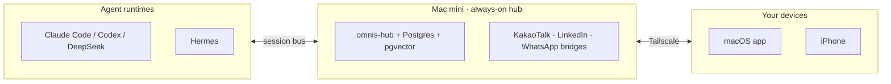

# A8 — README 청사진과 에셋

버전 1.0 (2026-09-20). 0.95→1.0: 전역 리뷰 2차 반영. 근거: `00-omnis-design.md` v0.95(D1, D6, D9, D14, §4, §8, §12, §16, §19 Q7/Q8/Q9), `99-review.md`(§3-3, §3-16, §4 Q9), `research/16-hot-repo-readme.md`, `research/02-block-buzz.md`, `research/01-kinso-and-competitors.md`.

이 부록은 마스터 문서의 결정과 충돌하지 않는다. `00-omnis-design.md`가 이기며, 이 부록은 D14(레포·라이선스)와 §16(Phase 계획)를 README 실물로 구체화만 한다.

## 확정하는 결정 (A8-D1 ~ A8-D14)

| # | 결정 | 근거 |
|---|---|---|
| A8-D1 | README 섹션 순서 13개 고정: Hero → Demo(3종) → Badges → "Everything is an inbox" 3테제 → Feature grid → Architecture(mermaid) → 지원 채널·런타임 표 → Quickstart → 디자인 원칙 → 로드맵 → 보안·프라이버시 → 기여·라이선스 → Star history | hermes-agent/openclaw/swarms 공통 골격(hero-badge-install-feature-arch-community) 위에 goose식 절제와 hermes-agent식 플랫폼 나열을 얹음(`16`) |
| A8-D2 | 히어로 태그라인 = `"Everything is an inbox."`(영문), 서브헤드는 별도 한 줄 | 3테제(§1)를 그대로 훅으로 승격. hermes-agent의 "hook 먼저, 설명은 그다음" 공식(`16`) |
| A8-D3 | 데모 GIF 3종 확정: triage / draft-approval / delegation, 각 15초 | 6개 핫 레포 중 실제 동작 GIF를 쓴 곳이 0개였다는 공백을 역이용(`16` "Visual Asset Production Methods") — omnis는 이 공백을 차별화 지점으로 삼는다 |
| A8-D4 | 배지 4종: License, CI, Platform(macOS/iPhone), Tailscale-only(정직 배지) | shields.io 표준은 6/6 공통(`16`); "Tailscale-only" 배지는 D12(hub 필요 채널)를 숨기지 않기 위한 omnis 고유 추가 |
| A8-D5 | 아키텍처 다이어그램은 마스터 §4.2 배치 토폴로지를 README용으로 1장 축약(hub/client/agent 3블록) | hermes-agent·swarms·crewai 3/6이 아키텍처 다이어그램을 갖춤(`16` Variable Elements) |
| A8-D6 | 채널·런타임 표는 §8 매트릭스를 Phase·리스크 열만 남겨 축약, 리스크 축소 없이 그대로 인용 | 정직한 정의(D12) 준수. kinso는 API-less 메커니즘을 아예 공개하지 않아 신뢰를 잃었다(`01`); omnis는 반대로 간다 |
| A8-D7 | Quickstart 3단계(미니 세팅 → 맥 앱 → 첫 브리핑), 각 단계 3줄 이내 커맨드 | "인증 없이 50줄 안에 실행 가능"이 6/6 공통(`16`); omnis는 로그인이 필수라 절대 재현은 불가하지만 "3단계, 각 3줄" 원칙은 유지 |
| A8-D8 | 디자인 원칙 절은 마스터 §12를 4줄로 요약(다크 우선, Liquid Glass는 표면에만, Pretendard+Inter, 모션 3단계) | goose의 "일부러 짧게"(`16`)를 디자인 절에 적용 — 길게 설명하지 않고 원칙만 나열 |
| A8-D9 | 라이선스 **Apache-2.0으로 확정**(마스터 §19 Q9, `99-review.md` §4 항목 16). MIT/AGPL은 기각된 후보로 §1.12에 비교만 남긴다. Logan의 실행 항목은 런치 시점 `LICENSE` 파일 커밋뿐, 값 자체는 더 이상 열려 있지 않다 | Buzz(★33.7k)가 Apache-2.0으로 에이전트 개발자 채택 마찰을 최소화한 선례(`02`); MIT는 특허 조항 없음, AGPL은 개인 도구엔 과함(상세 비교는 본문 §1.12) |
| A8-D10 | 에셋 툴체인: GUI 데모 3종 = QuickTime(⌘⇧5) → ffmpeg → WebP/MP4, CLI Quickstart 데모 1종 = VHS, 다이어그램 = Mermaid 인라인, 로고 = SVG 3안(텍스트 설명만, 실제 드로잉은 A8 밖) | `16`의 macOS 로컬 제작 도구 목록(Framer Motion/Final Cut/Mermaid/ffmpeg+gifsicle)을 GUI·CLI로 분리 적용 |
| A8-D11 | 에셋 경로 고정: `assets/demo/*.webp`, `assets/arch/*.mmd`, `assets/brand/*.svg`, `assets/banner-{light,dark}.png` | `16`의 관찰(전 레포가 `assets/`, `images/` 하위에 CDN 상대경로 사용)을 그대로 채택 |
| A8-D12 | 제작 순서 = Phase 연동: Phase A 종료 시 텍스트 README(배지·Quickstart·아키텍처만) 1차 커밋, Phase B에 데모 GIF 3종, Phase D 런치 직전에 배너·로고·Star history 최종본 | README 완성이 D14 폴백의 공개 전환 트리거이므로, 무거운 에셋(배너·로고)은 실제 public 전환 시점(Phase D)에 맞춰 마지막에 만든다 — 조기에 만들면 Phase A~C 사이 변경(D1~D16 재검토) 리스크로 재작업 |
| A8-D13 | 레포 위생: `docs/spec/`(이 기획서 전체 사본), `CHANGELOG.md`(Keep a Changelog, Phase 단위 엔트리), `SECURITY.md`(GitHub Security Advisory 비공개 신고, 이메일 미게재), `CODE_OF_CONDUCT.md`(Contributor Covenant 2.1, public 전환 시점부터), 이슈 템플릿 3종(bug/feature/channel-adapter-request) | 6/6 레포가 Docs+Issues+License 조합을 갖춤(`16`); SECURITY.md는 개인 이메일 노출 대신 GitHub 내장 비공개 신고 경로로 default |
| A8-D14 | 런치 체크리스트 12항목(본문 §4) | Phase D 종료 기준("레포 public", §16)의 실행 가능한 분해 |

---

## 1. 레포 첫인상 구조

### 1.1 히어로

**태그라인 후보 5개(영문):**

1. `Everything is an inbox.` — 3테제 1번을 그대로 승격. **추천안.**
2. `One queue. Every message, every agent, your call.`
3. `Your context, always on. Your decisions, always yours.`
4. `Not another inbox. The only inbox.`
5. `Agents work first. You decide.`

추천 이유: hermes-agent는 "hook 먼저, 차별화는 그다음"(`16`) 공식을 쓰고, goose는 짧을수록 자신감이 있다고 봤다(`16` "Sparse README as a feature"). `1`번은 이미 마스터 §1의 설계 원칙 자체라 카피를 새로 지어낼 필요가 없고, 가장 짧다.

**한 줄 설명(서브헤드):** `omnis merges every message, every meeting, and every agent session — Claude Code, Codex, DeepSeek, Hermes — into one inbox that acts before you look, and never acts without you.`

### 1.2 데모 3종 (각 15초 스토리보드)

리서치 16이 지적한 공백 — 6개 핫 레포 중 실제 동작 GIF/asciinema를 쓴 곳이 0곳(`16` "No asciinema / VHS / GIF recordings observed") — 을 omnis의 차별화 지점으로 쓴다. 파일: `assets/demo/triage.webp`, `assets/demo/draft.webp`, `assets/demo/delegate.webp`.

| 시간 | triage.webp | draft.webp | delegate.webp |
|---|---|---|---|
| 0–3s | 통합 인박스, Slack/Gmail/Kakao/Agent 항목이 실시간으로 쌓임 | 스레드 열림, 에이전트 draft 카드가 근거(참조 메모리 3건)와 함께 나타남 | Today 뷰, 대기 중 task 카드 하나 |
| 3–8s | 필터 pill 클릭(Work→Agents→Needs approval), 목록 좁혀짐 | "Edit & send" 인라인 편집, 커서로 한 문장 수정 | ⌘K 팔레트 열고 "delegate to Codex · mini" 입력 |
| 8–12s | `j/k`로 항목 이동, `e`/`r`/`a` 라벨링 적용 | 승인 버튼 클릭 | `pending_approvals` 카드 확인 후 승인 |
| 12–15s | 아카이브 스와이프, unread 배지 0으로 수렴 | 전송 확인 토스트 + 감사 로그 항목 페이드인 | 새 Agent Session 스레드 생성, tool_call 배지가 진행 상태로 갱신 |

세 GIF 모두 dark 테마, 실제 데이터가 아닌 시드 픽스처로 촬영(개인정보 노출 금지, §13 보안 원칙과 동일 기준 적용).

### 1.3 배지

`License: Apache-2.0` · `CI(GitHub Actions)` · `Platform(macOS · iPhone)` · `Tailscale-only`(KakaoTalk/LinkedIn은 허브 필요임을 배지 단계에서부터 숨기지 않음 — D12 정직한 정의를 README 최상단까지 끌어올림). shields.io 스타일(`16`). 마스터 §19 Q9가 Apache-2.0을 이미 확정했으므로(A8-D9) "TBD"나 "proposed" 표기는 쓰지 않는다 — Phase A 첫 커밋부터 `License: Apache-2.0`으로 표기하고, 런치 시점에 Logan이 `LICENSE` 파일 커밋으로 서명한다.

### 1.4 "Everything is an inbox" — 3테제

마스터 §1의 3테제를 원문 그대로, 영문 병기로 싣는다.

1. **Everything is an inbox.** People's messages and agent turns share one queue.
2. **Context is the product.** The inbox is the surface; the unified memory is the asset.
3. **Agents act first, I decide.** Triage, drafts, todos are ready before you look. Nothing leaves without approval.

### 1.5 기능 그리드 (3×3, §3·§11 기반)

| | | |
|---|---|---|
| Auto work/personal 필터 | 사람·토픽 자동 라벨 | 컨텍스트 기반 답장 초안 |
| 아침 브리핑 / 밤 다이제스트 | 에이전트와 함께 쓰는 투두 | 기기 간 에이전트 위임 |
| Network(개인 CRM) + 팔로업 | 노트 라우팅 | 통합 검색 |

### 1.6 아키텍처 다이어그램

마스터 §4.2 배치 토폴로지를 3블록으로 축약(전체 4층 다이어그램은 무겁다 — README용은 "어디서 뭐가 도는지"만):



### 1.7 지원 채널·런타임 표 (정직한 리스크 표기)

§8 매트릭스를 README 분량으로 축약. 채널 8개(마스터 §2, §3) 전부를 아래 표 행에 나열한다 — 표 첫 줄에 3개, 둘째 줄에 2개, 나머지 3개 채널로 합이 8. 리스크는 절대 완곡화하지 않는다 — kinso가 API-less 캡처 메커니즘을 비공개로 둬서 신뢰를 잃은 사례(`01`)의 정반대 방향.

| 채널 | Phase | 리스크 |
|---|---|---|
| Slack, Gmail, Google Calendar | A | 낮음(공식 API) |
| Outlook, Telegram | B | 낮음(공식 API) |
| WhatsApp | C | 중(Beeper Desktop API, whatsmeow 폴백) |
| KakaoTalk | C | 중~높음(macOS Accessibility 자동화, read 2주 안정 후 send) |
| LinkedIn | C | 중~높음(Playwright 상주 세션, 계정 정지 이력 있는 방식) |
| Claude Code, Codex, DeepSeek | A | 낮음(네이티브 headless) |
| Hermes | B(읽기 전용 세션) → C(위임 대상) | 낮음(선택적 어댑터, 기존 Hermes 구성에 의존하지 않고 HTTP `/v1` 표면만 사용) |

각주: *"KakaoTalk과 LinkedIn은 GUI 세션이 살아 있는 맥 1대가 항상 필요합니다. 이것은 채널의 구조적 제약이지 omnis의 한계가 아닙니다."*(마스터 D12 원문 인용)

### 1.8 Quickstart

```bash
# 1) 맥미니 허브 세팅 (1회)
git clone git@github.com:Onword-Lab/omnis.git && cd omnis
pnpm install
pnpm --filter @omnis/hub bootstrap   # Postgres+pgvector, Ollama pull, LaunchDaemon 설치

# 2) 맥 앱 (맥북)
pnpm --filter @omnis/desktop tauri dev   # Tailscale로 미니에 연결, Gmail/Slack OAuth

# 3) 첫 브리핑
pnpm --filter @omnis/hub briefing --now
```

`bootstrap` / `briefing --now` 서브커맨드는 A7(개발 프로세스)에서 CLI 표면이 확정되기 전까지 **UNVERIFIED — spike**. 이름과 플래그는 스켈레톤이며 구현 시 A7 CLI 명세로 대체된다.

### 1.9 디자인 원칙

마스터 §12를 4줄로: 다크 우선, 근흑 캔버스 + 단일 액센트. Liquid Glass는 sidebar/toolbar/sheet/팔레트에만, 리스트와 본문은 불투명. Pretendard(한글) + Inter(라틴). 모션 100/160/400ms 3단계. goose식 절제(`16`)를 따라 이 절은 여기서 끝낸다 — 상세는 `docs/spec/A5-ui-ux.md` 링크로 위임.

### 1.10 로드맵 (Phase A~D)

§16 표를 README용으로: **A** 커널+인박스 코어(Slack/Gmail/Calendar) → **B** 컨텍스트+에이전트+폰(메모리, 브리핑, PWA) → **C** 캡처 채널+투두+Network(Kakao/LinkedIn/WhatsApp) → **D** standalone+런치(허브 in-app, Tauri iOS, public).

Phase D 한 줄은 정직하게 쓴다: *"Phase D에서 허브 기능은 맥북 앱 안에서 돈다. 다만 KakaoTalk·LinkedIn 캡처는 GUI 세션이 살아 있는 맥이 항상 필요하므로, 맥미니가 이 두 채널만을 위한 캡처 사이드카로 계속 켜져 있다(마스터 §19 Q8)."* — "완전한 standalone"으로 과장하지 않고, D12/D14 폴백 조건과 §1.7의 Tailscale-only 배지가 왜 Phase D 이후에도 KakaoTalk·LinkedIn 사용자에게 남는지 여기서 먼저 밝힌다.

### 1.11 보안·프라이버시

§13 요약 4줄: 인박스 텍스트는 항상 data 태그로 분리(지시로 해석 안 함), 비가역 tool(send/delete/delegate)은 승인 없이 자율 루프에 없음, append-only 감사 로그 + 전역 kill switch, 비밀은 Keychain+sops/age(레포에 평문 없음).

### 1.12 기여·라이선스

**라이선스: Apache-2.0으로 확정.** 마스터 §19 Q9가 이미 결정했고 `99-review.md` §4 항목 16이 이를 재확인했다 — README에는 후보 목록이 아니라 확정값만 싣는다. MIT/AGPL을 검토했던 근거는 기록으로만 아래에 남긴다(A8-D9):

| 검토했던 후보 | 장점 | 단점 | 비고 |
|---|---|---|---|
| **Apache-2.0**(확정) | 특허 조항 있음, 엔터프라이즈/에이전트 개발자 채택 마찰 최소, Buzz 선례(`02`) | MIT보다 약간 긺 | omnis도 에이전트 런타임 다수를 통합하므로 특허 조항이 어댑터 기여자 보호에 유리 |
| MIT | 가장 단순, 가장 관대 | 특허 조항 없음 | 소규모 유틸이면 충분하지만 omnis는 채널 어댑터가 늘어날수록 특허 노출면이 커짐 — 기각 |
| AGPL | 파생 SaaS의 소스 공개 강제 | 개인 도구를 SaaS화할 계획이 마스터에 없음(v2도 "같은 프로파일의 파운더", §2) — 강한 카피레프트가 채택률만 깎음. 마스터 D6도 Honcho(AGPL)를 의존성으로도 배제 | 기각 |

Logan에게 남은 절차는 값을 고르는 것이 아니라 런치 시점에 `LICENSE` 파일을 커밋하는 실행뿐이다(A8-D9). Contributing 절은 crewai식 "역할극" 톤 대신 hermes-agent식 담백한 톤 채택(§16 Tone 비교, "Technical, matter-of-fact") — omnis는 개인 생산성 도구라 크루/역할극 메타포가 안 맞는다.

### 1.13 Star history

`https://api.star-history.com/svg?repos=Onword-Lab/omnis&type=Date` 차트를 README 최하단에. Public 전환 후(Phase D)부터만 의미가 있으므로 Phase A~C 커밋에는 넣지 않는다(A8-D12).

---

## 2. 에셋 제작 계획

| 에셋 | 툴 | 경로 | Phase |
|---|---|---|---|
| 데모 GIF 3종 | QuickTime(⌘⇧5) 녹화 → `ffmpeg -c:v libvpx-vp9` WebP 변환(`16` 커맨드 그대로) | `assets/demo/*.webp` | B |
| Quickstart 터미널 데모 | VHS(charmbracelet, `.tape` 스크립트로 재현 가능한 녹화) | `assets/demo/quickstart.gif` | A |
| 아키텍처 다이어그램 | Mermaid, README 인라인(외부 렌더 서버 불필요) | 인라인 + `assets/arch/hub-topology.mmd` 백업 | A |
| SVG 로고 3안(텍스트 설명, 드로잉은 디자이너 별도 작업) | ① 겹치는 원 3개가 하나로 수렴하는 마크(인박스 통합 은유) ② 소문자 `o` 안에 점 하나(단일 큐 은유, goose의 절제된 워드마크 참고) ③ 대괄호 `[ ]` 사이 점선이 실선으로 바뀌는 마크(승인 게이트 은유) — 최종 선택은 디자이너 브리프에서 | `assets/brand/logo-v1-{a,b,c}.svg` | D |
| 배너(light/dark) | Figma export 또는 스크린샷 합성 | `assets/banner-{light,dark}.png` | D |

제작 순서: A(Quickstart GIF+다이어그램, 텍스트 위주 1차 README) → B(데모 3종) → D(로고 확정, 배너, Star history 활성화). Phase C는 신규 에셋 없음(채널 표 갱신만).

## 3. 레포 위생

- `docs/spec/` — 이 기획서(00 + A1~A8) 전체 사본. public 전환 시에도 그대로 유지(전략 문서를 숨기지 않는다 — hermes-agent/goose 모두 ARCHITECTURE.md급 문서를 공개, `16`/`02`).
- `CHANGELOG.md` — Keep a Changelog 포맷, Phase 종료 시점마다 엔트리 1개(스토리 단위 원자 커밋과는 별도 레이어).
- `SECURITY.md` — GitHub Security Advisory의 비공개 취약점 신고 기능으로 연결. 개인 이메일은 게재하지 않는다(1인 프로젝트라 대체 채널 없음, 노출 리스크만 있고 이득 없음).
- `CODE_OF_CONDUCT.md` — Contributor Covenant 2.1. Phase D public 전환 시점부터 적용.
- 이슈 템플릿 3종: `bug_report.yml`, `feature_request.yml`, `channel_adapter_request.yml`(Adapter 인터페이스 §8 링크 포함 — "새 채널 = 새 어댑터" 확장 패턴을 외부 기여로 유도, Buzz의 kind 확장 철학과 유사(`02`)).

## 4. 런치 체크리스트 (Phase D 종료 기준의 분해)

1. README 13섹션 전부 채움, 링크 깨짐 없음
2. 데모 GIF 3종 최종본 교체(시드 픽스처 확인, 개인정보 없음)
3. 아키텍처 다이어그램 §4.2 최신 배치와 일치
4. 채널·런타임 표가 실제 Phase 진행 상태와 일치(문서 드리프트 없음)
5. Quickstart 3단계를 새 계정으로 실제 재현 테스트
6. 라이선스 파일(`LICENSE`) + 배지 Apache-2.0으로 확정
7. `CODE_OF_CONDUCT.md`, `SECURITY.md`, 이슈 템플릿 3종 존재
8. `CHANGELOG.md`에 Phase A~D 엔트리 소급 작성
9. 비밀·크리덴셜 grep 스캔(`git log`까지 포함) 0건
10. Star history 배지 활성화
11. 레포 visibility private → public 전환(D14)
12. 전환 직후 첫 이슈로 "Help wanted: KakaoTalk parser, LinkedIn scraper" 등록(`16` CONTRIBUTING 아이디어)

---

## 리뷰 노트 (2026-09-20)

인라인으로 고친 것(경미): (1) A8-D1과 런치 체크리스트 1번의 섹션 수가 "12개/12섹션"으로 적혀 있었으나, 나열된 항목과 본문 소제목(1.1~1.13)을 세어보면 실제로는 13개 — 둘 다 13으로 수정. (2) §1.12와 A8-D9 근거 열의 "§20-D9"는 존재하지 않는 참조(마스터 §20은 부록 목록일 뿐 D9 하위 항목이 없음) — A8 자신의 §1.12/A8-D9를 가리키도록 수정.

아래는 고치지 않고 남겨둔 것(경미~중대, Logan 판단 필요):

1. **[중대] A8-D10·§2의 "VHS(charmbracelet)" 출처 불명.** `research/16-hot-repo-readme.md`는 VHS를 "6개 레포 중 아무도 안 쓴 도구"로만 언급하고(Visual Asset Production Methods 절), 실제 macOS 로컬 제작 도구 목록(Framer Motion/Final Cut/Mermaid/ffmpeg+gifsicle, 같은 파일 "Tools for macOS" 절)에는 VHS가 없다. A8-D10의 근거 열은 이 도구 목록을 "그대로 적용"했다고 말하지만 VHS는 그 목록에 없는 항목이라, `16`에서 나온 것처럼 읽힌다. VHS 자체는 실존하는 도구(charmbracelet)라 구현이 막히진 않지만, 근거 인용이 부정확하다 — 다른 리서치 파일에도 VHS 언급이 전혀 없음(grep 확인).
2. **[경미] Star history 뱃지 URL(`https://api.star-history.com/svg?repos=...&type=Date`, §1.13)이 리서치에 없음.** `research/16`은 "Star History 뱃지가 있으면 좋다"는 권고와 dify README 링크만 인용하고, 실제 API 엔드포인트/쿼리 파라미터는 어디에도 없다(grep 결과 0건). 서비스 자체는 실존하고 URL 포맷도 맞지만, "리서치 파일에서 추적 가능"하지는 않다.
3. **[경미] 레포 위생 표준(§3, A8-D13)의 구체적 버전·방식 — `Contributor Covenant 2.1`, `Keep a Changelog` 포맷, `GitHub Security Advisory` 비공개 신고, 이슈 템플릿 파일명(`bug_report.yml` 등) — 이 리서치 폴더 어디에도 없음(grep 결과 0건).** 널리 쓰이는 표준 관행이라 틀린 내용은 아니지만, 이 부록의 다른 모든 결정처럼 "근거: `NN`" 인용이 붙어있지 않다. 리서치 기반 정확성이 이 기획서의 원칙이라면 일관성이 깨진다 — Logan 판단하에 "업계 표준, 리서치 무관" 정도로 명시하거나 그냥 두면 된다.
4. **[경미, 모호성] §1.10 로드맵 요약의 "B 컨텍스트+에이전트+폰"에서 "에이전트"가 Phase A에 이미 들어가는 에이전트 브리지(Claude Code·Codex, §16 Phase A 종료 기준)와 헷갈릴 수 있다.** 마스터 §16을 보면 에이전트 브리지 자체는 Phase A에 붙고, Phase B에서 추가되는 건 "컨텍스트 기반 초안"(에이전트 능력의 심화)이다. README를 그대로 구현하는 코딩 에이전트가 이 한 줄만 보고 "에이전트 연동이 Phase B부터 시작"이라고 오해할 여지가 있다 — §16 원문 표를 참조하라는 문구를 추가하면 해소된다.

(v0.9에 있던 5번 — "Tailscale-only" 배지가 Phase D standalone 이후에도 정확한지 불명확하다는 항목 — 은 v0.95에서 해소되어 제거. §1.10에 Phase D 정직한 문장을 추가해, Phase D 이후에도 "Tailscale-only"가 전체 제품이 아니라 KakaoTalk·LinkedIn 사용자에게만 조건부로 남는다는 것을 §1.7·§1.10 양쪽에서 명시했다 — 아래 수정 이력 참고.)

블로커는 없음: 위 항목들은 모두 마스터 D1~D16 결정과 직접 충돌하지 않고, Phase A~C 구현을 막지 않는다.

## 수정 이력 (v0.95, 2026-09-20)

1. 패키지 이름을 `@omnis/app` → `@omnis/desktop`으로 정정(§1.8 Quickstart 2단계 커맨드) — A7의 `@omnis/desktop`과 표기 통일(`99-review.md` §1.2 "표기 3건").
2. 라이선스를 "기본값, Logan 최종 확정 대기" 톤에서 "Apache-2.0으로 확정"으로 재서술(A8-D9, §1.3 배지, §1.12) — 마스터 §19 Q9와 `99-review.md` §4 항목 16이 이미 값을 정했으므로 배지에서 "TBD/proposed" 표기를 제거하고, MIT/AGPL은 기각된 후보로만 남김. Logan에게 남은 절차는 런치 시점 `LICENSE` 파일 커밋뿐이라고 명시.
3. 채널·런타임 표(§1.7)의 Hermes 행을 "C 이후 선택"에서 "B(읽기 전용 세션) → C(위임 대상)"으로 정정 — 마스터 §3, §19 Q7과 일치. 채널이 8개(§1.7 도입부에 합계 8 명시)임을 재확인.
4. 허브 포트: A8 전체를 grep한 결과 포트를 언급하는 곳이 원래 없었음 — 8642/8787 오기가 없어 변경할 곳이 없다(확인만, 변경 없음).
5. Phase D 정직한 문장을 §1.10 로드맵에 추가 — "Phase D에도 맥미니가 KakaoTalk·LinkedIn 캡처 사이드카로 남는다"(마스터 §19 Q8)를 명시하고, 이로써 v0.9 리뷰 노트 5번("Tailscale-only" 배지가 Phase D 이후에도 정확한지 모호했던 항목)을 해소.
6. 버전 표기를 0.9 → 0.95로, 근거 인용에 `99-review.md`와 마스터 §19를 추가.
