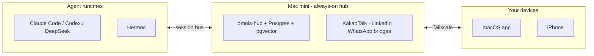

# A8 — README Blueprint and Assets

Version 1.0 (2026-09-20). 0.95→1.0: second pass of the global review incorporated. Sources: `00-omnis-design.md` v0.95 (D1, D6, D9, D14, §4, §8, §12, §16, §19 Q7/Q8/Q9), `99-review.md` (§3-3, §3-16, §4 Q9), `research/16-hot-repo-readme.md`, `research/02-block-buzz.md`, `research/01-kinso-and-competitors.md`.

This appendix does not conflict with the master document's decisions. `00-omnis-design.md` wins; this appendix only makes D14 (repo, license) and §16 (Phase plan) concrete as the actual README.

## Decisions Locked In (A8-D1 – A8-D14)

| # | Decision | Basis |
|---|---|---|
| A8-D1 | README section order fixed at 13: Hero → Demo (3 kinds) → Badges → "Everything is an inbox" 3 theses → Feature grid → Architecture (mermaid) → Supported channels & runtime table → Quickstart → Design principles → Roadmap → Security & privacy → Contributing & license → Star history | The common hermes-agent/openclaw/swarms skeleton (hero-badge-install-feature-arch-community) with goose-style restraint and hermes-agent-style platform enumeration layered on top (`16`) |
| A8-D2 | Hero tagline = `"Everything is an inbox."` (English); the subhead is a separate single line | Promotes the 3 theses (§1) directly as the hook. hermes-agent's "hook first, explanation next" formula (`16`) |
| A8-D3 | Three demo GIFs locked in: triage / draft-approval / delegation, 15 seconds each | Exploits the gap that 0 of the 6 hot repos used working GIFs (`16` "Visual Asset Production Methods") — omnis makes this gap its differentiator |
| A8-D4 | Four badges: License, CI, Platform (macOS/iPhone), Tailscale-only (honesty badge) | shields.io is standard in 6/6 (`16`); the "Tailscale-only" badge is an omnis-specific addition so as not to hide D12 (hub-required channels) |
| A8-D5 | The architecture diagram condenses the master §4.2 deployment topology into one README-sized chart (hub/client/agent, 3 blocks) | hermes-agent, swarms, and crewai — 3/6 include an architecture diagram (`16` Variable Elements) |
| A8-D6 | The channel/runtime table condenses the §8 matrix to the Phase and Risk columns only, quoted verbatim with no softening of risk | Complies with the honest definition (D12). kinso lost trust by not disclosing its API-less mechanism at all (`01`); omnis goes the opposite way |
| A8-D7 | Quickstart in 3 steps (mini setup → Mac app → first briefing), each step with commands in 3 lines or fewer | "Runnable in under 50 lines with no auth" is common in 6/6 (`16`); omnis requires login so exact reproduction is impossible, but the "3 steps, 3 lines each" principle is kept |
| A8-D8 | The design principles section summarizes master §12 in 4 lines (dark-first, Liquid Glass only on surfaces, Pretendard+Inter, 3 motion tiers) | Applies goose's "deliberately short" (`16`) to the design section — no long explanation, just the principles listed |
| A8-D9 | License **locked to Apache-2.0** (master §19 Q9, `99-review.md` §4 item 16). MIT/AGPL remain in §1.12 only as a comparison of rejected candidates. Logan's remaining action is solely committing the `LICENSE` file at launch; the value itself is no longer open | Buzz (★33.7k) set the precedent of using Apache-2.0 to minimize adoption friction for agent developers (`02`); MIT has no patent clause, and AGPL is overkill for a personal tool (detailed comparison in §1.12 below) |
| A8-D10 | Asset toolchain: 3 GUI demos = QuickTime (⌘⇧5) → ffmpeg → WebP/MP4, 1 CLI Quickstart demo = VHS, diagrams = inline Mermaid, logo = 3 SVG options (text description only; the actual drawing is outside A8) | Applies `16`'s list of macOS local production tools (Framer Motion/Final Cut/Mermaid/ffmpeg+gifsicle) split into GUI and CLI |
| A8-D11 | Fixed asset paths: `assets/demo/*.webp`, `assets/arch/*.mmd`, `assets/brand/*.svg`, `assets/banner-{light,dark}.png` | Adopts `16`'s observation as-is (every repo uses CDN-relative paths under `assets/`, `images/`) |
| A8-D12 | Production order = tied to Phase: at the end of Phase A a text-only README (badges, Quickstart, architecture only) is committed first; the 3 demo GIFs in Phase B; banner, logo, and the final Star history just before launch in Phase D | Because README completion is the public-switch trigger for the D14 fallback, the heavy assets (banner, logo) are made last so they line up with the actual public switch (Phase D) — making them early risks rework from changes between Phases A and C (D1–D16 re-review) |
| A8-D13 | Repo hygiene: `docs/spec/` (full copy of this planning document), `CHANGELOG.md` (Keep a Changelog, one entry per Phase), `SECURITY.md` (GitHub Security Advisory private reporting, no email published), `CODE_OF_CONDUCT.md` (Contributor Covenant 2.1, effective from the public switch), 3 issue templates (bug/feature/channel-adapter-request) | 6/6 repos have the Docs+Issues+License combination (`16`); SECURITY.md defaults to GitHub's built-in private reporting path instead of exposing a personal email |
| A8-D14 | Launch checklist with 12 items (§4 below) | An actionable decomposition of the Phase D exit criteria ("repo public", §16) |

---

## 1. Repo First-Impression Structure

### 1.1 Hero

**Five tagline candidates (English):**

1. `Everything is an inbox.` — a direct promotion of thesis 1. **Recommended.**
2. `One queue. Every message, every agent, your call.`
3. `Your context, always on. Your decisions, always yours.`
4. `Not another inbox. The only inbox.`
5. `Agents work first. You decide.`

Why recommended: hermes-agent uses the "hook first, differentiation next" formula (`16`), and goose held that the shorter it is, the more confident it reads (`16` "Sparse README as a feature"). Candidate `1` is already the design principle of master §1 itself, so no new copy has to be invented, and it is the shortest.

**One-line description (subhead):** `omnis merges every message, every meeting, and every agent session — Claude Code, Codex, DeepSeek, Hermes — into one inbox that acts before you look, and never acts without you.`

### 1.2 The Three Demos (15-second storyboard each)

The gap research 16 pointed out — 0 of the 6 hot repos used working GIFs/asciinema (`16` "No asciinema / VHS / GIF recordings observed") — is used as omnis's differentiator. Files: `assets/demo/triage.webp`, `assets/demo/draft.webp`, `assets/demo/delegate.webp`.

| Time | triage.webp | draft.webp | delegate.webp |
|---|---|---|---|
| 0–3s | Unified inbox; Slack/Gmail/Kakao/Agent items pile up in real time | Thread opens; an agent draft card appears with its evidence (3 referenced memories) | Today view, one pending task card |
| 3–8s | Filter pill clicks (Work→Agents→Needs approval), list narrows | "Edit & send" inline editing, cursor fixes one sentence | Open the ⌘K palette and type "delegate to Codex · mini" |
| 8–12s | `j/k` moves between items, `e`/`r`/`a` labels applied | Click the approve button | Confirm the `pending_approvals` card, then approve |
| 12–15s | Archive swipe, unread badge converges to 0 | Send confirmation toast + audit log entry fades in | A new Agent Session thread is created, tool_call badge updates to in-progress |

All three GIFs use the dark theme and are shot with seed fixtures rather than real data (no exposure of personal data; the same standard as the §13 security principles applies).

### 1.3 Badges

`License: Apache-2.0` · `CI(GitHub Actions)` · `Platform(macOS · iPhone)` · `Tailscale-only` (does not hide from the badge stage onward that KakaoTalk/LinkedIn require the hub — pulls D12's honest definition all the way to the top of the README). shields.io style (`16`). Because master §19 Q9 already locked Apache-2.0 (A8-D9), no "TBD" or "proposed" marker is used — `License: Apache-2.0` is shown from the first Phase A commit, and at launch Logan signs it by committing the `LICENSE` file.

### 1.4 "Everything is an inbox" — the 3 Theses

Carries the 3 theses of master §1 verbatim, in English.

1. **Everything is an inbox.** People's messages and agent turns share one queue.
2. **Context is the product.** The inbox is the surface; the unified memory is the asset.
3. **Agents act first, I decide.** Triage, drafts, todos are ready before you look. Nothing leaves without approval.

### 1.5 Feature Grid (3×3, based on §3/§11)

| | | |
|---|---|---|
| Auto work/personal filter | Automatic people and topic labels | Context-based reply drafts |
| Morning briefing / evening digest | Todos written together with agents | Cross-device agent delegation |
| Network (personal CRM) + follow-ups | Note routing | Unified search |

### 1.6 Architecture Diagram

Condenses the master §4.2 deployment topology into 3 blocks (the full 4-layer diagram is too heavy — the README version shows only "what runs where"):



### 1.7 Supported Channels & Runtime Table (honest risk labeling)

Condenses the §8 matrix to README length. All 8 channels (master §2, §3) are listed as rows in the table below — 3 in the first row, 2 in the second, and the remaining 3 channels, totaling 8. Risk is never softened — the exact opposite direction from the case where kinso lost trust by keeping its API-less capture mechanism closed (`01`).

| Channel | Phase | Risk |
|---|---|---|
| Slack, Gmail, Google Calendar | A | Low (official APIs) |
| Outlook, Telegram | B | Low (official APIs) |
| WhatsApp | C | Medium (Beeper Desktop API, whatsmeow fallback) |
| KakaoTalk | C | Medium–high (macOS Accessibility automation, read stable for 2 weeks before send) |
| LinkedIn | C | Medium–high (resident Playwright session, an approach with a history of account bans) |
| Claude Code, Codex, DeepSeek | A | Low (native headless) |
| Hermes | B (read-only session) → C (delegation target) | Low (optional adapter; uses only the HTTP `/v1` surface without depending on the existing Hermes setup) |

Footnote: *"KakaoTalk and LinkedIn always require one Mac with a live GUI session. This is a structural constraint of the channels, not a limitation of omnis."* (quoted verbatim from master D12)

### 1.8 Quickstart

```bash
# 1) Mac mini hub setup (one time)
git clone git@github.com:Onword-Lab/omnis.git && cd omnis
pnpm install
pnpm --filter @omnis/hub bootstrap   # Postgres+pgvector, Ollama pull, LaunchDaemon install

# 2) Mac app (MacBook)
pnpm --filter @omnis/desktop tauri dev   # connect to the mini over Tailscale, Gmail/Slack OAuth

# 3) First briefing
pnpm --filter @omnis/hub briefing --now
```

The `bootstrap` / `briefing --now` subcommands are **UNVERIFIED — spike** until the CLI surface is locked in A7 (dev process). The names and flags are a skeleton and are replaced by the A7 CLI spec at implementation time.

### 1.9 Design Principles

Master §12 in 4 lines: dark-first, near-black canvas + a single accent. Liquid Glass only on sidebar/toolbar/sheet/palette; lists and body text are opaque. Pretendard (Korean) + Inter (Latin). Motion in 3 tiers: 100/160/400ms. Following goose-style restraint (`16`), this section ends here — details are delegated to a link to `docs/spec/A5-ui-ux.md`.

### 1.10 Roadmap (Phases A–D)

The §16 table, README-sized: **A** kernel + inbox core (Slack/Gmail/Calendar) → **B** context + agents + phone (memory, briefing, PWA) → **C** capture channels + todos + Network (Kakao/LinkedIn/WhatsApp) → **D** standalone + launch (hub in-app, Tauri iOS, public).

The Phase D line is written honestly: *"In Phase D the hub functionality runs inside the MacBook app. However, KakaoTalk and LinkedIn capture always require a Mac with a live GUI session, so the Mac mini stays on as a capture sidecar for these two channels alone (master §19 Q8)."* — Rather than overstating this as "fully standalone," it states up front why the D12/D14 fallback conditions and the §1.7 Tailscale-only badge remain for KakaoTalk and LinkedIn users even after Phase D.

### 1.11 Security & Privacy

§13 in 4 lines: inbox text is always isolated with a data tag (never interpreted as instructions); irreversible tools (send/delete/delegate) never enter the autonomous loop without approval; append-only audit log + a global kill switch; secrets live in Keychain + sops/age (no plaintext in the repo).

### 1.12 Contributing & License

**License: locked to Apache-2.0.** Master §19 Q9 already decided this, and `99-review.md` §4 item 16 reconfirmed it — the README carries the locked value, not a candidate list. The reasoning behind reviewing MIT/AGPL is kept below as a record only (A8-D9):

| Candidate reviewed | Pros | Cons | Notes |
|---|---|---|---|
| **Apache-2.0** (locked) | Has a patent clause; minimizes adoption friction for enterprise and agent developers; Buzz precedent (`02`) | Slightly longer than MIT | omnis also integrates many agent runtimes, so the patent clause helps protect adapter contributors |
| MIT | Simplest, most permissive | No patent clause | Sufficient for a small utility, but omnis's patent exposure surface grows with each channel adapter — rejected |
| AGPL | Forces source disclosure of derivative SaaS | The master has no plan to turn a personal tool into SaaS (v2 is also "founders with the same profile," §2) — strong copyleft only erodes adoption. Master D6 also rules out Honcho (AGPL) even as a dependency | Rejected |

The only step left for Logan is not choosing a value but the action of committing the `LICENSE` file at launch (A8-D9). The Contributing section adopts hermes-agent's plain tone rather than crewai's "role-play" tone (§16 tone comparison, "Technical, matter-of-fact") — omnis is a personal productivity tool, so crew/role-play metaphors do not fit.

### 1.13 Star History

The `https://api.star-history.com/svg?repos=Onword-Lab/omnis&type=Date` chart goes at the very bottom of the README. It is meaningful only after the public switch (Phase D), so it is not included in Phase A–C commits (A8-D12).

---

## 2. Asset Production Plan

| Asset | Tool | Path | Phase |
|---|---|---|---|
| 3 demo GIFs | QuickTime (⌘⇧5) recording → `ffmpeg -c:v libvpx-vp9` WebP conversion (commands verbatim from `16`) | `assets/demo/*.webp` | B |
| Quickstart terminal demo | VHS (charmbracelet, reproducible recording via a `.tape` script) | `assets/demo/quickstart.gif` | A |
| Architecture diagram | Mermaid, inline in the README (no external render server needed) | inline + `assets/arch/hub-topology.mmd` backup | A |
| 3 SVG logo options (text description; drawing is separate designer work) | ① a mark of three overlapping circles converging into one (the unified-inbox metaphor) ② a single dot inside a lowercase `o` (the single-queue metaphor, referencing goose's restrained wordmark) ③ a mark where the dotted line between brackets `[ ]` becomes solid (the approval-gate metaphor) — final selection in the designer brief | `assets/brand/logo-v1-{a,b,c}.svg` | D |
| Banner (light/dark) | Figma export or screenshot compositing | `assets/banner-{light,dark}.png` | D |

Production order: A (Quickstart GIF + diagram, first text-heavy README) → B (the 3 demos) → D (final logo, banner, Star history activation). Phase C has no new assets (only a channel table refresh).

## 3. Repo Hygiene

- `docs/spec/` — a full copy of this planning document (00 + A1–A8). Kept as-is after the public switch (we do not hide strategy documents — both hermes-agent and goose publish ARCHITECTURE.md-grade documents, `16`/`02`).
- `CHANGELOG.md` — Keep a Changelog format, one entry per Phase exit (a separate layer from the story-level atomic commits).
- `SECURITY.md` — points to GitHub Security Advisory's private vulnerability reporting. No personal email is published (it is a one-person project with no alternative channel, so exposure carries only risk and no benefit).
- `CODE_OF_CONDUCT.md` — Contributor Covenant 2.1. Applies from the Phase D public switch.
- 3 issue templates: `bug_report.yml`, `feature_request.yml`, `channel_adapter_request.yml` (includes a link to the Adapter interface §8 — steers the "new channel = new adapter" extension pattern toward external contributions, similar to Buzz's kind-extension philosophy (`02`)).

## 4. Launch Checklist (decomposition of the Phase D exit criteria)

1. All 13 README sections filled in, no broken links
2. The 3 demo GIFs replaced with final versions (seed fixtures verified, no personal data)
3. Architecture diagram matches the latest §4.2 deployment
4. Channel/runtime table matches the actual Phase progress (no documentation drift)
5. The 3 Quickstart steps actually reproduction-tested with a fresh account
6. License file (`LICENSE`) + badge locked to Apache-2.0
7. `CODE_OF_CONDUCT.md`, `SECURITY.md`, and the 3 issue templates present
8. Phase A–D entries written retroactively in `CHANGELOG.md`
9. Secret/credential grep scan (including `git log`) returns 0 hits
10. Star history badge activated
11. Repo visibility private → public switch (D14)
12. Register "Help wanted: KakaoTalk parser, LinkedIn scraper" as the first issue right after the switch (`16` CONTRIBUTING idea)

---

## Review Notes (2026-09-20)

Fixed inline (minor): (1) The section count in A8-D1 and launch checklist item 1 read "12 items / 12 sections," but counting the listed items and the body subheadings (1.1–1.13) shows there are actually 13 — both were corrected to 13. (2) The "§20-D9" reference in §1.12 and in the A8-D9 basis column is a nonexistent reference (master §20 is only an appendix list and has no D9 sub-item) — corrected to point at A8's own §1.12/A8-D9.

The following were left unfixed (minor to major; Logan's judgment needed):

1. **[Major] The source of "VHS (charmbracelet)" in A8-D10/§2 is unknown.** `research/16-hot-repo-readme.md` mentions VHS only as "a tool nobody among the 6 repos used" (Visual Asset Production Methods section), and VHS is absent from the actual list of macOS local production tools (Framer Motion/Final Cut/Mermaid/ffmpeg+gifsicle, same file, "Tools for macOS" section). A8-D10's basis column says this tool list was "applied as-is," but VHS is not on that list, so it reads as if it came from `16`. VHS itself is a real tool (charmbracelet), so implementation is not blocked, but the citation of its basis is inaccurate — no other research file mentions VHS at all (verified by grep).
2. **[Minor] The Star history badge URL (`https://api.star-history.com/svg?repos=...&type=Date`, §1.13) is not in the research.** `research/16` cites only the recommendation that "a Star History badge would be nice" and a link to the dify README; the actual API endpoint and query parameters appear nowhere (grep result: 0 hits). The service itself exists and the URL format is correct, but it is not "traceable to a research file."
3. **[Minor] The specific versions and mechanisms of the repo hygiene standards (§3, A8-D13) — `Contributor Covenant 2.1`, the `Keep a Changelog` format, `GitHub Security Advisory` private reporting, issue template filenames (`bug_report.yml`, etc.) — appear nowhere in this research folder (grep result: 0 hits).** They are widely used standard practices, so the content is not wrong, but unlike every other decision in this appendix they carry no "basis: `NN`" citation. If research-grounded accuracy is a principle of this planning document, this is an inconsistency — at Logan's discretion, either note them as "industry standard, independent of the research" or leave them as-is.
4. **[Minor, ambiguity] In the §1.10 roadmap summary, "B context + agents + phone," the word "agents" can be confused with the agent bridge that already lands in Phase A (Claude Code/Codex, §16 Phase A exit criteria).** Looking at master §16, the agent bridge itself attaches in Phase A, and what Phase B adds is "context-based drafts" (a deepening of agent capability). A coding agent implementing the README literally could read this one line and mistake it for "agent integration starts in Phase B" — adding a pointer to the §16 source table would resolve it.

(Item 5 from v0.9 — the note that it was unclear whether the "Tailscale-only" badge stays accurate after the Phase D standalone — was resolved in v0.95 and removed. The Phase D honesty sentence added to §1.10 makes clear in both §1.7 and §1.10 that even after Phase D, "Tailscale-only" remains conditional on KakaoTalk/LinkedIn users rather than applying to the whole product — see the revision history below.)

No blockers: none of the items above directly conflicts with master decisions D1–D16, and none blocks Phase A–C implementation.

## Revision History (v0.95, 2026-09-20)

1. Corrected the package name from `@omnis/app` to `@omnis/desktop` (§1.8 Quickstart step 2 command) — unified the notation with A7's `@omnis/desktop` (`99-review.md` §1.2 "3 notation items").
2. Rewrote the license from a "default value, pending Logan's final decision" tone to "locked to Apache-2.0" (A8-D9, §1.3 badge, §1.12) — since master §19 Q9 and `99-review.md` §4 item 16 already fixed the value, the "TBD/proposed" marker was removed from the badge, and MIT/AGPL remain only as rejected candidates. Stated that the only step left for Logan is committing the `LICENSE` file at launch.
3. Corrected the Hermes row in the channel/runtime table (§1.7) from "optional after C" to "B (read-only session) → C (delegation target)" — matching master §3 and §19 Q7. Reconfirmed that there are 8 channels (the §1.7 intro states the total of 8).
4. Hub port: grepping all of A8 showed there was originally no place mentioning a port — there is no 8642/8787 typo to change (verification only, no changes).
5. Added the Phase D honesty sentence to the §1.10 roadmap — stating that "even in Phase D the Mac mini remains as a capture sidecar for KakaoTalk and LinkedIn" (master §19 Q8), thereby resolving v0.9 review note item 5 (the item where it was ambiguous whether the "Tailscale-only" badge stays accurate after Phase D).
6. Bumped the version notation from 0.9 to 0.95, and added `99-review.md` and master §19 to the source citations.
